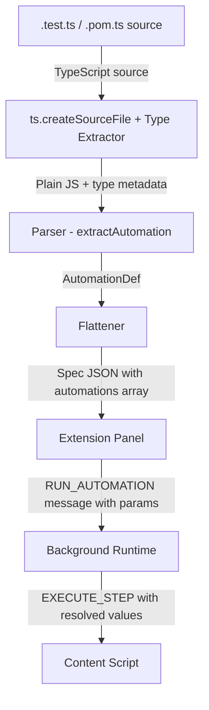

# Design Document: Automation

## Overview

This feature adds the "Automation" concept to Tomation — a parameterized, user-driven test procedure. Unlike Tests (which run with hardcoded values), Automations declare typed parameters that the user fills in via a form before execution. This enables reusable test procedures where input values are determined at run-time.

The feature touches five layers of the system:
1. **DSL** — new `Automation(fn).as(label)` function stub and TypeScript types
2. **Compiler** — parsing Automation declarations from `*.automation.ts` files, extracting param type metadata from TypeScript annotations, emitting steps
3. **Spec JSON** — new `automations` array in the compiled output with param metadata
4. **Side Panel** — displaying automations in the list, rendering param forms, validating inputs
5. **Background (Runtime)** — executing automation steps with user-provided param values via the existing template resolution mechanism

Key design principles:
- Automations reuse existing infrastructure wherever possible. Step extraction, template resolution (`{{paramName}}`), and the execution engine are identical to how Tasks work today.
- Automations live in dedicated `*.automation.ts` files in a configured `automations` directory — separate from POM and test files.
- Automations can import and invoke Tasks from POM files using `~/` path aliases.
- Automation names are namespaced by file path (e.g., `UserCreation__Create Users`), consistent with Test namespacing.
- The panel uses a unified `currentRunnable` abstraction to avoid duplicating test/automation branching logic.

## Architecture



### Flow

1. User writes `Automation((params: { email: string; count: number }) => { ... }).as('Create Users')` in a `*.automation.ts` file
2. Compiler extracts type annotations from the raw TypeScript source using `ts.createSourceFile()` (before stripping), producing `[{name: "email", type: "string"}, {name: "count", type: "number"}, {name: "role", type: "enum", options: ["admin", "user", "viewer"]}]`
3. Compiler strips types, parses the JS body, extracts steps (same as Task)
4. Flattener emits an entry in `spec.automations[]` with name, params, and steps
5. Side panel renders the automation in the test list; on click, shows param form
6. User fills the form, clicks Run — panel sends `RUN_AUTOMATION` with param values to background
7. Background calls `flattenSteps` with the automation's steps and the user-provided params, then runs the step loop

### File Type Convention

Automations live in dedicated `*.automation.ts` files:
- `detectFileType` recognizes the `.automation.ts` suffix and returns `"automation"`
- The `tomation.config.ts` accepts an `automations` path (defaults to `'./automations'` if not specified)
- The resolver scans the configured automations directory for `*.automation.ts` files
- No `export default` is needed — the compiler extracts Automation declarations by AST pattern (same as Tests)

Example file structure:
```
project/
├── pom/
│   └── login.pom.ts
├── tests/
│   └── login.test.ts
├── automations/
│   └── user-creation.automation.ts
└── tomation.config.ts
```

Example config:
```typescript
export default {
  meta: { name: 'My App', urls: ['http://localhost:3000'] },
  pom: './pom',
  tests: './tests',
  automations: './automations',
  baseUrl: './',
}
```

### Namespace Resolution

Automations are namespaced by their file path, consistent with Tests:
- `automations/user-creation.automation.ts` → namespace prefix `UserCreation`
- An Automation labeled `'Create Users'` in that file → spec name `UserCreation__Create Users`

This is handled by the existing namespace derivation logic in the resolver/flattener.

### Cross-File References

Automations can import and invoke Tasks from POM files:
```typescript
// automations/user-creation.automation.ts
import { Automation } from '@tomationjs/dsl'
import Login from '~/pom/login.pom'

Automation((params: { username: string; password: string }) => {
  Login.fillCredentials({ username: params.username, password: params.password })
  Login.submit()
}).as('Create User Account')
```

The step extraction handles cross-file Task references via the existing namespace resolution mechanism (import tracking + `extractElementRef` + namespace prefixing).

## Components and Interfaces

### 1. DSL Runtime Stub (`packages/dsl/index.js`)

```javascript
function Automation(fn) {
  return {
    __automation: true,
    fn: fn,
    as: function (label) {
      return { __automation: true, fn: fn, label: label };
    }
  };
}
```

Exported alongside `Task` and `Test`.

### 2. DSL Type Definitions (`packages/dsl/index.d.ts`)

```typescript
interface AutomationBuilder<P> {
  __automation: true;
  fn: (params: P) => void;
  as(label: string): AutomationDescriptor<P>;
}

interface AutomationDescriptor<P> {
  __automation: true;
  fn: (params: P) => void;
  label: string;
}

export declare function Automation<P>(
  fn: (params: P) => void
): AutomationBuilder<P>;
```

Param types constrained to objects with values of `string | number | Date`.

### 3. Compiler — Type Extraction (`packages/compiler/src/parser.js`)

New function: `extractAutomationParamTypes(source, node)`

Since the standard TypeScript stripper removes type annotations before AST parsing, the compiler must extract type metadata from the **raw TypeScript source** before stripping. Strategy:

1. Use `ts.createSourceFile()` from the TypeScript compiler API to parse the raw TypeScript source into an AST (single-file, no type-checking — fast)
2. Walk the AST to find the `Automation(` call expression and locate the params type annotation on the function argument
3. For each property in the params type literal:
   - Extract the property name
   - Check the `questionToken` to detect optional params (`?`)
   - Inspect the type node:
     - `ts.SyntaxKind.StringKeyword` → `"string"`
     - `ts.SyntaxKind.NumberKeyword` → `"number"`
     - `ts.isTypeReferenceNode` with identifier `Date` → `"date"`
     - `ts.isUnionTypeNode` where all members are `ts.isLiteralTypeNode` with string literals → `"enum"` with `options: string[]`
     - anything else → `"string"` + warning
4. Produce `[{name, type, optional?, defaultValue?, options?}]` entries preserving declaration order

This uses the `typescript` package already available as a dependency in `@tomationjs/compiler`. `ts.createSourceFile` is fast (single-file parse, no program creation, no type-checking) and correctly handles multi-line types, comments, and complex type syntax that regex would struggle with.

**Previous approach (rejected):** Regex-based extraction. While simpler for basic types, it fails on multi-line annotations, inline comments, trailing commas, and union literal types. The TS compiler API approach is more robust and only marginally more code.

### 4. Compiler — Automation Extraction (`packages/compiler/src/parser.js`)

New function: `extractAutomation(declarator, filePath, source, rawSource)`

Pattern matching (mirrors `extractTask`):
- `const X = Automation(fn).as('Label')` — full declaration
- `const X = Automation(fn)` — missing label (warning)

Returns:
```javascript
{
  automation: {
    name: variableName,  // variable name (for namespacing)
    label: "...",        // from .as()
    params: [
      { name: "email", type: "string" },
      { name: "count", type: "number" },
      { name: "environment", type: "string", optional: true, defaultValue: "staging" },
      { name: "role", type: "enum", options: ["admin", "user", "viewer"] }
    ],
    steps: [...],        // same format as Task/Test steps
    line: N
  },
  error: null,
  warnings: []
}
```

### 5. Flattener (`packages/compiler/src/flattener.js`)

Extended `flattenSpec` output adds an `automations` array:

```javascript
{
  format: "tomation-spec",
  version: 1,
  meta: { ... },
  pageElements: { ... },
  tasks: { ... },
  tests: [ ... ],
  automations: [
    {
      name: "Create Users",
      params: [
        { name: "email", type: "string" },
        { name: "count", type: "number" },
        { name: "environment", type: "string", optional: true, defaultValue: "staging" },
        { name: "role", type: "enum", options: ["admin", "user", "viewer"] }
      ],
      steps: [
        { action: "type", target: "Login__emailInput", value: "{{email}}" },
        ...
      ]
    }
  ]
}
```

### 6. Side Panel — Listing (`packages/extension/src/panel.js`)

- `renderHomeView()` extended to iterate `spec.automations[]` alongside `spec.tests[]`
- Automation entries rendered with a distinguishing badge/icon (e.g., `⚙` prefix or a CSS class `automation-item`)
- `filterTests` extended to include automation names in search
- Click handler sets `currentRunnable = { type: 'automation', index: i, data: automation }` and navigates to Test_Plan_View

**Unified `currentRunnable` state:**

```javascript
// Panel state — replaces separate currentTest/currentTestIndex for the plan view
var currentRunnable = null; // { type: 'test'|'automation', index: number, data: object }
```

- When a Test is clicked: `currentRunnable = { type: 'test', index: i, data: spec.tests[i] }`
- When an Automation is clicked: `currentRunnable = { type: 'automation', index: i, data: spec.automations[i] }`
- `renderTestPlanView` branches on `currentRunnable.type` to decide whether to render the param form
- Run button logic checks `currentRunnable.type` to dispatch either `RUN_TEST` or `RUN_AUTOMATION`

### 7. Side Panel — Param Form (`packages/extension/src/panel.js`)

New function: `renderParamForm(automation)`

Renders a `<div class="param-form">` above the step checklist:

```html
<div class="param-form">
  <h3>Parameters</h3>
  <div class="param-row">
    <label for="param-email">email</label>
    <input type="text" id="param-email" data-param-name="email" data-param-type="string" required />
  </div>
  <div class="param-row">
    <label for="param-count">count</label>
    <input type="number" id="param-count" data-param-name="count" data-param-type="number" required />
  </div>
  <div class="param-row param-optional">
    <label for="param-environment">environment <span class="optional-badge">(optional)</span></label>
    <input type="text" id="param-environment" data-param-name="environment" data-param-type="string" placeholder="staging" />
  </div>
  <div class="param-row">
    <label for="param-role">role</label>
    <select id="param-role" data-param-name="role" data-param-type="enum" required>
      <option value="admin">admin</option>
      <option value="user">user</option>
      <option value="viewer">viewer</option>
    </select>
  </div>
</div>
```

Type-to-input mapping:
- `"string"` → `<input type="text">`
- `"number"` → `<input type="number">`
- `"date"` → `<input type="date">`
- `"enum"` → `<select>` with `<option>` for each value in `options[]`

Optional param styling:
- Label includes "(optional)" suffix badge
- Input omits the `required` attribute
- If `defaultValue` is present (reserved for future use), it is used as the `placeholder` attribute

Pre-fill behavior:
- On render, retrieve stored values from `chrome.storage.local` keyed by automation name
- If stored values exist, set each input's value to the stored value for that param name

### 8. Side Panel — Param Value Persistence (`packages/extension/src/panel.js`)

New functions: `saveParamValues(automationName, params)` and `loadParamValues(automationName)`

Uses `chrome.storage.local` to persist the last-used parameter values per Automation:

```javascript
async function saveParamValues(automationName, params) {
  const key = `automation_params_${automationName}`;
  await chrome.storage.local.set({ [key]: params });
}

async function loadParamValues(automationName) {
  const key = `automation_params_${automationName}`;
  const result = await chrome.storage.local.get(key);
  return result[key] || null;
}
```

- `saveParamValues` is called after a successful automation run completes
- `loadParamValues` is called when `renderParamForm` initializes, pre-filling inputs with stored values
- Storage is scoped per automation name — different automations maintain independent value histories
- No compiler or runtime changes are needed — this is purely a panel-level feature

### 9. Side Panel — Validation & Run

On Run click for an Automation:
1. Collect all `param-form` input values (including `<select>` elements)
2. Validate: all **required** fields (those without `optional: true`) must be non-empty; if any required field is empty, show inline validation message and abort
3. For optional fields that are empty: send empty string
4. Coerce types: number fields → `parseFloat(value)`, date fields → value as-is (HTML date inputs produce `YYYY-MM-DD`), enum fields → value as-is (string from selected option)
5. Send message: `{ type: 'RUN_AUTOMATION', automationIndex: N, params: { email: "...", count: 5, role: "admin" }, checkedSteps: [...], config: {...} }`
6. On successful run completion: call `saveParamValues(automationName, params)` to persist values

### 10. Background Runtime (`packages/extension/src/background.js`)

New message handler for `RUN_AUTOMATION`:

```javascript
case 'RUN_AUTOMATION':
  var automation = runState.spec.automations[msg.automationIndex];
  startAutomationRun(tabId, automation, spec, msg.checkedSteps, msg.config, msg.params);
  break;
```

`startAutomationRun` must have **full parity** with the existing `startRun` function used for Tests. It reuses the same step execution lifecycle:

1. **Setup**: Initialize `runState` with `passCount`, `failCount`, `stepIndex`, `running`, `contextStore` (seeded with user-provided params)
2. **Tab tracking**: Lock tab, setup tab tracker (same as `startRun`)
3. **Step loop** (`runStepLoop`): For each step:
   - Emit `IN_PROGRESS` message to panel (same as test execution)
   - Resolve `{{paramName}}` placeholders via existing `resolveValue` function
   - Dispatch step to content script
   - On success: increment `passCount`, emit `LOG` via `emitLog`, advance
   - On failure: increment `failCount`, emit `LOG` via `emitLog`, enter `STEP_FAILED_AWAITING_ACTION` state if retry/skip is enabled (same as test execution)
4. **Completion**: Emit summary message with pass/fail counts, teardown tab tracker, unlock tab

**Design decision**: Rather than duplicating `startRun`, extract the common step loop into a shared helper (or have `startAutomationRun` call into the same `runStepLoop` with a different initial context). The only difference between test execution and automation execution is:
- Automation has user-provided params pre-loaded into the context store
- Automation resolves step references from `spec.automations[i].steps` instead of `spec.tests[i].steps`

All other lifecycle behavior (LOG emission, IN_PROGRESS, retry/skip, tab tracking, teardown) is identical.

## Data Models

### AutomationDef (Parser output)

| Field | Type | Description |
|-------|------|-------------|
| `name` | `string` | Variable name from declaration |
| `label` | `string \| null` | Label from `.as()` call |
| `params` | `Array<ParamDef>` | Extracted typed params (see below) |
| `steps` | `Step[]` | Extracted steps (same format as Task/Test) |
| `line` | `number` | Source line number |

### ParamDef (Param metadata)

| Field | Type | Description |
|-------|------|-------------|
| `name` | `string` | Parameter name from the type annotation |
| `type` | `"string" \| "number" \| "date" \| "enum"` | Mapped type |
| `optional` | `boolean \| undefined` | `true` if declared with `?` |
| `defaultValue` | `string \| undefined` | Reserved for future use (not extracted in initial implementation) |
| `options` | `string[] \| undefined` | Enum literal values (only for type `"enum"`) |

### Automation (Spec JSON output)

| Field | Type | Description |
|-------|------|-------------|
| `name` | `string` | Display name (from `.as()` label) |
| `params` | `Array<ParamDef>` | Param metadata for form generation |
| `steps` | `Step[]` | Steps with `{{paramName}}` placeholders |

### RUN_AUTOMATION Message

| Field | Type | Description |
|-------|------|-------------|
| `type` | `"RUN_AUTOMATION"` | Message type identifier |
| `automationIndex` | `number` | Index into `spec.automations[]` |
| `params` | `Record<string, string\|number>` | User-provided param values |
| `checkedSteps` | `number[]` | Checked step indices |
| `config` | `RunConfig` | Execution config (speed, debug mode) |

### Param Value Storage

| Field | Type | Description |
|-------|------|-------------|
| Key | `"automation_params_{automationName}"` | Storage key scoped per Automation |
| Value | `Record<string, string\|number>` | Last-used param values map |

## Correctness Properties

*A property is a characteristic or behavior that should hold true across all valid executions of a system — essentially, a formal statement about what the system should do. Properties serve as the bridge between human-readable specifications and machine-verifiable correctness guarantees.*

### Property 1: DSL Automation descriptor shape

*For any* function `fn` and any non-empty string `label`, calling `Automation(fn).as(label)` SHALL produce an object with `__automation: true`, a `fn` field referencing the original function, and a `label` field equal to the provided label string.

**Validates: Requirements 1.1, 1.2**

### Property 2: Compilation round-trip — param extraction preserves names, types, and order

*For any* Automation declaration with N params where each param has a name and a type annotation of `string`, `number`, or `Date`, the compiler SHALL emit a params array of length N where each entry's `name` and `type` match the source declaration, and the array preserves declaration order.

**Validates: Requirements 2.1, 2.2, 2.3, 2.4, 2.5, 3.2, 3.3, 3.5**

### Property 3: Template placeholder resolution in Automation steps

*For any* Automation with declared params, when the function body references `params.X` in a step value, the emitted step SHALL contain `{{X}}` as a template placeholder, and at runtime *for any* provided param map containing key `X`, the resolved value SHALL equal `params[X]`.

**Validates: Requirements 1.4, 2.7, 2.8, 6.2**

### Property 4: Unknown type annotation defaults to string with warning

*For any* parameter type annotation that is not `string`, `number`, or `Date`, the compiler SHALL emit type `"string"` for that parameter and produce a warning containing the file path and line number.

**Validates: Requirements 2.6**

### Property 5: Search filter includes automation names

*For any* search query string and any set of automation names, the search filter SHALL return all automations whose names contain the query as a case-insensitive substring, consistent with the test name filter behavior.

**Validates: Requirements 4.4**

### Property 6: Empty param validation prevents execution

*For any* Automation param form state where at least one required input field is empty, clicking Run SHALL NOT dispatch a `RUN_AUTOMATION` message and SHALL display a validation message indicating the empty field.

**Validates: Requirements 6.3**

### Property 7: Number param coercion

*For any* param with type `"number"` and any valid numeric string input `s`, the value sent in the `RUN_AUTOMATION` message SHALL be `parseFloat(s)` (a JavaScript number, not a string).

**Validates: Requirements 6.4**

### Property 8: Missing .as() produces warning

*For any* `Automation(fn)` declaration without a chained `.as()` call, the compiler SHALL emit a warning indicating the Automation requires a label.

**Validates: Requirements 7.1**

### Property 9: No-params Automation produces warning

*For any* Automation declaration where the function argument has zero params (empty type annotation), the compiler SHALL emit a warning suggesting it should be a Test.

**Validates: Requirements 7.2**

### Property 10: Duplicate Automation labels produce warning

*For any* spec containing two or more Automations with the same label string, the compiler SHALL emit a warning indicating duplicate Automation names.

**Validates: Requirements 7.3**

### Property 11: Empty body Automation produces warning

*For any* Automation declaration whose function body contains no recognizable steps, the compiler SHALL emit a warning indicating the Automation has no steps.

**Validates: Requirements 7.4**

### Property 12: Optional param extraction preserves optional marker

*For any* Automation declaration where a parameter is annotated with `?` (e.g., `name?: string`), the compiler SHALL emit a param entry with `optional: true`, and the param form SHALL NOT require that field for validation.

**Validates: Requirements 2.9, 8.1, 8.2, 8.3**

### Property 13: Enum param extraction produces options array

*For any* Automation declaration where a parameter has a string union literal type (e.g., `'a' | 'b' | 'c'`), the compiler SHALL emit a param entry with `type: "enum"` and an `options` array containing exactly the literal values in declaration order.

**Validates: Requirements 2.10, 9.1, 9.2**

### Property 14: Enum param renders as select dropdown

*For any* param with `type: "enum"` and `options: [...]`, the param form SHALL render a `<select>` element with one `<option>` for each value in the options array, and the submitted value SHALL be constrained to one of those options.

**Validates: Requirements 9.3, 9.4**

### Property 15: Last-used values are persisted and restored

*For any* Automation that completes a successful run, the param values used for that run SHALL be retrievable from storage, and when the same Automation is next selected, the form SHALL pre-fill with those values.

**Validates: Requirements 10.1, 10.2, 10.3**

### Property 16: TS compiler API handles multi-line and complex type syntax

*For any* Automation declaration with multi-line type annotations, inline comments within the type, or trailing commas, the `ts.createSourceFile()`-based extraction SHALL produce the same param metadata as for a single-line equivalent declaration.

**Validates: Requirements 2.2, 2.9, 2.10**

## Error Handling

| Scenario | Component | Behavior |
|----------|-----------|----------|
| Automation missing `.as()` | Compiler | Emit warning, skip automation entry |
| Unrecognized param type | Compiler | Default to `"string"`, emit warning with location |
| Duplicate automation labels | Compiler | Emit warning for each duplicate |
| Automation with no params | Compiler | Emit warning (suggest Test instead) |
| Automation with no steps | Compiler | Emit warning |
| Multi-line type annotation | Compiler | `ts.createSourceFile()` handles correctly (no special case) |
| Union type with non-string literals | Compiler | Default to `"string"`, emit warning (only string literals supported for enum) |
| File not ending in `.automation.ts` | Compiler | Not scanned as automation file — ignored |
| Param form field empty on Run (required) | Side Panel | Prevent execution, show inline validation error |
| Param form field empty on Run (optional) | Side Panel | Send empty string, proceed with execution |
| Invalid number input | Side Panel | HTML5 `type="number"` provides native validation; if `NaN` after parse, treat as validation failure |
| Enum param — no selection | Side Panel | First option is selected by default in `<select>`; no empty state possible |
| Runtime param resolution — missing key | Background | `resolveValue` already substitutes `""` and logs a warning (existing behavior) |
| Malformed spec `automations` field | Side Panel | `validateSpec` extended to validate automations array structure; show error view on failure |
| Storage read failure | Side Panel | Silently fail — render form with empty fields (graceful degradation) |
| Storage write failure | Side Panel | Silently fail — run still completes, values just not persisted |

## Testing Strategy

### Unit Tests (example-based)

- DSL stub: verify `Automation(fn).as(label)` returns correct shape (Properties 1)
- Type definitions: verify TypeScript compiles example Automation code (Req 1.3, 1.5)
- File type detection: verify `detectFileType` returns `"automation"` for `*.automation.ts` files (Req 11.1)
- Resolver: verify automation files scanned from configured directory (Req 11.3)
- Namespace: verify automation names are prefixed with file-path-derived namespace (Req 11.5)
- Cross-file imports: verify Task invocations from POM files are resolved in automation steps (Req 11.6)
- Panel rendering: verify param form renders correct input types (Req 5.1–5.6)
- Panel rendering: verify optional param renders with "(optional)" label and no `required` attribute (Req 5.7, 8.2)
- Panel rendering: verify enum param renders as `<select>` with correct options (Req 5.8, 9.3)
- Panel rendering: verify pre-fill from stored values (Req 5.9, 10.2)
- Panel listing: verify automations appear in home view with badge (Req 4.1–4.3)
- Panel state: verify `currentRunnable` abstraction correctly branches for test vs automation
- Background: verify `RUN_AUTOMATION` handler initiates execution with params (Req 6.1)
- Background: verify `emitLog`, `IN_PROGRESS`, retry/skip, and summary emission for automations
- Date value format: verify date params sent as `YYYY-MM-DD` (Req 6.5)
- Spec schema: verify `automations` array present in output (Req 3.1, 3.4)
- TS compiler API: verify multi-line type, comments, and trailing commas parse correctly (Req 2.2)
- Optional params: verify `optional: true` in metadata for `?` annotated params (Req 8.1)
- Enum params: verify `type: "enum"` and `options` array for union literal params (Req 9.1, 9.2)
- Storage: verify `saveParamValues` stores and `loadParamValues` retrieves correctly (Req 10.1, 10.2)

### Property-Based Tests

Property-based testing with `fast-check` (already available in the project's test tooling via Node.js). Each test runs a minimum of 100 iterations.

| Property | Generator Strategy | Assertion |
|----------|-------------------|-----------|
| P1: DSL descriptor | Random functions + random label strings | Output has `__automation`, `fn`, `label` |
| P2: Param extraction round-trip | Random param lists (1–10 params, names from identifier charset, types from {string, number, Date}, optional flags) | Compiled params array matches input names/types/order/optional |
| P3: Template resolution | Random param maps + step templates with `{{key}}` placeholders | All placeholders resolved to map values |
| P4: Unknown type default | Random non-standard type names | Type emitted as `"string"` + warning present |
| P5: Search filter | Random automation names + random query substrings | Filter returns names containing query |
| P6: Empty param validation | Random param sets with at least one required empty | Run blocked, validation message shown |
| P7: Number coercion | Random numeric strings (integers, decimals, negatives) | Sent value equals parseFloat(input) |
| P8: Missing .as() | Random Automation source without .as() | Warning emitted |
| P9: No-params | Automation source with empty params | Warning emitted |
| P10: Duplicate labels | Random label + two automations using it | Warning emitted |
| P11: No steps | Automation source with empty body | Warning emitted |
| P12: Optional param extraction | Random params with optional markers | `optional: true` preserved in output |
| P13: Enum extraction | Random string union literals (1–10 options) | `type: "enum"`, `options` matches literals in order |
| P14: Enum renders select | Random enum param with options | `<select>` rendered with matching `<option>` elements |
| P15: Value persistence round-trip | Random param value maps + automation names | Stored values retrievable and pre-filled on form render |
| P16: Multi-line type extraction | Random type annotations with whitespace, comments, trailing commas | Same output as single-line equivalent |

**Configuration:** Each property test runs minimum 100 iterations.
**Tag format:** `Feature: automation, Property N: <property_text>`

### Integration Tests

- End-to-end: compile an example `.test.ts` file with an Automation, load the spec in the panel, fill the form, run, and verify steps execute with resolved values
- Spec validator: verify `validateSpec` accepts and rejects automation schemas correctly
- Optional params: verify an Automation with optional params can be run without filling optional fields
- Enum params: verify an Automation with enum params constrains selection to declared options
- Value persistence: verify stored values persist across panel reloads and pre-fill the form
