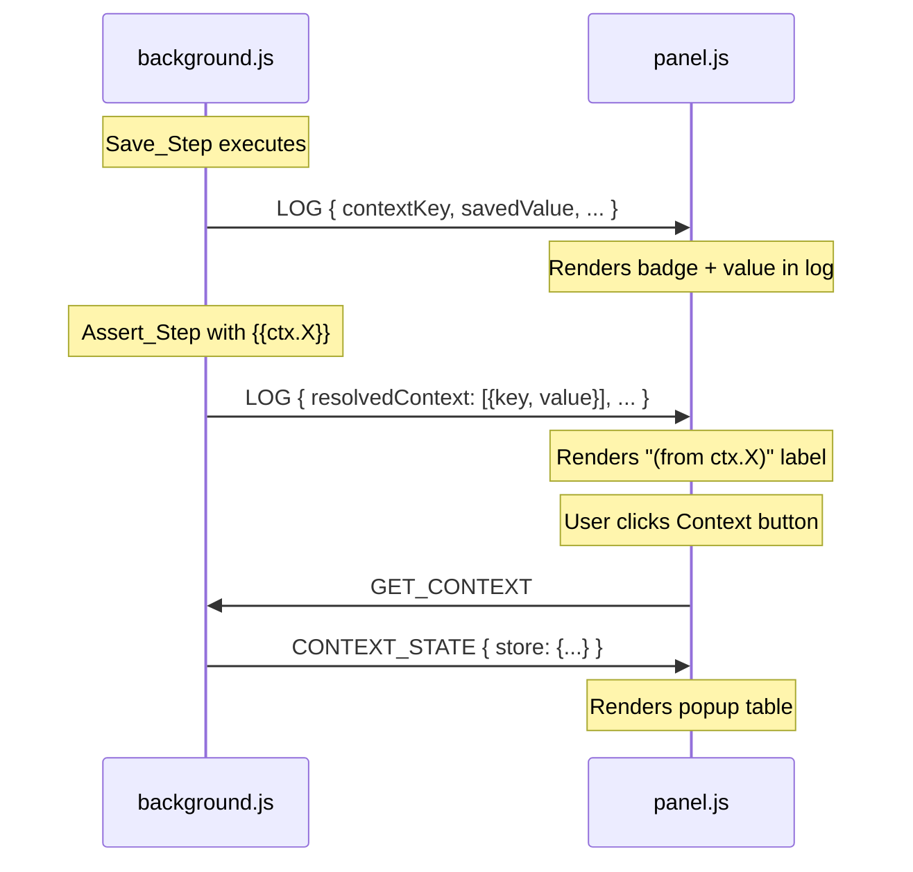

# Design Document: Context Visibility

## Overview

This feature makes the extension's runtime context store visible and inspectable in the panel UI. It enhances LOG messages from the background with context metadata, renders saved values and resolved references in the run log, and provides a Context button/popup for full store inspection.

The implementation touches three files — `background.js` (message enrichment), `panel.js` (rendering logic), and `panel.html` (CSS + markup) — following the existing ES5, global-scope, message-passing architecture.

## Architecture

The feature extends the existing unidirectional message flow:



**Design decisions:**

1. **Enriched LOG messages** rather than separate CONTEXT_UPDATED events — reduces message volume and keeps context data co-located with the step that produced it. The panel maintains a local `contextStoreCache` built from LOG messages.
2. **On-demand GET_CONTEXT request** for the popup — ensures the popup always shows the authoritative state from background, not just what was received via LOG messages (handles panel reconnection scenarios).
3. **Single `isSensitiveKey` utility** in panel.js for all masking decisions — avoids duplication, ensures consistency across log entries and popup.
4. **Single `formatContextValue` utility** in panel.js for truncation/masking — one function handles the 30-char truncation, tooltip generation, and sensitive key masking for all display locations.

## Components and Interfaces

### background.js Modifications

#### Enhanced `emitLog` function

```javascript
/**
 * @param {number} stepIndex
 * @param {object} step
 * @param {boolean} ok
 * @param {string} [error]
 */
function emitLog(stepIndex, step, ok, error) {
  var logMsg = { /* ...existing fields... */ };

  // NEW: Include context data for successful save steps
  if (ok && (step.action === 'saveText' || step.action === 'saveValue' ||
             step.action === 'saveAttribute' || step.action === 'saveExpression')) {
    var ctxKey = step.contextKey || step.key;
    if (ctxKey) {
      logMsg.contextKey = ctxKey;
      logMsg.savedValue = runState.contextStore[ctxKey];
    }
  }

  // NEW: Include resolved context references for assert steps
  if (step.value && typeof step.value === 'string' && step.value.indexOf('{{ctx.') !== -1) {
    logMsg.resolvedContext = extractResolvedContext(step.value, runState.contextStore);
  }

  safeSendMessage(logMsg);
}
```

#### New `extractResolvedContext` function

```javascript
/**
 * Extract context key references and their resolved values from a template string.
 * @param {string} template - Value containing {{ctx.X}} tokens
 * @param {object} contextStore - Current context store
 * @returns {Array<{key: string, value: string}>}
 */
function extractResolvedContext(template, contextStore) {
  var refs = [];
  var seen = {};
  template.replace(/\{\{ctx\.([^}]+)\}\}/g, function(match, keyName) {
    if (!seen[keyName]) {
      seen[keyName] = true;
      refs.push({
        key: keyName,
        value: contextStore.hasOwnProperty(keyName) ? contextStore[keyName] : null
      });
    }
    return match;
  });
  return refs;
}
```

#### New `GET_CONTEXT` handler in `handleMessage`

```javascript
case 'GET_CONTEXT':
  safeSendMessage({
    type: 'CONTEXT_STATE',
    store: runState.contextStore || {}
  });
  break;
```

### panel.js Modifications

#### New utility functions

```javascript
/**
 * Determine if a context key is sensitive (should be masked).
 * @param {string} key
 * @returns {boolean}
 */
function isSensitiveKey(key) {
  return /password|secret|token|key|auth/i.test(key);
}

/**
 * Format a context value for display with truncation and masking.
 * @param {string} key - The context key (for sensitivity check)
 * @param {*} value - The raw value
 * @returns {string} HTML string with appropriate truncation/masking/tooltip
 */
function formatContextValue(key, value) {
  if (value === null || value === undefined || value === '') {
    return '<span class="ctx-value"></span>';
  }
  var strVal = String(value);
  if (isSensitiveKey(key)) {
    return '<span class="ctx-value ctx-masked">****</span>';
  }
  if (strVal.length > 30) {
    return '<span class="ctx-value" title="' + escapeHtml(strVal) + '">"' +
           escapeHtml(strVal.slice(0, 30)) + '..."</span>';
  }
  return '<span class="ctx-value">"' + escapeHtml(strVal) + '"</span>';
}
```

#### Enhanced `buildLogEntryHtml` — new cases for save steps

```javascript
case 'saveText':
case 'saveValue':
case 'saveAttribute':
case 'saveExpression':
  if (logData.target) {
    var saveTarget = resolveTargetLabel(logData.target, pageElements);
    var saveTip = buildElementTooltip(logData.target, pageElements);
    parts.push('<span class="element-badge" title="' + escapeHtml(saveTip) + '">' + escapeHtml(saveTarget) + '</span>');
  }
  if (logData.contextKey) {
    parts.push('<span class="ctx-badge">ctx.' + escapeHtml(logData.contextKey) + '</span>');
    parts.push(formatContextValue(logData.contextKey, logData.savedValue));
  }
  break;
```

#### Enhanced default case — context source label for assert steps

```javascript
// After existing value rendering in default case:
if (logData.resolvedContext && logData.resolvedContext.length > 0) {
  var ctxLabels = logData.resolvedContext.map(function(ref) {
    return 'ctx.' + ref.key;
  });
  parts.push('<span class="ctx-source">(from ' + escapeHtml(ctxLabels.join(', ')) + ')</span>');
}
```

#### New `contextStoreCache` state and popup logic

```javascript
var contextStoreCache = {};

function toggleContextPopup() {
  var popup = document.getElementById('context-popup');
  if (!popup) return;
  if (popup.style.display === 'block') {
    popup.style.display = 'none';
    return;
  }
  // Request latest from background
  api.runtime.sendMessage({ type: 'GET_CONTEXT' });
  renderContextPopup(contextStoreCache);
  popup.style.display = 'block';
}

function renderContextPopup(store) {
  var body = document.getElementById('context-popup-body');
  if (!body) return;
  var keys = Object.keys(store);
  if (keys.length === 0) {
    body.innerHTML = '<p class="ctx-empty">No context values stored yet.</p>';
    return;
  }
  var rows = keys.map(function(k) {
    return '<tr><td class="ctx-popup-key">' + escapeHtml(k) + '</td>' +
           '<td class="ctx-popup-val">' + formatContextValue(k, store[k]) + '</td></tr>';
  });
  body.innerHTML = '<table class="ctx-table"><tbody>' + rows.join('') + '</tbody></table>';
}
```

#### Updated `onBackgroundMessage` — new cases

```javascript
case 'LOG':
  finalizeInProgressEntry(message);
  // Update local context cache from save step logs
  if (message.contextKey !== undefined) {
    contextStoreCache[message.contextKey] = message.savedValue;
    updateContextPopupIfOpen();
  }
  appendLogEntry(message);
  break;

case 'CONTEXT_STATE':
  contextStoreCache = message.store || {};
  renderContextPopup(contextStoreCache);
  break;
```

### panel.html Modifications

#### Context button in controller bar

```html
<div class="controller-bar">
  <button id="pause-btn" class="btn btn-sm">⏸ Pause</button>
  <button id="continue-btn" class="btn btn-sm" disabled>▶ Resume</button>
  <button id="stop-btn" class="btn btn-danger btn-sm">⏹ Stop</button>
  <button id="context-btn" class="btn btn-sm" aria-label="Context">🔑 Context</button>
</div>
```

#### Context popup overlay

```html
<div id="context-popup" class="context-popup" style="display:none;">
  <div class="context-popup-header">
    <span>Context Store</span>
    <button id="context-popup-close" class="btn btn-ghost btn-sm">✕</button>
  </div>
  <div id="context-popup-body"></div>
</div>
```

#### CSS additions

```css
.ctx-badge {
  display: inline-block;
  background: #e8f5e9;
  color: #2e7d32;
  font-weight: 600;
  padding: 1px 6px;
  border-radius: 4px;
  font-size: 11px;
}

.ctx-value {
  color: var(--text-muted);
  font-style: italic;
}

.ctx-masked {
  color: var(--text-muted);
  letter-spacing: 1px;
}

.ctx-source {
  color: var(--text-muted);
  font-size: 11px;
  font-style: italic;
}

.context-popup {
  position: absolute;
  top: 40px;
  right: 8px;
  left: 8px;
  background: var(--bg-surface);
  border: 1px solid var(--border);
  border-radius: var(--radius-md);
  box-shadow: var(--shadow-md);
  z-index: 100;
  max-height: 300px;
  overflow-y: auto;
}

.context-popup-header {
  display: flex;
  justify-content: space-between;
  align-items: center;
  padding: 8px 12px;
  border-bottom: 1px solid var(--border);
  font-weight: 600;
  font-size: 13px;
}

.ctx-table {
  width: 100%;
  border-collapse: collapse;
  font-size: 12px;
  font-family: var(--font-mono);
}

.ctx-table td {
  padding: 4px 12px;
  border-bottom: 1px solid var(--border-subtle);
}

.ctx-popup-key {
  font-weight: 600;
  white-space: nowrap;
}

.ctx-empty {
  padding: 16px;
  text-align: center;
  color: var(--text-muted);
  font-size: 13px;
}
```

## Data Models

### Enhanced LOG Message (Save Steps)

```javascript
{
  type: 'LOG',
  stepIndex: Number,
  action: 'saveText' | 'saveValue' | 'saveAttribute' | 'saveExpression',
  target: String | null,
  value: String | null,
  ok: Boolean,
  error: String | undefined,
  // NEW fields for successful save steps:
  contextKey: String | undefined,   // e.g. "username"
  savedValue: String | undefined    // full untruncated value
}
```

### Enhanced LOG Message (Assert Steps with Context)

```javascript
{
  type: 'LOG',
  stepIndex: Number,
  action: 'assertHasText' | 'assertExists' | 'assertNotExists' | 'assertHasValue',
  target: String | null,
  value: String | null,
  ok: Boolean,
  error: String | undefined,
  // NEW field when value contained {{ctx.X}} expressions:
  resolvedContext: Array<{ key: String, value: String }> | undefined
}
```

### GET_CONTEXT Request/Response

```javascript
// Panel → Background
{ type: 'GET_CONTEXT' }

// Background → Panel
{
  type: 'CONTEXT_STATE',
  store: { [key: String]: String }   // complete context store snapshot
}
```

### Panel Local State

```javascript
var contextStoreCache = {};  // mirror of background contextStore, updated from LOG messages
```

## Correctness Properties

*A property is a characteristic or behavior that should hold true across all valid executions of a system — essentially, a formal statement about what the system should do. Properties serve as the bridge between human-readable specifications and machine-verifiable correctness guarantees.*

### Property 1: Save step LOG messages include context data if and only if successful

*For any* save step (saveText, saveValue, saveAttribute, saveExpression) with any contextKey string and any savedValue string, when emitLog is called with ok=true the LOG message SHALL contain `contextKey` and the full untruncated `savedValue`, and when called with ok=false the LOG message SHALL NOT contain `contextKey` or `savedValue`.

**Validates: Requirements 1.1, 1.2, 1.3, 1.4, 7.3**

### Property 2: Value display truncation

*For any* string value and context key, `formatContextValue` SHALL: display the first 30 characters followed by "..." when the string length exceeds 30 (with the full value in a title attribute), display the full value inline when the string length is 30 or fewer (with no title attribute), and display an empty element when the value is empty/null/undefined.

**Validates: Requirements 2.2, 2.3, 2.4, 5.5**

### Property 3: Sensitive key masking

*For any* context key whose name contains (case-insensitive) any of the substrings "password", "secret", "token", "key", or "auth", and *for any* value associated with that key, `formatContextValue` SHALL return `****` as the displayed text with no tooltip revealing the actual value.

**Validates: Requirements 2.5, 2.6, 5.3, 5.4, 6.1, 6.2**

### Property 4: Sensitive key detection

*For any* string key, `isSensitiveKey` SHALL return `true` if and only if the key contains at least one of the substrings "password", "secret", "token", "key", or "auth" (case-insensitive match).

**Validates: Requirements 6.1**

### Property 5: Assert step LOG messages include all resolved context references

*For any* assert step whose value string contains N distinct `{{ctx.X}}` expressions, the LOG message SHALL include a `resolvedContext` array with exactly N entries, each containing the referenced key name and its current value from the context store.

**Validates: Requirements 3.1, 3.2**

### Property 6: Assert step log rendering shows context source labels

*For any* log entry with a non-empty `resolvedContext` array of N entries, `buildLogEntryHtml` SHALL produce output containing a label with all N context key names in the format "(from ctx.X, ctx.Y, ...)".

**Validates: Requirements 3.3, 3.4**

### Property 7: Context popup renders all store entries

*For any* context store with N key-value pairs where N > 0, `renderContextPopup` SHALL produce a table with exactly N rows, each containing the key name and the formatted value (subject to truncation and masking rules).

**Validates: Requirements 5.1**

### Property 8: GET_CONTEXT response contains complete store

*For any* context store state in the background (including empty), when a GET_CONTEXT message is handled, the response CONTEXT_STATE message SHALL contain a `store` object with all key-value pairs from `runState.contextStore`.

**Validates: Requirements 7.2, 7.4**

## Error Handling

| Scenario | Handling |
|----------|----------|
| `contextKey` is undefined/null in a save step | Do not add `contextKey`/`savedValue` fields to LOG — graceful degradation, log renders without context badge |
| `resolvedContext` extraction finds key not in store | Include the key with `value: null` — panel renders key name but shows empty value |
| Panel receives LOG with `contextKey` but `savedValue` is undefined | `formatContextValue` handles undefined → renders empty element |
| GET_CONTEXT sent when no run has ever occurred | Background responds with `{ store: {} }` — panel shows empty message |
| Panel receives CONTEXT_STATE with malformed store | Guard with `message.store || {}` — worst case shows empty popup |
| Escape key pressed when popup is already closed | No-op, guard against repeated close |

## Testing Strategy

### Unit Tests (example-based)

- Context button exists in controller bar after Stop button
- Context button has `aria-label="Context"`
- Toggle behavior: click opens, click again closes popup
- Escape key and click-outside close the popup
- Empty context store shows "No context values stored yet."
- `buildLogEntryHtml` renders save step with ctx badge
- `buildLogEntryHtml` renders assert step with "(from ctx.X)" label
- Edge cases: empty value, null value, undefined value

### Property-Based Tests (fast-check, minimum 100 iterations)

The project already has `fast-check` as a devDependency. Each property test references its design property.

| Property | Test Description |
|----------|-----------------|
| Property 1 | Generate random save step configs + ok/fail flag. Verify LOG message fields. |
| Property 2 | Generate random strings (0–200 chars). Verify `formatContextValue` output matches truncation rules. |
| Property 3 | Generate keys containing sensitive substrings + random values. Verify masked output. |
| Property 4 | Generate random strings (mix of sensitive/non-sensitive). Verify `isSensitiveKey` classification. |
| Property 5 | Generate template strings with 0–5 `{{ctx.X}}` tokens + random store. Verify `extractResolvedContext` output. |
| Property 6 | Generate logData with 1–5 resolvedContext entries. Verify rendered HTML contains all labels. |
| Property 7 | Generate random stores (1–20 entries). Verify `renderContextPopup` produces correct row count. |
| Property 8 | Generate random stores. Verify GET_CONTEXT handler response matches store. |

Tag format: `// Feature: context-visibility, Property N: <description>`
