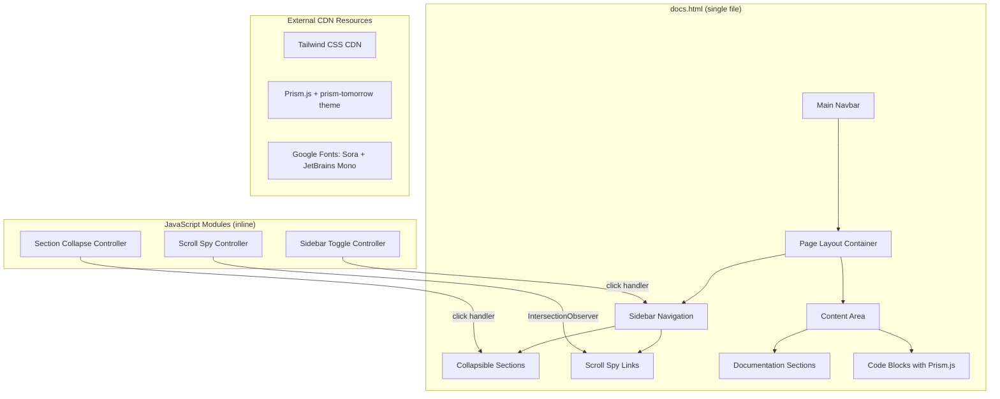

# Design Document: Docs Page

## Overview

This design specifies a static documentation page (`examples/playground/docs.html`) for the Tomation playground site. The page presents the full DSL reference and feature documentation in a Playwright-style layout: a fixed left sidebar with collapsible sections and scroll spy, paired with a scrollable content area on the right. On mobile (< 768px), the sidebar collapses into a hamburger-triggered overlay.

The page uses the same stack as existing playground pages — Tailwind CDN, Prism.js, Google Fonts (Sora + JetBrains Mono), and vanilla JavaScript. No build step is required.

### Design Decisions

1. **Single-file architecture**: All HTML, CSS, and JS live in one file, matching the playground pattern. This avoids build tooling and keeps deployment trivial via GitHub Pages.
2. **Scroll spy via Intersection Observer**: Using `IntersectionObserver` rather than scroll-event debouncing for better performance and simpler threshold logic.
3. **CSS-based responsive strategy**: The sidebar visibility toggle uses Tailwind's `md:` breakpoint utilities combined with a small JS toggle for the mobile overlay, minimizing custom CSS.
4. **Content hardcoded in HTML**: Documentation content is authored directly in the HTML file (sourced from the README at build time by the developer). This keeps the page static and avoids runtime fetch/render complexity.

## Architecture



### Page Layout (Desktop ≥ 768px)

```
┌─────────────────────────────────────────────────────────┐
│  Main Navbar (sticky top-0)                             │
├────────────┬────────────────────────────────────────────┤
│  Sidebar   │  Content Area                              │
│  (fixed,   │  (scrollable, margin-left offset)          │
│   w-64,    │                                            │
│   top-     │  ┌─ Section Heading ─────────────────┐     │
│   navbar)  │  │  Paragraphs, code blocks, tables  │     │
│            │  └───────────────────────────────────┘     │
│  ┌──────┐  │                                            │
│  │ Get  │  │  ┌─ Section Heading ─────────────────┐     │
│  │Start │  │  │  ...                              │     │
│  ├──────┤  │  └───────────────────────────────────┘     │
│  │ CLI  │  │                                            │
│  ├──────┤  │                                            │
│  │Config│  │                                            │
│  ├──────┤  │                                            │
│  │ API ▾│  │                                            │
│  │  ├El │  │                                            │
│  │  ├Wh │  │                                            │
│  │  ├Us │  │                                            │
│  │  └As │  │                                            │
│  ├──────┤  │                                            │
│  │Tests │  │                                            │
│  ├──────┤  │                                            │
│  │Auto  │  │                                            │
│  ├──────┤  │                                            │
│  │ POM  │  │                                            │
│  └──────┘  │                                            │
├────────────┴────────────────────────────────────────────┤
│  (no footer — content scrolls to end)                   │
└─────────────────────────────────────────────────────────┘
```

### Page Layout (Mobile < 768px)

```
┌────────────────────────────────┐
│  Main Navbar  [☰ hamburger]    │
├────────────────────────────────┤
│  Content Area (full width)     │
│                                │
│  Sections render linearly      │
│                                │
└────────────────────────────────┘

When hamburger is tapped:
┌────────────────────────────────┐
│  Overlay Sidebar (z-50)        │
│  ┌──────────────────────────┐  │
│  │  Sidebar links           │  │
│  │  (tap to scroll + close) │  │
│  └──────────────────────────┘  │
└────────────────────────────────┘
```

## Components and Interfaces

### 1. Main Navbar

Reused from existing playground pages. The "Docs" link `href` changes from the GitHub URL to `docs.html`. On the docs page itself, the "Docs" link receives the active style (emerald text color).

### 2. Sidebar Component

| Attribute | Value |
|-----------|-------|
| HTML element | `<nav aria-label="Documentation navigation">` |
| Position | `fixed`, `top` offset = navbar height (~60px), `left-0`, `h-[calc(100vh-60px)]` |
| Width | `w-64` (256px) on desktop |
| Overflow | `overflow-y-auto` with custom scrollbar styling |
| Background | `bg-slate-900/95 backdrop-blur` |
| Border | `border-r border-slate-700/70` |

#### Sidebar Section (collapsible parent)

```html
<div class="sidebar-section">
  <button aria-expanded="false" class="sidebar-section-toggle">
    <span>API</span>
    <svg class="chevron-icon">...</svg>
  </button>
  <ul class="sidebar-children hidden">
    <li><a href="#element-locators">Element/Locators Builder API</a></li>
    <li><a href="#where-matchers">Where Matchers</a></li>
    <li><a href="#user-functions">User Functions: Click, Type, Select</a></li>
    <li><a href="#assertions">Assertions</a></li>
  </ul>
</div>
```

#### Sidebar Link (leaf item)

```html
<a href="#section-id" class="sidebar-link text-slate-400 hover:text-emerald-300">
  Section Name
</a>
```

Active state class: `text-emerald-300 border-l-2 border-emerald-400 bg-emerald-500/5`

### 3. Scroll Spy Controller (JavaScript)

**Interface:**

```javascript
class ScrollSpy {
  constructor(options: {
    contentSelector: string,      // e.g., '[data-section]'
    linkSelector: string,         // e.g., '.sidebar-link'
    activeClass: string,          // e.g., 'active'
    offset: number                // px from top to trigger (navbar height)
  })

  init(): void                    // Sets up IntersectionObserver
  destroy(): void                 // Disconnects observer
  setActive(id: string): void     // Highlights link, expands parent section
}
```

**Behavior:**
- Creates an `IntersectionObserver` with `rootMargin: '-60px 0px -60% 0px'` to account for the sticky navbar and activate sections when they enter the upper portion of the viewport.
- On intersection, finds the corresponding sidebar link by matching `href` to the section `id`.
- Applies `activeClass` to the matching link, removes it from all others.
- Auto-expands the parent `sidebar-section` if the active link is a child item.

### 4. Sidebar Toggle Controller (JavaScript)

**Interface:**

```javascript
class SidebarToggle {
  constructor(options: {
    sidebarId: string,
    toggleButtonId: string,
    overlayId: string
  })

  open(): void       // Shows sidebar overlay, sets aria-expanded="true"
  close(): void      // Hides sidebar overlay, sets aria-expanded="false"
  toggle(): void     // Toggles between open/close
}
```

**Behavior:**
- On mobile (< 768px), the sidebar is hidden by default (`hidden md:block`).
- The hamburger button calls `toggle()`.
- Clicking a sidebar link on mobile calls `close()` after initiating scroll.
- An overlay backdrop (`bg-slate-950/50`) appears behind the sidebar to dim content.

### 5. Section Collapse Controller (JavaScript)

**Interface:**

```javascript
function initCollapsibleSections(containerSelector: string): void
```

**Behavior:**
- Attaches click handlers to all `.sidebar-section-toggle` buttons.
- Toggles `hidden` class on the adjacent `.sidebar-children` list.
- Updates `aria-expanded` attribute on the button.
- All sections start collapsed except the one containing the currently active link (determined by scroll spy on page load).

### 6. Content Area

| Attribute | Value |
|-----------|-------|
| HTML element | `<main>` |
| Position | Normal flow, `ml-64` on desktop, `ml-0` on mobile |
| Max width | `max-w-4xl` within the remaining space |
| Padding | `px-6 py-10 sm:px-10` |

Content sections use heading hierarchy:
- `<h1>` — Page title ("Tomation Documentation")
- `<h2>` — Top-level sections (Get Started, CLI, Config, etc.)
- `<h3>` — Sub-sections (Element Locators, Where Matchers, etc.)
- `<h4>` — Minor headings within sub-sections

Each `<h2>` and `<h3>` receives a unique `id` attribute matching the sidebar link `href`.

## Data Models

This feature has no dynamic data models. All content is static HTML. The key data structures are:

### Sidebar Navigation Tree (hardcoded)

```javascript
const navTree = [
  { id: 'get-started', label: 'Get Started & Installation', children: [] },
  { id: 'cli', label: 'Tomation CLI', children: [] },
  { id: 'configuration', label: 'Configuration File', children: [] },
  {
    id: 'api',
    label: 'API',
    children: [
      { id: 'element-locators', label: 'Element/Locators Builder API' },
      { id: 'where-matchers', label: 'Where Matchers' },
      { id: 'user-functions', label: 'User Functions: Click, Type, Select' },
      { id: 'assertions', label: 'Assertions' }
    ]
  },
  { id: 'tests', label: 'Tests', children: [] },
  { id: 'automations', label: 'Automations', children: [] },
  { id: 'pom-files', label: 'POM Files', children: [] }
];
```

### Section Anchor IDs

| Sidebar Label | Anchor ID |
|---------------|-----------|
| Get Started & Installation | `get-started` |
| Tomation CLI | `cli` |
| Configuration File | `configuration` |
| Element/Locators Builder API | `element-locators` |
| Where Matchers | `where-matchers` |
| User Functions: Click, Type, Select | `user-functions` |
| Assertions | `assertions` |
| Tests | `tests` |
| Automations | `automations` |
| POM Files | `pom-files` |

## Error Handling

Since this is a static HTML page with no network requests or user input processing, error handling is minimal:

| Scenario | Handling |
|----------|----------|
| CDN resources fail to load (Tailwind, Prism, Fonts) | Page degrades gracefully — content remains readable with browser defaults. Prism code blocks display as plain `<pre><code>` without highlighting. |
| JavaScript disabled | Sidebar sections remain expanded (no collapse), scroll spy inactive, hamburger menu non-functional. All content is still accessible via manual scrolling. Links work as standard anchor navigation. |
| Intersection Observer unsupported (old browsers) | Scroll spy silently fails. Sidebar remains functional for manual navigation. |
| Section anchor ID not found | Smooth scroll does nothing; browser falls back to default anchor behavior (instant jump or no-op). |

### Progressive Enhancement Strategy

The page is built with progressive enhancement:
1. **HTML layer**: All content readable, all links functional as standard anchors
2. **CSS layer**: Layout, theming, responsive behavior via Tailwind
3. **JS layer**: Scroll spy, collapse, hamburger toggle — all enhancements on top of a functional base

## Testing Strategy

Property-based testing is **not applicable** for this feature. The docs page is a static HTML page with UI rendering, DOM interactions (scroll spy, sidebar toggle), and responsive layout. There are no pure functions with meaningful input variation, no data transformations, and no serialization logic. The behavior is deterministic UI rendering that doesn't benefit from randomized input generation.

### Recommended Testing Approach

**Example-based integration tests** using the existing Tomation test framework or manual browser verification:

| Test Category | What to Verify |
|---------------|----------------|
| **Page structure** | docs.html loads, Main Navbar present, sidebar visible on desktop |
| **Sidebar navigation** | Each sidebar link scrolls to the correct section anchor |
| **Collapse/expand** | Clicking section toggles shows/hides children, aria-expanded updates |
| **Scroll spy** | Scrolling to a section highlights the corresponding sidebar link |
| **Responsive** | Below 768px: sidebar hidden, hamburger visible; above 768px: sidebar visible, hamburger hidden |
| **Mobile overlay** | Hamburger opens sidebar overlay, clicking a link closes it |
| **Code highlighting** | Code blocks render with Prism.js syntax highlighting (TypeScript grammar) |
| **Accessibility** | Focus indicators visible, keyboard navigation works, aria attributes correct |
| **Navbar link** | "Docs" link points to docs.html on all playground pages, active state on docs page |

**Manual testing checklist:**
- Viewport breakpoints: 320px, 375px, 768px, 1024px, 1440px, 1920px
- Keyboard-only navigation through sidebar
- Screen reader navigation (VoiceOver/NVDA) for aria labels and heading hierarchy
- Verify no horizontal scroll at any viewport width
