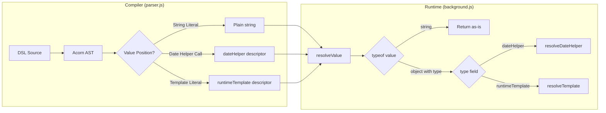

# Design Document: DSL Runtime Utilities

## Overview

This feature extends the Tomation DSL compiler and runtime with two new value expression types:

1. **Date helper functions** — built-in functions (`today()`, `tomorrow()`, `yesterday()`, `nextWeek()`, `lastWeek()`, `nextMonth()`, `lastMonth()`, `firstDateOfMonth(offset)`, `lastDateOfMonth(offset)`) that resolve to formatted date strings at test execution time.
2. **Runtime template strings** — backtick-delimited template literals containing `${}` expressions that are evaluated at runtime, enabling dynamic value construction.

Currently, DSL action values (the argument to `Type()`, `AssertHasText()`, etc.) only accept string literals and `{{paramName}}` references. This feature introduces runtime-evaluated value descriptors that the compiler emits as JSON objects in the test plan, which the runtime interprets at execution time.

### Design Rationale

The key architectural decision is to split responsibility between compile-time and runtime:
- The **compiler** recognizes date helper calls and template literals in value positions, validates arguments, and emits structured JSON descriptors (not resolved values).
- The **runtime** resolves descriptors to concrete strings at execution time, ensuring dates are always relative to when the test actually runs.

This approach keeps the compiler stateless (no clock dependency) and makes test plans portable and inspectable.

## Architecture



The compiler pipeline remains unchanged in structure — `parseSource()` → `extractPom()` → `emitter` → JSON output. The parser's `extractStringOrTemplate()` function is extended to recognize date helper calls and rich template literals, returning descriptor objects instead of flat strings when appropriate.

The runtime's existing `resolveValue()` function is extended to detect object-typed values and dispatch to new resolver functions.

## Components and Interfaces

### Compiler Changes (parser.js)

#### New: `extractValueExpression(node, filePath, warnings)`

Replaces `extractStringOrTemplate()` as the primary value extractor for DSL action arguments. Returns either:
- A plain string (for string literals and simple templates)
- A date helper descriptor object
- A runtime template descriptor object

This function is called from `extractStep()` wherever a value argument is expected (Type, TypePassword, Select, AssertHasText, Navigate, Manual).

```javascript
/**
 * Extract a value expression from an AST node in a DSL value position.
 * Handles: string literals, template literals (with/without expressions),
 * date helper calls, and identifier references.
 *
 * @param {object} node - AST node
 * @param {string} filePath - source file path for warnings
 * @param {Array} warnings - mutable warnings array
 * @returns {string|object|null} plain string, descriptor object, or null
 */
function extractValueExpression(node, filePath, warnings) { ... }
```

#### New: `extractDateHelperCall(node, filePath, warnings)`

Recognizes a CallExpression matching a known date helper name and extracts the descriptor.

```javascript
/**
 * Known day-offset helper names and their offsets.
 */
const DAY_OFFSET_HELPERS = {
  today: 0, tomorrow: 1, yesterday: -1,
  nextWeek: 7, lastWeek: -7, nextMonth: 30, lastMonth: -30
};

/**
 * Known month-boundary helper names.
 */
const MONTH_BOUNDARY_HELPERS = {
  firstDateOfMonth: 'first',
  lastDateOfMonth: 'last'
};
```

#### Modified: `extractStep()`

Updated to call `extractValueExpression()` instead of `extractStringOrTemplate()` for the value argument of Type, TypePassword, Select, AssertHasText, Navigate, and Manual actions. The step descriptor's `value`/`url`/`description` field can now be either a string or an object.

#### New: `extractRuntimeTemplate(node, filePath, warnings)`

Handles TemplateLiteral nodes with one or more expressions, building a `parts` array.

### Runtime Changes (background.js)

#### Modified: `resolveValue(value, params)`

Extended to detect object-typed values and dispatch:

```javascript
function resolveValue(value, params) {
  if (value === undefined || value === null) return value;

  // NEW: Object-typed runtime values
  if (typeof value === 'object' && value !== null && value.type) {
    switch (value.type) {
      case 'dateHelper': return resolveDateHelper(value);
      case 'runtimeTemplate': return resolveRuntimeTemplate(value, params);
      default: return '';
    }
  }

  // Existing string resolution (unchanged)
  if (typeof value !== 'string') return value;
  if (value === '$random') return generateRandom(8);
  // ... existing {{param}} and $random logic
}
```

#### New: `resolveDateHelper(descriptor)`

Resolves a date helper descriptor to a formatted date string.

```javascript
/**
 * Resolve a dateHelper descriptor to a date string.
 * @param {object} descriptor - { type, kind, offset?, boundary?, monthOffset?, format? }
 * @returns {string} formatted date string
 */
function resolveDateHelper(descriptor) { ... }
```

#### New: `resolveRuntimeTemplate(descriptor, params)`

Evaluates a runtime template descriptor by resolving each part and concatenating.

```javascript
/**
 * Resolve a runtimeTemplate descriptor to a string.
 * @param {object} descriptor - { type: "runtimeTemplate", parts: Array }
 * @param {object} params - current parameter context
 * @returns {string} concatenated result
 */
function resolveRuntimeTemplate(descriptor, params) { ... }
```

#### New: `formatDate(date, formatStr)`

Formats a Date object using the specified format string (or ISO default).

```javascript
/**
 * Format a Date using token substitution.
 * Tokens: YYYY, MM, DD, M, D. Everything else is literal.
 * @param {Date} date
 * @param {string} [formatStr='YYYY-MM-DD']
 * @returns {string}
 */
function formatDate(date, formatStr) { ... }
```

#### New: `evaluateExpression(source, params)`

Evaluates simple arithmetic expressions with parameter substitution.

```javascript
/**
 * Evaluate an arithmetic expression string with param substitution.
 * Supports: +, -, *, /, parentheses, identifiers (from params), numbers.
 * @param {string} source - expression source text
 * @param {object} params - parameter context
 * @returns {string} result coerced to string, or '' on error
 */
function evaluateExpression(source, params) { ... }
```

### TypeScript Declarations (globals.d.ts, index.d.ts)

#### New type: `DateHelperValue`

```typescript
/** A runtime-evaluated date value accepted in DSL value positions. */
type DateHelperValue = string;
```

Using `string` as the return type (rather than a branded type) ensures date helpers are accepted anywhere a string literal is accepted today, maintaining backward compatibility with existing action signatures.

#### New global function declarations

```typescript
// Day-offset helpers
declare function today(format?: string): string;
declare function tomorrow(format?: string): string;
declare function yesterday(format?: string): string;
declare function nextWeek(format?: string): string;
declare function lastWeek(format?: string): string;
declare function nextMonth(format?: string): string;
declare function lastMonth(format?: string): string;

// Month-boundary helpers
declare function firstDateOfMonth(offset: number, format?: string): string;
declare function lastDateOfMonth(offset: number, format?: string): string;
```

## Data Models

### Date Helper Descriptor (day-offset)

Emitted by the compiler when a day-offset helper call is encountered in a value position.

```json
{
  "type": "dateHelper",
  "kind": "dayOffset",
  "offset": 1,
  "format": "MM/DD/YYYY"
}
```

| Field | Type | Required | Description |
|-------|------|----------|-------------|
| `type` | `"dateHelper"` | yes | Discriminator for runtime dispatch |
| `kind` | `"dayOffset"` | yes | Identifies this as a day-offset helper |
| `offset` | integer | yes | Days from today (0=today, 1=tomorrow, -1=yesterday, etc.) |
| `format` | string | no | Custom format string. Absent = use default `YYYY-MM-DD` |

### Date Helper Descriptor (month-boundary)

```json
{
  "type": "dateHelper",
  "kind": "monthBoundary",
  "boundary": "first",
  "monthOffset": -1,
  "format": "DD/MM/YYYY"
}
```

| Field | Type | Required | Description |
|-------|------|----------|-------------|
| `type` | `"dateHelper"` | yes | Discriminator for runtime dispatch |
| `kind` | `"monthBoundary"` | yes | Identifies this as a month-boundary helper |
| `boundary` | `"first"` \| `"last"` | yes | Which boundary of the month |
| `monthOffset` | integer | yes | Months from current (0=this month, -1=last month, 1=next month) |
| `format` | string | no | Custom format string. Absent = use default `YYYY-MM-DD` |

### Runtime Template Descriptor

Emitted when a template literal with expressions is used as a DSL value.

```json
{
  "type": "runtimeTemplate",
  "parts": [
    "Appointment on ",
    { "type": "dateHelper", "kind": "dayOffset", "offset": 1 },
    " at ",
    { "type": "param", "name": "time" },
    ""
  ]
}
```

| Field | Type | Required | Description |
|-------|------|----------|-------------|
| `type` | `"runtimeTemplate"` | yes | Discriminator for runtime dispatch |
| `parts` | Array | yes | Interleaved static strings and expression descriptors |

### Expression Descriptors (within template parts)

**Parameter reference:**
```json
{ "type": "param", "name": "username" }
```

**Date helper (nested):**
```json
{ "type": "dateHelper", "kind": "dayOffset", "offset": 0 }
```

**Arithmetic expression:**
```json
{ "type": "expression", "source": "count + 1" }
```

### Value field polymorphism in steps

After this feature, a step's `value`, `url`, or `description` field can be:

| Shape | Meaning |
|-------|---------|
| `"hello"` (string) | Static literal — existing behavior, no change |
| `{ type: "dateHelper", ... }` | Runtime-evaluated date |
| `{ type: "runtimeTemplate", parts: [...] }` | Runtime-evaluated template |

## Correctness Properties

*A property is a characteristic or behavior that should hold true across all valid executions of a system — essentially, a formal statement about what the system should do. Properties serve as the bridge between human-readable specifications and machine-verifiable correctness guarantees.*

### Property 1: Compiler emits correct day-offset descriptors

*For any* valid day-offset date helper call (`today`, `tomorrow`, `yesterday`, `nextWeek`, `lastWeek`, `nextMonth`, `lastMonth`) with an optional string format argument used in a DSL value position, the compiler SHALL emit a JSON object with `type: "dateHelper"`, `kind: "dayOffset"`, the correct integer `offset` for the helper name, and a `format` field matching the argument (or absent if no argument provided).

**Validates: Requirements 1.3, 1.4, 3.1, 4.1, 8.2**

### Property 2: Compiler emits correct month-boundary descriptors

*For any* valid month-boundary date helper call (`firstDateOfMonth` or `lastDateOfMonth`) with a required integer offset argument and optional string format argument used in a DSL value position, the compiler SHALL emit a JSON object with `type: "dateHelper"`, `kind: "monthBoundary"`, the correct `boundary` field (`"first"` or `"last"`), `monthOffset` matching the integer argument, and `format` matching the string argument if provided.

**Validates: Requirements 1.5, 3.2, 4.1, 8.3**

### Property 3: Runtime resolves day-offset dates correctly

*For any* reference date and integer offset, the runtime's day-offset resolution SHALL produce a date that is exactly `offset` calendar days from the reference date.

**Validates: Requirements 2.1**

### Property 4: Runtime resolves first-of-month boundary correctly

*For any* reference date and integer month offset, the runtime's first-of-month resolution SHALL produce a date whose day is 1 and whose month/year is exactly `monthOffset` months from the reference date's month/year.

**Validates: Requirements 2.2**

### Property 5: Runtime resolves last-of-month boundary correctly

*For any* reference date and integer month offset, the runtime's last-of-month resolution SHALL produce the last calendar day of the month that is `monthOffset` months from the reference date's month/year (accounting for varying month lengths and leap years).

**Validates: Requirements 2.3**

### Property 6: Runtime date formatting round-trip

*For any* valid Date and any format string composed of tokens (`YYYY`, `MM`, `DD`, `M`, `D`) separated by literal characters, the formatted output SHALL contain the correct numeric values for each token with correct zero-padding (`MM`/`DD` = 2 digits, `M`/`D` = no leading zero) and literal separators preserved in position.

**Validates: Requirements 2.4, 2.5, 3.4**

### Property 7: Compiler emits correct runtime template descriptors

*For any* template literal with N ≥ 1 expressions used in a DSL value position, the compiler SHALL emit a `runtimeTemplate` descriptor whose `parts` array has exactly `2N + 1` elements: N+1 static strings interleaved with N expression descriptors, where each expression descriptor has the correct `type` field (`"param"` for identifiers, `"dateHelper"` for date helper calls, `"expression"` for arithmetic).

**Validates: Requirements 5.1, 5.3, 5.4, 5.5, 8.4, 8.5**

### Property 8: Runtime template evaluation concatenates correctly

*For any* runtime template descriptor with a valid `parts` array and a params context providing values for all referenced parameters, the runtime SHALL produce a string equal to the concatenation of: each static string part as-is, each `param` descriptor resolved to `String(params[name])`, each `dateHelper` descriptor resolved via the date helper logic, and each `expression` descriptor resolved via arithmetic evaluation.

**Validates: Requirements 5.7, 6.1, 6.2, 6.3**

### Property 9: Runtime value dispatch

*For any* step value that is a plain string, the runtime SHALL return it through existing string resolution logic ({{param}} substitution, $random). *For any* step value that is an object with a `type` field, the runtime SHALL dispatch to the appropriate resolver and never apply {{param}} token replacement to the object.

**Validates: Requirements 8.6**

### Property 10: Compiler warnings include source location

*For any* warning emitted during date helper or template parsing, the warning object SHALL contain a non-empty `filePath` string and a positive integer `line` field.

**Validates: Requirements 4.4**

## Error Handling

### Compiler Errors and Warnings

| Scenario | Severity | Message Pattern | Behavior |
|----------|----------|-----------------|----------|
| Day-offset helper with non-string argument | Warning | `"Date helper '{name}' format argument must be a string at {filePath}:{line}"` | Emit descriptor without `format` field |
| Month-boundary helper missing integer argument | Warning | `"'{name}' requires an integer offset argument at {filePath}:{line}"` | Emit descriptor with `monthOffset: 0` as fallback |
| Month-boundary helper with non-integer first arg | Warning | `"'{name}' first argument must be an integer at {filePath}:{line}"` | Emit descriptor with `monthOffset: 0` as fallback |
| Day-offset helper with extra arguments | Warning | `"'{name}' accepts at most 1 argument at {filePath}:{line}"` | Ignore extra args, emit descriptor normally |
| Month-boundary helper with extra arguments | Warning | `"'{name}' accepts at most 2 arguments at {filePath}:{line}"` | Ignore extra args, emit descriptor normally |
| Unrecognized function in value position | Warning | `"Unknown function '{name}' in value position at {filePath}:{line}"` | Continue compilation, skip the value |
| Unsupported expression in template `${}` | Warning | `"Unsupported expression type in template at {filePath}:{line}"` | Emit as `{ type: "param", name: "<source>" }` fallback |

All warnings are non-fatal — the compiler continues producing valid test plan output.

### Runtime Errors

| Scenario | Behavior | Logging |
|----------|----------|---------|
| Undefined parameter in template | Substitute `""` | `console.warn('[tomation] Missing param "X" — substituting empty string')` |
| Arithmetic producing NaN/Infinity | Substitute `""` | `console.warn('[tomation] Expression "X" produced non-finite result')` |
| Division by zero in expression | Substitute `""` | `console.warn('[tomation] Expression "X" division by zero')` |
| Unrecognized format token | Leave token as literal text | `console.warn('[tomation] Unrecognized format token "X"')` |
| Unknown descriptor type | Substitute `""` | `console.warn('[tomation] Unknown value descriptor type "X"')` |

Runtime errors never halt test execution — they degrade gracefully to empty strings to keep the test running.

## Testing Strategy

### Unit Tests (example-based)

- **Day-offset mapping**: Verify all 7 helpers map to correct offsets (1.4)
- **Backward compatibility**: Existing plain string values produce unchanged JSON output (8.1)
- **Zero-expression template**: Backtick with no `${}` emits plain string (5.2)
- **Date helper not in value position**: Helper calls outside action arguments are ignored (1.6)
- **Warning scenarios**: Each error condition above produces the expected warning message
- **Edge cases**: Leap year last-of-month, year boundaries for month offset calculations

### Property-Based Tests (fast-check)

Property-based testing is appropriate here because the compiler and runtime contain pure transformation functions with clear input/output behavior and large input spaces (arbitrary dates, format strings, template structures, param values).

**Library**: [fast-check](https://github.com/dubzzz/fast-check) (already an npm dependency pattern used in JS projects)

**Configuration**: Minimum 100 iterations per property test.

**Tag format**: `Feature: dsl-runtime-utilities, Property {N}: {description}`

Each correctness property (1–10) maps to a single property-based test:

1. Generate random day-offset helper names + optional format strings → verify descriptor shape
2. Generate random integer offsets + boundary type + optional format → verify descriptor shape
3. Generate random reference dates + offsets → verify date arithmetic
4. Generate random reference dates + month offsets → verify first-of-month result
5. Generate random reference dates + month offsets → verify last-of-month result (including Feb/leap)
6. Generate random dates + random valid format strings → verify token substitution
7. Generate random template structures (N expressions, mixed types) → verify parts array
8. Generate random template descriptors + param contexts → verify concatenation
9. Generate random mixed values (strings and objects) → verify dispatch
10. Trigger random warning scenarios → verify filePath and line presence

### Integration Tests

- End-to-end: DSL source → compiled JSON → runtime resolution → final string value
- Template with nested date helpers and params resolving correctly together
- Multiple date helpers in a single test plan with different format strings
