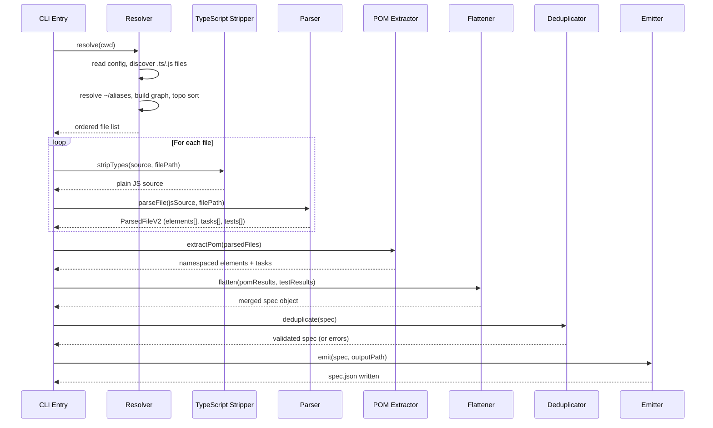
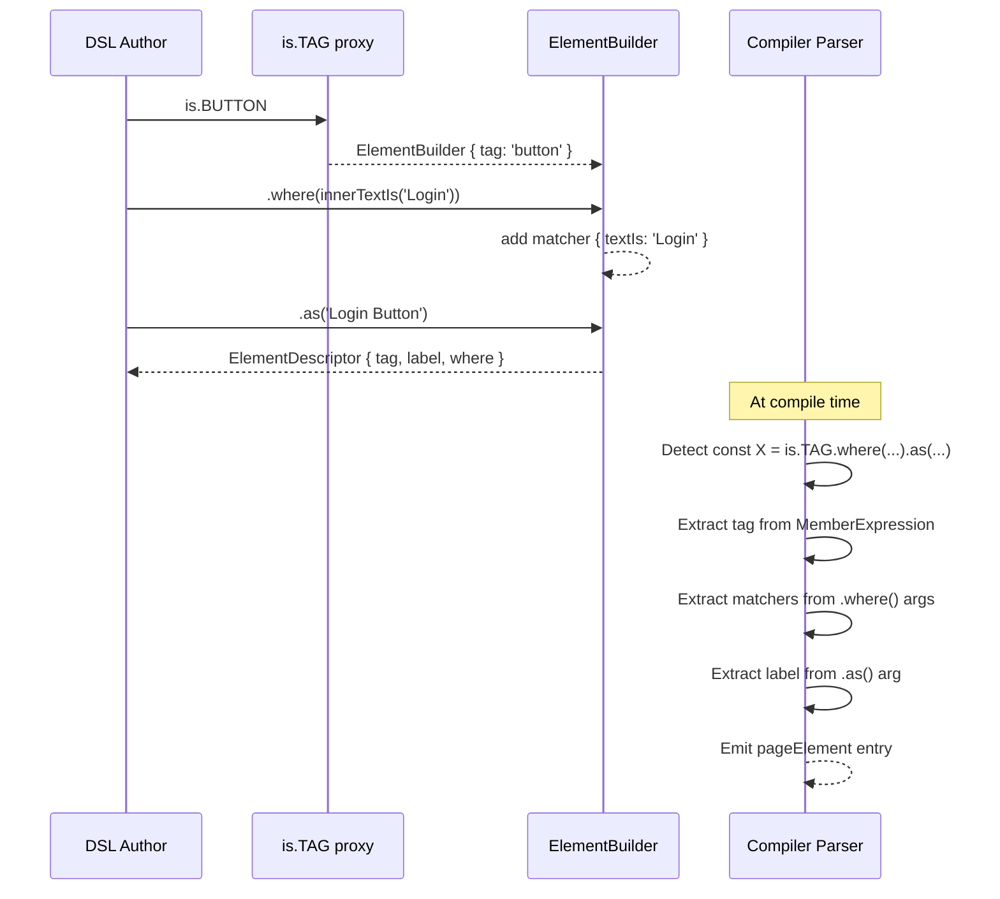

# Design Document: DSL v2 — Improved Readability with TypeScript Support

## Overview

DSL v2 evolves the Tomation authoring experience to a natural, declarative TypeScript-first approach. Elements are declared as constants using a tag-first builder pattern (`is.BUTTON.where(...).as('Label')`), tasks use a named function pattern (`Task('name', fn)`), and tests use simple function exports with `Test('name', fn)`. The compiler is extended to handle `.ts`/`.tsx` files via a type-stripping step and resolve `~/` path aliases — while still producing the same `spec.json` output format consumed by the browser extension runtime.

The changes are scoped to two packages: `@tomation/dsl` (new builder API + TypeScript types) and `@tomation/compiler` (TypeScript-aware parsing pipeline, new AST extraction patterns). The extension runtime receives two extensions: XPath-based element lookup via `document.evaluate()`, and conditional `if` step evaluation during the step flattening phase in the background.

## Architecture

```mermaid
graph TD
    subgraph "Author Time"
        POM["POM files (.ts)"]
        TEST["Test files (.ts)"]
        CONFIG["tomation.config.ts/js"]
    end

    subgraph "@tomation/compiler v2"
        RESOLVE["resolver.ts<br/>discover + topo sort + ~/alias"]
        STRIP["ts-stripper.ts<br/>strip types → plain JS"]
        PARSE["parser.ts<br/>AST extract (v2 patterns)"]
        POM_EXTRACT["pom-extractor.ts<br/>namespace elements/tasks"]
        FLATTEN["flattener.ts"]
        DEDUP["deduplicator.ts"]
        EMIT["emitter.ts"]
    end

    subgraph "Output"
        SPEC["spec.json<br/>(unchanged format)"]
    end

    POM --> RESOLVE
    TEST --> RESOLVE
    CONFIG --> RESOLVE
    RESOLVE --> STRIP
    STRIP --> PARSE
    PARSE --> POM_EXTRACT
    POM_EXTRACT --> FLATTEN
    FLATTEN --> DEDUP
    DEDUP --> EMIT
    EMIT --> SPEC
end
```


## Sequence Diagrams

### Compilation Flow




### Element Builder Chain Resolution



## Components and Interfaces

### Component 1: DSL Package (`@tomation/dsl` v2)

**Purpose**: Provide runtime stubs, TypeScript types, and the `is` global for authoring POM and test files.

**Interface**:

```typescript
// Element builder chain — only a single .where() call is allowed per element chain
interface ElementBuilder {
  where(matcher: WhereMatcher): ElementBuilder
  childOf(parent: ElementDescriptor): ElementBuilder
  as(label: string): ElementDescriptor
}

// XPath element builder — returned by Element() or is.ELEMENT()
interface XPathElementBuilder {
  as(label: string): ElementDescriptor
}

// Matcher types
type WhereMatcher = 
  | ReturnType<typeof innerTextIs>
  | ReturnType<typeof classIncludes>
  | ReturnType<typeof placeholderIs>
  | ReturnType<typeof nameIs>
  | ReturnType<typeof typeIs>
  | ReturnType<typeof idIs>

// Built-in matcher factories
declare function innerTextIs(text: string): { textIs: string }
declare function innerTextContains(text: string): { textContains: string }
declare function classIncludes(cls: string): { classIncludes: string }
declare function placeholderIs(ph: string): { placeholder: string }
declare function nameIs(name: string): { name: string }
declare function typeIs(type: string): { type: string }
declare function idIs(id: string): { id: string }

// XPath element constructors — two equivalent APIs
declare function Element(xpath: string): XPathElementBuilder
declare const is: {
  [TAG in keyof HTMLElementTagNameMap as Uppercase<TAG>]: ElementBuilder
  ELEMENT: (xpath: string) => XPathElementBuilder
}
```


**Responsibilities**:
- Export `is` proxy object that starts the element builder chain (including `is.ELEMENT(xpath)` for XPath selectors)
- Export `Element(xpath)` as a standalone XPath element constructor function
- Export matcher factory functions (`innerTextIs`, `classIncludes`, etc.)
- Export `Task`, `Test`, `Click`, `Type`, `TypePassword`, `Select`, and other action functions
- Provide full TypeScript type definitions for editor autocomplete

### Component 2: TypeScript Stripper

**Purpose**: Strip TypeScript type annotations from source files to produce plain JavaScript parseable by acorn.

**Interface**:

```typescript
interface StripResult {
  code: string        // Plain JS with types removed
  sourceMap?: object  // Optional source map for error reporting
}

function stripTypes(source: string, filePath: string): StripResult
```

**Responsibilities**:
- Remove type annotations, interfaces, type aliases, enums (type-only)
- Preserve runtime code structure and line numbers (for error reporting)
- Handle `.ts` and `.tsx` extensions
- Use `ts.transpileModule` with `isolatedModules` for fast per-file stripping (no type-checking)

### Component 3: Parser v2

**Purpose**: Extend the existing acorn-based parser to recognize v2 (`is.TAG`, `Task('name', fn)`, `Test('name', fn)`) patterns.

**Interface**:

```typescript
interface ParsedFileV2 {
  filePath: string
  type: 'pom' | 'test'
  // v2 patterns
  elements: ElementDef[]  // from is.TAG.where(...).as(...)
  tasks: TaskDefV2[]      // from Task('name', fn)
  tests: TestDefV2[]      // from Test('name', fn)
  error: null | { message: string; line: number }
}

interface ElementDef {
  variableName: string    // const name used for namespacing
  tag: string             // HTML tag name, or '*' for XPath elements
  label: string
  where: WhereDescriptor
  xpath?: string          // XPath expression (when using Element() or is.ELEMENT())
  childOf?: string        // variable name of parent element (resolved to namespaced key during POM extraction)
  line: number
}

interface TaskDefV2 {
  name: string            // from Task('name', ...)
  params: string[]        // inferred from fn parameter destructuring
  steps: Step[]
  line: number
}

interface TestDefV2 {
  name: string            // from Test('name', ...)
  steps: Step[]
  line: number
}

function parseFile(source: string, filePath: string): ParsedFileV2
```

**Responsibilities**:
- Detect v2 element declarations: `const X = is.TAG.where(...).as(...)`
- Detect v2 XPath element declarations: `const X = Element(xpath).as(...)` and `const X = is.ELEMENT(xpath).as(...)`
- Detect v2 task declarations: `Task('name', (params) => { ... })`
- Detect v2 test declarations: `Test('name', () => { ... })`
- Parse action calls within task/test bodies: `Click(el)`, `Type(val).in(el)`, etc.
- Detect `.childOf(parentRef)` in element builder chains and extract parent element reference


### Component 4: Resolver v2

**Purpose**: Extend the resolver to support `.ts`/`.tsx` file discovery, `~/` path aliases, and the new config format.

**Interface**:

```typescript
interface ResolveResult {
  ok: boolean
  files?: string[]        // ordered file paths
  error?: string
}

interface TomationConfig {
  meta: {
    name: string
    urls: string[]       // multiple URLs — tests can navigate across these
    description?: string
  }
  pom: string             // directory path
  tests: string           // directory path
  baseUrl?: string        // base path for ~/alias resolution (defaults to config dir)
}

function resolve(cwd: string): ResolveResult
```

**Responsibilities**:
- Discover `.ts`, `.tsx`, `.pom.ts`, `.test.ts` files (in addition to `.js`)
- Resolve `~/` path aliases to the configured `baseUrl` or project root
- Support `tomation.config.ts` in addition to `tomation.config.js`
- Maintain topological sort and cycle detection
- When the config file is `.ts`, use `ts.transpileModule` to strip types before evaluating it

### Component 5: POM Extractor v2

**Purpose**: Transform v2 parsed elements and tasks into the namespaced spec format.

**Interface**:

```typescript
interface PomResultV2 {
  filePath: string
  pageElements: Record<string, PageElement>
  tasks: Record<string, TaskSpec>
  errors: Array<{ message: string; filePath: string; line: number }>
}

function extractPomV2(parsedFile: ParsedFileV2): PomResultV2
```

**Responsibilities**:
- Derive namespace from the default export object name or file name (no more `Page('Name')` wrapper needed)
- Namespace element keys as `<Namespace>__<variableName>`
- Namespace task keys as `<Namespace>__<taskName>`
- Resolve `childOf` variable references to namespaced keys

### Runtime Extension: XPath Support

The extension runtime's `findElement()` is extended to check for the `xpath` field in the element descriptor. This is the **only** change to the extension runtime required by DSL v2.

**Behavior:**
- When `xpath` is present in the element descriptor, the runtime uses `document.evaluate(xpath, document, null, XPathResult.FIRST_ORDERED_NODE_TYPE, null).singleNodeValue` to locate the element
- The normal tag+where polling logic is bypassed entirely for XPath elements
- The 5-second polling timeout still applies — the runtime polls with `requestAnimationFrame` until `document.evaluate` returns a non-null node, or the timeout expires
- If the timeout expires without finding a node, the step fails with the standard "element not found" error

**Pseudocode:**
```typescript
async function findElement(descriptor: PageElementV2): Promise<HTMLElement | null> {
  if (descriptor.xpath) {
    // XPath path — use document.evaluate directly
    const deadline = Date.now() + 5000
    return new Promise((resolve) => {
      function poll() {
        const result = document.evaluate(
          descriptor.xpath,
          document,
          null,
          XPathResult.FIRST_ORDERED_NODE_TYPE,
          null
        )
        const node = result.singleNodeValue as HTMLElement | null
        if (node) return resolve(node)
        if (Date.now() >= deadline) return resolve(null)
        requestAnimationFrame(poll)
      }
      poll()
    })
  }
  // Normal tag+where polling logic (unchanged)
  // ...
}
```

**Note on `meta.urls`:** The extension runtime currently checks `meta.url` for hostname mismatch warnings. This needs to be updated to check against ALL urls in the `meta.urls` array — if the current page's hostname matches any url in the array, no warning is shown.

### Background Extension: Conditional Step Evaluation

The background's step flattener is extended to handle `"action": "if"` steps during the step expansion phase. This is evaluated at **runtime** when a task is invoked with concrete params — not at compile time.

**Behavior:**
- During step flattening, when the background encounters an `"if"` step, it evaluates the condition against the resolved params
- Condition evaluation:
  - `truthy`: `!!params[condition.param]` — non-empty string, non-zero number, true
  - `falsy`: `!params[condition.param]` — empty string, undefined, null, 0, false
  - `equals`: `params[condition.param] === condition.value`
  - `notEquals`: `params[condition.param] !== condition.value`
- If the condition is truthy: the `then` steps are spliced into the flat step list (with normal template resolution applied)
- If the condition is falsy: the `then` steps are skipped entirely — they never reach the runtime
- Nested `if` steps within `then` arrays are evaluated recursively

**Pseudocode:**
```typescript
function flattenSteps(steps: Step[], params: Record<string, string>): ResolvedStep[] {
  const result: ResolvedStep[] = []

  for (const step of steps) {
    if (step.action === 'if') {
      const conditionMet = evaluateCondition(step.condition, params)
      if (conditionMet) {
        // Recursively flatten the then-steps (may contain nested ifs)
        result.push(...flattenSteps(step.then, params))
      }
      continue
    }
    // Normal step — resolve templates, push to result
    result.push(resolveStep(step, params))
  }

  return result
}

function evaluateCondition(condition: Condition, params: Record<string, string>): boolean {
  const value = params[condition.param]
  switch (condition.op) {
    case 'truthy':    return !!value
    case 'falsy':     return !value
    case 'equals':    return value === condition.value
    case 'notEquals': return value !== condition.value
  }
}
```

## Data Models

### Extended Spec JSON (additions for v2)

```typescript
// pageElements entry — extended with optional xpath and childOf
interface PageElementV2 {
  tag: string             // HTML tag, or '*' for XPath-based elements
  label?: string
  childOf?: string        // namespaced key of the parent element
  where: WhereDescriptor  // empty object {} when xpath is used
  xpath?: string          // XPath expression — when present, runtime uses document.evaluate()
}
```

**Validation Rules**:
- `xpath` is mutually exclusive with `where` matchers — when `xpath` is present, `where` must be `{}`
- When `xpath` is present, the runtime uses `document.evaluate()` with the XPath expression to locate the element, bypassing the normal tag+where matcher logic
- `childOf` references a valid namespaced element key in the same spec


### Conditional Step Schema

```typescript
// The "if" step — evaluated at runtime by the background's step flattener
interface ConditionalStep {
  action: "if"
  condition: Condition
  then: Step[]             // steps to include if condition is truthy
}

interface Condition {
  param: string            // name of the param to evaluate (e.g., "icd10Code")
  op: "truthy" | "falsy" | "equals" | "notEquals"
  value?: string           // required when op is "equals" or "notEquals"
}
```

**Supported conditions:**
| DSL Syntax | Compiled Condition |
|---|---|
| `if (paramName) { ... }` | `{ param: "paramName", op: "truthy" }` |
| `if (!paramName) { ... }` | `{ param: "paramName", op: "falsy" }` |
| `if (paramName === 'value') { ... }` | `{ param: "paramName", op: "equals", value: "value" }` |
| `if (paramName !== 'value') { ... }` | `{ param: "paramName", op: "notEquals", value: "value" }` |

**Runtime behavior:**
- The background's step flattener evaluates conditions against the resolved `params` object at runtime
- If condition is truthy: the `then` steps are included in the execution sequence
- If condition is falsy: the `then` steps are skipped entirely (not sent to runtime)
- `if` steps can be nested (an `if` inside another `if`'s `then` array)
- `else` blocks are not supported — use a separate `if` with the negated condition

**Parser support for param destructuring:**
The compiler tracks `const { x, y, z } = params` destructuring at the top of task bodies. When `x` is used in a condition (`if (x) { ... }`), the compiler resolves it to `params.x` and emits `{ param: "x", op: "truthy" }`.


### V2 Action Mapping

The v2 DSL uses a different action call syntax. The parser maps these to the same spec.json step format:

| V2 DSL Syntax | Spec JSON Step |
|---|---|
| `Click(element)` | `{ action: "click", target: "Ns__key" }` |
| `Type(value).in(element)` | `{ action: "type", target: "Ns__key", value: "..." }` |
| `TypePassword(value).in(element)` | `{ action: "typePassword", target: "Ns__key", value: "..." }` |
| `Select(value).in(element)` | `{ action: "select", target: "Ns__key", value: "..." }` |
| `AssertExists(element)` | `{ action: "assertExists", target: "Ns__key" }` |
| `AssertNotExists(element)` | `{ action: "assertNotExists", target: "Ns__key" }` |
| `AssertHasText(element, text)` | `{ action: "assertHasText", target: "Ns__key", value: "..." }` |
| `Navigate(url)` | `{ action: "navigate", url: "..." }` |
| `Wait(ms)` | `{ action: "wait", ms: N }` |
| `WaitFor(element)` | `{ action: "waitFor", target: "Ns__key", gone: false }` |
| `WaitForGone(element)` | `{ action: "waitFor", target: "Ns__key", gone: true }` |
| `Manual(description)` | `{ action: "manual", description: "..." }` |
| `PageName.taskName(params)` | `{ action: "task", name: "Ns__key", params: {...} }` |
| `if (param) { ...steps }` | `{ action: "if", condition: { param: "paramName", op: "truthy" }, then: [...steps] }` |
| `if (param === value) { ...steps }` | `{ action: "if", condition: { param: "paramName", op: "equals", value: "..." }, then: [...steps] }` |

### Namespace Derivation (v2)

In v2, the namespace is derived from the **file name** rather than a `Page('Name')` call:

```typescript
// File: login-page.ts → namespace: "LoginPage"
// Rule: kebab-case filename → PascalCase namespace
// Suffix stripping: remove .pom.ts, .page.ts suffixes before converting
// Underscores are rejected — use kebab-case

function deriveNamespace(filePath: string): string {
  const basename = path.basename(filePath)
  const stripped = basename
    .replace(/\.(pom|page)\.(ts|tsx|js)$/, '')
    .replace(/\.(ts|tsx|js)$/, '')

  if (stripped.includes('_')) {
    throw new Error(`File name '${basename}' contains underscores. Use kebab-case (e.g., ${stripped.replace(/_/g, '-')}.ts)`)
  }

  return kebabToPascal(stripped)
}
```

### Config v2

```typescript
// tomation.config.ts
export default {
  meta: {
    name: 'My App Tests',
    urls: ['https://app.example.com', 'https://admin.example.com'],
    description: 'Auth regression suite'
  },
  pom: './pom',
  tests: './tests',
  baseUrl: './',           // root for ~/ alias resolution
}
```


## Algorithmic Pseudocode

### Algorithm: TypeScript Stripping

```typescript
function stripTypes(source: string, filePath: string): StripResult {
  // Use TypeScript compiler API in transpile-only mode
  const result = ts.transpileModule(source, {
    compilerOptions: {
      target: ts.ScriptTarget.ESNext,
      module: ts.ModuleKind.ESNext,
      jsx: filePath.endsWith('.tsx') ? ts.JsxEmit.Preserve : undefined,
      // Preserve line numbers by emitting blank lines where types were
      removeComments: false,
      isolatedModules: true,
    },
    fileName: filePath,
  })
  return { code: result.outputText }
}
```

**Preconditions:**
- `source` is a valid UTF-8 string (may contain TypeScript syntax)
- `filePath` ends with `.ts` or `.tsx`

**Postconditions:**
- `code` contains syntactically valid JavaScript (ES2020+)
- Line numbers are preserved (type-only lines become empty)
- No type annotations remain in the output

### Algorithm: Element Builder Pattern Detection

```typescript
function extractV2Element(node: ASTNode, scope: ScopeMap): ElementDef | null {
  // Pattern: const X = is.TAG.where(...).as('Label')
  // Pattern: const X = is.TAG.childOf(parent).where(...).as('Label')
  // AST shape: VariableDeclarator → CallExpression(.as) → CallExpression(.where) → MemberExpression(is.TAG)

  if (node.type !== 'VariableDeclarator') return null
  if (!node.init || node.init.type !== 'CallExpression') return null

  // Walk the method chain bottom-up
  let current = node.init
  let label: string | null = null
  let matchers: WhereDescriptor = {}
  let childOf: string | null = null
  let tag: string | null = null

  // Check for .as('Label') at the top
  if (isMethodCall(current, 'as')) {
    label = extractString(current.arguments[0])
    current = current.callee.object
  }

  // Check for .where(...) in the middle
  if (isMethodCall(current, 'where')) {
    // Check if the preceding node is ALSO a .where() call — reject multiple .where()
    const preceding = current.callee.object
    if (isMethodCall(preceding, 'where')) {
      emitError({
        message: `Multiple .where() calls at ${currentFilePath}:${current.loc.start.line} — use a single .where() with all conditions`,
        filePath: currentFilePath,
        line: current.loc.start.line,
      })
      return null  // skip this element
    }

    const arg = current.arguments[0]
    if (arg.type === 'CallExpression') {
      // Built-in matcher factory: innerTextIs('Login')
      matchers = extractMatcherCall(arg)
    }
    current = current.callee.object
  }

  // Check for .childOf(parentRef) in the chain
  if (isMethodCall(current, 'childOf')) {
    const parentArg = current.arguments[0]
    if (parentArg && parentArg.type === 'Identifier') {
      childOf = parentArg.name
    }
    current = current.callee.object
  }

  // Check for is.TAG at the base
  if (current.type === 'MemberExpression' &&
      current.object.type === 'Identifier' &&
      current.object.name === 'is') {
    tag = current.property.name.toLowerCase()
  }

  if (!tag) return null

  return {
    variableName: node.id.name,
    tag,
    label: label ?? node.id.name,
    where: matchers,
    childOf: childOf ?? undefined,
    line: node.loc.start.line,
  }
}
```

**Preconditions:**
- `node` is a VariableDeclarator AST node from acorn parse output
- `scope` contains all in-scope variable bindings

**Postconditions:**
- Returns `ElementDef` if the node matches the `is.TAG.where(...).as(...)` pattern
- Returns `null` for non-matching nodes or if multiple `.where()` calls are detected
- `tag` is always lowercase
- `childOf` contains the variable name of the parent element (or undefined if not specified)


### Algorithm: XPath Element Pattern Detection

```typescript
function extractXPathElement(node: ASTNode): ElementDef | null {
  // Pattern 1: const X = Element(xpath).as('Label')
  // Pattern 2: const X = is.ELEMENT(xpath).as('Label')
  // AST shape: VariableDeclarator → CallExpression(.as) → CallExpression(Element | is.ELEMENT)

  if (node.type !== 'VariableDeclarator') return null
  if (!node.init || node.init.type !== 'CallExpression') return null

  let current = node.init
  let label: string | null = null
  let xpath: string | null = null

  // Check for .as('Label') at the top
  if (isMethodCall(current, 'as')) {
    label = extractString(current.arguments[0])
    current = current.callee.object
  }

  if (!label) return null

  // Check for Element(xpath) or is.ELEMENT(xpath) at the base
  if (current.type === 'CallExpression') {
    const callee = current.callee

    // Pattern 1: Element(xpath)
    if (callee.type === 'Identifier' && callee.name === 'Element') {
      xpath = extractString(current.arguments[0])
    }

    // Pattern 2: is.ELEMENT(xpath)
    if (callee.type === 'MemberExpression' &&
        callee.object.type === 'Identifier' &&
        callee.object.name === 'is' &&
        callee.property.name === 'ELEMENT') {
      xpath = extractString(current.arguments[0])
    }
  }

  if (!xpath) return null

  return {
    variableName: node.id.name,
    tag: '*',              // XPath elements are tag-agnostic
    label,
    where: {},             // empty — XPath replaces where matchers
    xpath,
    line: node.loc.start.line,
  }
}
```

**Preconditions:**
- `node` is a VariableDeclarator AST node from acorn parse output

**Postconditions:**
- Returns `ElementDef` with `xpath` populated if the node matches either XPath pattern
- Returns `null` for non-matching nodes
- `tag` is always `'*'` for XPath elements (the XPath expression itself determines the tag)
- `where` is always an empty object `{}`
- `xpath` is a non-empty string containing the XPath expression


### Algorithm: Task v2 Extraction

```typescript
function extractV2Task(node: ASTNode): TaskDefV2 | null {
  // Pattern: const X = Task('name', (params) => { ... })
  // Also: Task('name', (params: { username: string }) => { ... })
  
  if (node.type !== 'CallExpression') return null
  if (!isIdentifier(node.callee, 'Task')) return null
  if (node.arguments.length < 2) return null

  const name = extractString(node.arguments[0])
  if (!name) return null

  const fn = node.arguments[1]
  if (fn.type !== 'ArrowFunctionExpression' && fn.type !== 'FunctionExpression') return null

  // Extract params from function parameter destructuring
  const params = extractFnParams(fn.params)

  // Extract steps from function body
  const steps = extractStepsFromBody(fn.body)

  return { name, params, steps, line: node.loc.start.line }
}

function extractStepsFromBody(body: ASTNode): Step[] {
  // Body can be a BlockStatement with ExpressionStatements and IfStatements
  const steps: Step[] = []

  if (body.type !== 'BlockStatement') return steps

  for (const stmt of body.body) {
    // Handle if-statements — extract conditional steps
    if (stmt.type === 'IfStatement') {
      const conditionalStep = extractIfStep(stmt)
      if (conditionalStep) {
        steps.push(conditionalStep)
      } else {
        emitWarning({
          message: `Unsupported if-condition — only param truthiness/equality checks are allowed`,
          filePath: currentFilePath,
          line: stmt.loc.start.line,
          source: sourceSlice(stmt.start, stmt.end),
        })
      }
      continue
    }

    // Allow const { x, y } = params destructuring (tracked for condition resolution)
    if (stmt.type === 'VariableDeclaration' && isParamDestructuring(stmt)) {
      trackDestructuredParams(stmt)
      continue
    }

    if (stmt.type !== 'ExpressionStatement') {
      // Variable declarations (non-destructuring), loops, etc. — emit warning
      emitWarning({
        message: `Non-expression statement skipped — only action calls and if-conditions are allowed in task/test bodies`,
        filePath: currentFilePath,
        line: stmt.loc.start.line,
        source: sourceSlice(stmt.start, stmt.end),
      })
      continue
    }
    const step = extractV2Step(stmt.expression)
    if (step) {
      steps.push(step)
    } else {
      // Valid JS/TS but not a recognized tomation action — emit warning
      emitWarning({
        message: `Unrecognized statement skipped — not a known tomation action`,
        filePath: currentFilePath,
        line: stmt.loc.start.line,
        source: sourceSlice(stmt.start, stmt.end),
      })
    }
  }

  return steps
}

function extractV2Step(expr: ASTNode): Step | null {
  // Click(element) → { action: 'click', target: resolveRef(element) }
  // Type(value).in(element) → { action: 'type', target: resolveRef(element), value }
  // PageName.taskName(params) → { action: 'task', name: 'PageName__taskName', params }

  if (expr.type !== 'CallExpression') return null

  // Check for .in(element) chain: Type(val).in(el) or TypePassword(val).in(el)
  if (expr.callee.type === 'MemberExpression' && 
      expr.callee.property.name === 'in') {
    const innerCall = expr.callee.object
    if (innerCall.type !== 'CallExpression') return null
    
    const actionName = getCalleeName(innerCall.callee)
    const value = extractString(innerCall.arguments[0])
    const target = resolveElementRef(expr.arguments[0])
    
    const actionMap: Record<string, string> = {
      'Type': 'type', 'TypePassword': 'typePassword', 'Select': 'select'
    }
    const action = actionMap[actionName]
    if (!action || !target) return null
    return { action, target, value: value ?? '' }
  }

  // Simple call: Click(el), AssertExists(el), etc.
  const actionName = getCalleeName(expr.callee)
  if (!actionName) return null

  const simpleActions: Record<string, string> = {
    'Click': 'click', 'AssertExists': 'assertExists',
    'AssertNotExists': 'assertNotExists', 'Navigate': 'navigate',
    'Wait': 'wait', 'WaitFor': 'waitFor', 'WaitForGone': 'waitFor',
    'Manual': 'manual',
  }

  if (simpleActions[actionName]) {
    return buildStep(simpleActions[actionName], actionName, expr.arguments)
  }

  // Two-argument actions
  if (actionName === 'AssertHasText' && expr.arguments.length >= 2) {
    const target = resolveElementRef(expr.arguments[0])
    const value = extractString(expr.arguments[1])
    if (!target) return null
    return { action: 'assertHasText', target, value: value ?? '' }
  }

  // Member expression: PageName.taskName(params) → task invocation
  if (expr.callee.type === 'MemberExpression') {
    const obj = expr.callee.object.name   // imported POM default
    const method = expr.callee.property.name
    const params = extractSimpleObject(expr.arguments[0])
    return { action: 'task', name: `${obj}__${method}`, params: params ?? undefined }
  }

  return null
}
```

**Preconditions:**
- AST has been produced from type-stripped JavaScript
- All imports have been resolved (element references are traceable)

**Postconditions:**
- Each extracted step maps to a valid spec.json Step schema
- Element references are resolved to namespaced keys
- Task invocations via `Page.method()` produce `Namespace__method` references


### Algorithm: Conditional If-Step Extraction

```typescript
function extractIfStep(stmt: ASTNode): ConditionalStep | null {
  // Supported patterns:
  //   if (paramName) { ...steps }
  //   if (!paramName) { ...steps }
  //   if (paramName === 'value') { ...steps }
  //   if (paramName !== 'value') { ...steps }

  if (stmt.type !== 'IfStatement') return null

  // Reject else blocks — not supported
  if (stmt.alternate !== null) {
    emitWarning({
      message: `else blocks are not supported — use a separate if with the negated condition`,
      filePath: currentFilePath,
      line: stmt.alternate.loc.start.line,
    })
  }

  const condition = extractCondition(stmt.test)
  if (!condition) return null

  // Recursively extract steps from the if-block body
  const thenSteps = extractStepsFromBody(stmt.consequent)
  if (thenSteps.length === 0) return null

  return { action: 'if', condition, then: thenSteps }
}

function extractCondition(test: ASTNode): Condition | null {
  // Pattern: paramName (truthy)
  if (test.type === 'Identifier') {
    const param = resolveToParam(test.name)
    if (!param) return null
    return { param, op: 'truthy' }
  }

  // Pattern: !paramName (falsy)
  if (test.type === 'UnaryExpression' && test.operator === '!' &&
      test.argument.type === 'Identifier') {
    const param = resolveToParam(test.argument.name)
    if (!param) return null
    return { param, op: 'falsy' }
  }

  // Pattern: paramName === 'value' or paramName !== 'value'
  if (test.type === 'BinaryExpression' &&
      (test.operator === '===' || test.operator === '!==')) {
    const left = test.left.type === 'Identifier' ? resolveToParam(test.left.name) : null
    const right = extractString(test.right)
    if (!left || right === null) return null
    return {
      param: left,
      op: test.operator === '===' ? 'equals' : 'notEquals',
      value: right,
    }
  }

  return null
}

function resolveToParam(name: string): string | null {
  // Check if the identifier was destructured from params
  // e.g., const { icd10Code } = params → icd10Code maps to param "icd10Code"
  if (destructuredParams.has(name)) return name

  // Check if it's a direct params.X member access (handled as Identifier after TS strip)
  return null
}

function isParamDestructuring(stmt: ASTNode): boolean {
  // Matches: const { x, y, z } = params
  if (stmt.type !== 'VariableDeclaration') return false
  const decl = stmt.declarations[0]
  return decl.id.type === 'ObjectPattern' &&
         decl.init?.type === 'Identifier' &&
         decl.init.name === 'params'
}

function trackDestructuredParams(stmt: ASTNode): void {
  const decl = stmt.declarations[0]
  for (const prop of decl.id.properties) {
    if (prop.key.type === 'Identifier') {
      destructuredParams.add(prop.key.name)
    }
  }
}
```

**Preconditions:**
- `stmt` is an IfStatement AST node
- `destructuredParams` set has been populated from any `const { x } = params` at the top of the body

**Postconditions:**
- Returns a `ConditionalStep` if the condition matches a supported pattern and the body contains valid steps
- Returns `null` if the condition is not a supported pattern (triggers warning in caller)
- Recursively extracts nested steps from the if-block body (including nested if-steps)
- `else` blocks emit a warning but don't halt compilation


### Algorithm: Path Alias Resolution

```typescript
function resolveAlias(specifier: string, fromFile: string, config: TomationConfig): string | null {
  // Handle ~/ alias
  if (specifier.startsWith('~/')) {
    const relPath = specifier.slice(2)
    const baseUrl = config.baseUrl ?? path.dirname(config.configPath)
    const resolved = path.resolve(baseUrl, relPath)
    return resolveWithExtensions(resolved)
  }

  // Handle relative imports as before
  if (specifier.startsWith('.')) {
    const base = path.resolve(path.dirname(fromFile), specifier)
    return resolveWithExtensions(base)
  }

  // Package imports (e.g., 'tomation') — not resolved in dependency graph
  return null
}

function resolveWithExtensions(base: string): string | null {
  const candidates = [
    base,
    base + '.ts',
    base + '.tsx',
    base + '.js',
    base + '.pom.ts',
    base + '.test.ts',
    path.join(base, 'index.ts'),
    path.join(base, 'index.js'),
  ]
  for (const candidate of candidates) {
    if (fs.existsSync(candidate)) return candidate
  }
  return null
}
```

**Preconditions:**
- `specifier` is a non-empty import path string
- `config.baseUrl` is resolved to an absolute path (or defaults to config directory)

**Postconditions:**
- Returns an absolute file path if the import resolves to an existing file
- Returns `null` for package imports or unresolvable paths
- `~/` prefixed imports resolve relative to `baseUrl`

### Config File Handling

```typescript
function loadConfig(configPath: string): TomationConfig {
  const source = fs.readFileSync(configPath, 'utf-8')
  if (configPath.endsWith('.ts')) {
    const stripped = stripTypes(source, configPath)
    // Write to temp .mjs and dynamic import, or use vm module
    const tempPath = configPath.replace(/\.ts$/, '.tmp.mjs')
    fs.writeFileSync(tempPath, stripped.code)
    const config = await import(tempPath)
    fs.unlinkSync(tempPath)
    return config.default
  }
  // .js config — import directly
  return (await import(configPath)).default
}
```

**Preconditions:**
- `configPath` is an absolute path to a `.ts` or `.js` config file

**Postconditions:**
- Returns a valid `TomationConfig` object with `meta`, `pom`, `tests` fields
- Temp file is always cleaned up (even on error, via try/finally in production code)
- For `.ts` configs, types are stripped before evaluation


## Key Functions with Formal Specifications

### Function: stripTypes()

```typescript
function stripTypes(source: string, filePath: string): StripResult
```

**Preconditions:**
- `source` is a valid string (may be empty)
- `filePath` ends with `.ts`, `.tsx`, or `.js` (`.js` files pass through unchanged)

**Postconditions:**
- Output `code` contains no TypeScript-specific syntax
- Line count of output equals line count of input (line mapping preserved)
- All runtime-relevant expressions are preserved
- If input is already valid JS, output is semantically identical

**Loop Invariants:** N/A

### Function: parseFile() (v2)

```typescript
function parseFile(source: string, filePath: string): ParsedFileV2
```

**Preconditions:**
- `source` is valid JavaScript (types already stripped)
- `filePath` is an absolute path

**Postconditions:**
- `error` is null if and only if parsing succeeded
- If `error` is non-null, `elements`, `tasks`, `tests` are all empty arrays
- Every element in `elements` has a non-empty `tag` and a non-empty `label`
- Every task in `tasks` has a non-empty `name`
- Every test in `tests` has a non-empty `name`

**Loop Invariants:**
- During AST walk: each node is visited exactly once

### Function: resolveElementRef()

```typescript
function resolveElementRef(node: ASTNode, scope: ScopeMap): string | null
```

**Preconditions:**
- `node` is an Identifier or MemberExpression AST node
- `scope` maps variable names to their definitions (imports resolved)

**Postconditions:**
- Returns a namespaced key string (`Namespace__elementName`) if resolvable
- Returns `null` if the reference cannot be resolved
- Never returns an empty string

**Loop Invariants:** N/A

### Function: deriveNamespace()

```typescript
function deriveNamespace(filePath: string): string
```

**Preconditions:**
- `filePath` is a non-empty absolute file path

**Postconditions:**
- Returns a PascalCase string
- Result contains only alphanumeric characters
- Same file path always produces the same namespace (deterministic)
- Different file paths produce different namespaces (within a project)

**Loop Invariants:** N/A


## Example Usage

### POM File (v2 syntax)

```typescript
// File: pom/login-page.ts
import { Task, Click, Type, TypePassword, is, innerTextIs, idIs, Element } from 'tomation'

// --- UI Elements (tag + where matchers) ---
const loginButton = is.BUTTON
  .where(innerTextIs('Login'))
  .as('Login Button')

// --- UI Elements (XPath — two equivalent APIs) ---
const usernameInput = Element('//div[text()="Username"]/following-sibling::input')
  .as('Username Input')

const passwordInput = is.ELEMENT('//div[text()="Password"]/following-sibling::input')
  .as('Password Input')

// --- UI Elements (childOf — scoped to a parent element) ---
const form = is.FORM.where(idIs('login-form')).as('Login Form')
const submitBtn = is.BUTTON.childOf(form).where(innerTextIs('Submit')).as('Submit Button')

// --- UI Actions ---
const login = Task('Login task', (params: { username: string, password: string }) => {
  Type(params.username).in(usernameInput)
  TypePassword(params.password).in(passwordInput)
  Click(loginButton)
})

export default {
  loginButton,
  usernameInput,
  passwordInput,
  form,
  submitBtn,
  login,
}
```

### POM File with Conditional Steps

```typescript
// File: pom/problems-page.ts
import { Task, Click, Type, is, innerTextIs, idIs } from 'tomation'

const usernameInput = is.INPUT.where(idIs('username')).as('Username Input')
const passwordInput = is.INPUT.where(idIs('password')).as('Password Input')
const emailInput = is.INPUT.where(idIs('email')).as('Email Input')
const phoneInput = is.INPUT.where(idIs('phone')).as('Phone Input')
const signinButton = is.BUTTON.where(innerTextIs('Sign In')).as('Sign In Button')

const signin = Task('Sign In', (params: {
  username: string
  password: string
  email: string
  phone: string
}) => {
  const { username, password, email, phone } = params

  Type(username).in(usernameInput)
  Type(password).in(passwordInput)

  if (email) {
    Type(email).in(emailInput)
  }
  if (phone) {
    Type(phone).in(phoneInput)
  }

  Click(signinButton)
})
export default {
  usernameInput, passwordInput, emailInput,
  phoneInput, signinButton, signin,
}
```

### Test File (v2 syntax)

```typescript
// File: tests/login.test.ts
import LoginPage from '~/login-page'

function LoginTest() {
  Test('Login with valid credentials', () => {
    LoginPage.login({
      username: 'admin',
      password: '12345',
    })
  })

  Test('Login button is visible', () => {
    AssertExists(LoginPage.loginButton)
  })
}

export { LoginTest }
```

### Compiled Output (spec.json — unchanged format)

```json
{
  "format": "tomation-spec",
  "version": 1,
  "meta": { "name": "My App Tests", "urls": ["https://app.example.com", "https://admin.example.com"], "description": "Auth regression suite" },
  "pageElements": {
    "LoginPage__loginButton": {
      "tag": "button",
      "label": "Login Button",
      "where": { "textIs": "Login" }
    },
    "LoginPage__usernameInput": {
      "tag": "*",
      "label": "Username Input",
      "where": {},
      "xpath": "//div[text()=\"Username\"]/following-sibling::input"
    },
    "LoginPage__passwordInput": {
      "tag": "*",
      "label": "Password Input",
      "where": {},
      "xpath": "//div[text()=\"Password\"]/following-sibling::input"
    },
    "LoginPage__form": {
      "tag": "form",
      "label": "Login Form",
      "where": { "id": "login-form" }
    },
    "LoginPage__submitBtn": {
      "tag": "button",
      "label": "Submit Button",
      "where": { "textIs": "Submit" },
      "childOf": "LoginPage__form"
    }
  },
  "tasks": {
    "LoginPage__login": {
      "params": ["username", "password"],
      "steps": [
        { "action": "type", "target": "LoginPage__usernameInput", "value": "{{username}}" },
        { "action": "typePassword", "target": "LoginPage__passwordInput", "value": "{{password}}" },
        { "action": "click", "target": "LoginPage__loginButton" }
      ]
    },
    "ProblemsPage__addProblem": {
      "params": ["icd10Code", "snomedCTCode", "startDate", "endDate"],
      "steps": [
        { "action": "click", "target": "ProblemsPage__addProblemButton" },
        { "action": "if", "condition": { "param": "icd10Code", "op": "truthy" }, "then": [
          { "action": "type", "target": "ProblemsPage__icd10CodeSuggestBox", "value": "{{icd10Code}}" }
        ]},
        { "action": "if", "condition": { "param": "snomedCTCode", "op": "truthy" }, "then": [
          { "action": "type", "target": "ProblemsPage__snomedCTCodeSuggestBox", "value": "{{snomedCTCode}}" }
        ]},
        { "action": "type", "target": "ProblemsPage__startDateDatePicker", "value": "{{startDate}}" },
        { "action": "if", "condition": { "param": "endDate", "op": "truthy" }, "then": [
          { "action": "type", "target": "ProblemsPage__endDateDatePicker", "value": "{{endDate}}" }
        ]},
        { "action": "click", "target": "ProblemsPage__saveButton" }
      ]
    }
  },
  "tests": [
    {
      "name": "Login with valid credentials",
      "steps": [
        { "action": "task", "name": "LoginPage__login", "params": { "username": "admin", "password": "12345" } }
      ]
    },
    {
      "name": "Login button is visible",
      "steps": [
        { "action": "assertExists", "target": "LoginPage__loginButton" }
      ]
    }
  ]
}
```


## Correctness Properties

*A property is a characteristic or behavior that should hold true across all valid executions of a system — essentially, a formal statement about what the system should do. Properties serve as the bridge between human-readable specifications and machine-verifiable correctness guarantees.*

### Property 1: Type Stripping Produces Valid JavaScript with Preserved Line Count

*For any* valid TypeScript source file, stripping types produces syntactically valid JavaScript (parseable by acorn) with the same line count as the input. All runtime-relevant expressions are preserved.

**Validates: Requirements 1.1, 1.5**

### Property 2: Element Builder Pattern Produces Valid Descriptors

*For any* expression matching `is.TAG.where(matcher).as('Label')`, the parser extracts an ElementDef where `tag` is the tag name in lowercase, `label` is a non-empty string, and `where` contains the matcher key-value from the factory function.

**Validates: Requirements 2.1, 2.2**

### Property 3: Multiple Where Calls Are Rejected

*For any* element builder chain containing more than one `.where()` call, the parser emits an error with file path and line number, and does not produce an ElementDef for that chain.

**Validates: Requirement 2.3**

### Property 4: XPath Element Constructor Equivalence

*For any* XPath expression string and label string, `Element(xpath).as(label)` and `is.ELEMENT(xpath).as(label)` produce identical ElementDef output with tag `'*'`, the label, an empty where object, and the xpath string.

**Validates: Requirements 3.1, 3.2**

### Property 5: childOf Produces Valid Parent References

*For any* element builder chain containing `.childOf(parentRef)` where the parent is a declared element in the same file, the POM Extractor resolves the variable name to a valid namespaced key that exists in the spec's `pageElements`.

**Validates: Requirements 4.1, 4.2, 4.3**

### Property 6: Task Extraction Completeness

*For any* valid `Task('name', fn)` call with N recognized action calls in the body, the parser extracts the task name, all destructured param names, and exactly N steps in source order.

**Validates: Requirements 5.1, 5.2, 5.3**

### Property 7: Namespace Derivation Is Deterministic and Injective

*For any* file path with a kebab-case name (no underscores), `deriveNamespace` produces a deterministic PascalCase result. Suffixes (.pom.ts, .page.ts) are stripped before conversion. *For any* file name containing underscores, `deriveNamespace` throws an error with a kebab-case suggestion. *For any* two distinct kebab-case file names, `deriveNamespace` produces distinct namespaces.

**Validates: Requirements 8.1, 8.2, 8.3, 8.4**

### Property 8: Path Alias Resolution Consistency

*For any* import specifier starting with `~/`, `resolveAlias` returns the same absolute path regardless of which file contains the import (determined solely by `baseUrl`). *For any* relative import `./foo`, the resolution depends on the importing file's location.

**Validates: Requirements 9.1, 9.3**

### Property 9: Conditional Step Parsing Correctness

*For any* `if` statement inside a task body where the condition is a tracked destructured param (truthiness, negation, strict equality, or strict inequality against a string literal), the parser emits a correct `"if"` step with the matching `op` and `param` values. The `then` array contains the recursively extracted steps from the if-block body.

**Validates: Requirements 7.1, 7.2, 7.3, 7.4**

### Property 10: Flattener Conditional Evaluation Semantics

*For any* set of `if` steps (including nested) and a resolved params object, the flattener includes `then` steps when the condition evaluates to true and excludes them when false. Truthy evaluates `!!params[param]`, falsy evaluates `!params[param]`, equals evaluates `params[param] === value`, notEquals evaluates `params[param] !== value`. The total flattened step count equals unconditional steps plus `then` steps of all true conditions.

**Validates: Requirements 7.7, 7.8, 7.9, 13.1, 13.2, 13.3, 13.4, 13.5, 13.6, 13.7**

### Property 11: Unrecognized Statement Handling

*For any* statement inside a `Task()` or `Test()` body that is not a recognized action call, a supported if-condition, or a `const { x } = params` destructuring, the parser emits a warning with file path, line number, and source snippet, does not produce a step, and compilation still succeeds. *For any* top-level statement outside task/test bodies, no warning is emitted.

**Validates: Requirements 11.1, 11.2, 11.3, 11.4**

### Property 12: Action Mapping Correctness

*For any* recognized v2 action call (Click, Type, TypePassword, Select, AssertExists, AssertNotExists, AssertHasText, Navigate, Wait, WaitFor, WaitForGone, Manual, or PageName.taskName), the parser emits a spec.json step with the correct `action` field, target resolved to a namespaced key, and all required fields populated.

**Validates: Requirements 15.1, 15.2, 15.3, 15.4, 15.5, 15.6, 15.7, 15.8, 15.9, 15.10, 15.11, 15.12**

### Property 13: URL Array Hostname Matching

*For any* set of URLs in `meta.urls` and any current page hostname, no warning is shown if and only if the current hostname matches at least one URL in the array.

**Validates: Requirement 10.4**

### Property 14: Unsupported If-Conditions Emit Warnings

*For any* `if` statement inside a task/test body whose condition does not match a supported pattern (simple identifier truthiness, negation, or strict equality/inequality against a string literal), the compiler emits a warning and does not produce an `"if"` step. Compilation still succeeds.

**Validates: Requirements 7.6, 11.1**


## Error Handling

### TypeScript Stripping Errors

**Condition**: Source file has syntax errors that prevent TS transpilation
**Response**: Return error with file path and line number from TS diagnostics
**Recovery**: Skip file, report to user, continue with remaining files

### Element Pattern Errors

**Condition**: `is.TAG` used with an invalid tag name (not a known HTML element)
**Response**: Warning (not error) — the tag is still emitted as-is since custom elements exist
**Recovery**: Continue parsing

**Condition**: `.as()` called without argument or with non-string
**Response**: Error with line number: "Element at <file>:<line> missing label in .as()"
**Recovery**: Skip this element, continue parsing

### XPath Element Errors

**Condition**: `Element()` or `is.ELEMENT()` called without an argument or with a non-string argument
**Response**: Error: "XPath element at <file>:<line> requires a string argument"
**Recovery**: Skip this element, continue parsing

**Condition**: `Element(xpath)` or `is.ELEMENT(xpath)` used without `.as('label')`
**Response**: Error: "XPath element at <file>:<line> missing label — call .as('Label') to name it"
**Recovery**: Skip this element, continue parsing

**Condition**: XPath expression contains syntax that the browser's `document.evaluate()` cannot handle
**Response**: Warning at compile time (best-effort XPath syntax validation). Runtime will report failure if the expression is invalid.
**Recovery**: Continue — runtime will handle the error gracefully

### Path Alias Errors

**Condition**: `~/` import cannot be resolved to an existing file
**Response**: Error: "Cannot resolve import '~/foo' from <file>:<line>"
**Recovery**: Skip import, continue (may cause downstream reference errors)

### Namespace Collision Errors

**Condition**: Two POM files produce the same namespace (e.g., `login-page.ts` and `loginPage.ts`)
**Response**: Error: "Namespace collision: 'LoginPage' derived from both <file1> and <file2>"
**Recovery**: Halt compilation — this must be fixed by the author

### File Name Underscore Errors

**Condition**: File name contains underscores (e.g., `login_page.ts`)
**Response**: Error: "File name 'login_page.ts' contains underscores. Use kebab-case (e.g., login-page.ts)"
**Recovery**: Halt compilation

### Multiple Where Errors

**Condition**: Element chain has multiple `.where()` calls
**Response**: Error: "Multiple .where() calls at <file>:<line> — use a single .where() with all conditions"
**Recovery**: Skip this element, continue parsing

### Unrecognized Statement Warnings

The parser uses a **context-sensitive warning** strategy for statements that don't map to a known tomation construct:

**Inside `Task()` or `Test()` bodies:**
**Condition**: Any statement inside a task or test body that is not: (a) an ExpressionStatement matching a known action pattern (Click, Type, TypePassword, Select, AssertExists, AssertNotExists, AssertHasText, Navigate, Wait, WaitFor, WaitForGone, Manual, or PageName.method()), (b) an `if` statement with a supported condition pattern, or (c) a `const { x } = params` destructuring declaration.
**Response**: Warning: "Unrecognized statement skipped at <file>:<line> — not a known tomation action: `<source snippet>`" or "Non-expression statement skipped — only action calls and if-conditions are allowed in task/test bodies"
**Recovery**: Skip the statement (do not produce a step), continue parsing remaining statements. Compilation succeeds.

**At file top-level (outside Task/Test bodies):**
**Condition**: A top-level statement is not a recognized pattern (not `is.TAG...`, `Element(...)`, `Task(...)`, `Test(...)`, `import`, `export`, or variable declaration)
**Response**: Silently ignored — these are expected authoring scaffolding (imports, utility variables, helper functions, type declarations)
**Recovery**: No action needed

**Practical examples that trigger a warning:**
```typescript
const addProblem = Task('Add Problem', (params) => {
  const { icd10Code, startDate } = params   // ✓ Recognized (param destructuring)
  Click(addProblemButton)                   // ✓ Recognized
  if (icd10Code) { Type(icd10Code).in(x) } // ✓ Recognized (conditional step)
  console.log('debugging')                  // ⚠️ Warning: unrecognized statement
  Clik(loginButton)                         // ⚠️ Warning: unrecognized (typo)
  someHelper(params)                        // ⚠️ Warning: unrecognized
  const temp = 'x'                         // ⚠️ Warning: non-expression statement
  for (let i=0; i<3; i++) { Click(btn) }   // ⚠️ Warning: non-expression statement (loops not supported)
  if (items.length > 2) { Click(btn) }     // ⚠️ Warning: unsupported if-condition
})
```

**Warning output format:**
```
Warning [problems-page.ts:5] Unrecognized statement skipped — not a known tomation action: `console.log('debugging')`
Warning [problems-page.ts:6] Unrecognized statement skipped — not a known tomation action: `Clik(loginButton)`
Warning [problems-page.ts:9] Non-expression statement skipped — only action calls and if-conditions are allowed in task/test bodies: `const temp = 'x'`
Warning [problems-page.ts:10] Non-expression statement skipped — only action calls and if-conditions are allowed in task/test bodies: `for (let i=0; ...)`
Warning [problems-page.ts:11] Unsupported if-condition — only param truthiness/equality checks are allowed
```


## Testing Strategy

### Unit Testing Approach

- **TypeScript stripper**: Test with various TS constructs (interfaces, type annotations, generics, enums) and verify output is valid JS with preserved semantics
- **Element pattern parser**: Test all builder chain variations (`.where()` only, `.as()` only, both, chained matchers, XPath via `Element()`, XPath via `is.ELEMENT()`, `.childOf()` chains)
- **Task v2 parser**: Test param extraction from destructured function params, step extraction from body, conditional if-step extraction
- **Test v2 parser**: Test `Test('name', fn)` extraction with various body patterns
- **Action mapping**: Test each v2 action syntax → spec.json step conversion (including `AssertHasText` two-argument form)
- **Conditional steps**: Test all supported condition patterns (truthy, falsy, ===, !==), param destructuring tracking, nested if-steps, unsupported conditions emitting warnings, else-block warnings
- **Namespace derivation**: Test various file naming conventions → PascalCase conversion, underscore rejection
- **Path alias resolution**: Test `~/` resolution with various config `baseUrl` values
- **Multiple .where() rejection**: Test that chains with 2+ `.where()` calls emit errors
- **Non-expression statement warnings**: Test that variable declarations (non-destructuring), loops inside task bodies emit warnings
- **Conditional step runtime evaluation**: Test that background flattener correctly includes/excludes `then` steps based on resolved param values

### Property-Based Testing Approach

**Property Test Library**: fast-check

Key properties to test with generated inputs:
1. **stripTypes round-trip**: For any generated TS type annotation inserted into valid JS, stripping produces parseable JS
2. **namespace determinism**: For any generated file path (kebab-case only), `deriveNamespace` is pure (same input → same output)
3. **element pattern completeness**: For any generated `is.TAG.where(matcher).as(label)` AST, extraction produces a complete ElementDef
4. **XPath element equivalence**: For any generated XPath string and label, `Element(xpath).as(label)` and `is.ELEMENT(xpath).as(label)` produce identical ElementDef output
5. **step count preservation**: For any generated task body with N action calls, extraction produces exactly N steps
6. **underscore rejection**: For any file name containing `_`, `deriveNamespace` throws an error

### Integration Testing Approach

- **Full pipeline**: Compile the example v2 POM + test files and verify the spec.json output matches expected structure
- **Watch mode**: File change detection works for `.ts` files
- **Config loading**: Both `.ts` and `.js` config files are correctly loaded

## Performance Considerations

- **TypeScript stripping** uses `ts.transpileModule` (single-file, no type-checking) — fast enough for watch mode (~5-20ms per file)
- **File discovery** adds `.ts`/`.tsx` extensions to the search — negligible cost
- **Acorn parsing** handles the stripped JS the same as before — no performance regression
- **Config loading** adds ~20ms for the TS transpile step (only once per compilation or watch restart)
- For large projects (100+ POM files), consider caching stripped JS output keyed by file content hash

## Security Considerations

- **Path alias resolution** is restricted to the project directory — `~/` cannot escape above the `baseUrl`
- **XPath expressions** are authored by the test writer and evaluated in the page's DOM context — they cannot access extension APIs or escalate privileges
- **Spec.json is user-authored output**: All content comes from the automation author's own source files, not from untrusted input

## Dependencies

| Dependency | Purpose | Package |
|---|---|---|
| `typescript` | Type stripping via `ts.transpileModule` | `@tomation/compiler` |
| `acorn` (existing) | JavaScript AST parsing | `@tomation/compiler` |
| `fast-check` (existing) | Property-based testing | `@tomation/compiler` (dev) |
| None new | | `@tomation/dsl` (runtime stubs only) |

The `typescript` package is added as a production dependency of `@tomation/compiler` since it's needed at compile time. The DSL package remains dependency-free (stubs + types only).
