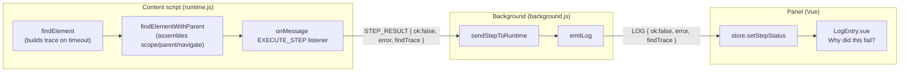

# Design Document

## Overview

This feature adds a **find trace**: a structured, ordered record of what the element finder attempted while trying (and failing) to locate a DOM element. When a step cannot resolve its element after the 5-second poll timeout, the finder builds a `FindTrace`, attaches it to the failure result, and the extension propagates it unchanged through the existing message protocol (`STEP_RESULT` → `LOG`) into the panel store and the `LogEntry.vue` component, which renders it as a collapsible "Why did this fail?" disclosure beneath the step's error line.

The central design constraint is performance (Requirement 8): the detailed per-candidate breakdown is built **exactly once, at the moment of failure** — after the poll window elapses — and never on the success path or during any poll frame. The success path stays byte-for-byte identical to today's behavior aside from carrying one extra promise-result field that is `undefined` on success.

A second design constraint is preserving matching semantics (Out of Scope: "Changing element matching semantics or the 5-second timeout behavior"). The breakdown must classify each `where` matcher as pass/fail using the *same* logic `matchesWhere` uses. We achieve this by extracting a shared per-key evaluator, `evaluateWhereKey`, that both `matchesWhere` and the failure-time breakdown call. `matchesWhere`'s observable boolean result is unchanged.

### Key design decisions

| Decision | Rationale | Requirements |
|---|---|---|
| Build the breakdown once, in the finder's timeout branch, via a dedicated final pass over `querySelectorAll(tag)` | Keeps poll frames and success path fast | 8.1, 8.2, 8.4 |
| Extract `evaluateWhereKey(el, key, value, parentNode) → {passed, actual}` shared by `matchesWhere` and the breakdown | Guarantees the recorded breakdown is consistent with real matching without duplicating logic | 2.3, 2.4, 2.6 |
| Track lightweight poll-frame stats (min/max candidate count seen) during polling — a counter only, not a breakdown | Distinguishes "absent full window" from "present but unmatched" (Req 3) at O(1) per frame | 3.1, 3.2, 8.1 |
| `FindTrace` is a plain JS object built in `runtime.js` (ES5 style) and typed in the panel with a TS `FindTrace` interface | Runtime is untyped ES5 JS; panel is TS. The shapes must mirror each other | 9.x |
| Field is optional everywhere (`findTrace?`) | Success results and non-element steps must omit it | 1.5, 9.3, 9.4, 11.4 |
| Return the trace on the resolved `{ ok:false, ... }` result object rather than throwing | `findElement` currently rejects; `findElementWithParent` already converts rejection to `{ ok:false, error }`. We change `findElement` to reject with an error that *carries* the trace, and `findElementWithParent` reads it off | 1.2, 9.1 |

## Architecture

The find trace flows through four existing layers. No new transport, listener, or store is introduced — each layer gains one optional field.



Layer responsibilities:

- **`findElement`** — owns trace construction for a single descriptor resolution (tag+where OR xpath). On timeout it performs the single final pass, builds the strategy-specific portions of the trace (tag/candidateCount/whereBreakdown/absence, or xpath outcome), and rejects with an `Error` object that carries `error.findTrace`.
- **`findElementWithParent`** — owns the cross-cutting portions: scope classification (whole-document vs parent-scoped), parent resolution outcome, navigate hop outcome, and the action label. It merges these into the trace produced by `findElement` (or produces a trace itself when the parent fails before any child pass runs) and returns `{ ok:false, error, findTrace }`.
- **message listener** — copies `findResult.findTrace` onto the `STEP_RESULT` response (Req 9.1).
- **`emitLog` (background)** — copies `result.findTrace` onto the `LOG` message when present (Req 9.2, 9.3).
- **`setStepStatus` (store)** — copies `meta.findTrace` onto the matching `LogEntry` (Req 9.5); silently ignores when no entry exists (Req 9.6).
- **`LogEntry.vue`** — renders the disclosure when `status==='fail' && entry.findTrace` (Req 10).

## Components and Interfaces

### 1. `runtime.js` — shared matcher evaluator (new)

A single per-key evaluator becomes the source of truth for both matching and the breakdown. `matchesWhere` is refactored to call it; its boolean return value and AND/early-exit semantics are unchanged.

```js
/**
 * Evaluate a single where-key against an element.
 * @returns {{passed: boolean, actual: *}} actual is the observed value (for the breakdown),
 *          or the sentinel UNAVAILABLE when it cannot be read (Req 2.7).
 */
function evaluateWhereKey(el, key, value, parentNode) { /* ... */ }

var UNAVAILABLE = { __unavailable: true }; // sentinel for "actual value could not be observed"
```

`matchesWhere` after refactor:

```js
function matchesWhere(el, where, parentNode) {
  var keys = Object.keys(where);
  for (var i = 0; i < keys.length; i++) {
    if (!evaluateWhereKey(el, keys[i], where[keys[i]], parentNode).passed) return false;
  }
  return true;
}
```

`evaluateWhereKey` reproduces each `case` from today's `matchesWhere` (`id`, `textIs`, `textContains`, `classIncludes`, `placeholder`, `name`, `type`, `value`, `ariaLabel`, `role`, `title`, `hrefContains`, `isDisabled`, `dataAttr`, `nthChild`, `closestLabel`) but also returns the observed `actual`:

| key | passed test (unchanged) | actual reported |
|---|---|---|
| `id` | `el.id === value` | `el.id` |
| `textIs` | `el.textContent.trim() === value` | raw `el.textContent` (whitespace-preserving, Req 2.5) |
| `textContains` | `el.textContent.indexOf(value) !== -1` | raw `el.textContent` (whitespace-preserving, Req 2.5) |
| `classIncludes` | class list includes value | `el.className` |
| `placeholder`/`name`/`type`/`ariaLabel`/`role`/`title` | attribute equals value | the attribute value (may be `null` → `UNAVAILABLE`) |
| `value` | `el.value === value` | `el.value` (or `UNAVAILABLE` when `undefined`) |
| `hrefContains` | href present and contains value | `el.getAttribute('href')` |
| `isDisabled` | `el.disabled === true` | `el.disabled` |
| `dataAttr` | `el.getAttribute('data-'+name) === value` | that attribute value |
| `nthChild` | computed position `=== value` | computed position |
| `closestLabel` | `matchClosestLabel(...)` | closestLabel sub-record (see component 3) |

For `textIs`/`textContains` the breakdown records the raw (untrimmed) text so leading/trailing whitespace is visible to the developer (Req 2.5); matching itself still uses `.trim()`.

When `actual` resolves to the `UNAVAILABLE` sentinel, the breakdown records that the actual value was unavailable rather than dropping the matcher (Req 2.7).

### 2. `runtime.js` — `buildWhereBreakdown` (new, failure-time only)

```js
/**
 * Final failure-time pass. Runs ONCE after the poll window elapses.
 * @param {NodeList} candidates - root.querySelectorAll(tag) at failure time
 * @param {object} where
 * @param {Element|null} parentNode
 * @returns {{ nearMiss: object|null, candidateCount: number }}
 */
function buildWhereBreakdown(candidates, where, parentNode) { /* ... */ }
```

Algorithm:

1. `candidateCount = candidates.length`.
2. If `candidateCount === 0`, return `{ nearMiss: null, candidateCount: 0 }` (Req 2.2, 8.3).
3. For each candidate, evaluate every `where` key with `evaluateWhereKey`, counting passes. Track the candidate with the greatest pass count as the Near_Miss_Candidate; ties keep the first encountered (deterministic). At most one candidate is chosen (Req 8.5, 2.3). Because the candidate list is a single `querySelectorAll` snapshot evaluated synchronously (no await/yield), the DOM cannot shift between candidates *within this one pass*, which keeps the breakdown internally consistent; this stability is confined to the pass and does not imply the DOM was frozen earlier during resolution.
4. For the Near_Miss_Candidate, build the `whereBreakdown` array: one `{ key, expected, actual, passed }` entry per key, expected taken from the descriptor, actual from `evaluateWhereKey`, each string truncated to 256 chars (Req 2.4). `passed` per key comes from the same evaluation, so a Near_Miss_Candidate that would fail `matchesWhere` always has at least one `passed:false` entry (consistency, Req 2.6).
5. Set `nearMiss.fullMatch = true` when the Near_Miss_Candidate satisfies **every** Where_Matcher (all `whereBreakdown` entries `passed:true`, i.e. `matchesWhere` would return `true`). This can only happen when a matching element appeared between the last poll frame and this final pass; the caller uses `fullMatch` to classify the absence outcome as `appeared-after-timeout` (Req 3.3). Note that when `fullMatch` is `true`, the `whereBreakdown` has no failing entry, so consumers must not assume a `passed:false` entry exists.

Truncation helper: `truncate256(v)` coerces to string and slices to 256 chars, recording a `truncated: true` flag when it cut (used only for display; not required by AC but harmless).

### 3. `runtime.js` — instrumented `matchClosestLabel` (new failure-time variant)

`matchClosestLabel` is left intact for the matching path. A parallel `traceClosestLabel(el, spec, parentNode)` runs **only** during the failure pass when the Near_Miss_Candidate has a failing `closestLabel` matcher (Req 5.1). It mirrors the existing strategy structure and records outcomes:

```js
function traceClosestLabel(el, spec, parentNode) {
  // returns:
  // {
  //   labelTag, labelText (truncated 256; or absent flag, Req 5.3),
  //   bounded: boolean,                 // Strategy A ran (parent-scoped, Req 5.4)
  //   strategies: [                     // in attempt order
  //     { name: 'boundedSubtree'|'forAttr'|'ancestorWalk'|'ariaLabelledby',
  //       outcome: 'matched'|'not-matched' }
  //   ]
  // }
}
```

- Parent-scoped (`parentNode` present): records `bounded: true` and a single `boundedSubtree` strategy outcome (Req 5.4). Strategy A only.
- Unbounded: records outcomes for `forAttr` (B1), `ancestorWalk` (B2), `ariaLabelledby` (B3), each `matched`/`not-matched` (Req 5.5). It reuses the existing B1/B2/B3 logic exactly (no semantic change), simply capturing per-strategy results instead of early-returning a boolean.

### 4. `runtime.js` — navigate instrumentation

`applyNavigateSteps` currently returns `{ ok:false, error }` with a **1-based** step number in the message. The design keeps `applyNavigateSteps` returning that human string but adds a machine field so the trace can record a **zero-based** index (Req 6.1, 6.2):

```js
// on failure:
return { ok: false, error: '...', failedHopIndex: i /* zero-based */, failedHopType: s.step };
```

`findElementWithParent` reconciles: the trace's `navigate.failedHopIndex` is the zero-based `i` (the loop index), never the `i+1` used in the display string. The human error string is preserved unchanged (Req 1.6).

Anchor resolution (Req 6.3, 6.4): the navigate hops only run after the anchor descriptor resolved to an element via `findElement`. If the anchor `findElement` rejects, no hops are attempted; the trace records `navigate.anchorResolved: false` and an empty `hops`/no `failedHopIndex`. If the anchor resolved, `navigate.anchorResolved: true`.

### 5. `runtime.js` — `findElement` timeout branch

Both branches (xpath and tag+where) already have a timeout check. The trace is built inside those branches only.

**tag+where branch:**

```js
if (Date.now() - startTime >= TIMEOUT_5sec) {
  // Single synchronous final pass. querySelectorAll is captured ONCE into `candidates`
  // and evaluated without yielding. Because JS is single-threaded and this pass never awaits,
  // no async render / fetch resolution / framework re-render can mutate the DOM WHILE the pass
  // iterates the captured list — that stability holds only WITHIN this pass, not across the
  // whole resolution. The DOM can still have changed in the gap BEFORE the pass began.
  var candidates = root.querySelectorAll(tag);          // single final re-query (snapshot)
  var bd = buildWhereBreakdown(candidates, where, root === document ? null : root);
  var elapsedMs = Date.now() - startTime;               // clamped 0..5000
  // Race handling: if a candidate now satisfies ALL Where_Matchers (it appeared between the
  // last poll frame and this final pass), classify as 'appeared-after-timeout'. In that case
  // buildWhereBreakdown's Near_Miss_Candidate IS the fully-matching element and its
  // whereBreakdown has every entry passed:true. This does NOT retroactively succeed — the 5s
  // window already elapsed and the finder already timed out, so the step still fails.
  var absence;
  if (bd.nearMiss && bd.nearMiss.fullMatch) {            // matchesWhere would return true
    absence = 'appeared-after-timeout';
  } else if (maxSeenCandidates > 0 || bd.candidateCount > 0) {
    absence = 'present-unmatched';
  } else {
    absence = 'absent-full-window';
  }
  var trace = {
    strategy: 'tag-where',
    tag: tag,
    candidateCount: bd.candidateCount,
    whereBreakdown: bd.nearMiss ? bd.nearMiss.whereBreakdown : [],
    passedMatchers: bd.nearMiss ? bd.nearMiss.passed : [],
    failedMatcher: bd.nearMiss ? bd.nearMiss.firstFailed : null,
    closestLabel: bd.nearMiss ? bd.nearMiss.closestLabel : null, // from traceClosestLabel
    absence: absence,
    finalFrameCandidateCount: bd.candidateCount,
    elapsedMs: clamp(elapsedMs, 0, 5000)
  };
  var err = new Error('Element not found: ' + tag + ' with conditions ' + JSON.stringify(where));
  err.findTrace = trace;
  reject(err);                                           // still rejects — no retroactive success
  return;
}
```

`maxSeenCandidates` is a counter updated inside `poll()` (`maxSeenCandidates = Math.max(maxSeenCandidates, candidates.length)`). This is the only per-frame addition and is O(1) — it does **not** build any breakdown (Req 8.1). Per Req 3.1 "zero candidates in every poll frame" maps to `maxSeenCandidates === 0`.

The final pass reads all candidates from a single `root.querySelectorAll(tag)` snapshot and evaluates them synchronously (no `await`, no yield). This guarantees stability **only within the pass itself**: because JS is single-threaded and the pass never yields, no async render, fetch resolution, or framework re-render can mutate the DOM while the pass iterates its captured candidate list, which keeps the resulting trace internally consistent. It does **not** mean the DOM is frozen for the whole resolution — there is a real gap *before* the pass begins, between the last `requestAnimationFrame` poll frame (~16ms cadence) that failed to match and the moment this final pass starts, during which an element can appear or mutate. During the pass, if at least one Candidate satisfies **all** Where_Matchers (i.e. `matchesWhere` would return `true` for it), the finder sets `absence = 'appeared-after-timeout'` and that fully-matching element becomes the Near_Miss_Candidate, whose `whereBreakdown` shows every matcher passing (Req 3.3) — that pre-pass gap is exactly what allows a full match to surface here. Otherwise the classification is as before: `present-unmatched` when candidates were seen (`maxSeenCandidates > 0` or `candidateCount > 0`, Req 3.2), else `absent-full-window` (Req 3.1). `appeared-after-timeout` is a rare/low-frequency outcome — it fires only when the element lands in that narrow pre-pass gap, so most slow-render cases still surface as `present-unmatched` or `absent-full-window`; when it does fire it is a high-value signal (the locator is correct and the element rendered just after the wait window, so the fix is to add a `waitFor` or raise the timeout). In every case the step outcome is unchanged: the resolution already timed out and rejected after the 5s window, so recording `appeared-after-timeout` is purely diagnostic — the finder never retroactively succeeds (Req 3.4).

**xpath branch:** on timeout, wrap `document.evaluate` in `try/catch` for malformed expressions (Req 7.5). Build:

```js
var trace = { strategy: 'xpath', xpath: descriptor.xpath, elapsedMs, configuredWaitMs: TIMEOUT_5sec };
try {
  var r = document.evaluate(descriptor.xpath, root, null, XPathResult.ORDERED_NODE_SNAPSHOT_TYPE, null);
  trace.xpathOutcome = r.snapshotLength === 0 ? 'none' : (r.snapshotLength === 1 ? 'one' : 'many');
  trace.matchedNodeCount = r.snapshotLength;
} catch (e) {
  trace.xpathOutcome = 'invalid';
  trace.invalid = true;
}
```

The success path for xpath already returns the node before the timeout; when it returns exactly one node it records outcome `one` with elapsed time only on the success side is not needed (success has no trace, Req 1.5) — the outcome distinctions in Req 7.2/7.3 that mention "returns a node" are recorded on the failure pass via the snapshot re-query so the developer sees whether the expression currently matches one/many nodes.

### 6. `runtime.js` — `findElementWithParent` assembly

This function owns scope/parent/navigate/action. Pseudocode:

```js
function findElementWithParent(stepMessage) {
  var action = stepMessage.action;
  // no parent:
  return findElement(elementDescriptor, document)
    .then(applyNavigationWithTrace)     // navigate hops; on hop fail attach navigate trace
    .catch(function (err) {
      var trace = err.findTrace || emptyTrace();     // Req 1.7 empty steps possible
      trace.scope = 'whole-document';                 // Req 1.3
      trace.action = action;                          // Req 11.3
      trace.error = 'Element not found: ' + stepMessage.target; // preserved string, Req 1.6
      return { ok: false, error: trace.error, findTrace: trace };
    });
  // with parent: findElement(parentDescriptor) then findElement(child, parentEl)
  //   parent fail  -> trace.scope='whole-document' (parent search), parent.resolved=false,
  //                   parent.descriptorId = parentId (Req 4.2)
  //   parent ok    -> child findElement, on child fail: trace.scope='parent-scoped',
  //                   trace.parent = { resolved:true, identifier:getElementXPath(parentEl),
  //                                    matchCount, scopedToParent:true } (Req 4.1,4.3,4.4,4.5)
}
```

Parent identifier reuses the existing `getElementXPath` helper already defined inside `findElementWithParent` (Req 4.4). Multiple parent matches (Req 4.5) require counting: `findElement` resolves the *first* matching parent; to report `matchCount` the assembly does a lightweight `document.querySelectorAll(parentDescriptor.tag)` count filtered by `matchesWhere` **only on failure of the child**, not during matching. The identifier of the parent actually used is `getElementXPath(parentElement)`.

The preserved human error strings are exactly today's (`'Element not found: ' + target`, `'Element with parent ' + xpath + ' not found: ' + target + error.message`, `'Parent element not found: ' + parentId`) — the trace never replaces them (Req 1.6).

### 7. `runtime.js` — message listener

Every branch that calls `findElementWithParent` (the `ACTIONS_NEEDING_ELEMENT` block, `assertNotExists`, and `pressKey`-with-target) forwards `findResult.findTrace` onto the failure `STEP_RESULT` (Req 9.1, 11.1):

```js
if (!findResult.ok) {
  sendResponse({ type: 'STEP_RESULT', stepIndex: stepIndex, ok: false,
                 error: findResult.error, findTrace: findResult.findTrace });
  return;
}
```

`assertNotExists` intentionally does **not** carry a trace on its *failure* (element found), consistent with the Considerations note that `assertNotExists` tracing is out of scope this iteration. When it calls `findElementWithParent` and the element is not found, that is a *pass* for assertNotExists (no trace, no failure).

### 8. `background.js` — `emitLog`

`emitLog(stepIndex, step, ok, error)` is called from the run loop and retry loop. The run loop has the `result` object in scope (`result.findTrace`). We add an optional 5th parameter:

```js
function emitLog(stepIndex, step, ok, error, findTrace) {
  var logMsg = { type: 'LOG', stepIndex, action: step.action, target: step.target || null,
                 value: step.value || null, ok: ok };
  // ... existing fields ...
  if (error) logMsg.error = error;
  if (findTrace) logMsg.findTrace = findTrace;   // Req 9.2; omitted when absent (Req 9.3)
  safeSendMessage(logMsg);
}
```

Call site change: `emitLog(currentIndex, step, !!ok, error || undefined, result && result.findTrace);`

### 9. Panel types, store, component

- `messages.ts`: add `findTrace?: FindTrace` to the `LOG` `BackgroundMessage` variant, and define/import the `FindTrace` interface (Req 9.4).
- `store.ts`: add `findTrace?: FindTrace` to `LogEntry` (Req 9.7).
- `store/index.ts` `setStepStatus`: add `if (meta.findTrace !== undefined) entry.findTrace = meta.findTrace;`. Because `setStepStatus` already creates entries on demand and no-ops safely, a LOG whose entry does not exist is created; but per Req 9.6 (discard when no entry corresponds) the caller path for LOG only updates existing planned entries. The store keeps existing entries unchanged and raises no error either way.
- `RunView.vue`/message router: whichever code maps `LOG` → `setStepStatus` passes `findTrace` through in the `meta` object.
- `LogEntry.vue`: new disclosure block (component 10 below).

## Data Models

### TS interface (panel: `messages.ts` or a new `findTrace.ts`)

```ts
/** A single where-matcher outcome on the Near_Miss_Candidate. */
export interface WhereBreakdownEntry {
  key: string;                 // e.g. 'textIs', 'classIncludes'
  expected: string;            // descriptor value, truncated to 256 chars
  actual: string | null;       // observed value, whitespace-preserved for text*, truncated 256; null = unavailable
  actualUnavailable?: boolean; // true when the actual value could not be observed (Req 2.7)
  passed: boolean;
}

export interface ClosestLabelStrategyOutcome {
  name: 'boundedSubtree' | 'forAttr' | 'ancestorWalk' | 'ariaLabelledby';
  outcome: 'matched' | 'not-matched';
}

export interface ClosestLabelTrace {
  labelTag: string;
  labelText: string | null;    // truncated 256; null when absent (Req 5.3)
  labelTextAbsent?: boolean;
  bounded: boolean;            // true = search bounded to parent subtree (Req 5.4)
  strategies: ClosestLabelStrategyOutcome[];
}

export interface NavigateTrace {
  anchorResolved: boolean;         // Req 6.3, 6.4
  failedHopIndex?: number;         // zero-based index of first failing hop (Req 6.1, 6.2)
  failedHopType?: string;          // e.g. 'child', 'nextSibling' (Req 6.2)
  hopCount?: number;
}

export interface ParentTrace {
  resolved: boolean;               // Req 4.1
  descriptorId?: string;           // identifier from the parent descriptor when not resolved (Req 4.2)
  identifier?: string;             // getElementXPath of resolved parent (Req 4.4)
  matchCount?: number;             // number of parent matches (Req 4.5)
  scopedToParent?: boolean;        // child search was scoped to parent subtree (Req 4.3)
}

export interface XPathTrace {
  expression: string;                                   // Req 7.1, 7.5
  outcome: 'one' | 'many' | 'none' | 'invalid';         // Req 7.2, 7.3, 7.4, 7.5
  matchedNodeCount?: number;                            // Req 7.3
  invalid?: boolean;                                    // Req 7.5
  elapsedMs: number;                                    // Req 7.2, 7.4
  configuredWaitMs: number;                             // Req 7.4
}

/** An ordered resolution step the finder performed (Req 1.4, 1.7). */
export interface FindTraceStep {
  strategy: string;                       // e.g. 'resolve-parent', 'query-tag', 'match-where', 'navigate', 'xpath'
  outcome: 'matched' | 'not-matched';
}

export interface FindTrace {
  scope: 'whole-document' | 'parent-scoped';   // Req 1.3
  action: string;                              // step action the trace was produced for (Req 11.3)
  error: string;                               // preserved human-readable error string (Req 1.6)
  steps: FindTraceStep[];                      // ordered strategies + outcomes; may be empty (Req 1.4, 1.7)

  // tag+where strategy (Req 2)
  tag?: string;
  candidateCount?: number;                     // Req 2.1, 2.2
  whereBreakdown?: WhereBreakdownEntry[];      // Near_Miss_Candidate per-matcher breakdown (Req 2.3–2.7)

  // absence classification (Req 3)
  // Exactly one value on failure (Req 3.6). 'appeared-after-timeout' means a Candidate satisfied
  // ALL Where_Matchers in the final pass (it appeared after the wait window). In that case the
  // whereBreakdown entries may all have passed:true and there is NO failing matcher — the step
  // still fails (Req 3.4), so this is a timing signal only, never a retroactive success.
  absence?: 'absent-full-window' | 'present-unmatched' | 'appeared-after-timeout';   // (Req 3.1, 3.2, 3.3, 3.6)
  finalFrameCandidateCount?: number;           // Req 3.2
  elapsedMs?: number;                          // 0..5000 (Req 3.5)

  // childOf (Req 4)
  parent?: ParentTrace;

  // closestLabel (Req 5)
  closestLabel?: ClosestLabelTrace;

  // navigate (Req 6)
  navigate?: NavigateTrace;

  // xpath (Req 7)
  xpath?: XPathTrace;
}
```

### Plain-JS object built in `runtime.js`

`runtime.js` is untyped ES5 JS (`var`, function declarations). It builds a plain object literal with the same field names and value domains as the TS interface. In particular, the runtime's `absence` field takes exactly one of the same three string values as the TS union: `'absent-full-window'`, `'present-unmatched'`, or `'appeared-after-timeout'`. When it is `'appeared-after-timeout'`, the `whereBreakdown` entries may all have `passed:true` (no failing matcher) because a Candidate matched all conditions in the final pass; the step still records a failure. Example produced object for a failed `click` on `button` with `{ textIs: "Submit" }` where two buttons exist but neither matches:

```js
{
  scope: 'whole-document',
  action: 'click',
  error: 'Element not found: button with conditions {"textIs":"Submit"}',
  steps: [
    { strategy: 'query-tag', outcome: 'matched' },      // tag found candidates
    { strategy: 'match-where', outcome: 'not-matched' } // no candidate matched
  ],
  tag: 'button',
  candidateCount: 2,
  whereBreakdown: [
    { key: 'textIs', expected: 'Submit', actual: '  Send  ', passed: false }
  ],
  absence: 'present-unmatched',
  finalFrameCandidateCount: 2,
  elapsedMs: 5000
}
```

The panel treats every field as optional and defensively (`?.`), so any field the runtime omits simply does not render.

## Correctness Properties

*A property is a characteristic or behavior that should hold true across all valid executions of a system — essentially, a formal statement about what the system should do. Properties serve as the bridge between human-readable specifications and machine-verifiable correctness guarantees.*

The repository uses [fast-check](https://github.com/dubzzz/fast-check) with `node:test` (see `packages/extension/src/runtime.property.test.js`), running under jsdom. Properties below are written to be implemented as fast-check properties with a minimum of 100 iterations each. Because the real finder waits 5 seconds, property tests drive the failure pass directly (exercise `buildWhereBreakdown`, `evaluateWhereKey`, the instrumented finders, and the propagation functions) rather than waiting on the live timer.

### Property 1: Success never produces a trace

*For any* DOM and element descriptor that resolves to a matching element within the wait window, the finder returns a success result with no `findTrace` and performs zero breakdown passes.

**Validates: Requirements 1.5, 8.1, 8.4, 11.4**

### Property 2: A failed find always produces a trace

*For any* element-dependent step whose descriptor cannot be resolved against the DOM, the finder's failure result carries a `findTrace` whose `steps` outcomes are each `matched` or `not-matched`, whose `error` equals the preserved human-readable error string, and whose `action` equals the step's action.

**Validates: Requirements 1.1, 1.2, 1.4, 1.6, 1.7, 11.1, 11.3**

### Property 3: Near_Miss_Candidate is unique and maximal, and its breakdown is consistent with matchesWhere

*For any* failing tag+where resolution with at least one candidate, the finder designates at most one Near_Miss_Candidate whose count of satisfied `Where_Matchers` is greater than or equal to that of every other candidate (uniqueness and maximality hold unconditionally); and every `whereBreakdown` entry's `passed` value equals `evaluateWhereKey` for that key on the Near_Miss_Candidate. Furthermore:
- WHEN `absence !== 'appeared-after-timeout'`: at least one `whereBreakdown` entry has `passed === false` and `matchesWhere(nearMiss, where)` is `false`.
- WHEN `absence === 'appeared-after-timeout'`: every `whereBreakdown` entry has `passed === true` and `matchesWhere(nearMiss, where)` is `true` (the element appeared and fully matched in the final pass, yet the step still fails).

**Validates: Requirements 2.3, 2.6, 3.3, 8.5**

### Property 4: Candidate count and tag are recorded faithfully

*For any* failing tag+where resolution, `findTrace.tag` equals the descriptor tag and `findTrace.candidateCount` equals the number of elements matching that tag in the failing scope.

**Validates: Requirements 2.1, 2.2**

### Property 5: Recorded values are truncated to 256 characters

*For any* failing where-matcher, each recorded `expected` and `actual` string has length at most 256, and each recorded `closestLabel.labelText` has length at most 256.

**Validates: Requirements 2.4, 5.2**

### Property 6: Text matcher actual preserves whitespace

*For any* `textIs` or `textContains` matcher on the Near_Miss_Candidate, the recorded `actual` equals the candidate's raw (untrimmed) `textContent` truncated to 256 chars, so leading and trailing whitespace remain distinguishable from the trimmed value.

**Validates: Requirements 2.5**

### Property 7: Absence classification is exactly one valid value

*For any* failing tag+where resolution, `findTrace.absence` is present and equals exactly one value from the set `{ absent-full-window, present-unmatched, appeared-after-timeout }` (never more than one classification):
- `appeared-after-timeout` when the final failure-time pass observes at least one candidate that satisfies all Where_Matchers;
- otherwise `present-unmatched` (with `finalFrameCandidateCount` equal to the failure-time candidate count) when at least one candidate was seen in any poll frame or the final pass;
- otherwise `absent-full-window` when no candidate of the tag was ever seen.

Regardless of which classification is recorded, the step result is still a failure — recording `appeared-after-timeout` never converts the timed-out resolution into a success.

**Validates: Requirements 3.1, 3.2, 3.3, 3.4, 3.6**

### Property 8: Elapsed time is a bounded integer

*For any* failing resolution, `findTrace.elapsedMs` is an integer in the inclusive range 0 to 5000.

**Validates: Requirements 3.5**

### Property 9: Scope reflects parent presence and resolution

*For any* failing step, `findTrace.scope` is `parent-scoped` if and only if a `Parent_Descriptor` was resolved and the child search then failed within it; otherwise `whole-document`; and whenever the scope is `parent-scoped` the trace records a non-empty parent identifier.

**Validates: Requirements 1.3, 4.1, 4.4**

### Property 10: closestLabel strategy outcomes are recorded when it is the failing matcher

*For any* Near_Miss_Candidate whose failing matcher is `closestLabel`, `findTrace.closestLabel.strategies` is non-empty and every recorded strategy outcome is `matched` or `not-matched`.

**Validates: Requirements 5.1**

### Property 11: Navigate records the first failing hop by type and zero-based index

*For any* navigate hop sequence that fails at position k (zero-based), when the anchor resolved, `findTrace.navigate.anchorResolved` is `true`, `findTrace.navigate.failedHopIndex` equals k, and `findTrace.navigate.failedHopType` equals the type of the hop at position k.

**Validates: Requirements 6.1, 6.2, 6.3**

### Property 12: XPath records the exact expression and correct no-node outcome

*For any* failing valid XPath descriptor that matches no node, `findTrace.xpath.expression` equals the descriptor's `xpath` string exactly, `findTrace.xpath.outcome` is `none`, `findTrace.xpath.configuredWaitMs` is 5000, and `findTrace.xpath.elapsedMs` is an integer in 0..5000.

**Validates: Requirements 7.1, 7.4**

### Property 13: The breakdown pass runs at most once per failed resolution

*For any* resolution, the number of failure-time breakdown passes (`buildWhereBreakdown` invocations) is 0 when the resolution succeeds and exactly 1 when it fails.

**Validates: Requirements 8.1, 8.2**

### Property 14: The trace propagates unchanged across content → background → panel

*For any* `findTrace` attached to a failure result, the value carried on the `STEP_RESULT`, the value carried on the `LOG` message, and the value stored on the panel `LogEntry` are all deep-equal to the original; and when no trace is present, the `LOG` message omits the field and the stored entry has no trace.

**Validates: Requirements 9.1, 9.2, 9.3, 9.5**

### Property 15: Passed-matcher display cap

*For any* list of passed `Where_Matchers`, the display helper returns at most 50 entries plus a remaining count equal to `max(0, length - 50)`.

**Validates: Requirements 10.5**

## Error Handling

- **Malformed XPath** (Req 7.5): `document.evaluate` throws on an invalid expression. The failure-pass xpath re-query wraps the call in `try/catch`; on throw it records `outcome: 'invalid'`, `invalid: true`, and still records the exact `expression`. The success poll loop is unchanged (it already only runs when the descriptor has a valid path, and an invalid path simply never resolves, then hits the timeout branch that does the guarded re-query).
- **Missing / null actual values** (Req 2.7): `evaluateWhereKey` returns the `UNAVAILABLE` sentinel when the observed attribute is `null`/`undefined`; the breakdown records `actual: null, actualUnavailable: true` and keeps the matcher entry.
- **Appeared-after-timeout race** (Req 3.3, 3.4): a matching element can appear in the gap *before* the final pass begins — between the last `requestAnimationFrame` poll frame (~16ms cadence) that failed to match and the moment the single final pass starts (that pass reads candidates from one synchronous `querySelectorAll` snapshot, so it is stable only within itself, not across the whole resolution). When the final pass finds a Candidate satisfying all Where_Matchers, the finder records `absence: 'appeared-after-timeout'` — a diagnostic timing signal — but the resolution has already timed out and rejected. This is a rare/low-frequency outcome (it only fires when the element lands in that narrow pre-pass gap; most slow-render cases still surface as `present-unmatched` or `absent-full-window`), and when it does fire it is a high-value hint that the locator is correct but the element rendered just after the wait window — add a `waitFor` or raise the timeout. It never converts the failure into a success; the step still fails and its Near_Miss_Candidate's `whereBreakdown` shows all matchers passing.
- **Parent not resolved** (Req 4.2): the child pass never runs; `findElementWithParent` builds a trace with `scope: 'whole-document'`, `parent.resolved: false`, `parent.descriptorId` from the parent descriptor, and the preserved `'Parent element not found: <id>'` string.
- **Anchor not resolved for navigate** (Req 6.4): no hops attempted; `navigate.anchorResolved: false`, no `failedHopIndex`.
- **No matching store entry for a LOG** (Req 9.6): the LOG → store router only applies `findTrace` to an existing planned entry; if none corresponds it discards the trace, leaves all entries unchanged, and raises no user-facing error (consistent with the existing `safeSendMessage` tolerance in background).
- **Panel defensiveness**: `LogEntry.vue` reads every trace field with optional chaining and renders only what is present, so a partial trace never breaks the row. A failed entry without a trace renders exactly as today (Req 10.10).

## Performance Considerations

- **Single failure-time pass** (Req 8): the per-candidate breakdown, the instrumented `traceClosestLabel`, and the parent match-count re-query all run only in the timeout branch, never during a poll frame and never on success. This keeps the hot path identical to today.
- **Poll-frame cost**: the only per-frame addition is `maxSeenCandidates = Math.max(maxSeenCandidates, candidates.length)` — O(1), no allocation.
- **Re-query cost**: the failure branch does one extra `root.querySelectorAll(tag)` (tag+where) or one `document.evaluate` snapshot (xpath), plus at most one `document.querySelectorAll(parentDescriptor.tag)` for the parent match count. All are bounded by the DOM size and run exactly once, after the user has already waited 5 seconds, so the added latency is negligible relative to the timeout.
- **Payload size**: `whereBreakdown` covers only the single Near_Miss_Candidate (not all candidates), and all recorded strings are truncated to 256 chars, bounding the message size regardless of DOM size.

## Testing Strategy

**Dual approach.** Property-based tests (fast-check, ≥100 iterations, under jsdom) verify the universal guarantees above; example/edge and UI tests cover the specific branches and rendering.

**Unit / example tests:**
- `evaluateWhereKey`: one example per supported key confirming `{ passed, actual }` matches `matchesWhere`'s decision and reports the right observed value, including `UNAVAILABLE` for absent attributes (Req 2.7).
- `buildWhereBreakdown`: zero-candidate empty result (Req 2.2, 8.3); single candidate; ties resolved to first.
- `traceClosestLabel`: bounded (Strategy A, Req 5.4) vs unbounded (B1/B2/B3, Req 5.5); absent label text (Req 5.3).
- Parent branches: not-resolved (Req 4.2), resolved-child-missing (Req 4.3), multiple parent matches (Req 4.5).
- Navigate anchor failure (Req 6.4); xpath one/many/invalid outcomes (Req 7.2, 7.3, 7.5).
- `LogEntry.vue`: mounts for fail+trace (disclosure present, initially collapsed — Req 10.1, 10.2), expand shows scope/candidateCount/passed+failing matchers with whitespace rendered visibly (Req 10.3, 10.4), >50 passed matchers capped (Req 10.5), collapse returns to error line (Req 10.6), parent/absence/closestLabel/navigate/xpath details (Req 10.7–10.9), and fail-without-trace unchanged (Req 10.10).

**Property tests:** implement Properties 1–15 above. Each test is tagged with a comment in the form:

```
// Feature: element-find-trace, Property <n>: <property text>
```

and configured with `{ numRuns: 100 }` (or more). Property 13 spies on `buildWhereBreakdown` call counts; Property 14 exercises the runtime listener → `emitLog` → `setStepStatus` chain and deep-equals the trace at each hop.

**Type-level checks** (Req 9.4, 9.7): the optional `findTrace?` fields on `LOG`, `STEP_RESULT` (implicit, plain JS), `LogEntry`, and the `FindTrace` interface are validated by the panel's TypeScript build.

**Test execution note:** per the workspace execution rules, the assistant/tooling must **not** run `node --test` or any test command, and must not run `node -c` syntax checks. The developer runs the property and unit tests manually.

## Data Flow and Failure-Pass Sequence Diagrams

Finder failure-pass sequence (tag+where):

```mermaid
sequenceDiagram
  participant L as onMessage(EXECUTE_STEP)
  participant FWP as findElementWithParent
  participant FE as findElement (poll loop)
  participant BD as buildWhereBreakdown / traceClosestLabel
  participant BG as background emitLog
  participant ST as store.setStepStatus
  participant UI as LogEntry.vue

  L->>FWP: findElementWithParent(stepMessage)
  FWP->>FE: findElement(descriptor, root)
  loop each animation frame until 5s
    FE->>FE: querySelectorAll(tag); matchesWhere(...)
    FE->>FE: maxSeenCandidates = max(...)  %% O(1), no breakdown (Req 8.1)
  end
  Note over FE: timeout elapsed, no match
  FE->>BD: single final pass over candidates (Req 8.2)
  BD-->>FE: { nearMiss, candidateCount, whereBreakdown, closestLabel }
  FE-->>FWP: reject(Error with err.findTrace)
  FWP->>FWP: add scope / parent / navigate / action; preserve error string
  FWP-->>L: { ok:false, error, findTrace }
  L->>BG: STEP_RESULT { ok:false, error, findTrace } (Req 9.1)
  BG->>ST: LOG { ok:false, error, findTrace } (Req 9.2)
  ST->>UI: LogEntry.findTrace set (Req 9.5)
  UI-->>UI: render "Why did this fail?" disclosure (Req 10)
```
