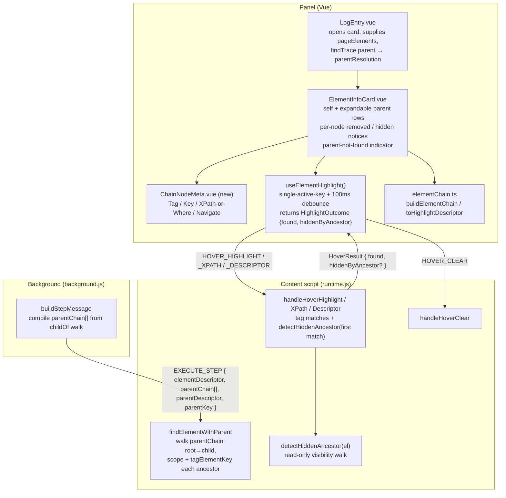
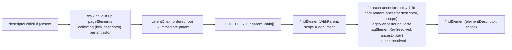

# Design Document

## Overview

This feature enriches the Run View's **Element_Info_Card** (`ElementInfoCard.vue`) and extends the **Runtime** (`runtime.js`) so that debugging a `childOf` resolution chain is a single-card, precise experience.

Four capabilities are added on top of the existing hover-highlight infrastructure introduced by the `run-log-element-highlight` and `element-find-trace` specs:

1. **Inline-expandable parent rows (Req 1).** Each `Parent_Row` becomes a disclosure that expands *inside the same card* to reveal the exact same metadata block the `Self_Node` shows (Tag / Key / XPath-or-Where / Navigate). The self metadata block and each expanded parent share one extracted subcomponent so they render identically. No second popup is ever opened.
2. **Tag every resolved ancestor (Req 3).** Today the compiler emits a *single* `parentDescriptor` + `parentKey` for the immediate `childOf` parent, and the Runtime resolves and tags exactly that one scope parent. This feature changes the compiled step message to carry an ordered **`parentChain`** array (`{ key, descriptor }` per ancestor), and changes the Runtime's `findElementWithParent` to resolve the chain root→child, scope each level to the previous, and tag *every* resolved ancestor with its own `tomation-key`. Matching semantics, parent-scoping, and Navigate-then-scope are preserved.
3. **Per-node "removed" and "hidden-ancestor" notices (Req 4, Req 5).** The card's single card-level `removed` prop is generalized to a **per-hovered-node** result. When a hovered node resolved during the run but the Runtime now reports `found === 0`, the card shows the removed notice for that node. Separately, the Runtime detects when a matched element is present but invisible because an ancestor is hidden (`display:none`, `visibility:hidden`, zero size, `overflow` clipping), reports it via an **additive** `hiddenByAncestor` flag on `HoverResult`, and the card shows a distinct Hidden_Ancestor_Notice — without mutating any author style.
4. **Parent-not-found indicator (Req 7).** When the inspected step failed because a `childOf` parent could not be resolved, the card marks exactly the failed parent row, matched to a chain node by the failed ancestor's Element_Key, derived purely from the step's existing `findTrace.parent` outcome (`{ resolved:false, descriptorId }`, where the runtime records the failed ancestor's key for card matching) — the card performs no DOM resolution of its own.

### Key design decisions

| Decision | Rationale | Requirements |
|---|---|---|
| Extract a shared `<ChainNodeMeta>` subcomponent rendering Tag/Key/XPath-or-Where/Navigate | Guarantees self and expanded parents render identically with one code path (Req 1.9) | 1.4, 1.9 |
| Per-row expansion state held as a reactive `Set<string>` of expanded keys | Multiple rows open simultaneously; toggling one leaves others (Req 1.7) | 1.5, 1.7 |
| Hover = highlight (`@pointerenter`/`@pointerleave`); Click = toggle expand (`@click` on a real `<button>`) | Two independent gestures on the same row never conflict — pointer events drive highlighting, the activation click drives expansion | 1.3, 1.5, 2.1, 2.2 |
| Compile an ordered `parentChain: Array<{key, descriptor}>` in `background.js` instead of a single `parentKey`/`parentDescriptor` | The Runtime cannot walk `pageElements` (it does not have the map); the chain must be supplied. Ordered root→immediate-parent lets the Runtime scope and tag each level | 3.1, 3.2 |
| Runtime resolves the chain iteratively, scoping each ancestor to the previous ancestor's subtree, tagging each with `tagElementKey` | Reuses the existing single-parent scope+tag logic per level; matching semantics unchanged | 3.1–3.8, 6.5, 6.6 |
| Keep `parentDescriptor`/`parentKey` as a **back-compat alias** for the last (immediate) chain entry | Existing find-trace parent logic and older compiled specs keep working unchanged | 6.3, 6.4 |
| Additive `hiddenByAncestor?: boolean` on `HoverResult`; composable returns a `HighlightOutcome` result object `{ found, hiddenByAncestor }` | Additive to the wire contract; the card needs both `found` (for removed notice) and the flag (for hidden notice). Changing the composable's resolved value to an object is the one breaking internal change | 5.2, 6.4 |
| Hidden-ancestor detection is a read-only `detectHiddenAncestor(el)` helper using `getComputedStyle` + rects; never writes styles | Req 5.4 forbids revealing the element; detection must be observational only | 5.1, 5.4 |
| Parent-not-found marking derived from a supplied `parentResolution` prop (from `entry.findTrace.parent`), matched to a chain node by the failed ancestor's Element_Key | Req 7.4 forbids card-side DOM resolution; the card reads a supplied outcome. Every ancestor is spec-defined with a descriptor and stable key, so matching by key is unambiguous and no `'unknown'` case arises | 7.1–7.4 |

## Architecture

The feature spans the panel (Vue), the content-script hover contract, the Runtime, and — new for this feature — the compiled step message that carries the ancestor chain.



### Compiled-step `parentChain` flow (Req 3)



Ordering note: `buildElementChain` in the panel produces self → immediate parent → grandparent (child→root). The compiled `parentChain` is ordered **root → immediate parent** (the reverse of the ancestors, excluding self) so the Runtime can resolve outermost first and scope inward. The panel and Runtime orderings are intentionally opposite and each is documented at its site.

## Components and Interfaces

### 1. `background.js` — compile `parentChain` (Req 3)

`buildStepMessage` currently attaches a single `parentDescriptor` + `parentKey` when `descriptor.childOf` is present. It gains a walk up the `childOf` chain:

```js
// New helper: resolve the full ancestor chain, ordered root → immediate parent.
// Reuses findParentKey / findParentDescriptor for each hop; stops on a missing
// ancestor or a cycle (a key already seen), so the result is always finite.
function buildParentChain(childOfRef, pageElements) {
  var chain = [];              // { key, descriptor }, immediate parent first
  var seen = {};
  var ref = childOfRef;
  while (ref) {
    var key = findParentKey(ref, pageElements);
    var descriptor = findParentDescriptor(ref, pageElements);
    if (!key || !descriptor || seen[key]) break;   // missing ancestor or cycle
    seen[key] = true;
    chain.push({ key: key, descriptor: descriptor });
    ref = descriptor.childOf;                        // advance up the chain
  }
  chain.reverse();            // root → immediate parent for outermost-first scoping
  return chain;
}
```

In `buildStepMessage`, when `descriptor.childOf` resolves:

```js
if (descriptor.childOf) {
  var parentChain = buildParentChain(descriptor.childOf, pageElements);
  if (parentChain.length > 0) {
    msg.parentChain = parentChain;                       // Req 3.1, 3.2
    // Back-compat aliases: the immediate parent = last entry of the chain.
    var immediate = parentChain[parentChain.length - 1];
    msg.parentDescriptor = immediate.descriptor;         // preserved for find-trace
    msg.parentKey = immediate.key;                       // preserved
  }
}
```

`parentDescriptor`/`parentKey` remain populated so the existing find-trace parent-resolution code path (Req 7 source data) and any older consumers keep working unchanged.

### 2. `runtime.js` — resolve & tag every ancestor (Req 3, Req 6)

`findElementWithParent` is refactored so that, when `stepMessage.parentChain` is present (length ≥ 1), it resolves the chain iteratively instead of resolving a single parent. When `parentChain` is absent it falls back to the existing single-`parentDescriptor` path (preserving behavior for older compiled specs).

```js
// Resolve the ancestor chain root → immediate parent, scoping each level to the
// previous and tagging each resolved ancestor with its own key.
// Returns { ok:true, scope } on success, or a parent-resolution failure result
// carrying the find trace (Req 4.1, 4.2 of element-find-trace preserved).
function resolveParentChain(parentChain) {
  var scope = document;
  var chainPromise = Promise.resolve({ ok: true, scope: document });
  parentChain.forEach(function (ancestor) {
    chainPromise = chainPromise.then(function (state) {
      if (!state.ok) return state;                       // short-circuit on failure
      return findElement(ancestor.descriptor, state.scope)
        .then(function (anchor) {
          // Navigate-then-scope preserved per ancestor (Req 6.6).
          var navSteps = ancestor.descriptor.navigate;
          var scopeEl = anchor;
          if (navSteps && navSteps.length > 0) {
            var nav = applyNavigateSteps(anchor, navSteps);
            if (nav.ok === false) return parentFailure(ancestor, nav); // Req 3.4
            scopeEl = nav.element;
          }
          // Tag this resolved ancestor with its own key (Req 3.1–3.3, 3.8).
          // No-ops on empty key; overwrites → exactly one tomation-key.
          tagElementKey(scopeEl, ancestor.key);
          return { ok: true, scope: scopeEl };           // scope next level inward (Req 6.5)
        })
        .catch(function () { return parentFailure(ancestor); }); // Req 3.4
    });
  });
  return chainPromise;
}
```

The child is then resolved with `findElement(elementDescriptor, finalScope)`. Key invariants:

- **Req 3.4** — if any ancestor fails to resolve, `resolveParentChain` short-circuits: no tag is set for that ancestor, and every ancestor already tagged earlier in the walk keeps its tag. Existing page `tomation-key` values are never removed on failure. `parentFailure(ancestor)` records the failed ancestor's Element_Key (`ancestor.key`) on the parent-resolution outcome so the card can match the failed row by key; since every ancestor is spec-defined with a key, this is always available.
- **Req 3.5 / 6.3** — `tagElementKey` only calls `setAttribute('tomation-key', …)`; `matchesWhere` ignores `tomation-key`, so tagging cannot change which elements resolve. The 5s timeout is entirely inside `findElement` and is untouched.
- **Req 3.6 / 3.7** — tags are set during resolution and never removed on step completion; `highlightElement`/`unhighlightElement` only touch `data-tomation-active`.
- **Req 3.8** — `setAttribute` overwrites, so re-resolving leaves exactly one `tomation-key`.
- **Req 6.5** — each level's `scope` becomes the next level's search root; the final child search is scoped to the innermost resolved parent, exactly as today for one level.

The find-trace `parent` outcome (used by Req 7) continues to be built from the *immediate* parent (last chain entry), preserving `element-find-trace` behavior. On a chain failure, the outcome records the failed ancestor's **Element_Key** so the card can match the failed row by key. Because every ancestor is defined in the spec's `pageElements` with a descriptor and a stable Element_Key, that key is always available and the `'unknown'` case does not arise in practice.

### 3. `runtime.js` — hidden-ancestor detection (Req 5)

A new read-only helper determines whether a matched element is invisible because of an ancestor. It **never mutates** styles or attributes (Req 5.4).

```js
/**
 * Walk from `el` up through its ancestors, returning true when an ancestor
 * prevents `el` from being rendered/visible: display:none, visibility:hidden,
 * opacity:0, zero-size, or overflow-clipped out of the ancestor's box.
 * Read-only: uses getComputedStyle and getBoundingClientRect only.
 */
function detectHiddenAncestor(el) {
  if (!el || el.nodeType !== 1) return false;
  var node = el.parentElement;
  while (node && node.nodeType === 1) {
    var cs = window.getComputedStyle(node);
    if (cs.display === 'none') return true;
    if (cs.visibility === 'hidden' || cs.visibility === 'collapse') return true;
    if (parseFloat(cs.opacity) === 0) return true;
    var r = node.getBoundingClientRect();
    if (r.width === 0 || r.height === 0) return true;
    // Clipping container: element rect entirely outside a scroll/hidden overflow box.
    if ((cs.overflow === 'hidden' || cs.overflowX === 'hidden' || cs.overflowY === 'hidden')) {
      var er = el.getBoundingClientRect();
      if (er.bottom <= r.top || er.top >= r.bottom || er.right <= r.left || er.left >= r.right) return true;
    }
    node = node.parentElement;
  }
  // offsetParent === null (and not position:fixed) indicates the element is not rendered.
  if (el.offsetParent === null && window.getComputedStyle(el).position !== 'fixed') return true;
  return false;
}
```

The three hover handlers report the flag additively. Only the flag is added; `found` semantics are unchanged (Req 5.2, 6.4):

```js
function handleHoverHighlight(key) {
  var matches = document.querySelectorAll(hoverSelectorFor(key));
  if (matches.length === 0) return { type: 'HOVER_RESULT', found: 0 };
  for (var i = 0; i < matches.length; i++) matches[i].setAttribute('data-tomation-hover', 'true');
  if (!isInViewport(matches[0])) matches[0].scrollIntoView({ block: 'nearest' });
  return { type: 'HOVER_RESULT', found: matches.length, hiddenByAncestor: detectHiddenAncestor(matches[0]) };
}
```

`handleHoverHighlightXPath` and `handleHoverHighlightDescriptor` gain the same `hiddenByAncestor: detectHiddenAncestor(els[0])` on their non-empty return. Zero-match returns keep `found: 0` and omit the flag (or `hiddenByAncestor: false`). `handleHoverClear` is unchanged.

### 4. `useElementHighlight.ts` — return a `HighlightOutcome` (Req 4, Req 5)

Today the composable resolves to `number | null` (the `found` count). It changes to resolve to a small result object so the card can read both the count (removed notice) and the hidden flag. This is the one **breaking internal change**; all callers (`ElementInfoCard.vue`, `LogEntry.vue`) are updated.

```ts
export interface HighlightOutcome {
  found: number;                 // matched element count
  hiddenByAncestor: boolean;     // runtime-reported hidden condition (Req 5.2)
}

// highlight / highlightXPath / highlightDescriptor / highlightNode now resolve to
// HighlightOutcome | null (null = request could not be delivered — Req 2.9).
function highlight(key: string): Promise<HighlightOutcome | null>;
function highlightNode(
  key: string,
  descriptor: HighlightDescriptor | null,
): Promise<HighlightOutcome | null>;
```

`debouncedHighlight` maps the raw `HoverResult` to the outcome: `res ? { found: res.found, hiddenByAncestor: res.hiddenByAncestor === true } : null`. `highlightNode`'s key-then-descriptor fallback is unchanged except it now compares `outcome.found > 0`. The single-active-key handoff (`clearNow` before `start`) is unchanged (Req 2.7).

`LogEntry.vue`'s existing `found === 0` removed-notice logic is updated to read `outcome?.found === 0`.

### 5. `ChainNodeMeta.vue` — shared metadata block (new, Req 1.4, 1.9)

The Tag/Key/XPath-or-Where/Navigate `<dl>` currently inlined in the self section of `ElementInfoCard.vue` is extracted verbatim into a small presentational component, reused by both the self region and each expanded parent row.

```ts
// ChainNodeMeta.vue props
defineProps<{ node: ElementChainNode }>();
// Renders: Tag (when descriptor.tag), Key (node.key), XPath (when descriptor.xpath)
//          else Where lines (when descriptor.where), Navigate (when descriptor.navigate).
// whereLines() moves into this component (or a shared util imported by it).
```

### 6. `ElementInfoCard.vue` — expandable rows, per-node notices, indicator

New props (all additive; existing `elementKey`, `pageElements`, `removed` retained — `removed` becomes the self-node fallback):

```ts
const props = defineProps<{
  elementKey: string;
  pageElements?: Record<string, PageElement>;
  removed?: boolean;                 // self-node removed hint from LogEntry (existing)
  parentResolution?: ParentTrace;    // from entry.findTrace.parent (Req 7)
}>();
```

State and derivations:

```ts
// Per-row expansion state — multiple rows open at once (Req 1.7).
const expandedKeys = reactive(new Set<string>());
function toggleExpand(key: string) {
  if (expandedKeys.has(key)) expandedKeys.delete(key); else expandedKeys.add(key);
}

// Per-hovered-node hover outcome, keyed by node key (Req 4, Req 5). Cleared on leave.
const hoverState = reactive<{ key: string | null; found: number | null; hidden: boolean }>(
  { key: null, found: null, hidden: false },
);

// The failed parent node's key, derived purely from parentResolution (Req 7.4).
// Every ancestor is spec-defined with a stable Element_Key, so the runtime records
// the failed ancestor's key on the outcome and the card matches the chain node by key.
const failedParentKey = computed<string | null>(() => {
  const p = props.parentResolution;
  if (!p || p.resolved !== false) return null;      // Req 7.3
  const id = p.key ?? p.descriptorId;                // failed ancestor's Element_Key (key preferred; descriptorId for back-compat)
  if (!id) return null;
  // Primary match: chain node whose key equals the failed ancestor's key.
  // Secondary (defensive): a node whose descriptor.where.id equals the key.
  const node = parents.value.find(
    (n) => n.key === id || n.descriptor?.where?.id === id,
  );
  return node ? node.key : null;                     // null when no node matches
});
```

Hover wiring (per row) keeps hover and click orthogonal:

```html
<li
  class="eic-chain-item"
  :class="{ 'eic-not-found': parent.key === failedParentKey }"
  @pointerenter="onNodeEnter(parent)"
  @pointerleave="onNodeLeave"
>
  <button
    type="button"
    class="eic-chain-toggle"
    :aria-expanded="expandedKeys.has(parent.key)"
    :disabled="!parent.descriptor"        <!-- no-descriptor rows are not expandable to metadata (Req 1.6) -->
    @click.stop="parent.descriptor && toggleExpand(parent.key)"
  >
    <font-awesome-icon :icon="['fas', expandedKeys.has(parent.key) ? 'chevron-down' : 'chevron-right']" />
    <span class="element-badge">{{ parent.label }}</span>
    <code v-if="parent.descriptor" class="eic-tag-chip">&lt;{{ parent.descriptor.tag || '*' }}&gt;</code>
    <span v-else class="eic-missing">not defined in spec</span>
    <span v-if="parent.key === failedParentKey" class="eic-parent-not-found">could not be located</span>
  </button>

  <ChainNodeMeta v-if="expandedKeys.has(parent.key) && parent.descriptor" :node="parent" />

  <!-- Per-node notices (Req 4.1, 5.3), shown only while THIS node is hovered. -->
  <div v-if="isHoveredRemoved(parent)" class="eic-removed">…removed…</div>
  <div v-if="isHoveredHidden(parent)" class="eic-hidden-ancestor">…exists but hidden by an ancestor…</div>
</li>
```

`onNodeEnter(node)` skips when the node has neither key nor descriptor (Req 2.5), otherwise sets `hoverState.key = node.key`, awaits `highlightNode`, and — guarded against a late result after leave — stores `found`/`hidden`. `onNodeLeave` calls `clear()` and resets `hoverState` (Req 4.4, 5.6). `isHoveredRemoved(node)` returns `hoverState.key === node.key && hoverState.found === 0 && nodeResolvedDuringRun(node)`; `isHoveredHidden(node)` returns `hoverState.key === node.key && hoverState.hidden`.

`nodeResolvedDuringRun(node)`:
- **Self** — the existing `removed` prop already encodes "resolved during the run" (`LogEntry` only sets it via `stepResolvedElement`). Self uses `props.removed` as the gate.
- **Parents** — a parent "resolved during the run" iff the Runtime tagged it, which we now do for every resolved ancestor (Req 3). The card cannot see the DOM, so it treats a parent as resolved-during-run when it is *not* the `failedParentKey` and its descriptor is present (a resolved ancestor was tagged; an unresolved one is the failed node). This keeps the removed notice off the failed-parent row (which shows the distinct not-found indicator instead), satisfying Req 4.2 and Req 7.6.

The self region is refactored to use `<ChainNodeMeta :node="self" />` and the same `@pointerenter`/`@pointerleave` wiring, so Req 1.9 holds by construction. Escape-to-close and backdrop-click-to-close are unchanged; `onUnmounted` still clears any active highlight (Req 2.8).

### 7. `LogEntry.vue` — supply `parentResolution` (Req 7)

`LogEntry` already has `props.entry.findTrace` in scope. Both `<ElementInfoCard>` usages gain `:parent-resolution="entry.findTrace?.parent"`. Its `showRemovedMessage` logic changes only to read the new outcome object (`outcome?.found === 0`). No other change.

### 8. `messages.ts` — additive `HoverResult` field (Req 5.2, 6.4)

```ts
export interface HoverResult {
  type: 'HOVER_RESULT';
  found: number;
  hiddenByAncestor?: boolean;   // additive; true when a Hidden_Ancestor hides the first match
}
```

The `EXECUTE_STEP` message the Runtime consumes is a content-script/background contract (not in `PanelMessage`/`BackgroundMessage`); the added `parentChain` field is documented alongside `parentDescriptor` in `background.js` and consumed in `runtime.js`. No panel-facing `messages.ts` type covers `EXECUTE_STEP`, so only `HoverResult` changes here.

## Data Models

### TypeScript (panel)

```ts
// messages.ts — additive
export interface HoverResult {
  type: 'HOVER_RESULT';
  found: number;
  hiddenByAncestor?: boolean;
}

// useElementHighlight.ts — new result object (breaking internal return-type change)
export interface HighlightOutcome {
  found: number;
  hiddenByAncestor: boolean;
}

// ElementInfoCard.vue — props (additive)
interface ElementInfoCardProps {
  elementKey: string;
  pageElements?: Record<string, PageElement>;
  removed?: boolean;                 // self-node removed hint
  parentResolution?: ParentTrace;    // from findTrace.parent (findTrace.ts); carries failed ancestor key
}

// ElementInfoCard.vue — internal reactive state
interface HoverState {
  key: string | null;      // key of the currently hovered node, or null
  found: number | null;    // runtime found count for that node (null when undelivered)
  hidden: boolean;         // runtime hiddenByAncestor flag for that node
}
// expandedKeys: Set<string>   // keys of currently expanded parent rows
```

`ParentTrace` (defined in `findTrace.ts`) is reused, extended **additively** so the failed ancestor's Element_Key is available for card matching: `{ resolved, descriptorId?, identifier?, matchCount?, scopedToParent?, key? }`. The optional `key?: string` carries the failed ancestor's raw Element_Key; the card reads it as the primary match target (falling back to `descriptorId` for back-compat). Existing consumers that ignore `key` are unaffected.

### Runtime plain-JS shapes (ES5)

```js
// EXECUTE_STEP message (background → content script) — additive parentChain.
// {
//   type: 'EXECUTE_STEP', action, target, value?, ...,
//   elementDescriptor: { tag?, where?, xpath?, navigate?, childOf? },
//   parentChain: [ { key: string, descriptor: {tag?,where?,xpath?,navigate?} }, ... ], // root → immediate parent
//   parentDescriptor: {…},   // back-compat alias = last parentChain entry's descriptor
//   parentKey: 'someKey'     // back-compat alias = last parentChain entry's key
// }

// HoverResult (content script → panel) — additive hiddenByAncestor.
// { type: 'HOVER_RESULT', found: number, hiddenByAncestor: boolean }

// parentChain entry
// { key: string /* raw Element_Key */, descriptor: PageElement-like locator }

// Parent-resolution failure outcome (findTrace.parent) — additive `key`.
// Records the failed ancestor's Element_Key so the card can match by key.
// { resolved: false, descriptorId?: string, key?: string /* failed ancestor's raw Element_Key */,
//   identifier?, matchCount?, scopedToParent? }
```

## Correctness Properties

*A property is a characteristic or behavior that should hold true across all valid executions of a system — essentially, a formal statement about what the system should do. Properties serve as the bridge between human-readable specifications and machine-verifiable correctness guarantees.*

### Property 1: Every resolved ancestor is tagged with exactly its own key

*For any* `childOf` chain and any DOM in which each ancestor resolves, after `findElementWithParent` runs, every resolved ancestor whose Element_Key is a non-empty string carries exactly one `tomation-key` attribute whose value equals that ancestor's raw Element_Key string, and every resolved ancestor whose key is empty, whitespace-only, or missing carries no `tomation-key` added by this run. Repeating the resolution N ≥ 1 times leaves exactly one such attribute per ancestor.

**Validates: Requirements 3.1, 3.2, 3.3, 3.8**

### Property 2: Unresolved ancestors are not tagged and existing tags are preserved

*For any* `childOf` chain in which some ancestor cannot be resolved, `findElementWithParent` sets no `tomation-key` for the unresolved ancestor and leaves every pre-existing `tomation-key` value on the page unchanged (including tags set for ancestors resolved earlier in the same walk).

**Validates: Requirements 3.4**

### Property 3: Tagging does not change which elements are resolved

*For any* DOM and any `childOf` chain that resolves a child element, the child element and each ancestor resolved by `findElementWithParent` are identical whether or not `tomation-key` attributes are present on candidates, and `tomation-key` is never evaluated as a `where` matcher key.

**Validates: Requirements 3.5, 6.3**

### Property 4: Key/active/hover attributes are independent, and key tags persist

*For any* element and any sequence of tag / `highlightElement` / `unhighlightElement` / hover-set / hover-clear operations, each of `tomation-key`, `data-tomation-active`, and `data-tomation-hover` changes only in response to its own operation; in particular an element may carry `data-tomation-active` and `data-tomation-hover` simultaneously, removing `data-tomation-active` on step completion leaves every ancestor's `tomation-key` present and unchanged, and clearing the hover highlight leaves both other attributes unchanged.

**Validates: Requirements 3.6, 3.7, 6.1, 6.2**

### Property 5: Chain scoping resolves each level within the previous

*For any* `childOf` chain, `findElementWithParent` scopes the resolution of each ancestor to the subtree of the previously resolved ancestor (root outermost), and scopes the final child search to the innermost resolved ancestor's subtree, so a child present inside the innermost parent is found and an otherwise-matching element outside it is not.

**Validates: Requirements 6.5**

### Property 6: Single-active row handoff never leaves two rows highlighted

*For any* sequence of distinct chain-row hovers driven through the highlight coordinator, a `HOVER_CLEAR` for the previously active row is issued before the `HOVER_HIGHLIGHT` for the next row, so at no observable point are elements of two different rows carrying `data-tomation-hover` simultaneously.

**Validates: Requirements 2.7**

### Property 7: Removed notice iff the node resolved during the run and no match remains

*For any* hovered chain node and any runtime-reported outcome, the Element_Info_Card displays the Element_Removed_Message for that node if and only if the node resolved during the run and the reported `found` count is zero; it displays no Element_Removed_Message when the node did not resolve during the run or when `found` is at least one.

**Validates: Requirements 4.1, 4.2, 4.3**

### Property 8: Hidden-ancestor flag equals the hidden condition and does not change the count

*For any* DOM in which the first matched element is either visible or hidden by an ancestor, the Runtime's `HoverResult.hiddenByAncestor` is true exactly when a Hidden_Ancestor prevents that element from being visible and false otherwise, and the reported `found` count equals the count that would be reported without hidden-ancestor detection.

**Validates: Requirements 5.1, 5.2**

### Property 9: Hidden-ancestor detection is non-mutating

*For any* DOM and any author-defined inline styles, classes, and computed visibility, running `detectHiddenAncestor` on a matched element adds, removes, and modifies no attribute or style on that element or any ancestor, and applies no style that would reveal the matched element or its Hidden_Ancestor.

**Validates: Requirements 5.4**

### Property 10: Parent-not-found marks exactly the unresolved node and none otherwise

*For any* Element_Chain and any supplied Parent_Resolution_Outcome, the Element_Info_Card marks the Parent_Not_Found_Indicator on exactly the single Parent_Row whose node matches by the failed ancestor's Element_Key of an unresolved outcome and on no other row; when the outcome is resolved, absent, or when the key matches no node, it marks no Parent_Row.

**Validates: Requirements 7.1, 7.2, 7.3**

### Property 11: Expanded metadata field presence mirrors the descriptor exactly

*For any* chain node descriptor, the metadata block rendered for that node (whether the Self_Node or an expanded Parent_Row) contains the Tag field iff `descriptor.tag` is present, the Key field always, the XPath field iff `descriptor.xpath` is present and the Where field iff `descriptor.xpath` is absent and `descriptor.where` is present, and the Navigate field iff `descriptor.navigate` is present — using the same field set for self and parents.

**Validates: Requirements 1.4, 1.9**

### Property 12: Row expansion toggles exactly one row and is its own inverse

*For any* set of parent rows and any sequence of toggle activations, activating a row flips only that row's membership in the expanded set and leaves every other row's state unchanged, toggling the same row twice returns the set to its prior state, and any subset of rows may be expanded simultaneously.

**Validates: Requirements 1.5, 1.7**

## Error Handling

- **Parent match by key (Req 7).** All ancestors are spec-defined in `pageElements` with descriptors and stable Element_Keys, so the failed parent is matched to its chain node by the failed ancestor's Element_Key recorded on `parentResolution`. When `parentResolution` is absent or resolved, or (defensively) when the recorded key matches no chain node, `failedParentKey` is `null` and **no** row is marked. This never marks more than one row (upholds Property 10's "and none otherwise").
- **Missing `pageElements` node.** `buildElementChain` already yields nodes with `descriptor: null` for missing keys. Such rows render "not defined in spec", are not expandable to metadata (button `disabled`), and issue no highlight when they also lack a key (Req 1.6, 2.5). `ChainNodeMeta` is only mounted when `parent.descriptor` is truthy.
- **Invalid XPath during hidden-ancestor detection.** `detectHiddenAncestor` operates on an already-matched element, so it never evaluates XPath. The hover handlers' existing `try/catch` around `document.evaluate` is unchanged; a thrown/invalid expression still returns `found: 0` and simply omits the flag.
- **Composable delivery failure.** `sendToRuntime` swallows every failure to `null`; `highlight*` therefore resolve to `null` (not an outcome object). The card treats a `null` outcome as "no information": no highlight, no removed notice, no hidden notice, DOM unchanged (Req 2.9).
- **Late hover results.** As today, `onNodeEnter` guards against a result arriving after `pointerleave` by checking the current `hoverState.key` before applying `found`/`hidden`, so a stale outcome cannot resurrect a notice on an un-hovered row.
- **Card defensiveness.** All descriptor reads use optional chaining (`node.descriptor?.where?.id`), matching the existing card and `LogEntry` diagnosis code, so a partially-populated `findTrace`, descriptor, or `pageElements` map never throws.
- **Parent-chain resolution failure in the Runtime.** `resolveParentChain` short-circuits on the first unresolved ancestor and reuses the existing `{ ok:false, error, findTrace }` failure shape, with `parent.resolved:false` and — additively — `parent.key` set to the failed ancestor's Element_Key (alongside the preserved `descriptorId`), so the card matches the failed row by key while downstream find-trace and back-compat consumers are unchanged.

## Testing Strategy

### Testing execution note (workspace constraint)

Per the workspace rules, the agent **does not run tests**: do **not** run `node --test`, any test command, or `node -c` syntax checks. Test files are authored as part of implementation, and the **developer runs them manually**. This section specifies what to write, not commands to execute.

### Dual approach

- **Runtime** (`packages/extension/src/*.test.js`, `*.property.test.js`): `node:test` + `node:assert/strict` + `fast-check` + `jsdom`, loading `runtime.js`/`background.js` into a jsdom window (matching the existing `run-log-element-highlight` and `element-find-trace` test setup).
- **Panel** (`packages/extension/panel-vue/**`): Vue component tests for `ElementInfoCard.vue`, `ChainNodeMeta.vue`, and the expansion/notice/indicator interactions, plus `fast-check` property tests for the pure derivations (`failedParentKey`, field-presence, expansion state model, removed-notice predicate).

### Property-based tests

- Library: **`fast-check`** (already a dependency), minimum **100 iterations** per property test (`fc.assert(fc.property(...), { numRuns: 100 })` or higher).
- Each correctness property is implemented by a **single** property-based test.
- Each test is tagged with a comment in the repo's existing format:
  `// Feature: element-info-card-parent-metadata, Property <n>: <property text>`
- Mapping:
  - **P1–P5** (runtime tagging, non-tagging on failure, matching invariance, attribute independence/persistence, chain scoping): jsdom + `runtime.js` + `background.js`. Generators produce random `childOf` chains (depth ≥ 1, including depth ≥ 2), random DOMs where ancestors resolve or fail, and random key sets (including empty/whitespace). Resolve with and without pre-existing tags to prove invariance (P3).
  - **P6** (single-active handoff): drive a sequence of distinct node hovers through `useElementHighlight`, recording the ordered messages sent, and assert every `HOVER_CLEAR` for a prior token precedes the next `HOVER_HIGHLIGHT` (mirrors the sibling coordinator test, restated for chain rows).
  - **P8, P9** (hidden-ancestor detect/report + non-mutation): jsdom DOMs with a matched element under ancestors in varied visibility states; assert the flag equals the hidden condition, `found` is unchanged versus a baseline handler, and a before/after snapshot of inline styles/classes/attributes is identical. *Note:* jsdom does not compute real layout, so zero-size and overflow-clipping sub-cases are exercised via explicit `getBoundingClientRect` stubs; genuinely layout-dependent sub-cases are additionally covered by example tests.
  - **P7** (removed-notice predicate): pure `fast-check` property over `(resolvedDuringRun: boolean, found: number | null)` asserting the notice shows iff `resolvedDuringRun && found === 0`.
  - **P10** (parent-not-found marking): `fast-check` over generated chains and `ParentTrace` outcomes; assert exactly the node matching by the failed ancestor's Element_Key is marked, and zero rows for resolved/absent/unmatched outcomes.
  - **P11** (field presence): `fast-check` over generated `PageElement` descriptors; render `ChainNodeMeta` and assert the rendered field set equals the descriptor's present-field set, identically for self and parent nodes.
  - **P12** (expansion state model): `fast-check` over random row-key sets and toggle sequences against the `Set<string>` model; assert single-key flips, others unchanged, toggle-twice identity, and simultaneous multi-expansion.

### Unit / component / example tests

- **Card rendering (Req 1):** one row per ancestor in order (1.1); collapsed row shows label + tag + expand affordance with `aria-expanded=false` (1.2); activating expands inline (1.3) and re-activating collapses (1.5); no-descriptor row shows "not defined in spec" and no metadata (1.6); exactly one `role="dialog"` remains after expansion (1.8); self and expanded parent both render `<ChainNodeMeta>` (1.9).
- **Hover wiring (Req 2):** `pointerenter` on self / parent calls `highlightNode(key, descriptor)` (2.1, 2.2); a node with neither key nor descriptor issues no request (2.5); `pointerleave` calls `clear()` (2.6); unmount mid-hover clears (2.8); delivery-failure/null outcome leaves the DOM unchanged (2.9, reused from the sibling spec).
- **Notices (Req 4, 5):** removed notice appears on `found === 0` for a resolved node and disappears on leave (4.1, 4.4); no notice when `found ≥ 1` (4.3); hidden notice appears when `hiddenByAncestor` is reported and disappears on leave (5.3, 5.6); no hidden notice when visible (5.5).
- **Indicator (Req 7):** marked failed row is distinct from collapsed/expanded and from the removed notice (7.1, 7.6); resolved/absent outcome marks nothing (7.3); marking uses props only, no DOM access (7.4); a marked row with a descriptor is still expandable (7.5).
- **Runtime scoping/navigate (Req 6):** example tests that a `childOf` parent scopes the child search (6.5) and that a parent with `navigate` uses the navigated element as the child search root (6.6); Action_Highlight set/remove around a step is unchanged (6.1); the existing 5s timeout example tests are retained unchanged (6.3).
- **Compiler (Req 3):** `background.js` example tests that `buildStepMessage` emits `parentChain` ordered root → immediate parent for a multi-level `childOf`, that `parentDescriptor`/`parentKey` still alias the immediate parent, and that a cycle or missing ancestor terminates the walk.
