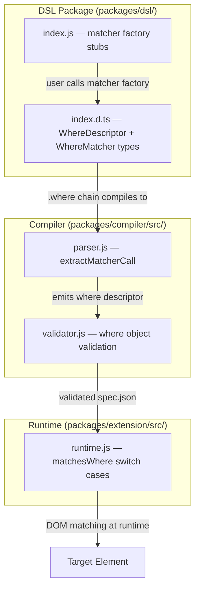

# Design Document: Extended Where Matchers

## Overview

This feature adds 9 new `where` matchers to Tomation's DSL for element selection: `valueIs`, `dataAttr`, `ariaLabel`, `roleIs`, `titleIs`, `hrefContains`, `isDisabled`, `nthChild`, and `closestLabelIs`. Each matcher requires changes across three layers: the DSL package (runtime stubs + TypeScript types), the compiler (AST-based extraction in `extractMatcherCall`), and the runtime (`matchesWhere()` DOM evaluation).

The matchers fall into four signature categories:
- **Standard 1-arg string** (valueIs, ariaLabel, roleIs, titleIs, hrefContains) — same shape as existing matchers
- **2-arg string** (dataAttr, closestLabelIs) — new pattern requiring extraction of both arguments
- **0-arg boolean** (isDisabled) — new pattern producing a hardcoded `true` value
- **1-arg numeric** (nthChild) — new pattern requiring numeric literal extraction

Design principle: extend existing extraction logic with minimal branching. The `extractMatcherCall` function already handles a matcher-name → key mapping for single-arg string matchers; we expand that map and add conditional paths for the special shapes.

## Architecture



### Data Flow

1. Test author writes: `is.INPUT.where(valueIs('hello')).as('Input')`
2. DSL runtime stub `valueIs('hello')` returns `{ value: 'hello' }` — consumed only at compile time
3. Compiler's `extractMatcherCall` walks the AST, recognizes `valueIs` callee, extracts the string argument, emits `{ value: 'hello' }` into the element descriptor's `where` object
4. Compiled `spec.json` includes `{ tag: "input", where: { value: "hello" }, label: "Input" }`
5. At runtime, `matchesWhere(el, { value: 'hello' })` checks `el.value === 'hello'`

## Components and Interfaces

### 1. DSL Runtime Stubs (`packages/dsl/index.js`)

New matcher factory functions added alongside existing ones:

```javascript
// Standard 1-arg string matchers
function valueIs(val) { return { value: val }; }
function ariaLabel(val) { return { ariaLabel: val }; }
function roleIs(val) { return { role: val }; }
function titleIs(val) { return { title: val }; }
function hrefContains(val) { return { hrefContains: val }; }

// 0-arg boolean matcher
function isDisabled() { return { isDisabled: true }; }

// 1-arg numeric matcher
function nthChild(n) { return { nthChild: n }; }

// 2-arg string matchers
function dataAttr(name, val) { return { dataAttr: { name: name, value: val } }; }
function closestLabelIs(tag, text) { return { closestLabel: { tag: tag, text: text } }; }
```

All new factories added to `module.exports`.

### 2. DSL TypeScript Types (`packages/dsl/index.d.ts`)

**WhereDescriptor additions:**

```typescript
export interface WhereDescriptor {
  // ... existing fields ...
  value?: string;
  dataAttr?: { name: string; value: string };
  ariaLabel?: string;
  role?: string;
  title?: string;
  hrefContains?: string;
  isDisabled?: boolean;
  nthChild?: number;
  closestLabel?: { tag: string; text: string };
}
```

**WhereMatcher union additions:**

```typescript
export type WhereMatcher =
  // ... existing members ...
  | { value: string }
  | { dataAttr: { name: string; value: string } }
  | { ariaLabel: string }
  | { role: string }
  | { title: string }
  | { hrefContains: string }
  | { isDisabled: true }
  | { nthChild: number }
  | { closestLabel: { tag: string; text: string } };
```

**New factory declarations:**

```typescript
export declare function valueIs(val: string): { value: string };
export declare function dataAttr(name: string, val: string): { dataAttr: { name: string; value: string } };
export declare function ariaLabel(val: string): { ariaLabel: string };
export declare function roleIs(val: string): { role: string };
export declare function titleIs(val: string): { title: string };
export declare function hrefContains(val: string): { hrefContains: string };
export declare function isDisabled(): { isDisabled: true };
export declare function nthChild(n: number): { nthChild: number };
export declare function closestLabelIs(tag: string, text: string): { closestLabel: { tag: string; text: string } };
```

### 3. Compiler — `extractMatcherCall` (`packages/compiler/src/parser.js`)

The existing function has a `matcherMap` table that maps callee names to where-key names for single-string-arg matchers. We extend this and add special-case branches before the map lookup:

```javascript
function extractMatcherCall(callNode, warnings, filePath) {
  if (!callNode || callNode.type !== 'CallExpression') return {};
  const callee = callNode.callee;
  const calleeName = callee.type === 'Identifier' ? callee.name : null;
  if (!calleeName) return {};

  const args = callNode.arguments;
  const line = lineOf(callNode);

  // --- Special-shape matchers ---

  // 0-arg: isDisabled
  if (calleeName === 'isDisabled') {
    if (args.length > 0) {
      warnings.push({
        message: `'isDisabled' accepts zero arguments at ${filePath}:${line}`,
        filePath, line
      });
    }
    return { isDisabled: true };
  }

  // Numeric-arg: nthChild
  if (calleeName === 'nthChild') {
    const n = extractNumber(args[0]);
    if (n === null || !Number.isInteger(n) || n < 1) {
      warnings.push({
        message: `'nthChild' requires a positive integer argument at ${filePath}:${line}`,
        filePath, line
      });
      return {};
    }
    return { nthChild: n };
  }

  // 2-arg string: dataAttr
  if (calleeName === 'dataAttr') {
    const name = extractString(args[0]);
    const val = extractString(args[1]);
    if (name === null || val === null) {
      warnings.push({
        message: `'dataAttr' requires two string arguments at ${filePath}:${line}`,
        filePath, line
      });
      return {};
    }
    if (name.startsWith('data-')) {
      warnings.push({
        message: `'dataAttr' name should be the suffix only (e.g., 'testid' not 'data-testid') at ${filePath}:${line}`,
        filePath, line
      });
    }
    return { dataAttr: { name: name, value: val } };
  }

  // 2-arg string: closestLabelIs
  if (calleeName === 'closestLabelIs') {
    const tag = extractString(args[0]);
    const text = extractString(args[1]);
    if (tag === null || text === null) {
      warnings.push({
        message: `'closestLabelIs' requires two string arguments at ${filePath}:${line}`,
        filePath, line
      });
      return {};
    }
    return { closestLabel: { tag: tag, text: text } };
  }

  // --- Standard 1-arg string matchers ---
  const arg = extractString(args[0]);
  if (arg === null) return {};

  const matcherMap = {
    innerTextIs: 'textIs',
    innerTextContains: 'textContains',
    classIncludes: 'classIncludes',
    placeholderIs: 'placeholder',
    nameIs: 'name',
    typeIs: 'type',
    idIs: 'id',
    // New single-arg matchers
    valueIs: 'value',
    ariaLabel: 'ariaLabel',
    roleIs: 'role',
    titleIs: 'title',
    hrefContains: 'hrefContains',
  };

  const key = matcherMap[calleeName];
  if (!key) return {};
  return { [key]: arg };
}
```

**Key change**: The function signature gains optional `warnings` and `filePath` parameters to support compiler diagnostics for the new special-shape matchers. Call sites that currently call `extractMatcherCall(arg)` are updated to pass `extractMatcherCall(arg, warnings, filePath)`.

### 4. Runtime — `matchesWhere` (`packages/extension/src/runtime.js`)

New cases added to the `switch` statement inside `matchesWhere`:

```javascript
function matchesWhere(el, where, parentNode) {
  var keys = Object.keys(where);
  for (var i = 0; i < keys.length; i++) {
    var key = keys[i];
    var value = where[key];
    switch (key) {
      // ... existing cases ...

      case 'value':
        if (el.value === undefined || el.value !== value) return false;
        break;

      case 'dataAttr':
        var dataVal = el.getAttribute('data-' + value.name);
        if (dataVal !== value.value) return false;
        break;

      case 'ariaLabel':
        if (el.getAttribute('aria-label') !== value) return false;
        break;

      case 'role':
        if (el.getAttribute('role') !== value) return false;
        break;

      case 'title':
        if (el.getAttribute('title') !== value) return false;
        break;

      case 'hrefContains':
        var href = el.getAttribute('href');
        if (href === null || href.indexOf(value) === -1) return false;
        break;

      case 'isDisabled':
        if (el.disabled !== true) return false;
        break;

      case 'nthChild':
        var pos = 1;
        var sib = el.previousElementSibling;
        while (sib) { pos++; sib = sib.previousElementSibling; }
        if (pos !== value) return false;
        break;

      case 'closestLabel':
        if (!matchClosestLabel(el, value, parentNode)) return false;
        break;

      default:
        break;
    }
  }
  return true;
}
```

### 5. Runtime — `matchClosestLabel` Algorithm

```javascript
/**
 * Determine if a label element matching the spec exists near the target element.
 *
 * @param {Element} el - target element
 * @param {{ tag: string, text: string }} spec - label specification
 * @param {Element|null} parentNode - childOf parent if present, null otherwise
 * @returns {boolean}
 */
function matchClosestLabel(el, spec, parentNode) {
  var tag = spec.tag.toUpperCase();
  var text = spec.text;

  // Strategy A: childOf-bounded search — search within parent subtree only
  if (parentNode) {
    return searchSubtreeForLabel(parentNode, tag, text);
  }

  // Strategy B: Unbounded search with max 3 ancestor levels

  // B1: Explicit `for` attribute — find a matching-tag element with for=el.id
  if (el.id) {
    var forLabels = document.querySelectorAll(spec.tag + '[for="' + el.id + '"]');
    for (var i = 0; i < forLabels.length; i++) {
      if (forLabels[i].tagName === tag && forLabels[i].textContent.trim() === text) {
        return true;
      }
    }
  }

  // B2: Walk up at most 3 ancestor levels, search descendants
  var ancestor = el.parentElement;
  for (var depth = 0; depth < 3 && ancestor; depth++) {
    if (searchSubtreeForLabel(ancestor, tag, text)) {
      return true;
    }
    ancestor = ancestor.parentElement;
  }

  // B3: aria-labelledby resolution
  var labelledBy = el.getAttribute('aria-labelledby');
  if (labelledBy) {
    var refEl = document.getElementById(labelledBy);
    if (refEl && refEl.tagName === tag && refEl.textContent.trim() === text) {
      return true;
    }
  }

  return false;
}

/**
 * Search a subtree for an element matching the given tag and text content.
 */
function searchSubtreeForLabel(root, tag, text) {
  var candidates = root.getElementsByTagName(tag);
  for (var i = 0; i < candidates.length; i++) {
    if (candidates[i].textContent.trim() === text) {
      return true;
    }
  }
  return false;
}
```

**Design decisions:**
- `tag` comparison uses `tagName` (always uppercase in DOM) against `spec.tag.toUpperCase()` — achieving case-insensitive comparison per requirement 10.9.
- The `parentNode` parameter is threaded through from `findElement` → `matchesWhere` when a `childOf` descriptor is present.
- The 3-ancestor-level walk uses `parentElement` chain, searching each ancestor's full subtree via `getElementsByTagName`.
- `aria-labelledby` resolution handles only single ID references (the common case).

### 6. Runtime — Threading `parentNode` into `matchesWhere`

The existing `findElement` function calls `matchesWhere(candidates[i], where)`. For `closestLabel` to know whether it's in a childOf context, we pass the parent node:

```javascript
// In findElement's poll function:
if (matchesWhere(candidates[i], where, root === document ? null : root)) {
  resolve(candidates[i]);
  return;
}
```

When `root` is not `document` (i.e., we're searching within a childOf parent), `parentNode` will be the parent element. When searching at document level, it's `null` — triggering the 3-ancestor-depth strategy.

## Data Models

### WhereDescriptor (internal spec.json)

```typescript
interface WhereDescriptor {
  // Existing
  id?: string;
  textIs?: string;
  textContains?: string;
  classIncludes?: string;
  placeholder?: string;
  name?: string;
  type?: string;
  // New — simple string match
  value?: string;
  ariaLabel?: string;
  role?: string;
  title?: string;
  // New — substring match
  hrefContains?: string;
  // New — structured object
  dataAttr?: { name: string; value: string };
  closestLabel?: { tag: string; text: string };
  // New — boolean flag
  isDisabled?: boolean;
  // New — numeric
  nthChild?: number;
}
```

### Matcher Signature Categories

| Category | Matchers | Compiler Extraction | Runtime Check |
|----------|----------|-------------------|---------------|
| 1-arg string (exact) | valueIs, ariaLabel, roleIs, titleIs | `matcherMap` lookup | `el.prop/attr === val` |
| 1-arg string (contains) | hrefContains | `matcherMap` lookup | `attr.indexOf(val) !== -1` |
| 2-arg string (structured) | dataAttr, closestLabelIs | Named branch, extract both args | Structured logic |
| 0-arg boolean | isDisabled | Named branch, emit `true` | `el.disabled === true` |
| 1-arg numeric | nthChild | Named branch, `extractNumber` | Sibling position count |

## Correctness Properties

*A property is a characteristic or behavior that should hold true across all valid executions of a system — essentially, a formal statement about what the system should do. Properties serve as the bridge between human-readable specifications and machine-verifiable correctness guarantees.*

### Property 1: Single-arg matcher factory round-trip

*For any* single-arg matcher factory (`valueIs`, `ariaLabel`, `roleIs`, `titleIs`, `hrefContains`) and *for any* string `s`, calling the factory with `s` SHALL return an object with exactly one key whose value is `s`, and that key matches the factory's designated where-key.

**Validates: Requirements 1.1, 3.1, 4.1, 5.1, 6.1**

### Property 2: Two-arg matcher factory round-trip

*For any* two-arg matcher factory (`dataAttr`, `closestLabelIs`) and *for any* pair of strings `(a, b)`, calling the factory with `(a, b)` SHALL return the correctly structured nested object preserving both arguments.

**Validates: Requirements 2.1, 10.1**

### Property 3: Compiler single-arg extraction preserves value

*For any* recognized single-arg matcher name and *for any* string literal value in the AST, `extractMatcherCall` SHALL produce a where descriptor containing that exact string value at the correct key.

**Validates: Requirements 1.2, 3.2, 4.2, 5.2, 6.2**

### Property 4: Compiler two-arg extraction preserves both values

*For any* two-arg matcher name (`dataAttr`, `closestLabelIs`) and *for any* pair of string literals in the AST, `extractMatcherCall` SHALL produce the correctly structured nested descriptor preserving both string values.

**Validates: Requirements 2.2, 10.2, 11.1, 11.6**

### Property 5: Compiler numeric extraction preserves value

*For any* positive integer `n` passed as a numeric literal to `nthChild`, `extractMatcherCall` SHALL produce `{ nthChild: n }`.

**Validates: Requirements 8.2, 11.4**

### Property 6: Unrecognized matcher yields empty object

*For any* identifier that is not a recognized matcher factory name, `extractMatcherCall` SHALL return an empty object `{}`.

**Validates: Requirements 11.7**

### Property 7: Runtime exact-attribute matching

*For any* element and *for any* attribute-based where key (`ariaLabel`, `role`, `title`), `matchesWhere` SHALL return `true` if and only if the element's corresponding attribute value exactly equals the where value.

**Validates: Requirements 3.3, 4.3, 5.3**

### Property 8: Runtime value property matching

*For any* element with a defined `value` property and *for any* where descriptor with a `value` key, `matchesWhere` SHALL return `true` if and only if `el.value === where.value`.

**Validates: Requirements 1.3, 1.5**

### Property 9: Runtime href substring matching

*For any* element with an `href` attribute and *for any* where descriptor with an `hrefContains` key, `matchesWhere` SHALL return `true` if and only if the href value contains the where value as a substring.

**Validates: Requirements 6.3, 6.5**

### Property 10: Runtime nthChild position matching

*For any* parent element with N children and *for any* child at 1-based position `p`, `matchesWhere` with `{ nthChild: n }` SHALL return `true` if and only if `p === n`.

**Validates: Requirements 8.3**

### Property 11: Runtime dataAttr matching

*For any* element and *for any* `dataAttr` where spec `{ name, value }`, `matchesWhere` SHALL return `true` if and only if `el.getAttribute('data-' + name) === value`.

**Validates: Requirements 2.3**

### Property 12: Compiler data- prefix warning

*For any* string that starts with `"data-"` passed as the first argument to `dataAttr`, the compiler SHALL emit a warning about using the suffix only.

**Validates: Requirements 2.6**

### Property 13: closestLabel childOf-bounded search

*For any* DOM tree where an element has a childOf parent, and *for any* `closestLabel` spec `{ tag, text }`, `matchClosestLabel` SHALL return `true` if and only if the parent subtree contains a matching-tag element (case-insensitive) whose trimmed textContent equals the specified text.

**Validates: Requirements 10.3, 10.9**

### Property 14: closestLabel unbounded search — ancestor depth limit

*For any* DOM tree where an element does NOT have a childOf parent, `matchClosestLabel` SHALL NOT find a label that exists only beyond 3 ancestor levels from the target element (when no `for` or `aria-labelledby` link exists).

**Validates: Requirements 10.4, 10.7**

## Error Handling

### Compiler Warnings

| Condition | Warning Message | Result |
|-----------|----------------|--------|
| `dataAttr` with < 2 string args | `'dataAttr' requires two string arguments` | Empty descriptor `{}` |
| `dataAttr` name starts with `data-` | `'dataAttr' name should be the suffix only` | Valid descriptor still emitted |
| `closestLabelIs` with < 2 string args | `'closestLabelIs' requires two string arguments` | Empty descriptor `{}` |
| `isDisabled` with > 0 args | `'isDisabled' accepts zero arguments` | Valid descriptor still emitted (`{ isDisabled: true }`) |
| `nthChild` with non-positive-integer arg | `'nthChild' requires a positive integer argument` | Empty descriptor `{}` |
| Unrecognized matcher name | None (silent) | Empty descriptor `{}` |

Warnings are appended to the `warnings` array on the `ParsedFile` result and surfaced in the compiler CLI output. They do not halt compilation.

### Runtime Graceful Degradation

- Missing attributes (`getAttribute` returns `null`) result in non-match — no exceptions thrown.
- `el.value === undefined` → non-match for `value` where key.
- `el.disabled` not being `true` (e.g., `undefined` or `false`) → non-match for `isDisabled`.
- `closestLabel` exhausting all strategies → non-match, no error.
- `nthChild` on a root element (no parent) → position is 1 (element is its own first child conceptually). In practice, `previousElementSibling` will be `null`, so `pos = 1`.

## Testing Strategy

### Unit Tests (node:test + assert)

- **DSL stubs**: Verify each factory returns the correct object shape with specific examples (existing pattern in `index.test.js`).
- **Compiler extraction**: Verify `extractMatcherCall` handles each special shape with example AST nodes (existing pattern in `parser.test.js`).
- **Compiler warnings**: Verify correct warnings are emitted for invalid inputs.
- **Runtime matching**: Verify `matchesWhere` for each new case with mock DOM elements.
- **closestLabel algorithm**: Verify each search strategy (for-attribute, ancestor walk, aria-labelledby) with specific DOM fixtures.

### Property-Based Tests (fast-check)

The project already has `fast-check` as a dev dependency in `packages/compiler`. Property tests will be added alongside unit tests.

**Configuration:**
- Minimum 100 iterations per property
- Each test tagged with: `Feature: extended-where-matchers, Property {N}: {title}`

**Property tests to implement:**
1. Single-arg factory round-trip (Properties 1, 2)
2. Compiler extraction round-trip for all matcher shapes (Properties 3, 4, 5)
3. Unrecognized matcher → empty object (Property 6)
4. Runtime exact-attribute matching (Property 7)
5. Runtime value matching (Property 8)
6. Runtime href substring matching (Property 9)
7. Runtime nthChild position matching (Property 10)
8. Runtime dataAttr matching (Property 11)
9. Compiler data- prefix warning (Property 12)
10. closestLabel bounded/unbounded search (Properties 13, 14)

**Test file locations:**
- `packages/dsl/index.test.js` — DSL factory properties
- `packages/compiler/src/parser.test.js` — compiler extraction properties
- `packages/extension/src/runtime.test.js` — runtime matching properties
