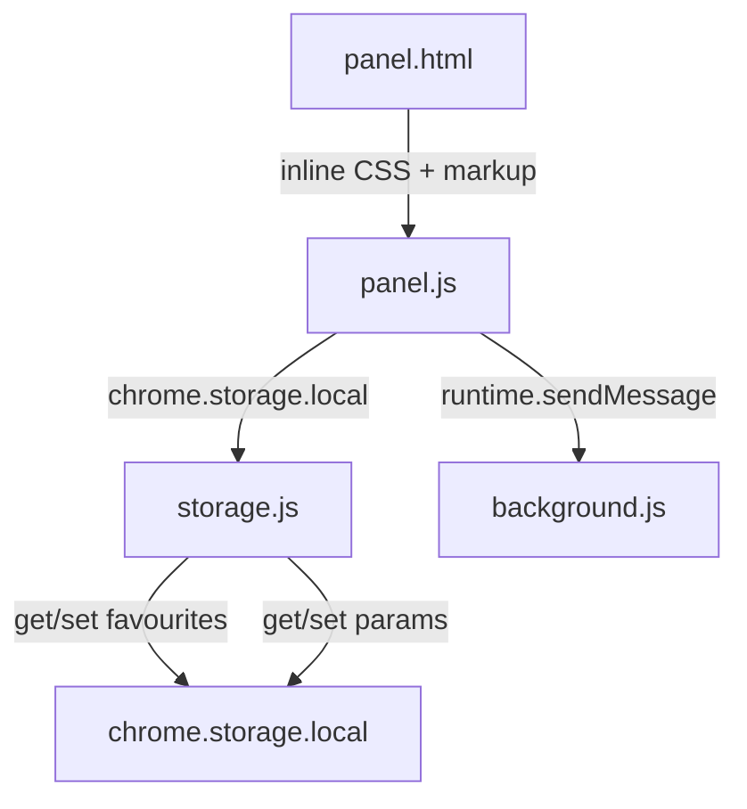

# Design Document: Home Tabs & Quick Run

## Overview

This feature restructures the Tomation extension's home view from a single combined list into a tabbed interface with "Tests" and "Automations" tabs, adds Quick Run buttons for immediate execution without navigating to the test plan view, and introduces automation favouriting for priority sorting.

All changes are scoped to the panel layer (`panel.js` and `panel.html`), with a small addition to `storage.js` for favourite persistence. The background runtime (`background.js`) requires no changes — it already handles `RUN_TEST` and `RUN_AUTOMATION` messages with the same payload shape used by Quick Run.

### Design Rationale

- **Tabs over single list**: As the number of tests and automations grows, a tabbed view lets users focus on one type at a time, reducing cognitive load and improving discoverability.
- **Quick Run**: Power users who know their test plan rarely need to configure individual steps. Quick Run removes 2 clicks (navigate to plan → click run) for the common case.
- **Favourites on automations only**: Automations often have more entries and more variable usage patterns than tests. Favouriting on the Automations tab keeps the feature focused where it adds the most value.

## Architecture

The feature modifies three existing files and adds no new files:



The architecture follows the existing pattern:
1. **panel.html** — static structure and inline CSS (no build step)
2. **panel.js** — ES5 global functions, DOM manipulation, event handling
3. **storage.js** — thin async wrappers around `chrome.storage.local`
4. **background.js** — receives messages and orchestrates execution (unchanged)

### Key Decisions

| Decision | Choice | Rationale |
|----------|--------|-----------|
| Tab state persistence | `chrome.storage.local` with key `home_active_tab` | Consistent with existing config persistence pattern |
| Favourite storage | `chrome.storage.local` with key `automation_favourites_{hostname}` (object map per project) | Scoped per project so favourites don't leak across different hostnames |
| Favourite cleanup | Remove `automation_favourites_{hostname}` key when project is deleted | Keeps localStorage clean and avoids orphaned data |
| Quick Run config | Debug mode ON, all steps checked, default speed from saved config | Matches the most common power-user workflow |
| ES5 compatibility | `var`, `function`, no arrows | Matches existing panel.js codebase style |
| Click event isolation | `e.stopPropagation()` on Quick Run and favourite buttons | Prevents row click (navigate to plan) from firing |

## Components and Interfaces

### 1. Tab UI Component (panel.html + panel.js)

**HTML structure** added inside `#home-loaded`:

```html
<div class="tab-bar">
  <button class="tab-btn active" data-tab="tests">☑ Tests</button>
  <button class="tab-btn" data-tab="automations">⚡ Automations</button>
</div>
<div id="tab-content-tests" class="tab-content active">
  <div class="search-wrapper">
    <input type="text" class="tab-search-input" maxlength="100" placeholder="Search tests..." />
  </div>
  <!-- test list items rendered here -->
</div>
<div id="tab-content-automations" class="tab-content">
  <div class="search-wrapper">
    <input type="text" class="tab-search-input" maxlength="100" placeholder="Search automations..." />
  </div>
  <!-- automation list items rendered here -->
</div>
```

**CSS** (inline in panel.html):
- `.tab-bar` — flex row with gap, border-bottom
- `.tab-btn` — ghost-style button with icon + text; `.tab-btn.active` — accent underline
- `.tab-btn` icons (☑ and ⚡) rendered inline with the label text for visual distinction
- `.tab-content` — hidden by default; `.tab-content.active` — displayed
- `.tab-search-input` — same styling as existing `#search-input`, placed at the top of each tab content section

**JS functions** (panel.js):

| Function | Signature | Description |
|----------|-----------|-------------|
| `switchTab` | `function switchTab(tabName)` | Toggles active class on tab buttons and content containers; persists selection via `saveActiveTab` |
| `saveActiveTab` | `function saveActiveTab(tabName)` | Writes `tabName` to `chrome.storage.local` under key `home_active_tab` |
| `loadActiveTab` | `function loadActiveTab(callback)` | Reads `home_active_tab` from storage; calls `callback('tests')` or `callback('automations')` |

### 2. Quick Run Button (panel.js)

Rendered inline in each test/automation list item as a small play-icon button on the right side.

**HTML per row**:
```html
<li data-spec-index="0" data-test-index="0" data-runnable-type="test">
  <span class="row-label">Login test</span>
  <button class="quick-run-btn" title="Quick Run">▶</button>
</li>
```

**JS functions**:

| Function | Signature | Description |
|----------|-----------|-------------|
| `onQuickRunClick` | `function onQuickRunClick(e)` | Stops propagation; determines type (test/automation); delegates to `quickRunTest` or `quickRunAutomation` |
| `quickRunTest` | `function quickRunTest(specIndex, testIndex)` | Builds all-steps-checked array, debug config; sends `RUN_TEST` message; calls `switchToRunView()` |
| `quickRunAutomation` | `function quickRunAutomation(specIndex, automationIndex)` | Loads saved params via `loadParamValues`; if required params missing with no saved values → navigates to plan view; otherwise sends `RUN_AUTOMATION` with debug config; calls `switchToRunView()` |
| `buildAllStepsChecked` | `function buildAllStepsChecked(steps)` | Returns array `[0, 1, 2, ..., steps.length - 1]` |
| `buildDefaultParams` | `function buildDefaultParams(params)` | Returns object with empty string for string, 0 for number, today's date (YYYY-MM-DD) for date, first option for enum |
| `hasRequiredParamsWithoutValues` | `function hasRequiredParamsWithoutValues(params, savedValues)` | Returns `true` if any non-optional param has no saved value |

### 3. Favourite Toggle (panel.js + storage.js)

A star icon button on each automation row. Clicking toggles the favourite state and re-sorts the list.

**HTML per automation row**:
```html
<li data-spec-index="0" data-automation-index="0" data-runnable-type="automation" class="automation-item">
  <button class="favourite-btn" data-favourite="false" title="Favourite">☆</button>
  <span class="row-label">⚙ todo automation</span>
  <button class="quick-run-btn" title="Quick Run">▶</button>
</li>
```

**Storage functions** (storage.js):

| Function | Signature | Description |
|----------|-----------|-------------|
| `saveFavourites` | `function saveFavourites(hostname, favourites)` | Persists the favourites object `{ automationName: true }` under key `automation_favourites_{hostname}` |
| `loadFavourites` | `function loadFavourites(hostname)` | Returns Promise resolving to the favourites object or `{}` for the given hostname |
| `deleteFavourites` | `function deleteFavourites(hostname)` | Removes the `automation_favourites_{hostname}` key from storage (called on project deletion) |

**Panel functions** (panel.js):

| Function | Signature | Description |
|----------|-----------|-------------|
| `onFavouriteClick` | `function onFavouriteClick(e)` | Stops propagation; toggles favourite state; calls `saveFavourites(currentHostname, favourites)`; re-renders automations tab |
| `sortAutomationsWithFavourites` | `function sortAutomationsWithFavourites(automations, favourites)` | Returns new array with favourites first, preserving relative order within each group |

### 4. Refactored renderHomeView (panel.js)

The existing `renderHomeView()` function is refactored to:
1. Render the tab bar
2. Call `renderTestsTab()` and `renderAutomationsTab()` to populate each tab content area
3. Restore the last active tab from storage

| Function | Signature | Description |
|----------|-----------|-------------|
| `renderTestsTab` | `function renderTestsTab(specs)` | Renders only test items into `#tab-content-tests` with Quick Run buttons |
| `renderAutomationsTab` | `function renderAutomationsTab(specs, favourites)` | Renders automation items sorted by favourites into `#tab-content-automations` with favourite toggles and Quick Run buttons |

### 5. Search Integration

Each tab has its own search input at the top of its content area. The `applySearchFilter()` function is updated to filter only the items within the active tab's content container. Each `.tab-search-input` gets its own `input` event listener that calls the scoped filter function.

When switching tabs, the search input in the newly active tab retains its value (if any) and the filter is re-applied immediately.

## Data Models

### Storage Keys

| Key | Type | Description |
|-----|------|-------------|
| `home_active_tab` | `string` (`'tests'` or `'automations'`) | Last selected tab |
| `automation_favourites_{hostname}` | `object` (`{ [automationName]: boolean }`) | Map of favourite flags keyed by automation name, scoped per project hostname |
| `automation_params_{name}` | `object` (existing) | Last-used parameter values per automation |

### Message Payloads (unchanged)

```javascript
// RUN_TEST — same as existing onRunClick sends
{
  type: 'RUN_TEST',
  testIndex: number,
  checkedSteps: number[],
  config: { allowContinueOnFailure: true, allowRetryOnFailure: true, executionSpeed: string }
}

// RUN_AUTOMATION — same as existing onRunClick sends
{
  type: 'RUN_AUTOMATION',
  automationIndex: number,
  params: object,
  checkedSteps: number[],
  config: { allowContinueOnFailure: true, allowRetryOnFailure: true, executionSpeed: string }
}
```

### Quick Run Config Construction

```javascript
// Debug mode always enabled for Quick Run
var config = {
  allowContinueOnFailure: true,
  allowRetryOnFailure: true,
  executionSpeed: savedSpeed || 'NORMAL'
};
```

## Correctness Properties

*A property is a characteristic or behavior that should hold true across all valid executions of a system — essentially, a formal statement about what the system should do. Properties serve as the bridge between human-readable specifications and machine-verifiable correctness guarantees.*

### Property 1: Tab filtering is exhaustive and exclusive

*For any* loaded Spec containing tests and automations, the set of items displayed in the Tests tab unioned with the set of items displayed in the Automations tab SHALL equal the full set of runnables in the Spec, with no item appearing in both tabs.

**Validates: Requirements 1.2, 1.3**

### Property 2: Favourite sort preserves relative order

*For any* list of automations and any subset marked as favourites, sorting by favourites SHALL produce a list where all favourited items appear before all non-favourited items, AND the relative order among favourited items matches their original relative order, AND the relative order among non-favourited items matches their original relative order.

**Validates: Requirements 4.3, 4.4**

### Property 3: Quick Run test message is equivalent to all-checked plan run

*For any* test with N steps, a Quick Run SHALL produce a `RUN_TEST` message with `checkedSteps` equal to `[0, 1, ..., N-1]` and `config.allowContinueOnFailure === true` and `config.allowRetryOnFailure === true`.

**Validates: Requirements 2.2, 2.3**

### Property 4: Quick Run automation default params

*For any* automation with parameters where no saved values exist, the generated default params object SHALL contain empty string for each string param, 0 for each number param, today's date string for each date param, and the first option for each enum param.

**Validates: Requirements 3.5**

### Property 5: Quick Run automation with required params and no saved values falls back to plan view

*For any* automation that has at least one non-optional parameter AND no saved values exist for that automation, Quick Run SHALL NOT send a `RUN_AUTOMATION` message and SHALL instead navigate to the test plan view.

**Validates: Requirements 3.6**

### Property 6: Search filter scopes to active tab

*For any* search query applied while a tab is active, only items within the active tab's content container SHALL be affected by visibility toggling; items in the inactive tab SHALL remain unaffected.

**Validates: Requirements 1.7**

### Property 7: Favourite persistence round trip

*For any* set of automation names marked as favourites and any valid hostname, saving then loading favourites for that hostname SHALL return the same set of automation names with `true` values, and loading favourites for a different hostname SHALL return an independent result.

**Validates: Requirements 4.2, 4.5**

## Error Handling

| Scenario | Handling |
|----------|----------|
| `loadParamValues` fails (storage read error) | Treat as "no saved values" — fall back to plan view for automations with required params, use defaults otherwise |
| `loadFavourites` fails | Treat as empty object `{}` — no favourites, original order preserved |
| `saveActiveTab` fails | Silent fail (non-critical); next visit defaults to "Tests" tab |
| `saveFavourites` fails | Log error; UI still reflects toggle (optimistic); next reload may lose state |
| `deleteFavourites` fails on project deletion | Silent fail (non-critical); orphaned key remains but causes no functional harm |
| Quick Run clicked while `currentProject` is null | Guard clause returns early — no message sent |
| Automation has 0 steps | `buildAllStepsChecked` returns `[]`; message sent with empty array (background handles gracefully) |

## Testing Strategy

### Unit Tests (example-based)

- `filterTests` — existing pure function, verify it still works within active tab scope
- `sortAutomationsWithFavourites` — test with various favourite combinations (empty, all, some)
- `buildAllStepsChecked` — verify output for 0, 1, N steps
- `buildDefaultParams` — verify correct defaults for each param type
- `hasRequiredParamsWithoutValues` — true/false cases with various param/saved-value combos

### Property-Based Tests

Using [fast-check](https://github.com/dubzzz/fast-check) for property-based testing:

- **Property 1**: Generate arbitrary arrays of test/automation objects; verify tab split is exhaustive and exclusive
- **Property 2**: Generate arbitrary automation lists and favourite subsets; verify sort stability invariant
- **Property 3**: Generate tests with random step counts; verify Quick Run message shape
- **Property 4**: Generate automations with random param type combinations; verify default values
- **Property 5**: Generate automations with required params; verify fallback behavior when saved values are missing/present
- **Property 7**: Generate random automation name sets; verify save/load round trip (using storage mock)

Each property test SHALL run a minimum of 100 iterations.

Tag format: `Feature: home-tabs-quick-run, Property {N}: {description}`

### Integration Tests

- Tab persistence: save tab → reload panel → verify correct tab active
- Quick Run end-to-end: click Quick Run → verify `RUN_TEST`/`RUN_AUTOMATION` message sent with correct payload
- Favourite toggle: click star → reload → verify sort order preserved

### Manual Verification

- Visual check that tab styling matches existing panel aesthetic
- Click isolation: Quick Run and favourite clicks don't trigger row navigation
- Empty states display correctly when no tests / no automations exist
