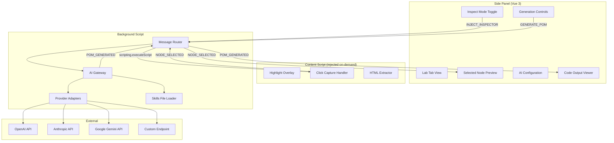
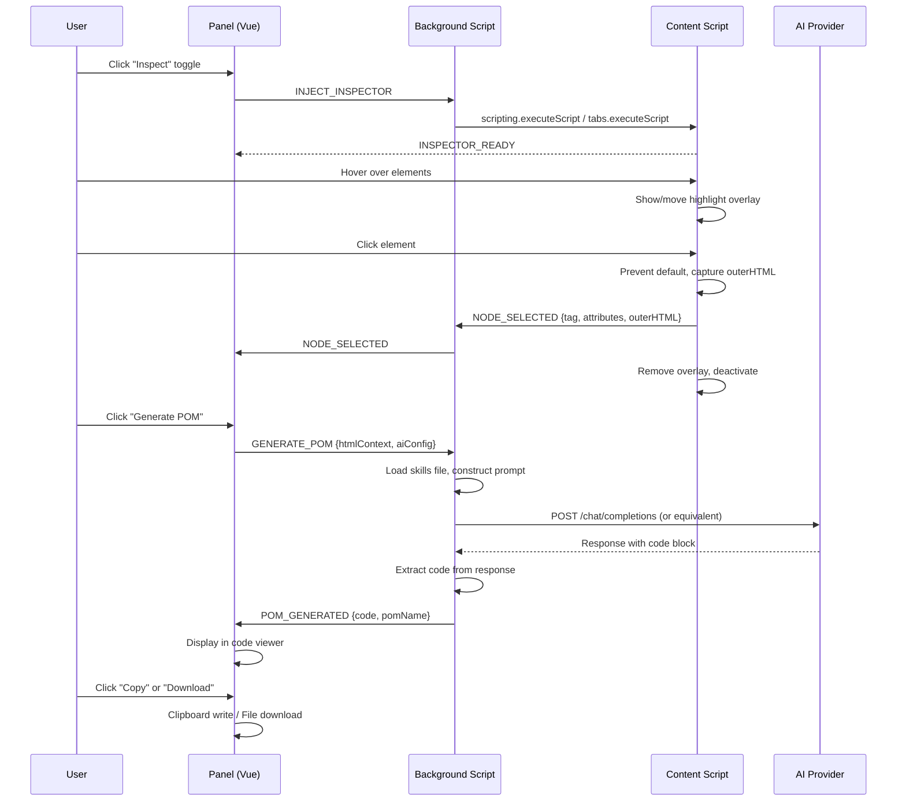
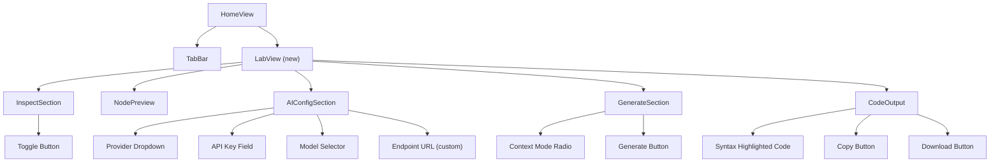

# Design Document: HTML Inspector POM Generator

## Overview

The HTML Inspector POM Generator adds a "Lab" tab to the Tomation browser extension side panel, enabling users to visually inspect DOM elements and generate Page Object Model (`.pom.ts`) files using AI. The feature integrates three runtime contexts — the Vue 3 panel, a dynamically-injected content script, and the background service worker — connected via the browser messaging API.

The pipeline is: **Inspect → Select → Configure → Generate → Output**. Users toggle an inspection mode that injects a content script for element highlighting and selection, configure their preferred AI provider, then generate POM code from the selected element's HTML subtree.

## Architecture



### Data Flow: Inspection → Selection → Generation → Output



## Components and Interfaces

### Vue Component Structure (Lab Tab)



**New/Modified Components:**

| Component | File | Purpose |
|-----------|------|---------|
| `TabBar.vue` | Modified | Add "Lab" tab button |
| `HomeView.vue` | Modified | Conditionally render `LabView` when `activeTab === 'lab'` |
| `LabView.vue` | New | Container for all Lab tab sections |
| `InspectSection.vue` | New | Inspect mode toggle + status indicator |
| `NodePreview.vue` | New | Selected node tag, child summary, truncated HTML |
| `AIConfigSection.vue` | New | Provider, key, model, endpoint configuration |
| `GenerateSection.vue` | New | Context mode radio + Generate button |
| `CodeOutput.vue` | New | Code viewer + Copy/Download actions |

### Content Script Design

The content script (`inspector.js`) is injected on-demand when the user activates inspect mode. It is **not** declared in the manifest — it uses programmatic injection.

```
inspector.js
├── Overlay management
│   ├── createOverlay() → creates positioned absolute div
│   ├── positionOverlay(element) → matches element's bounding rect
│   └── removeOverlay() → removes div from DOM
├── Event handlers
│   ├── onMouseMove(e) → positionOverlay(e.target)
│   ├── onClick(e) → preventDefault, captureNode, sendMessage, cleanup
│   └── onKeyDown(e) → Escape to cancel inspection
└── Messaging
    ├── sendNodeSelected(nodeData) → chrome.runtime.sendMessage
    └── cleanup() → remove listeners, remove overlay
```

**Content Script Lifecycle:**
1. Script injected → creates overlay element, attaches mousemove/click/keydown listeners
2. Hover → overlay positioned on hovered element
3. Click → captures node data, sends message, removes all listeners and overlay (self-cleanup)
4. Escape → cancels inspection, removes overlay, sends INSPECT_CANCELLED

**Node data captured on click:**
```typescript
interface SelectedNodeData {
  tagName: string;
  attributes: Record<string, string>;
  outerHTML: string;
  childElementCount: number;
}
```

### Background Script AI Gateway

The background script handles AI API calls to avoid CORS restrictions from the panel context.

**Provider Adapter Pattern:**

```javascript
// Provider adapter interface (conceptual)
{
  buildRequest(config, systemPrompt, userPrompt) → { url, headers, body }
  parseResponse(responseJson) → { code: string, pomName: string }
}
```

| Provider | Endpoint | Auth Header | Model Param |
|----------|----------|-------------|-------------|
| OpenAI | `https://api.openai.com/v1/chat/completions` | `Authorization: Bearer {key}` | `model` field in body |
| Anthropic | `https://api.anthropic.com/v1/messages` | `x-api-key: {key}` | `model` field in body |
| Google Gemini | `https://generativelanguage.googleapis.com/v1beta/models/{model}:generateContent` | `?key={key}` query param | URL path segment |
| Custom | User-provided URL | `Authorization: Bearer {key}` | `model` field in body (OpenAI-compatible) |

**Prompt Construction:**
- **System message**: Full contents of `tomation-ai.md` + instruction to generate a POM file
- **User message**: The HTML context (either full page with marker or selected subtree)
- **Generation instruction**: "Generate a .pom.ts file for the following HTML. Export a default object with element descriptors and any reusable Tasks."

**Response Parsing:**
Extract the first markdown code block (` ```typescript ... ``` ` or ` ```ts ... ``` ` or ` ``` ... ``` `) from the response content. If no code block found, use the full response text.

### Build System Changes

The `build.js` script is extended to copy `tomation-ai.md` into each target's output directory:

```javascript
// In buildTarget(target):
var skillsSrc = path.join(ROOT, '../../tomation-ai.md');
var skillsDest = path.join(targetDir, 'bundled', 'tomation-ai.md');
copyFile(skillsSrc, skillsDest);
```

The skills file is declared as a web-accessible resource in the manifest so the background script can load it via `fetch(chrome.runtime.getURL('bundled/tomation-ai.md'))`.

**Manifest changes:**
- Chrome (MV3): Add `"web_accessible_resources": [{ "resources": ["bundled/tomation-ai.md"], "matches": [] }]`
- Firefox (MV2): Add `"web_accessible_resources": ["bundled/tomation-ai.md"]`
- Both: Add `"scripting"` to permissions (Chrome MV3 requires this for `chrome.scripting.executeScript`)

### Cross-Browser Script Injection

The injection logic lives in a shared utility used by the background script:

```javascript
function injectInspector(tabId) {
  if (typeof browser !== 'undefined') {
    // Firefox MV2: browser.tabs.executeScript
    return browser.tabs.executeScript(tabId, { file: 'src/inspector.js' });
  } else {
    // Chrome MV3: chrome.scripting.executeScript
    return chrome.scripting.executeScript({
      target: { tabId: tabId },
      files: ['src/inspector.js']
    });
  }
}
```

The content script itself is browser-agnostic — it uses `chrome.runtime.sendMessage` which is aliased by the existing `api` pattern (`typeof browser !== 'undefined' ? browser : chrome`).

### Message Protocol

**Panel → Background messages (new):**

| Type | Payload | Purpose |
|------|---------|---------|
| `INJECT_INSPECTOR` | `{}` | Request content script injection into active tab |
| `REMOVE_INSPECTOR` | `{}` | Request content script removal (deactivate) |
| `GENERATE_POM` | `{ htmlContext: string, contextMode: 'full' \| 'subtree', aiConfig: AIConfig }` | Request AI POM generation |
| `GET_PAGE_HTML` | `{}` | Request full page HTML from active tab |

**Background → Panel messages (new):**

| Type | Payload | Purpose |
|------|---------|---------|
| `INSPECTOR_INJECTED` | `{ success: boolean, error?: string }` | Injection result |
| `NODE_SELECTED` | `{ tagName, attributes, outerHTML, childElementCount }` | Node captured by content script |
| `INSPECT_CANCELLED` | `{}` | User pressed Escape or navigated away |
| `PAGE_HTML` | `{ html: string } \| { error: string }` | Full page HTML response |
| `POM_GENERATED` | `{ code: string, pomName: string }` | Successful generation |
| `POM_GENERATION_ERROR` | `{ provider: string, status?: number, error: string }` | Generation failure |
| `POM_GENERATION_TIMEOUT` | `{}` | 60-second timeout reached |

**Content Script → Background messages:**

| Type | Payload | Purpose |
|------|---------|---------|
| `NODE_SELECTED` | `{ tagName, attributes, outerHTML, childElementCount }` | Element selected |
| `INSPECT_CANCELLED` | `{}` | Inspection cancelled via Escape |

## Data Models

### AI Configuration (persisted to `chrome.storage.local`)

```typescript
interface AIConfig {
  provider: 'openai' | 'anthropic' | 'gemini' | 'custom';
  endpointUrl: string;
  apiKey: string;
  model: string;
}

// Storage key: 'lab_ai_config'
```

### Provider Model Options (hardcoded in panel)

```typescript
const PROVIDER_MODELS: Record<string, string[]> = {
  openai: ['gpt-4o', 'gpt-4o-mini', 'gpt-4-turbo', 'gpt-3.5-turbo'],
  anthropic: ['claude-sonnet-4-20250514', 'claude-haiku-4-20250514', 'claude-3-5-sonnet-20241022'],
  gemini: ['gemini-2.5-flash', 'gemini-2.5-pro', 'gemini-2.0-flash'],
};

const PROVIDER_ENDPOINTS: Record<string, string> = {
  openai: 'https://api.openai.com/v1/chat/completions',
  anthropic: 'https://api.anthropic.com/v1/messages',
  gemini: 'https://generativelanguage.googleapis.com/v1beta',
};
```

### Lab Store State (reactive, in-memory)

```typescript
interface LabState {
  inspectMode: boolean;
  selectedNode: SelectedNodeData | null;
  aiConfig: AIConfig | null;
  contextMode: 'full' | 'subtree';
  isGenerating: boolean;
  generatedCode: string | null;
  generatedPomName: string | null;
  error: string | null;
  copyConfirmation: boolean;
}
```

### Selected Node Data

```typescript
interface SelectedNodeData {
  tagName: string;
  attributes: Record<string, string>;
  outerHTML: string;
  childElementCount: number;
}
```

## Correctness Properties

*A property is a characteristic or behavior that should hold true across all valid executions of a system — essentially, a formal statement about what the system should do. Properties serve as the bridge between human-readable specifications and machine-verifiable correctness guarantees.*

### Property 1: Overlay positioning matches element geometry

*For any* DOM element that receives a mouseover event while inspect mode is active, the highlight overlay element SHALL be positioned with top, left, width, and height matching that element's bounding client rect.

**Validates: Requirements 2.2**

### Property 2: Click-to-select captures complete node data and sends correct message

*For any* DOM element clicked while inspect mode is active, the resulting message payload SHALL contain the element's tag name (uppercase), a complete map of its attributes, and its full outerHTML (including all descendant elements), and inspect mode SHALL be deactivated.

**Validates: Requirements 2.3, 2.4**

### Property 3: Node preview renders correct summary

*For any* valid SelectedNodeData object, the preview display SHALL contain the tag name, the correct `childElementCount` value, and an HTML string that is either the full outerHTML (if under the truncation limit) or a prefix of it (if over).

**Validates: Requirements 2.5**

### Property 4: Single selection invariant

*For any* sequence of node selections, the store's `selectedNode` state SHALL always hold exactly the most recent selection (or null if cleared), never accumulating multiple selections.

**Validates: Requirements 2.6**

### Property 5: AI configuration validation rejects invalid inputs

*For any* AI configuration where the API key is empty or whitespace-only, or (for the custom provider) the endpoint URL is empty or whitespace-only, attempting to save SHALL produce a validation error and SHALL NOT call `chrome.storage.local.set`.

**Validates: Requirements 3.6**

### Property 6: AI configuration persistence round-trip

*For any* valid AI configuration (non-empty API key, valid provider, non-empty model, and for custom provider a non-empty endpoint URL), saving to `chrome.storage.local` and then loading SHALL produce an identical configuration object.

**Validates: Requirements 3.7, 3.8**

### Property 7: Full HTML mode inserts marker before selected node

*For any* full page HTML string and any selected node whose outerHTML appears within it, the prepared HTML context SHALL contain the comment marker `<!-- SELECTED_NODE -->` immediately before the first occurrence of the selected node's outerHTML.

**Validates: Requirements 4.2**

### Property 8: Subtree mode sends only the selected node's outerHTML

*For any* selected node, when context mode is "subtree", the HTML context payload SHALL equal exactly the node's `outerHTML` string with no additional content.

**Validates: Requirements 4.3**

### Property 9: Generation prerequisites validation

*For any* lab state where `selectedNode` is null OR `aiConfig` is null OR `aiConfig.apiKey` is empty OR `aiConfig.model` is empty, clicking Generate SHALL produce an error message and SHALL NOT dispatch a `GENERATE_POM` message.

**Validates: Requirements 5.2**

### Property 10: Prompt construction includes skills and HTML context

*For any* valid HTML context string, the prompt constructed by the AI gateway SHALL include the full `tomation-ai.md` content as the system message and the HTML context as the user message content.

**Validates: Requirements 5.3**

### Property 11: Provider adapter constructs correct HTTP request

*For any* valid AI configuration, the provider adapter SHALL produce an HTTP request with the correct endpoint URL, authentication header/param matching the provider's convention, and the model identifier in the appropriate location (body field or URL path).

**Validates: Requirements 5.4**

### Property 12: Code block extraction from AI response

*For any* AI response string containing at least one markdown code fence (triple backticks with optional language tag), the extraction function SHALL return the content of the first code block, stripped of the fence markers and language tag.

**Validates: Requirements 5.5**

### Property 13: Error response formatting

*For any* AI provider error response with a status code and error message, the displayed error SHALL contain the provider name, the numeric HTTP status code, and the error reason string.

**Validates: Requirements 5.7**

### Property 14: Skills file bundling integrity

*For any* build of the extension, the skills file loaded at runtime via `chrome.runtime.getURL('bundled/tomation-ai.md')` SHALL have content identical to the source `tomation-ai.md` file (no truncation or modification).

**Validates: Requirements 7.2**

## Error Handling

| Scenario | Handling | User Feedback |
|----------|----------|---------------|
| Content script injection fails (restricted page, chrome://, etc.) | Catch injection error, revert inspectMode to false | "Element inspection is not available on this page" error in InspectSection |
| Tab navigated/closed during inspection | Content script self-cleans on unload; background detects tab gone | "Inspection was cancelled — the page was navigated or closed" |
| AI config missing when generating | Validate prerequisites before dispatching | Inline error: "Please configure your AI provider and API key first" |
| No selected node when generating | Validate prerequisites before dispatching | Inline error: "Please select an element first using the inspector" |
| AI API returns 401/403 | Background parses error, sends POM_GENERATION_ERROR | "Authentication failed for {provider}: {reason}. Check your API key." |
| AI API returns 429 (rate limit) | Background parses error, sends POM_GENERATION_ERROR | "Rate limit exceeded for {provider}. Please wait and try again." |
| AI API returns 500+ | Background parses error, sends POM_GENERATION_ERROR | "{provider} returned an error ({status}): {reason}" |
| AI request timeout (60s) | AbortController signal, sends POM_GENERATION_TIMEOUT | "Request timed out after 60 seconds. Try again or use a different model." |
| AI response has no code block | Use full response text as code | Display raw response in code viewer (may need manual cleanup) |
| Clipboard write fails | Catch DOMException from navigator.clipboard | "Could not copy to clipboard. Try selecting and copying manually." |
| chrome.storage.local unavailable | Catch storage errors on save/load | "Could not save configuration. Extension storage is unavailable." |
| Skills file missing at build time | Build script checks existence, exits with error | Build failure message in terminal: "Error: tomation-ai.md not found at {path}" |

## Testing Strategy

### Unit Tests (Example-Based)

- **TabBar**: Verify Lab tab appears in correct position, active state styling
- **LabView**: Verify all sections render when Lab tab is active
- **AIConfigSection**: Provider selection updates endpoint/model options; custom shows extra fields
- **CodeOutput**: Copy and Download button behavior with mocked clipboard/download APIs
- **InspectSection**: Toggle button state reflects `inspectMode`
- **Cross-browser detection**: Correct API selected based on `browser` global presence

### Property-Based Tests

The following properties are suitable for PBT using a library like [fast-check](https://github.com/dubzzz/fast-check):

- **Property 2** (Node capture): Generate arbitrary DOM trees, click elements, verify message payloads
- **Property 3** (Preview rendering): Generate SelectedNodeData with varying childElementCount and outerHTML lengths, verify output
- **Property 4** (Single selection): Generate sequences of selections and clears, verify invariant
- **Property 5** (Config validation): Generate invalid AIConfig variants, verify rejection
- **Property 6** (Config round-trip): Generate valid AIConfig objects, verify save→load identity
- **Property 7** (Marker insertion): Generate HTML strings with known substrings, verify marker placement
- **Property 8** (Subtree mode): Generate SelectedNodeData, verify payload equals outerHTML
- **Property 9** (Prerequisites): Generate lab states with missing fields, verify blocking
- **Property 11** (Provider adapter): Generate valid AIConfig across all providers, verify request shape
- **Property 12** (Code extraction): Generate strings with various code fence formats, verify extraction
- **Property 13** (Error formatting): Generate error responses with varying status/message, verify output

**Configuration:**
- Library: `fast-check` (TypeScript-native, works well with Vitest)
- Minimum iterations: 100 per property
- Tag format: `Feature: html-inspector-pom-generator, Property {N}: {title}`

### Integration Tests

- End-to-end injection and messaging flow (requires browser test harness)
- AI gateway request/response cycle with mocked fetch
- Build output verification (skills file present in both dist targets)

### Manual Testing

- Visual inspection of overlay positioning across different page layouts
- Cross-browser testing (Chrome + Firefox) for injection behavior
- AI response quality verification with real API keys
