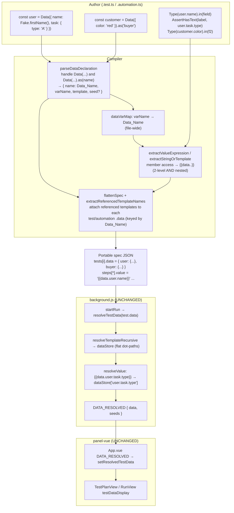

# Design Document: Inline Test Data

## Overview

Today a Tomation `Data()` template can only live in a dedicated `.data.ts` file and be imported into a test or automation file. This feature makes `Data()` declarable **inline**, at the top level of a `.test.ts` / `.automation.ts` file, so deterministic file-local data can sit next to the tests that use it. A new optional `.as(name)` chained call lets authors override the reference name.

The guiding principle is that **inline data is additive and shape-compatible**. An inline `Data()` declaration produces exactly the same compiled artifacts as an imported one: the same per-file `dataTemplates` entries, the same `{{data.<name>.<path>}}` tokens in steps, and the same `data` object attached to each test. Because the compiled JSON is identical in shape, the Runtime and the Panel need **no changes** — they already resolve `{{data...}}` tokens from the run-scoped data store and display resolved data through a single `testDataDisplay` path. This design therefore concentrates almost all work in the **Compiler** and the **DSL type definitions**, and explicitly keeps the existing shared-file (`.data.ts` + import) flow byte-identical.

Scope boundaries:

- **In scope:** inline `Data()` detection; `.as(name)` override; nested (3+ level) member-access → token resolution; file-wide data-variable tracking that carries the Data_Name; DSL `.as()` type; warning/error handling.
- **Out of scope / unchanged:** the Runtime data-resolution engine, the `DATA_RESOLVED` message, the Panel display, the context store, and the imported shared-data flow.

### Grounding in the current code

The design is anchored to the code as it exists today:

- `packages/compiler/src/parser.js`
  - `parseDataDeclaration(declarator, constBindings, filePath, warnings)` already matches `const X = Data(obj, { seed })` where the init is a `CallExpression` whose callee is the identifier `Data`. It returns `{ name, template, seed? }`. It does **not** currently handle a `.as()` chain (there the init is a `CallExpression` whose callee is a `MemberExpression`).
  - `parseDataTemplate(...)` recurses into nested object literals and handles `Fake.*` descriptors and literals.
  - A top-level `walk` collects every `const X = Data(...)` into `result.dataTemplates` (works in any file type).
  - `dataTemplateVars` is built as a `Set<string>` of names: every `result.dataTemplates[*].name` plus every import whose path ends in `.data`.
  - `extractValueExpression(...)` emits a token for a **2-level** member access on a tracked data var (`user.name → {{data.user.name}}`). Its existing **3-level** branch is only for namespaced *enum* resolution via `constBindings`, not for data vars — so nested data paths are not tokenized yet. The 2-level data branch performs **no** unknown-path validation.
  - `extractStringOrTemplate(...)` contains the same 2-level data branch for task-invocation params.
- `packages/compiler/src/flattener.js`
  - `collectDataTemplates(parsedFiles)` merges every parsed file's `dataTemplates` into one map keyed by Data_Name (and copies `seed` to `__seed`). This is why imported templates work: the `.data.ts` file is its own parsed file whose templates are merged globally.
  - `extractReferencedTemplateNames(steps)` scans `{{data.(name).path}}` tokens to decide which templates attach to each test's `testOut.data`.
- `packages/extension/src/background.js`
  - `resolveTestData` → `resolveTemplateRecursive` builds arbitrary-depth dot-path keys; `resolveValue` resolves `/\{\{data\.([^}]+)\}\}/g` against `runState.dataStore` (nested paths already supported). `resetRunState` resets `dataStore`; `startRun` emits `DATA_RESOLVED`.
- `packages/extension/panel-vue`
  - `App.vue` routes `DATA_RESOLVED` → `store.setResolvedTestData`. `TestPlanView.vue` and `RunView.vue` compute `testDataDisplay` from `resolvedTestData`, falling back to the compiled `runnable.data.data` template.
- `packages/dsl/index.d.ts`
  - `Data<T>(template, options?): DataTemplate<T> & T`.

## Architecture

### Component responsibilities

| Layer | File(s) | Responsibility for this feature | Change? |
|-------|---------|---------------------------------|---------|
| DSL | `packages/dsl/index.d.ts` | Add an optional `.as(name)` method to the `Data()` return type while preserving `& T` typed access and re-chainability. | **Yes (types only)** |
| Compiler — parse | `packages/compiler/src/parser.js` | Detect inline `Data({...})` and `Data({...}).as('name')`; derive the Data_Name; track the variable → Data_Name mapping file-wide; emit nested data tokens; warn on invalid `.as()`, unknown paths, and name conflicts. | **Yes** |
| Compiler — assemble | `packages/compiler/bin/tomation.js` | Unchanged — inline templates flow through the same per-file `dataTemplates` the CLI already assembles. (Only indirectly affected by the new warnings it already prints.) | No |
| Compiler — flatten | `packages/compiler/src/flattener.js` | Attach inline templates to tests via the existing token-driven `extractReferencedTemplateNames` path. **One additive change:** also attach `data` to automations that reference inline/shared data (today only tests get it). | **Small addition** |
| Runtime | `packages/extension/src/background.js` | Resolve inline data through the existing `resolveTestData → dataStore → DATA_RESOLVED` path. | No |
| Panel | `packages/extension/panel-vue` | Display inline data through the existing `testDataDisplay`. | No |

> **Note on the automation attachment:** `flattenSpec` currently attaches `data` only to tests, not automations. Requirement 4.1 and 7 require inline data to be available to *every test and automation* in the file and to display for automation runs. The design adds the same token-driven attachment to the automation branch. This also benefits imported shared data used by automations, which is consistent with Requirement 8 (shared flow preserved and improved, never regressed).

### Data-flow diagram



The key architectural insight the diagram shows: everything downstream of the portable JSON is unchanged. Inline and shared data converge at `parseDataDeclaration`/`dataVarMap` and produce an identical JSON contract.

## Components and Interfaces

All new/changed logic lives in the Compiler and DSL types. Signatures below show the current shape and the proposed shape.

### 1. `parseDataDeclaration` — handle `.as(name)` and derive Data_Name

**Current signature (unchanged):**
```js
function parseDataDeclaration(declarator, constBindings, filePath, warnings)
  // returns { name, template, seed? } | null
```

**Change:** detect two init shapes:

1. **Plain:** `declarator.init` is a `CallExpression` with `callee.type === 'Identifier'` and `callee.name === 'Data'` (today's path).
2. **Chained `.as(...)`:** `declarator.init` is a `CallExpression` whose `callee` is a `MemberExpression` with `property.name === 'as'`, and whose `callee.object` is the `Data(...)` `CallExpression`. The `.as` call's first argument supplies the Data_Name.

Add a helper rather than inlining the branch:

```js
/**
 * Unwrap a (possibly .as()-chained) Data() call expression.
 * @returns {{ dataCall: CallExpression, asArg: Node|null } | null}
 */
function unwrapDataCall(initNode) // null when not a Data(...) / Data(...).as(...) chain
```

Then `parseDataDeclaration` derives:

- `varName` = declarator identifier name (as today).
- `name` (Data_Name) = resolved from `.as()` when present and valid, else `varName`.

Validity of `.as()` (Req 2.4 / 11.3): the first argument must be a **non-empty string literal**. If `.as()` has no argument, a non-string/non-literal argument, or an empty string, push a warning identifying file+line and fall back to `varName`.

**Updated return shape:**
```js
{
  name: string,        // Data_Name (used as the spec key and token first segment)
  varName: string,     // the const binding name (used for member-access matching)
  template: object,
  seed?: number
}
```

`varName` is new and is needed so the token emitter can match member accesses on the *variable* while emitting the *Data_Name*. For imported shared data, `varName === name` (no `.as` in the import flow), so nothing regresses.

### 2. File-wide data-variable tracking — `dataVarMap`

**Current:** `dataTemplateVars` is a `Set<string>` of variable names, built from `result.dataTemplates[*].name` and `.data` imports.

**Change:** introduce a map from **variable name → Data_Name** so the emitter can translate the first token segment:

```js
// Built in parseSource after dataTemplates are collected.
var dataVarMap = new Map(); // varName -> Data_Name

for (const dt of result.dataTemplates) {
  dataVarMap.set(dt.varName || dt.name, dt.name);
}
for (const imp of result.imports) {
  if (imp.importPath && imp.importPath.endsWith('.data')) {
    dataVarMap.set(imp.localName, imp.localName); // imported: name === var
  }
}
```

To minimize churn and keep the "is this a data var?" checks that pepper the code, `dataVarMap` is passed where `dataTemplateVars` is passed today. `has(name)` becomes `dataVarMap.has(name)` and the emitted first segment becomes `dataVarMap.get(name)`. The threaded parameter is renamed `dataVars` through the step/value helpers (`extractValueExpression`, `extractStringOrTemplate`, `extractStep`, `extractSteps`, `extractIfStep`, `extractWhenStep`, `extractTaskInvocationParams`, `extractTest`, `extractAutomation`/automation walk).

The map also optionally carries the template structure for unknown-path validation (see §4). A richer shape is used internally:

```js
dataVars: Map<string /*varName*/, { dataName: string, template: object }>
```

### 3. Nested-path token emission — `extractValueExpression` / `extractStringOrTemplate`

**Current (2-level only):**
```js
if (dataTemplateVars && dataTemplateVars.has(node.object.name)) {
  return '{{data.' + node.object.name + '.' + node.property.name + '}}';
}
```

**Change:** generalize to walk a member-access chain of arbitrary depth whose **root object identifier** is a tracked data var, collect the trailing property path, and emit `{{data.<Data_Name>.<p1>.<p2>...}}`.

Add a helper:

```js
/**
 * If node is a (possibly nested) member access rooted at a tracked data var,
 * return { rootVar, path: ['p1','p2',...] }. Otherwise null.
 * Supports dot access and string-literal computed access (obj["p"]).
 */
function extractDataMemberPath(node, dataVars) // null when root is not a data var
```

Emission:
```js
const dm = extractDataMemberPath(node, dataVars);
if (dm) {
  const entry = dataVars.get(dm.rootVar);
  validateDataPath(entry, dm.path, filePath, lineOf(node), warnings); // §4 (warn-only)
  return '{{data.' + entry.dataName + '.' + dm.path.join('.') + '}}';
}
```

This single branch replaces the existing 2-level data branch in **both** `extractValueExpression` and `extractStringOrTemplate`. The ordering is preserved: `ctx.*` is still checked first, then data vars, then `constBindings` enum resolution, then the param fallback. The pre-existing namespaced-enum 3-level branch (`constBindings[ns][enum][key]`) is untouched and still runs before the generic data branch for const/enum objects, because its root identifier is a `constBindings` entry, not a data var.

Because the Runtime's resolver already captures the full dot path (`/\{\{data\.([^}]+)\}\}/g`), nested tokens resolve with no runtime change.

### 4. Unknown-path validation — `validateDataPath` (warn-only)

```js
/**
 * Walk entry.template along path; if any segment is missing, push a warning
 * identifying the unknown path, the Data_Name, and file:line.
 * NEVER throws and NEVER suppresses the token — the token is still emitted.
 */
function validateDataPath(entry, path, filePath, line, warnings)
```

This is the **standardized Warn_And_Skip behavior** (see the consistency note under Error Handling). The requirements-detailing phase had an inconsistency: one place described an unknown data property path as a hard compile error. **This design overrides that** and standardizes on Requirement 11's convention: *warn, keep (emit) the token, and continue compiling.* An unknown path is never fatal.

`Fake.*` descriptors are leaf values in the template, so a path that reaches a `Fake.*` node is valid at that leaf; descending *into* a `Fake.*` leaf (e.g. `user.name.first` when `name` is a `Fake.firstName()`) is an unknown path and warns.

### 5. Scope: lexical to test/automation bodies (Req 9)

Data-variable resolution must apply only inside **test and automation bodies**, not inside **task bodies**. Tasks receive concrete param values from the calling body.

Current reality: `extractTask(...)` is already called with `dataTemplateVars`. To honor Req 9 cleanly, **task extraction is called with an empty data-var map** (`new Map()`), so a bare identifier inside a task body resolves as a param reference (`{{paramName}}`), never as a data token. Test and automation extraction continue to receive the real `dataVars`.

Task **invocations** from a test/automation body still resolve their arguments against `dataVars` via `extractTaskInvocationParams`, so a call like `login({ user: user.name })` passes the concrete token `{{data.user.name}}` as the `user` param. Inside the task, `{{user}}`-style param tokens are later resolved by the runtime from the passed params. This matches Req 9.3.

### 6. Flattener — attach data to automations (additive)

`flattenSpec` gains, in its automation branch, the same token-driven attachment the test branch already has:

```js
// Mirror of the test branch, applied to each automationOut:
if (hasAnyTemplates && automationOut.steps) {
  const referenced = extractReferencedTemplateNames(automationOut.steps);
  const keys = Object.keys(referenced);
  if (keys.length > 0) {
    const data = {};
    for (const k of keys) if (allDataTemplates[k]) data[k] = allDataTemplates[k];
    if (Object.keys(data).length) automationOut.data = data;
  }
}
```

Tests keep their existing branch verbatim. Attachment is keyed by **Data_Name** (the token's first segment), which is exactly what `collectDataTemplates` keys on, so inline and shared templates attach identically.

### 7. DSL type change — optional `.as(name)`

**Current:**
```ts
export interface DataTemplate<T> {
  __data: true;
  template: T;
}
export declare function Data<T extends Record<string, any>>(
  template: T, options?: { seed?: number }
): DataTemplate<T> & T;
```

**Change:** add an optional `.as(name)` that returns the same intersection so typed property access and re-chainability are preserved:

```ts
export interface DataTemplate<T> {
  __data: true;
  template: T;
  /**
   * Override the reference name used in compiled data tokens.
   * Returns the same typed template so property access still type-checks.
   */
  as(name: string): DataTemplate<T> & T;
}

export declare function Data<T extends Record<string, any>>(
  template: T, options?: { seed?: number }
): DataTemplate<T> & T;
```

Because the return type is `DataTemplate<T> & T`, `user.name` is typed from `T`, `.as('x')` is available, and `Data({...}).as('x').color` still resolves against `T`. No change to `Fake` types.

## Data Models

### Parsed data declaration (compiler-internal)

```ts
interface ParsedDataDeclaration {
  name: string;        // Data_Name — spec key + token first segment
  varName: string;     // const binding name — matched against member-access roots
  template: DataTemplateNode;
  seed?: number;       // from Data(obj, { seed }); copied to __seed at flatten time
}
```

### Data template node (recursive — unchanged from today)

```ts
type DataTemplateNode = {
  [key: string]:
    | string | number | boolean            // static literal
    | { type: 'fake'; method: string; options: object }  // Fake.* descriptor
    | DataTemplateNode;                     // nested object
};
```

### Compiled test/automation `data` (portable JSON — unchanged shape)

```jsonc
{
  "name": "adds a todo",
  "steps": [ { "action": "type", "target": "...", "value": "{{data.user.name}}" } ],
  "data": {
    "user": {                        // keyed by Data_Name
      "__seed": 42,                  // present only when a seed was given
      "name": { "type": "fake", "method": "firstName", "options": {} },
      "task": { "type": "A" }        // nested object preserved
    },
    "buyer": { "color": "red" }      // from Data({color:'red'}).as('buyer')
  }
}
```

This is byte-identical in shape to the object produced for imported `.data.ts` data; only the *origin* of the template differs.

### Data_Token format

```
{{data.<Data_Name>.<segment>(.<segment>)*}}
```

- First segment after `data.` is the **Data_Name** (variable name by default, `.as()` override otherwise).
- Remaining segments are the member-access path, any depth ≥ 1.
- Examples: `{{data.user.name}}`, `{{data.user.task.type}}`, `{{data.buyer.color}}`.

### Seed

- Authored as `Data(template, { seed: <number> })`.
- Carried on `ParsedDataDeclaration.seed`, emitted as the template's `__seed` by `collectDataTemplates`.
- Runtime reads `__seed` (config override > `__seed` > random) in `resolveTestData` — unchanged.

### Run-scoped data store (runtime-internal — unchanged)

Flat dot-path map, e.g. `{ "user.name": "Ada", "user.task.type": "A", "buyer.color": "red" }`, built by `resolveTemplateRecursive`, reset per run, distinct from the context store.

## Correctness Properties

*A property is a characteristic or behavior that should hold true across all valid executions of a system — essentially, a formal statement about what the system should do. Properties serve as the bridge between human-readable specifications and machine-verifiable correctness guarantees.*

This feature is suited to property-based testing because the net-new logic — Data_Name derivation, data-variable → token translation (including nested paths), warning emission, and conflict resolution — is **pure compiler logic over AST/strings** with clear input/output behavior and large input spaces (identifiers, path depths, value kinds). The Runtime resolver and Panel display are unchanged, so their universal laws (5.1, 5.3, 5.4) are covered by the existing runtime property suite and are not re-stated here; the shared-data equivalence is captured by a backward-compatibility property.

### Reflection (redundancy elimination)

- Default-name (1.2, 2.1) collapse into one.
- Name-mapping / token first segment (2.3, 3.5), value-position emission (3.1, 6.1, 9.1), and nested path (3.4) combine into a single comprehensive **token round-trip** check parameterized over Data_Name, path depth, and position (value/assertion/task-param).
- Token-not-literal (3.2, 3.3) is one check (origin of the leaf — literal or `Fake.*` — does not change the fact that a token is emitted).
- File-wide attachment (4.1, 4.2, 4.3) combines into one attachment check over N tests/automations.
- `.as` validation (2.4, 11.3) are the same check.
- Backward-compat equivalence (8.1, 8.2, 8.4 compiler side) combine into one golden check.
- Resilience / continue (11.5, 11.6) combine into one.

The following is the de-duplicated set.

### Property 1: Inline Data parses into a key-faithful template

*For any* top-level declaration `const V = Data(O)` where `O` is an object literal of static literals, `Fake.*` descriptors, and nested object literals, the Compiler SHALL produce a Data_Template whose key structure mirrors `O` (every literal preserved as-is, every `Fake.*` as a `{ type:'fake', method, options }` descriptor, every nested object recursed).

**Validates: Requirements 1.1, 1.4**

### Property 2: Default Data_Name equals the variable name iff there is no valid `.as`

*For any* inline declaration `const V = Data(O)` with no `.as()` chain, the derived Data_Name SHALL equal `V`; and *for any* declaration whose `.as()` argument is not a non-empty string literal, the derived Data_Name SHALL also equal `V`.

**Validates: Requirements 1.2, 2.1, 2.4, 11.3**

### Property 3: Valid `.as(S)` overrides the Data_Name

*For any* inline declaration `const V = Data(O).as(S)` where `S` is a non-empty string literal, the derived Data_Name SHALL equal `S` (not `V`).

**Validates: Requirements 2.2**

### Property 4: Member-access tokens round-trip to `{{data.<Data_Name>.<dotpath>}}`

*For any* tracked data variable `V` with Data_Name `N`, and *for any* member-access path `p1.p2…pk` (k ≥ 1) referenced in a test or automation body — in an action value position, an assertion expected-value position, or a task-invocation argument — the Compiler SHALL emit exactly the token `{{data.N.p1.p2…pk}}`.

**Validates: Requirements 2.3, 3.1, 3.4, 3.5, 6.1, 9.1**

### Property 5: References emit a token rather than inlining the value

*For any* referenced Data_Template leaf, regardless of whether the leaf holds a static literal or a `Fake.*` descriptor, the Compiler SHALL emit a `{{data.…}}` token in place of the value and SHALL NOT inline the literal value.

**Validates: Requirements 3.2, 3.3**

### Property 6: Referenced inline templates attach to every referencing test and automation

*For any* file with a top-level inline declaration of Data_Name `N`, and *for any* set of tests and automations in that file that reference `N`, the compiled `data` of each referencing test and automation SHALL contain `N` mapped to the collected Data_Template (including `__seed` when a seed was given), and all referencing items SHALL use the same `N` as the token first segment.

**Validates: Requirements 4.1, 4.2, 4.3, 7.2, 7.3**

### Property 7: Seed is recorded iff provided

*For any* inline declaration, if a numeric `seed` option is present then the compiled template SHALL carry `__seed` equal to that number; if the option is absent the compiled template SHALL carry no `__seed`.

**Validates: Requirements 1.3, 5.4**

### Property 8: Data scope is lexical to test/automation bodies

*For any* identifier `I` that is a tracked data variable, a reference to `I` (or a member access rooted at `I`) that appears inside a **task body** SHALL NOT emit a `{{data.…}}` token (it resolves as a param reference `{{I}}` or `{{prop}}`), while the same reference inside a **test or automation body** SHALL emit a data token; and *for any* task invocation from a test/automation body whose argument is a data-var member access, the passed param value SHALL be the corresponding `{{data.N.path}}` token.

**Validates: Requirements 9.1, 9.2, 9.3**

### Property 9: Mixed inline and imported data each map to their own Data_Name

*For any* file containing both an inline declaration and an imported `.data.ts` variable with distinct Data_Names, every reference SHALL emit a token keyed to that variable's own Data_Name, and both templates SHALL attach to a test/automation that references both.

**Validates: Requirements 8.3**

### Property 10: Backward-compatible compilation for shared-only files

*For any* test/automation file that uses only imported `.data.ts` data (no inline `Data()` and no `.as()`), the compiled spec output SHALL be identical to the output produced before this feature.

**Validates: Requirements 8.1, 8.2, 8.4**

### Property 11: Unknown property path warns but still emits the token

*For any* member-access path on a tracked data variable that is not present in that variable's Data_Template, the Compiler SHALL record exactly one warning naming the unknown path, the Data_Name, and `file:line`, AND SHALL still emit the `{{data.…}}` token and continue compiling (Warn_And_Skip, never a hard error).

**Validates: Requirements 11.4**

### Property 12: Name conflicts warn and resolve deterministically without dropping output

*For any* file where two inline declarations, or an inline declaration and an imported variable, resolve to the same Data_Name, the Compiler SHALL record a conflict warning naming the Data_Name and file, SHALL still emit output for every affected test and automation, SHALL deterministically select one Data_Template for the conflicting name (stable across repeated compilations of the same input), and SHALL continue compiling the remaining tests and automations.

**Validates: Requirements 11.1, 11.2, 11.5, 11.6**

## Error Handling

### Standardized convention: Warn_And_Skip (consistency note)

Every inline-data problem follows the Compiler's established **Warn_And_Skip** convention: record a warning (to `result.warnings` / `allWarnings`, printed to stderr by the CLI), apply a best-effort resolution, emit output, and continue. No inline-data condition is fatal.

> **Explicit standardization:** The earlier requirements-detailing had an inconsistency where an unknown data property path (Req 11.4) was described in one place as a hard compile error. **This design standardizes on Warn_And_Skip per Requirement 11:** an unknown path produces a warning, the token is still emitted (so the author sees it and the runtime can still attempt resolution, logging an "Unknown data path" console warning if it is truly absent), and compilation continues. Unknown paths are never fatal.

### Warn_And_Skip table

| # | Condition | Detection point | Best-effort resolution | Output impact |
|---|-----------|-----------------|------------------------|---------------|
| E1 | `.as()` called with no argument, a non-string literal, or an empty string | `parseDataDeclaration` / `unwrapDataCall` | Fall back to the Data_Variable name as Data_Name | Decl still produced; tokens use variable name |
| E2 | Two inline declarations resolve to the same Data_Name | `parseSource` after building `dataVarMap` | Deterministically keep one definition (e.g. first by source order / declaration line); map both variables to that Data_Name | All tests/automations still emitted |
| E3 | An inline declaration and an imported `.data.ts` variable resolve to the same Data_Name | `parseSource` after merging inline + import names | Deterministic pick (documented precedence, stable per input) | All tests/automations still emitted |
| E4 | Reference to a property path not present in the Data_Template | `validateDataPath` during token emission | Keep and emit the token unchanged | Step still emitted with the token |
| E5 | Descend into a `Fake.*` leaf (e.g. `user.name.first` where `name` is `Fake.firstName()`) | `validateDataPath` | Treated as E4 (unknown path) | Token emitted |

All warnings use the existing `{ message, filePath, line }` shape and are surfaced by the CLI's existing warning printer. Messages name the specific element: the unknown path + Data_Name (E4/E5), the conflicting Data_Name (E2/E3), or the file:line of the bad `.as()` (E1).

### Non-error / unchanged paths

- Runtime "Unknown data path" `console.warn` in `resolveValue` is unchanged and remains the runtime-side signal for a token with no store entry.
- The existing `"Data file … exports no Data templates"` warning in `bin/tomation.js` is unchanged; it applies only to `.data.ts` files, not to inline declarations in test/automation files.

## Testing Strategy

### Dual approach

- **Property tests** verify the universal compiler laws above across generated inputs.
- **Unit / example tests** verify specific scenarios, edge cases, and the (unchanged) runtime/panel integration points.
- **Type tests** verify the DSL `.as()` and typed property-access guarantees (Req 10).

### Property-based tests (compiler)

- Library: a property-based testing library for the compiler's runtime (JavaScript/Node) — e.g. `fast-check`. Do not hand-roll generators/shrinking.
- Each property test runs a **minimum of 100 iterations**.
- Each test is tagged with a comment referencing its design property, format:
  `// Feature: inline-test-data, Property <number>: <property text>`
- Generators:
  - **Identifiers** for variable names and path segments (valid JS identifiers).
  - **Value kinds**: string/number/boolean literals, `Fake.*` descriptors, nested objects.
  - **Path depth** 1–4 for nested-access coverage (covers the 3+ level requirement and the existing 2-level case).
  - **Positions**: action value, assertion expected value, task-invocation argument, and task-body (negative) context.
  - **`.as` arguments**: valid non-empty string literals and the invalid set (empty string, numeric literal, identifier, missing).
  - **Mixed files**: inline + imported names, including deliberate collisions.
- Properties → tests mapping: Property 1→structural mirror; 2/3→name derivation; 4→token round-trip (parameterized by depth/position); 5→token-not-literal; 6→attachment across N items; 7→seed; 8→scope (positive in test/automation, negative in task); 9→mixed origins; 10→golden/backward-compat; 11→unknown-path warn+emit; 12→conflict determinism + output presence.
- **Property 10 (backward-compat)** uses a golden-output comparison: compile a corpus of shared-only files and assert the emitted spec equals the pre-feature baseline (e.g. the committed `examples/playground-tests` output), confirming byte-identical results.

### Unit / example tests

- `.as()` happy path on a concrete declaration; seed recorded/omitted; a `Data({color:'red'}).as('buyer')` → `{{data.buyer.color}}`.
- Nested concrete example `user.task.type → {{data.user.task.type}}`.
- Automation referencing inline data gets `data` attached (new flattener branch).
- Edge cases: empty template object; computed string-literal access `user["task"]["type"]`.

### Runtime and Panel (reuse existing; no new feature code)

- Reuse the existing `background.js` resolver tests for 5.1, 5.3, 5.4, 6.2 — unchanged, must still pass.
- Example/integration: a run of a test carrying an inline template emits `DATA_RESOLVED` with resolved values + seeds (7.1); `dataStore` populated and `contextStore` untouched (5.2); store reset between sequential runs (5.5).
- Panel: component/snapshot tests confirming inline data renders through the existing `testDataDisplay` in both `TestPlanView.vue` and `RunView.vue` (7.2, 7.3) with no new display component (7.4).

### Type tests (DSL)

- `tsd` (or equivalent) checks: `.as` present and optional on the `Data()` return (10.1); `user.name` typed from the template `T` (10.2); `Data({...}).as('x').color` type-checks (10.3).

### Explicitly unchanged

The shared-file (`.data.ts` + import) flow, the Runtime data-resolution engine, the `DATA_RESOLVED` message, the Panel display path, and the context store are unchanged. The existing suites covering them are the regression guard for Requirement 8.
