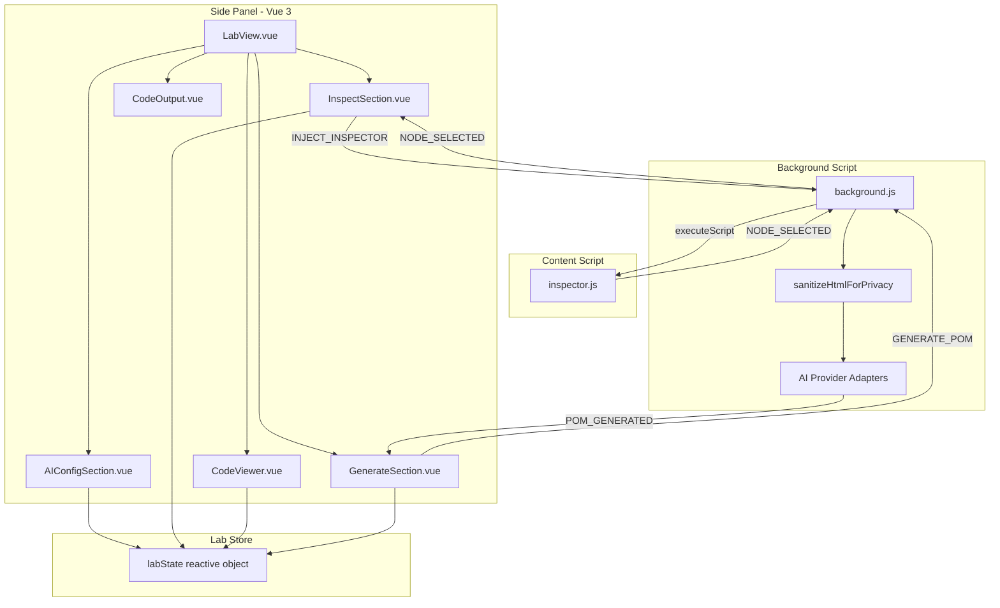

# Design Document: Lab Tab UX Redesign

## Overview

This design covers the UX redesign of the Lab tab in the Tomation browser extension side panel. The redesign reorders the panel layout so AI configuration is the first step, introduces a full HTML code viewer with editing, two context modes (Full HTML vs. Inspect Element), multi-node selection with deduplication, and a privacy label informing users about automatic data sanitization.

The changes span four layers:
1. **Vue panel components** — new layout order, new `CodeViewer` component, refactored `AIConfigSection` with collapsible state, multi-node mini-editors in `InspectSection`
2. **Lab store** — multi-node selection array, AI config collapse state, context mode semantics updated
3. **Inspector content script** — stays alive after selection (no self-cleanup on click), supports multi-select
4. **Message protocol** — `NODE_SELECTED` continues flowing without auto-deactivating inspect mode

### Key Design Decisions

| Decision | Rationale |
|----------|-----------|
| Store `selectedNodes` as an array capped at 20 | Keeps memory bounded while allowing flexible multi-select |
| Deduplicate by `outerHTML` string comparison | Simple, deterministic, and aligns with what the user sees |
| CodeViewer uses a `<textarea>` with CSS syntax highlighting overlay | Avoids heavy editor dependencies (CodeMirror/Monaco) for a panel context where bundle size matters |
| Inspector stays alive on click, only cleans up on Escape or explicit panel deactivation | Enables multi-select without repeated inject/cleanup cycles |
| Privacy label is static (not conditional) | Always visible builds trust; no logic needed to show/hide |

## Architecture



### Component Rendering Order (Top to Bottom)

1. `AIConfigSection` — collapsible, shows first
2. `InspectSection` — context mode selector + inspect button + selected nodes mini-editors
3. `CodeViewer` — editable HTML display with syntax highlighting
4. `GenerateSection` — generate button + privacy label
5. `CodeOutput` — generated POM result

## Components and Interfaces

### AIConfigSection (Modified)

**Changes:**
- Replaces `<details>` with custom collapsible using reactive `isCollapsed` state
- Collapsed view shows: provider name, model name, check icon (✓)
- Auto-collapses on load if `aiConfig.apiKey` has ≥1 non-whitespace character
- Auto-expands on load if no config or empty/whitespace-only key
- Click on summary header toggles collapse
- On save while expanded: stays expanded, shows confirmation for 2 seconds

```typescript
// New props/state in AIConfigSection
const isCollapsed = ref(false);
const saveConfirmation = ref(false);

// On mount: determine initial collapse state
onMounted(() => {
  const key = labState.aiConfig?.apiKey ?? '';
  isCollapsed.value = key.trim().length > 0;
});
```

### InspectSection (Modified)

**Changes:**
- Adds context mode radio buttons ("Generate with Full HTML" / "Select elements with Inspect Element")
- In Inspect Element mode: shows selected nodes as a list of mini-editors
- Each mini-editor: read-only code display of `outerHTML` + delete button
- Inspector toggle button only shown in Inspect Element mode
- "Clear All" button to reset the selected nodes list

```typescript
// Template structure
// <div class="inspect-section">
//   <ContextModeSelector />          — radio buttons
//   <InspectToggleButton />          — only in inspect mode
//   <SelectedNodesList>              — only in inspect mode
//     <MiniEditor v-for />           — per node
//   </SelectedNodesList>
// </div>
```

### CodeViewer (New Component)

**Purpose:** Displays the HTML content that will be sent to AI, with syntax highlighting and inline editing.

**Behavior:**
- In Full HTML mode: shows full page HTML (fetched via `GET_PAGE_HTML`)
- In Inspect Element mode: shows concatenated outerHTML of all selected nodes (joined by `\n`)
- Editable: user can modify content before generation
- When mode switches: replaces content (discards edits)
- Empty state: shows placeholder message when no content is available

```typescript
interface CodeViewerProps {
  // No props — reads from labState directly
}

// Internal state
const editorContent = ref('');  // The editable content
const isEmpty = computed(() => editorContent.value.trim().length === 0);
```

**Syntax Highlighting Strategy:**
- Use a `<textarea>` layered behind a `<pre><code>` overlay
- The overlay renders tokenized HTML with color classes
- Tokens: tags (`<tag>`), attribute names, attribute values (strings), text content
- Lightweight — no external dependency

### GenerateSection (Modified)

**Changes:**
- Remove existing context mode radio buttons (moved to InspectSection)
- Add static Privacy_Label near the generate button
- Update `generate()` to read from `labState.codeViewerContent` instead of `selectedNode.outerHTML`
- Validate: in Inspect Element mode with empty node list → show error, don't send

```typescript
// Privacy label text
const PRIVACY_TEXT = 'Email addresses, passwords, and personally identifiable information are automatically stripped from HTML before sending to the AI service.';
```

### LabView (Modified)

**Changes:** Reorder children, add CodeViewer import.

```vue
<template>
  <div class="lab-view">
    <AIConfigSection />
    <InspectSection />
    <CodeViewer />
    <GenerateSection />
    <CodeOutput />
  </div>
</template>
```

## Data Models

### Updated LabState

```typescript
export interface SelectedNodeData {
  tagName: string;
  attributes: Record<string, string>;
  outerHTML: string;
  childElementCount: number;
}

export interface AIConfig {
  provider: 'openai' | 'anthropic' | 'gemini' | 'custom';
  endpointUrl: string;
  apiKey: string;
  model: string;
}

export interface LabState {
  inspectMode: boolean;
  selectedNodes: SelectedNodeData[];         // Changed: array instead of single node
  aiConfig: AIConfig | null;
  contextMode: 'full' | 'inspect';          // Changed: 'subtree' → 'inspect'
  isGenerating: boolean;
  generatedCode: string | null;
  generatedPomName: string | null;
  error: string | null;
  copyConfirmation: boolean;
  codeViewerContent: string;                 // New: current editable content in CodeViewer
  fullPageHtml: string | null;               // New: cached full page HTML
}
```

### Updated Lab Store Actions

```typescript
// New actions
function addSelectedNode(node: SelectedNodeData): { added: boolean; reason?: string } {
  if (labState.selectedNodes.length >= 20) {
    return { added: false, reason: 'Maximum of 20 nodes reached' };
  }
  const isDuplicate = labState.selectedNodes.some(n => n.outerHTML === node.outerHTML);
  if (isDuplicate) {
    return { added: false, reason: 'duplicate' };
  }
  labState.selectedNodes.push(node);
  updateCodeViewerContent();
  return { added: true };
}

function removeSelectedNode(index: number): void {
  labState.selectedNodes.splice(index, 1);
  updateCodeViewerContent();
}

function clearSelectedNodes(): void {
  labState.selectedNodes = [];
  updateCodeViewerContent();
}

function setCodeViewerContent(content: string): void {
  labState.codeViewerContent = content;
}

function updateCodeViewerContent(): void {
  if (labState.contextMode === 'inspect') {
    labState.codeViewerContent = labState.selectedNodes
      .map(n => n.outerHTML)
      .join('\n');
  } else {
    labState.codeViewerContent = labState.fullPageHtml ?? '';
  }
}

function setFullPageHtml(html: string): void {
  labState.fullPageHtml = html;
  if (labState.contextMode === 'full') {
    labState.codeViewerContent = html;
  }
}
```

### Inspector Script Changes

The `onClick` handler no longer calls `cleanup()`. It sends `NODE_SELECTED` and continues listening:

```javascript
function onClick(e) {
  e.preventDefault();
  e.stopPropagation();

  var el = e.target;
  var attributes = {};
  for (var i = 0; i < el.attributes.length; i++) {
    var attr = el.attributes[i];
    attributes[attr.name] = attr.value;
  }

  var nodeData = {
    type: 'NODE_SELECTED',
    tagName: el.tagName,
    attributes: attributes,
    outerHTML: el.outerHTML,
    childElementCount: el.childElementCount
  };

  sendMessage(nodeData);
  // No cleanup() call — stay active for multi-select
}
```

Cleanup only happens on:
- Escape key → sends `INSPECT_CANCELLED`, calls `cleanup()`
- `REMOVE_INSPECTOR` message from panel → calls `cleanup()`

### Message Flow Changes

| Message | Direction | Change |
|---------|-----------|--------|
| `NODE_SELECTED` | inspector → background → panel | No longer triggers inspect mode deactivation in panel |
| `INJECT_INSPECTOR` | panel → background | Same as before |
| `REMOVE_INSPECTOR` | panel → background → inspector | Same as before |
| `INSPECT_CANCELLED` | inspector → background → panel | Same as before |
| `GET_PAGE_HTML` | panel → background | Same as before |
| `PAGE_HTML` | background → panel | Same as before |
| `GENERATE_POM` | panel → background | `htmlContext` now comes from `codeViewerContent` |

## Correctness Properties

*A property is a characteristic or behavior that should hold true across all valid executions of a system — essentially, a formal statement about what the system should do. Properties serve as the bridge between human-readable specifications and machine-verifiable correctness guarantees.*

### Property 1: AI Config collapse state determined by API key content

*For any* stored AI configuration, the AIConfigSection SHALL render in collapsed state if and only if the API key contains at least one non-whitespace character. Conversely, for any API key that is empty or composed entirely of whitespace characters, the section SHALL render expanded.

**Validates: Requirements 1.2, 1.3**

### Property 2: Node concatenation produces newline-separated outerHTML in selection order

*For any* non-empty list of selected nodes (1 to 20), the concatenated HTML string SHALL equal the outerHTML of each node joined by a single newline character (`\n`), preserving the original selection order.

**Validates: Requirements 2.6, 4.6, 7.1**

### Property 3: Generation always sends current Code_Viewer content

*For any* context mode and any content string currently in the Code_Viewer (including user edits), when the user triggers AI generation, the HTML payload sent to the background script SHALL be exactly the current Code_Viewer content (post-sanitization).

**Validates: Requirements 2.4, 7.2**

### Property 4: Duplicate nodes are rejected by outerHTML equality

*For any* Selected_Nodes_List and any new node whose outerHTML is identical to an existing node in the list, adding the new node SHALL leave the list unchanged (same length, same contents).

**Validates: Requirements 4.2**

### Property 5: Node deletion removes the targeted node and regenerates Code_Viewer content

*For any* Selected_Nodes_List of length N (where N ≥ 1) and any valid index i (0 ≤ i < N), removing the node at index i SHALL produce a list of length N-1 with the node at index i absent, and the Code_Viewer content SHALL equal the concatenation of the remaining nodes' outerHTML joined by newline.

**Validates: Requirements 4.5**

### Property 6: Inspector script remains active after click in multi-select mode

*For any* sequence of element clicks while in Inspect_Element_Mode, after each click the Inspector_Script SHALL: (a) have sent a `NODE_SELECTED` message, (b) still have `mousemove`, `click`, and `keydown` event listeners registered, and (c) still have the highlight overlay element present in the DOM.

**Validates: Requirements 6.1**

### Property 7: Overlay position tracks hovered element bounding rect

*For any* DOM element with a computable bounding client rect, when the mouse moves over that element during inspection, the overlay element's `top`, `left`, `width`, and `height` styles SHALL match the element's bounding rect adjusted for page scroll offset.

**Validates: Requirements 6.2**

### Property 8: Privacy sanitizer strips PII from HTML before AI submission

*For any* HTML string containing email addresses, input value attributes, or phone number patterns, after passing through `sanitizeHtmlForPrivacy`, the output SHALL not contain the original email addresses, input values, or phone number strings (they are replaced with `[redacted-email]`, `[redacted]`, or `[redacted-phone]` respectively).

**Validates: Requirements 7.3**

### Property 9: Multi-select stores up to 20 unique nodes with one Mini_Editor per node

*For any* sequence of node selections (with unique outerHTML values), the Selected_Nodes_List SHALL contain all selected nodes up to a maximum of 20, and the number of rendered Mini_Editor components SHALL equal the length of the Selected_Nodes_List.

**Validates: Requirements 4.1, 4.3**

## Error Handling

| Scenario | Handling |
|----------|----------|
| Generate triggered with empty node list in Inspect mode | Show inline error: "Please select at least one element before generating" |
| Node selection exceeds 20-node limit | Discard selection, show inline message: "Maximum of 20 nodes reached" |
| Full page HTML retrieval fails | Show error in Code_Viewer empty state: "Could not retrieve HTML from the current page" |
| AI config missing or invalid when generating | Show inline error prompting user to configure AI (same as current behavior) |
| Inspector injection fails (e.g., chrome:// page) | Show error in InspectSection (same as current behavior) |
| Privacy sanitizer receives non-string input | Return input unchanged (existing guard: `if (!html || typeof html !== 'string') return html`) |
| Duplicate node selected | Silently discard — no error shown to user (it's a no-op, not an error) |

## Testing Strategy

### Unit Tests (Example-Based)

- **AIConfigSection**: Verify collapsed/expanded rendering based on config state; verify toggle interaction; verify save confirmation timing
- **LabView**: Verify component order in rendered output
- **CodeViewer**: Verify empty state display; verify syntax highlighting token classes; verify editability
- **InspectSection**: Verify context mode radio buttons; verify mini-editor rendering with delete buttons
- **GenerateSection**: Verify privacy label presence and text; verify error display for empty node list
- **Inspector script**: Verify Escape key cleanup; verify REMOVE_INSPECTOR cleanup; verify no-op when not active

### Property-Based Tests (fast-check)

Property-based tests will use `fast-check` (already a project dependency) with Node's built-in test runner (`node --test`). Each property test runs a minimum of 100 iterations.

| Property | Test Target | Generator Strategy |
|----------|-------------|-------------------|
| P1: Collapse state | `AIConfigSection` initial state logic | `fc.string()` for API keys, `fc.stringOf(fc.constantFrom(' ', '\t', '\n'))` for whitespace-only |
| P2: Concatenation | `updateCodeViewerContent()` store action | `fc.array(fc.record({ outerHTML: fc.string() }), { minLength: 1, maxLength: 20 })` |
| P3: Generation sends viewer content | `generate()` flow | `fc.string()` for arbitrary editor content |
| P4: Deduplication | `addSelectedNode()` store action | `fc.array(nodeDataArb)` with forced duplicates |
| P5: Node deletion | `removeSelectedNode()` store action | `fc.array(nodeDataArb, { minLength: 1, maxLength: 20 })` + `fc.nat()` for index |
| P6: Inspector active after click | Inspector script `onClick` handler | `fc.array(elementArb)` for click sequences |
| P7: Overlay position | `positionOverlay()` function | `fc.record({ top, left, width, height: fc.float() })` for bounding rects |
| P8: Privacy sanitization | `sanitizeHtmlForPrivacy()` function | `fc.string()` with injected email/phone patterns |
| P9: Multi-select limit | `addSelectedNode()` repeated calls | `fc.array(nodeDataArb, { minLength: 1, maxLength: 25 })` to test beyond limit |

**Tag format:** Each test is annotated with:
```
// Feature: lab-tab-ux-redesign, Property {N}: {title}
```

**Configuration:** 100+ iterations per property (`{ numRuns: 100 }`).

### Integration Tests

- End-to-end flow: inject inspector → select 3 nodes → verify Code_Viewer shows concatenated HTML → trigger generation → verify sanitized HTML is sent
- Mode switching: switch from Inspect to Full HTML → verify page HTML is fetched and displayed → switch back → verify nodes are preserved
