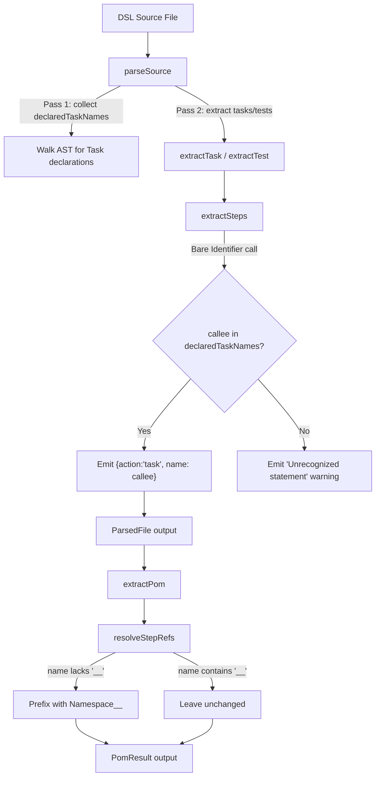

# Design Document: Local Task Invocation

## Overview

This feature enables task composition within a single POM file by allowing tasks to invoke other locally-declared tasks using bare function-call syntax (`taskName()` or `taskName({...params})`). The parser recognizes these invocations during step extraction by consulting a pre-collected set of declared task variable names. The POM extractor then applies the file's namespace prefix to produce fully-qualified task step names in the output.

The implementation is split across two existing components:
- **Parser** (`packages/compiler/src/parser.js`): Recognizes bare `Identifier(...)` call expressions as local task invocations when the callee name is in the `declaredTaskNames` set.
- **POM Extractor** (`packages/compiler/src/pom.js`): Prefixes un-namespaced task step names with the file's namespace during `resolveStepRefs`.

Both components already have the core logic implemented. This design documents the behavior, validates correctness properties, and defines the testing strategy.

## Architecture



## Components and Interfaces

### Parser: `extractStep` (default case)

The `extractStep` function's `default` switch case handles bare identifier calls:

```javascript
// In extractStep, within the Identifier callee branch:
default: {
  // Bare task invocation: taskName() / taskName({ ...params })
  if (!declaredTaskNames || !declaredTaskNames.has(fnName)) {
    return null; // triggers "Unrecognized statement" warning upstream
  }
  if (args.length === 0) {
    return { action: 'task', name: fnName };
  }
  if (args.length === 1 && args[0] && args[0].type === 'ObjectExpression') {
    const step = { action: 'task', name: fnName };
    const params = extractTaskInvocationParams(args[0]);
    if (params && Object.keys(params).length > 0) step.params = params;
    return step;
  }
  // Any other argument form (e.g., bare Identifier like login(params))
  // is not supported — fall through to null which triggers warning upstream
  return null;
}
```

**Inputs:** AST `CallExpression` node, `declaredTaskNames` Set  
**Output:** `{ action: 'task', name: string, params?: object }` or `null`

### Parser: `declaredTaskNames` collection (first pass)

Before processing task/test bodies, `parseSource` walks the AST to collect all `const X = Task(...)` and `const X = Task(...).as(...)` variable names into a `Set<string>`. This enables forward-reference recognition.

**Input:** Full AST  
**Output:** `Set<string>` of declared task variable names

### Parser: `extractTaskInvocationParams`

Extracts key-value pairs from an `ObjectExpression` argument:
- **Shorthand properties** (`{username, password}`): If the value identifier is in `trackedParams`, emits `{{variableName}}` template references.
- **Literal string values** (`{username: 'admin'}`): Preserved as-is.
- **Literal numeric values** (`{retry: 3}`): Preserved as-is.
- **Literal boolean values** (`{force: true}`): Preserved as-is.

**Input:** `ObjectExpression` AST node  
**Output:** `{ [key: string]: string | number | boolean }`

### POM Extractor: `resolveStepRefs`

Within `extractPom`, the `resolveStepRefs` function handles namespace prefixing for task steps:

```javascript
if (resolved.action === 'task' && typeof resolved.name === 'string' && !resolved.name.includes('__')) {
  if (localTaskNames[resolved.name]) {
    resolved.name = prefix + resolved.name;
  }
}
```

**Input:** Array of step objects, `localTaskNames` map, namespace `prefix`  
**Output:** Steps with resolved (namespaced) task names

## Data Models

### Task Step (parser output)

```typescript
interface TaskStep {
  action: 'task';
  name: string;          // bare identifier (e.g., 'fillCredentials')
  params?: {             // optional — only when ObjectExpression argument provided
    [key: string]: string | number | boolean;  // e.g., { username: '{{username}}', retry: 3 }
  };
}
```

### Task Step (POM extractor output)

```typescript
interface NamespacedTaskStep {
  action: 'task';
  name: string;          // namespaced (e.g., 'Login__fillCredentials')
  params?: {
    [key: string]: string | number | boolean;
  };
}
```

### Declared Task Names Set

```typescript
// Collected during first pass over AST
type DeclaredTaskNames = Set<string>;  // e.g., Set { 'login', 'fillCredentials', 'submitForm' }
```

## Correctness Properties

*A property is a characteristic or behavior that should hold true across all valid executions of a system — essentially, a formal statement about what the system should do. Properties serve as the bridge between human-readable specifications and machine-verifiable correctness guarantees.*

### Property 1: Bare call recognition is determined by Declared_Task_Names membership

*For any* valid identifier name, a bare call expression `name()` inside a task body produces a task step with `action: 'task'` if and only if `name` is in the `declaredTaskNames` set. When not in the set, no task step is emitted and a warning is produced.

**Validates: Requirements 1.1, 1.2**

### Property 2: Object literal params are preserved through parsing

*For any* ObjectExpression with properties having literal string or numeric values passed as the argument to a local task invocation, the parser SHALL emit a `params` object where each key maps to the corresponding literal value unchanged.

**Validates: Requirements 3.1, 3.2**

### Property 3: Namespace resolution prefixes local names and preserves cross-file names

*For any* task step produced by the parser, if the step's `name` does not contain `__` and matches a locally declared task, `extractPom` SHALL prefix it with `Namespace__`. If the `name` already contains `__`, it SHALL remain unchanged.

**Validates: Requirements 4.1, 4.2**

### Property 4: Forward references are recognized regardless of declaration order

*For any* pair of task declarations A and B in the same file where A invokes B, the parser SHALL recognize the invocation regardless of whether A is declared before or after B in the source.

**Validates: Requirements 6.1, 6.2**

### Property 5: Parse-then-extract pipeline is deterministic

*For any* valid source file containing local task invocations, parsing the source N times and extracting the POM N times SHALL produce identical output each time.

**Validates: Requirements 7.1, 7.2**

## Error Handling

| Condition | Behavior | Output |
|-----------|----------|--------|
| Bare call to undeclared identifier | Skip statement, emit warning | `{ message: "Unrecognized statement at {file}:{line} — skipped", ... }` |
| Local task call with bare Identifier argument (e.g., `login(params)`) | Return null from extractStep, emit warning | Same unrecognized statement warning |
| Local task call with other unsupported argument forms | Return null from extractStep, emit warning | Same unrecognized statement warning |
| Syntax error in source file | acorn parse error caught | `{ error: { message: "Parse error in ...", line } }` |
| Task step referencing a name not in localTaskNames during POM extraction | Name is left un-prefixed (no error) | Step passes through with bare name |

The design follows the existing pattern where unrecognized statements produce warnings (not fatal errors), allowing partial extraction of well-formed portions of a file.

## Testing Strategy

### Property-Based Tests (fast-check)

The feature is well-suited for property-based testing because:
- The parser is a pure function (`source string → structured output`)
- The POM extractor is a pure function (`ParsedFile → PomResult`)
- There are clear universal properties that hold across all valid identifiers and param combinations
- The input space (identifier names, param key/value combinations) is large

**Library:** `fast-check` (already used in the project — see `pom.test.js`)  
**Minimum iterations:** 100 per property  
**Tag format:** `Feature: local-task-invocation, Property {N}: {title}`

Each correctness property above maps to a single property-based test:
1. Property 1 → Generate random identifiers, toggle membership in declaredTaskNames, verify output
2. Property 2 → Generate random key-value ObjectExpression params, verify preservation
3. Property 3 → Generate task steps with/without `__`, verify prefix behavior
4. Property 4 → Generate two tasks with invocation, randomize declaration order, verify recognition
5. Property 5 → Generate valid source, parse/extract multiple times, verify equality

### Unit Tests (example-based)

Specific examples to anchor the property tests and cover interaction patterns:

- Local task invocation with no args (Requirement 1.1)
- Local task invocation with shorthand object params using template references (Requirement 2.1)
- Local task invocation with bare Identifier argument produces warning (Requirement 2.2)
- Local task invocation with inline string literals (Requirement 3.1)
- Local task invocation with inline numeric literals (Requirement 3.2)
- Test body invoking a locally declared task (Requirement 5.1)
- Test body invoking a locally declared task with params (Requirement 5.2)
- Bare call to non-task identifier produces warning (Requirement 1.2)

### Test File Location

Tests reside in `packages/compiler/src/`:
- `task-test-parser.test.js` — existing file with unit tests for task/test parsing (extend)
- `pom.test.js` — existing file with property tests for POM extraction (extend)
- New property tests can be added to either file or a dedicated `local-invocation.test.js`
