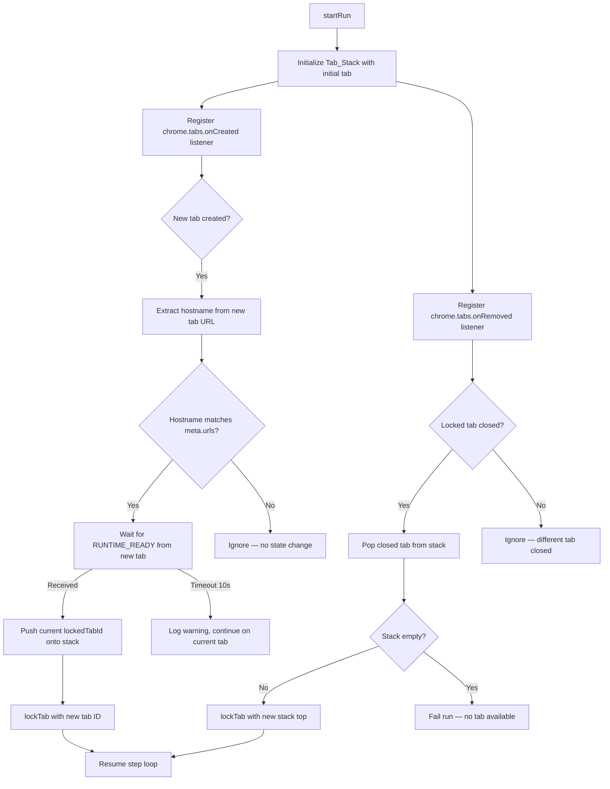

# Design Document: Multi-Tab Tracking

## Overview

Multi-tab tracking adds automatic tab-following capability to the Tomation extension's background script. When a test action (e.g., a click on a `target="_blank"` link or an OAuth redirect) opens a new browser tab whose hostname matches the test's `meta.urls` scope, the extension seamlessly switches execution to the new tab. A tab stack maintains history so that when the active tab closes, execution falls back to the previous tab.

This feature is implemented entirely within `packages/extension/src/background.js` as a Tab_Tracker module that hooks into the existing `runState` lifecycle. No DSL, compiler, or spec-file changes are needed.

## Architecture

The Tab_Tracker integrates into the existing background script execution flow:



### Integration Points

1. **`startRun()`** — After `resetRunState()`, initializes the tab stack and registers Chrome event listeners.
2. **`finishRun()`** — Tears down listeners and clears the tab stack.
3. **`runStepLoop()`** — Before dispatching each step, checks a `pendingTabSwitch` flag. If set, waits for the switch to complete before sending the next step.
4. **RUNTIME_READY handler** — Extended to detect messages from non-locked tabs during a pending tab switch and resolve the switch promise.

## Components and Interfaces

### TabTracker Module

The Tab_Tracker is a set of functions added to `background.js` that manage tab lifecycle during test execution.

#### Functions

| Function | Signature | Description |
|----------|-----------|-------------|
| `initTabTracker()` | `() → void` | Registers `onCreated` and `onRemoved` listeners. Called from `startRun()`. |
| `teardownTabTracker()` | `() → void` | Removes listeners and clears tab stack. Called from `finishRun()`. |
| `handleTabCreated(tab)` | `(chrome.tabs.Tab) → void` | Listener callback. Extracts hostname, checks match, triggers switch if applicable. |
| `handleTabRemoved(tabId)` | `(number) → void` | Listener callback. If `tabId === runState.lockedTabId`, performs fallback. |
| `extractHostname(url)` | `(string) → string` | Pure function. Returns lowercase hostname from a URL string. Returns empty string for invalid URLs. |
| `isMatchingHostname(hostname, metaUrls)` | `(string, string[]) → boolean` | Pure function. Returns true if `hostname` matches any hostname extracted from `metaUrls`. Case-insensitive. |
| `switchToTab(tabId)` | `(number) → Promise<void>` | Pushes current `lockedTabId` onto stack, calls `lockTab(tabId)`, resolves `pendingTabSwitch`. |
| `fallbackToPreviousTab()` | `() → Promise<void>` | Pops the stack. If non-empty, locks the new top. If empty, fails the run. |

#### State Additions to `runState`

```javascript
runState.tabStack = [];           // Array<number> — stack of tab IDs (top = last element)
runState.pendingTabSwitch = null; // Promise resolve function, or null
```

### Interaction with Existing Components

- **`lockTab(tabId)`** — Reused as-is. Sets `runState.lockedTabId` and activates the tab.
- **`unlockTab()`** — Reused as-is during `finishRun()`.
- **`runStepLoop()`** — Modified to await `pendingTabSwitch` promise before dispatching steps.
- **RUNTIME_READY handler in `handleMessage()`** — Extended to resolve a pending tab switch when the message comes from the expected new tab.

## Data Models

### Tab Stack

```javascript
// runState.tabStack: number[]
// Example state after two tab switches:
// Initial tab: 100, switched to 200, then to 300
// tabStack = [100, 200]
// lockedTabId = 300
```

The stack uses array push/pop semantics:
- `push(tabId)` — adds to end (top of stack)
- `pop()` — removes and returns last element (top of stack)
- `peek()` — reads last element without removing (`tabStack[tabStack.length - 1]`)

### Meta URLs Hostname Cache

During a run, hostnames are extracted from `runState.spec.meta.urls` once and cached:

```javascript
runState.metaHostnames = null; // Set<string> — lowercase hostnames from meta.urls, computed on first use
```

This avoids re-parsing URLs on every `onCreated` event.

### Pending Tab Switch State

```javascript
// When a matching tab is detected:
runState.pendingTabSwitch = {
  tabId: number,       // The tab we're waiting for
  resolve: Function,   // Resolves the step-loop wait promise
  timeoutId: number    // setTimeout handle for the 10s timeout
};
```

## Correctness Properties

*A property is a characteristic or behavior that should hold true across all valid executions of a system — essentially, a formal statement about what the system should do. Properties serve as the bridge between human-readable specifications and machine-verifiable correctness guarantees.*

### Property 1: Hostname extraction correctness

*For any* valid URL string, `extractHostname(url)` SHALL return the lowercase hostname component of that URL, and for any invalid URL string, it SHALL return an empty string.

**Validates: Requirements 1.2, 2.1**

### Property 2: Hostname matching classification

*For any* tab hostname and any array of meta URL strings, `isMatchingHostname(hostname, metaUrls)` SHALL return true if and only if the lowercase tab hostname equals at least one lowercase hostname extracted from the meta URLs array.

**Validates: Requirements 2.2, 2.3, 2.4**

### Property 3: Tab switch state update

*For any* tab switch event with a new tab ID, the Tab_Tracker SHALL push the previous `lockedTabId` onto the Tab_Stack and set `lockedTabId` to the new tab ID, such that `tabStack.length` increases by exactly one and the last element of the stack equals the previous locked tab.

**Validates: Requirements 3.2, 3.3, 5.2**

### Property 4: Stack initialization

*For any* test run started with an initial tab ID, the Tab_Stack SHALL be initialized containing exactly that tab ID as the sole entry, and `lockedTabId` SHALL equal that tab ID.

**Validates: Requirements 5.1**

### Property 5: Tab close fallback

*For any* non-empty Tab_Stack state where the locked tab is closed, the Tab_Tracker SHALL remove the closed tab from the stack and set `lockedTabId` to the new top of the stack, such that `tabStack.length` decreases by exactly one.

**Validates: Requirements 6.2, 6.3**

### Property 6: Non-matching tab invariance

*For any* newly created tab whose hostname does not match any hostname in meta URLs, the `lockedTabId`, the Tab_Stack contents, and the step execution state SHALL remain unchanged.

**Validates: Requirements 7.1, 7.2, 7.3**

## Error Handling

| Scenario | Behavior |
|----------|----------|
| Matching tab does not send RUNTIME_READY within 10s | Log warning via `console.warn`, cancel the pending switch, resume step loop on current tab. |
| Locked tab closes with empty stack | Call `finishRun()` with a failure summary (`RUN_COMPLETE` with fail count incremented). Emit a descriptive error: "Active tab closed and no fallback tab available." |
| `extractHostname` receives an invalid URL | Return empty string. This naturally results in a non-match since no meta hostname will be empty. |
| `meta.urls` is undefined or empty | `metaHostnames` set is empty. All new tabs are classified as non-matching. Tab tracking effectively becomes a no-op. |
| Tab created event fires after run ends | `handleTabCreated` checks `runState.running` first and returns immediately if false. Listener is also removed in `teardownTabTracker()`. |
| Multiple matching tabs open simultaneously | Only the first one reaching RUNTIME_READY triggers a switch. Subsequent matches are ignored while `pendingTabSwitch` is non-null. |

## Testing Strategy

### Unit Tests (example-based)

Unit tests cover specific integration scenarios and edge cases:

- **Listener lifecycle**: Verify `initTabTracker` registers listeners and `teardownTabTracker` removes them.
- **Timeout behavior**: Simulate a 10s timeout and verify execution continues on the current tab with a warning logged.
- **Empty stack failure**: Close the locked tab with an empty stack and verify the run stops with a failure summary.
- **Stack cleanup on run end**: Verify `finishRun()` clears `tabStack` and `metaHostnames`.
- **Rapid tab creation**: Create multiple matching tabs quickly, verify only one switch occurs.
- **RUNTIME_READY from wrong tab**: Verify it does not resolve a pending switch.

### Property-Based Tests

Property-based tests validate the universal correctness properties defined above using the `fast-check` library. Each property test runs a minimum of 100 iterations.

- **Property 1** — Generate random URL strings (valid and invalid), verify `extractHostname` returns correct lowercase hostname or empty string.
  - Tag: `Feature: multi-tab-tracking, Property 1: Hostname extraction correctness`
- **Property 2** — Generate random hostname/metaUrls pairs, verify `isMatchingHostname` classification matches set membership with case-insensitive comparison.
  - Tag: `Feature: multi-tab-tracking, Property 2: Hostname matching classification`
- **Property 3** — Generate random initial state (lockedTabId + tabStack), perform a `switchToTab`, verify stack grows by one and previous tab is on top.
  - Tag: `Feature: multi-tab-tracking, Property 3: Tab switch state update`
- **Property 4** — Generate random tab IDs, simulate run initialization, verify stack contains exactly the initial tab.
  - Tag: `Feature: multi-tab-tracking, Property 4: Stack initialization`
- **Property 5** — Generate random non-empty stacks, simulate tab close, verify stack shrinks and lockedTabId updates to new top.
  - Tag: `Feature: multi-tab-tracking, Property 5: Tab close fallback`
- **Property 6** — Generate non-matching hostnames and random state, simulate `handleTabCreated`, verify zero state changes.
  - Tag: `Feature: multi-tab-tracking, Property 6: Non-matching tab invariance`

### Test Configuration

- Library: `fast-check` (already compatible with the project's Node.js test setup)
- Minimum iterations: 100 per property
- Test file location: `packages/extension/src/tab-tracker.test.js`
