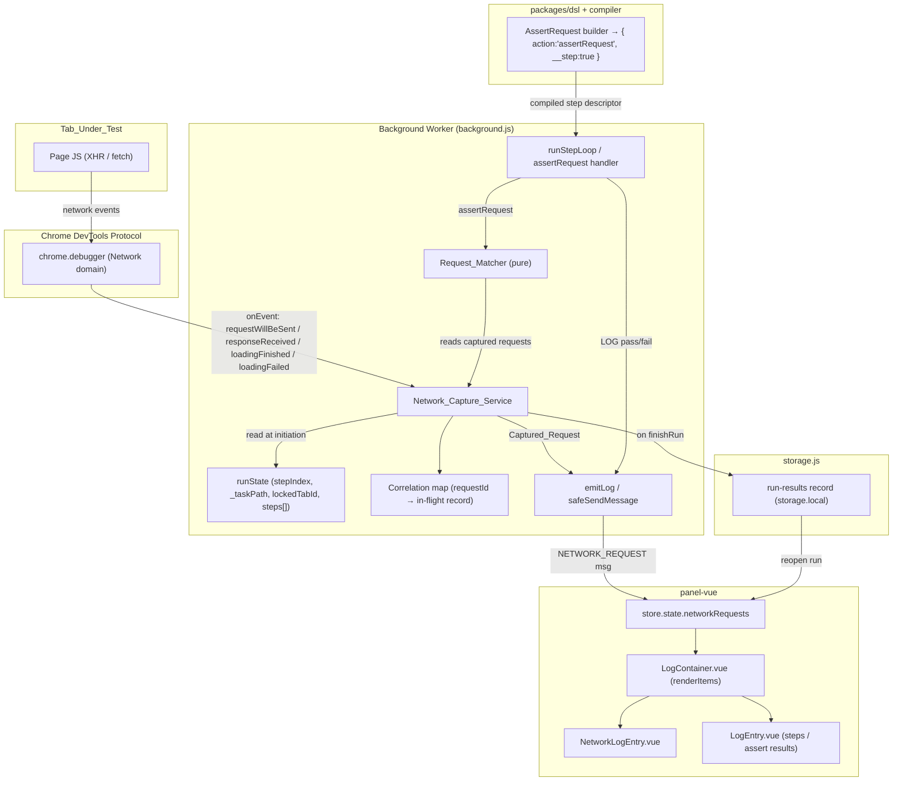

# Design Document — Network Usage Tracking

## Overview

This feature captures the XHR/fetch traffic a page under test makes during a run, attributes each
captured request to the step that was executing when the request fired, shows those requests in the
run log grouped under their step, persists them with the run results, and adds a DSL `AssertRequest`
assertion surface for validating server interactions.

Capture is performed through the Chrome DevTools Protocol (CDP) via `chrome.debugger`, attached to
the `Tab_Under_Test` for the lifetime of the run. Capture, attribution, assertion evaluation, and
persistence all live in the background service worker (`packages/extension/src/background.js`) — the
same worker that already owns `runState`, the step loop, tab locking, and message relay. The panel
(`panel-vue`) gains a `NETWORK_REQUEST` message handler, a `state.networkRequests` slice, and a new
`NetworkLogEntry.vue` component. The DSL (`packages/dsl`) gains an `AssertRequest` builder that emits
an `assertRequest` step descriptor, evaluated in the background (not the content-script runtime),
consistent with `navigate`/`wait`/`saveExpression`.

Design decisions grounded in the codebase:

- **Where capture lives.** The background worker already holds `runState.lockedTabId`,
  `runState.stepIndex`, and the flattened `runState.steps[]` (each carrying `_taskPath`). Attribution
  needs exactly those, so the `Network_Capture_Service` is a module hosted in `background.js`, next to
  `lockTab`/`finishRun`, using the existing `safeSendMessage` + `emitLog` conventions. (Req 2, 4)
- **Attribution at initiation, not completion.** CDP delivers `requestWillBeSent` and
  `responseReceived`/`loadingFinished` as separate events with a shared `requestId`. We read
  `runState.stepIndex`/`_taskPath` at `requestWillBeSent` and lock it, so a response that lands during
  a later step never reassigns the attribution. (Req 4.1)
- **Assertion evaluation in the background.** `assertRequest` is not a DOM step; like `navigate`,
  `wait`, and `saveExpression`, it is handled inside `runStepLoop` against the in-memory captured
  requests, then reported via `emitLog`. (Req 7, 8, 9)
- **Persistence built on `storage.local`.** There is no run-results store today. This design adds a
  minimal `run-results` record keyed under a dedicated storage key, written through `storage.js` on
  run completion. (Req 10)
- **Unmasked throughout.** No redaction is applied at capture, display, or persistence. The existing
  `LogEntry`/param-banner masking of `password|secret|token|key|auth` is deliberately NOT reused for
  network entries. (Req 11)

> **SECURITY NOTE (design-level).** Because capture and persistence are unmasked (Req 11), any
> secret transmitted by the page — auth tokens, cookies, API keys, passwords in URL/query/body — is
> written verbatim into the run log and into `storage.local` run-results. This is a deliberate
> full-fidelity-debugging tradeoff carried over from requirements; it is called out here so a reviewer
> can reconsider before adoption. The design honors the unmasked decision.

> **DEBUGGER BANNER (Req 3).** Attaching via `chrome.debugger` causes Chrome to show its "… is being
> debugged" banner on the `Tab_Under_Test` for the whole run. This is inherent to CDP and is not a
> defect. It appears on attach (Req 3.1) and is removed by Chrome automatically on detach (Req 3.2);
> no code beyond attach/detach is required to control it.

## Architecture

### Component diagram



### Data / control flow

1. **Attach (run start).** `startRun` / `startAutomationRun`, right after `lockTab(tabId)` resolves,
   call `NetworkCapture.attach(lockedTabId)`. It calls `chrome.debugger.attach({ tabId }, '1.3')`,
   then `chrome.debugger.sendCommand({ tabId }, 'Network.enable')`, and registers an
   `chrome.debugger.onEvent` listener. (Req 2.1)
2. **Capture (during run).** Each CDP event is filtered by `resourceType` (keep `XHR`/`Fetch`, drop
   static assets) and correlated by `requestId`. At `requestWillBeSent` the current step attribution
   is locked; at `responseReceived`/`loadingFinished` the status and body are filled in and the
   completed `Captured_Request` is emitted to the panel as a `NETWORK_REQUEST` message. (Req 1, 4)
3. **Assertion evaluation.** When `runStepLoop` reaches an `assertRequest` step, it matches against
   the captured requests held in the service and emits a pass/fail `LOG`. (Req 7-9)
4. **Detach + persist (run end).** `finishRun` (and every early-exit path) calls
   `NetworkCapture.detach()`; then the collected `Captured_Request[]` plus attribution is persisted as
   a `run-results` record through `storage.js`. (Req 2.3, 2.4, 10)
5. **Reopen.** Opening a stored run loads the `run-results` record and rehydrates
   `state.networkRequests`, so `LogContainer` re-renders the network entries grouped by step. (Req
   10.3)

## Data Models

This section is the canonical, consolidated reference for every data shape the feature introduces.
Each shape is also shown inline where it is used below (in Components and Interfaces); the definitions
here are authoritative and the inline versions match them. Shapes are given in TypeScript-ish form,
consistent with the rest of the document, with the originating requirement numbers annotated per
field.

### `CapturedRequest`

The full captured-request record. It is produced in the background worker, sent to the panel over the
`NETWORK_REQUEST` message, held in `store.state.networkRequests`, and persisted verbatim inside a
`RunResultsRecord`. Values are stored byte-for-byte with no masking (Req 11.1).

```ts
interface CapturedRequest {
  requestId: string;              // CDP requestId (correlation key)
  url: string;                    // full URL, capped at 8192 chars (Req 1.3)
  method: string;                 // HTTP method verbatim (Req 1.3)
  queryParams: Record<string, string[]>; // parsed from URL query (repeat keys → array) (Req 1.3)
  requestBody: string;            // raw request body, ≤ 1 MB (Req 1.3, 1.4)
  requestBodyTruncated: boolean;  // true if request body was capped (Req 1.4)
  status: number | null;          // 100..599, or null when pending/failed (Req 1.3, 5.8)
  responseBody: string;           // raw response body, ≤ 1 MB (Req 1.3, 1.4)
  responseBodyTruncated: boolean; // true if response body was capped (Req 1.4)
  bodyUnavailable: boolean;       // true if response body could not be read (Req 1.5)
  stepIndex: number | null;       // locked attribution; null = unattributed (Req 4.1, 4.4)
  taskPath: Array<{ name: string; label?: string; params?: unknown }> | null; // (Req 4.2, 4.5)
  initiatedAt: number;            // monotonic sequence for ordering (Req 5.7)
}
```

### Panel store additions (`panel-vue` `store/index.ts`)

The store gains a keyed slice of captured requests and a pending flag. The slice is keyed by
`String(stepIndex)` for attributed requests or the literal `'unattributed'` for requests with a `null`
step index (Req 4.4, 5.9).

```ts
// StoreState additions
networkRequests: Record<string, CapturedRequest[]>; // key: String(stepIndex) or 'unattributed' (Req 5.1, 5.7)
networkCapturePending: boolean;                      // true while attached & run in progress, no completion yet (Req 5.11)
```

### `NETWORK_REQUEST` message

The panel message the background worker emits (through `safeSendMessage`) for each completed captured
request. The `request` payload is a `CapturedRequest` exactly as defined above.

```ts
interface NetworkRequestMessage {
  type: 'NETWORK_REQUEST';
  request: CapturedRequest; // (Req 5.1)
}
```

### DSL step descriptor + matcher / expectation model

The `AssertRequest` builder emits a plain step descriptor (same `__step: true` shape the compiler
already serializes). Its `matcher` and `expectation` are structured criteria objects.

```ts
// Compiled step descriptor
interface AssertRequestStep {
  __step: true;
  action: 'assertRequest';
  matcher: RequestMatcher;         // (Req 6)
  expectation: RequestExpectation; // (Req 7, 8)
}

interface RequestMatcher {
  url?: UrlCriterion;              // (Req 6.2, 6.3)
  method?: string;                 // case-insensitive token (Req 6.4, 6.5)
  queryParams?: Record<string, string>; // subset match (Req 6.6)
  body?: BodyCriterion;            // (Req 6.7, 6.8)
  status?: StatusCriterion;        // (Req 6.9, 6.10)
}

interface UrlCriterion {
  kind: 'exact' | 'regex' | 'glob'; // (Req 6.2, 6.3)
  value?: string;   // exact
  source?: string;  // regex source
  flags?: string;   // regex flags
  pattern?: string; // glob pattern
}

interface StatusCriterion {
  kind: 'exact' | 'range'; // (Req 6.9, 6.10)
  value?: number;          // exact
  min?: number;            // range lower bound (inclusive)
  max?: number;            // range upper bound (inclusive)
}

interface BodyCriterion {
  kind: 'json' | 'form' | 'raw'; // (Req 6.7, 6.8)
  value: unknown;                // object for json/form, string for raw
}

interface RequestExpectation {
  kind: 'exists' | 'notMade' | 'count'; // (Req 7.1, 7.3, 8.1)
  count?: number;                        // required when kind === 'count' (Req 8.1)
}
```

### `RunResultsRecord` (persistence)

The run-results record persisted through `storage.js` under the `runResults` key namespace
(`runId → RunResultsRecord`). `capturedRequests` holds the full unmasked `CapturedRequest[]`,
each including its step attribution (Req 10.2).

```ts
interface RunResultsRecord {
  runId: string;                 // storage.generateUUID()
  hostname: string;
  specId: string | null;
  runnableName: string;          // test/automation name
  startedAt: string;             // ISO
  finishedAt: string;            // ISO
  summary: { total: number; passed: number; failed: number; stopped?: boolean };
  capturedRequests: CapturedRequest[]; // each includes all fields + Step_Attribution (Req 10.2)
}
```

### `networkState` (background in-memory)

The background worker's per-run capture state, reset alongside `resetRunState`. It is not persisted or
messaged; it exists only for the duration of a run to drive correlation and attribution.

```ts
interface NetworkState {
  attached: boolean;                          // whether chrome.debugger is currently attached (Req 2.1, 2.3)
  tabId: number | null;                       // the debuggee tabId (mirrors runState.lockedTabId)
  inFlight: Record<string, Partial<CapturedRequest>>; // requestId → partial correlation record (Req 4.1)
  captured: CapturedRequest[];                // completed records, in completion order (Req 5.7)
  attributionCounter: number;                 // monotonic seq to order requests by initiation (Req 5.7)
  onEventListener: ((...args: unknown[]) => void) | null;  // bound chrome.debugger.onEvent handler
  onDetachListener: ((...args: unknown[]) => void) | null; // bound chrome.debugger.onDetach handler
}
```

## Components and Interfaces

### 1. `Network_Capture_Service` (new module in `background.js`)

Hosted in the background worker in the existing ES5-ish style (function declarations, `var`,
`module.exports` test hooks). It owns the debugger attachment, the correlation map, and the array of
completed captured requests for the current run. It reads attribution from the shared `runState`.

```js
// Internal state (reset per run, alongside resetRunState)
var networkState = {
  attached: false,          // whether chrome.debugger is currently attached
  tabId: null,              // the debuggee tabId (mirrors runState.lockedTabId)
  inFlight: {},             // requestId -> partial Captured_Request (correlation map)
  captured: [],             // completed Captured_Request records, in completion order
  attributionCounter: 0,    // monotonic seq to order requests by initiation
  onEventListener: null,    // bound chrome.debugger.onEvent handler
  onDetachListener: null    // bound chrome.debugger.onDetach handler
};

// Public interface (called from startRun/startAutomationRun/runStepLoop/finishRun)
function attachNetworkCapture(tabId) { /* Req 2.1, 2.5 */ }
function detachNetworkCapture() { /* Req 2.3, 2.4, 3.2 */ }
function resetNetworkState() { /* clear inFlight/captured/counter */ }
function getCapturedRequests() { return networkState.captured.slice(); } // for assertRequest + persist
```

**Attach (Req 2.1, 2.5).**

```js
function attachNetworkCapture(tabId) {
  networkState.tabId = tabId;
  var attachTimedOut = false;
  var timer = setTimeout(function () {
    attachTimedOut = true;
    emitCaptureLog('attach-error', { tabId: tabId, reason: 'Attach timed out after 5s' }); // Req 2.5
  }, 5000);

  return new Promise(function (resolve) {
    api.debugger.attach({ tabId: tabId }, '1.3', function () {
      clearTimeout(timer);
      if (attachTimedOut) { resolve(false); return; }
      if (api.runtime.lastError) {
        // includes "Another debugger is already attached" (Req 2.5)
        emitCaptureLog('attach-error', { tabId: tabId, reason: api.runtime.lastError.message });
        resolve(false); // continue run WITHOUT capture
        return;
      }
      api.debugger.sendCommand({ tabId: tabId }, 'Network.enable', {}, function () {
        networkState.attached = true;
        registerDebuggerListeners();
        emitCaptureLog('attached', { tabId: tabId }); // banner appears now (Req 3.1)
        resolve(true);
      });
    });
  });
}
```

Attach failure is non-fatal: the run continues, just without captured requests (Req 2.5). Because
`Network.enable` persists across in-tab navigations while a single debuggee session stays attached,
requests are collected across navigations without re-attaching (Req 2.2).

**CDP event handling.** A single `onEvent` listener dispatches by method:

| CDP method | Handling |
| --- | --- |
| `Network.requestWillBeSent` | Filter by `type` (`XHR`/`Fetch` only, Req 1.2). If kept, create an in-flight record keyed by `params.requestId`, capture URL (≤8192 chars, Req 1.3), method, query params, request body (`params.request.postData`, 1 MB cap, Req 1.4), and **lock attribution** from `runState` (Req 4.1). Stamp `initiatedAt` = `attributionCounter++`. |
| `Network.responseReceived` | Look up in-flight by `requestId`; record `params.response.status` (Req 1.3). |
| `Network.loadingFinished` | Fetch body via `Network.getResponseBody`; apply 1 MB cap (Req 1.4) or unavailable indicator (Req 1.5); finalize + emit. |
| `Network.loadingFailed` | Finalize with `status = null` (failed indicator, Req 5.8), body unavailable; emit. |

`Network.requestWillBeSentExtraInfo` / `responseReceivedExtraInfo` may be used to obtain full headers
unmasked if header capture is later needed; headers are out of the required field set but the design
leaves room since Req 11 forbids masking any captured field.

**Detach (Req 2.3, 2.4, 3.2).**

```js
function detachNetworkCapture() {
  if (!networkState.attached) return Promise.resolve();
  unregisterDebuggerListeners();
  return new Promise(function (resolve) {
    api.debugger.detach({ tabId: networkState.tabId }, function () {
      // ignore lastError (tab may already be gone) — Req 2.6
      networkState.attached = false;
      resolve();
    });
  });
}
```

**External detach / tab closed (Req 2.6, 2.7).** A `chrome.debugger.onDetach` listener distinguishes
reasons:

```js
function onDebuggerDetach(source, reason) {
  if (!source || source.tabId !== networkState.tabId) return;
  networkState.attached = false;
  unregisterDebuggerListeners();
  if (reason === 'target_closed') {
    emitCaptureLog('capture-ended', { tabId: source.tabId }); // tab closed, no error (Req 2.6)
  } else {
    emitCaptureLog('detached', { tabId: source.tabId, reason: reason }); // external detach (Req 2.7)
  }
  // Run continues; requests captured before this point are retained.
}
```

**Capture-service log entries.** `emitCaptureLog(kind, info)` sends a `LOG`-shaped message the panel
renders as a distinct info row (attachment/detachment/capture-ended). These are Run_Log entries per
Req 2.5-2.7, not step rows.

### 2. Attribution (Req 4)

At `requestWillBeSent`, `resolveAttribution()` reads the shared `runState`:

```js
// Pure function (extracted for testing): given a snapshot of run state, return attribution.
function resolveAttribution(snapshot) {
  // snapshot: { stepIndex, stepsLength, executing, steps, lastExecutedIndex }
  // Returns { stepIndex: number|null, taskPath: Array|null }
  if (snapshot.executing) {
    var step = snapshot.steps[snapshot.stepIndex];
    return { stepIndex: snapshot.stepIndex, taskPath: step && step._taskPath ? step._taskPath : null }; // Req 4.1, 4.2, 4.5
  }
  if (snapshot.lastExecutedIndex >= 0) {
    var last = snapshot.steps[snapshot.lastExecutedIndex];
    return { stepIndex: snapshot.lastExecutedIndex, taskPath: last && last._taskPath ? last._taskPath : null }; // Req 4.3
  }
  return { stepIndex: null, taskPath: null }; // before first step → unattributed (Req 4.4)
}
```

- `executing` is true while a step is dispatched and not yet resolved. We track this with a
  `runState.executing` boolean (set true right before `sendStepToRuntime`/background step handlers,
  false when the step resolves) and `runState.lastExecutedIndex` (updated on each step completion).
- `taskPath` is the resolved step's existing `_taskPath` (already stamped by `expandStep`). A non-task
  step has `_taskPath === []`, so it groups under the step directly with no task path (Req 4.5).
- Attribution is **locked** into the in-flight record at initiation and copied verbatim onto the
  completed `Captured_Request`; the response handlers never recompute it (Req 4.1).

### 3. Messaging & the `Captured_Request` data model (Req 4, 5)

A `NETWORK_REQUEST` panel message, emitted through `safeSendMessage` exactly like `emitLog` emits
`LOG`:

```js
function emitNetworkRequest(rec) {
  safeSendMessage({ type: 'NETWORK_REQUEST', request: rec });
}
```

`Captured_Request` shape (TypeScript-ish; stored, messaged, and persisted identically):

```ts
interface CapturedRequest {
  requestId: string;              // CDP requestId (correlation key)
  url: string;                    // full URL, capped at 8192 chars (Req 1.3)
  method: string;                 // HTTP method verbatim (Req 1.3)
  queryParams: Record<string, string[]>; // parsed from URL query (repeat keys → array) (Req 1.3)
  requestBody: string;            // raw request body, ≤ 1 MB (Req 1.3, 1.4)
  requestBodyTruncated: boolean;  // true if request body was capped (Req 1.4)
  status: number | null;          // 100..599, or null when pending/failed (Req 1.3, 5.8)
  responseBody: string;           // raw response body, ≤ 1 MB (Req 1.3, 1.4)
  responseBodyTruncated: boolean; // true if response body was capped (Req 1.4)
  bodyUnavailable: boolean;       // true if response body could not be read (Req 1.5)
  stepIndex: number | null;       // locked attribution; null = unattributed (Req 4.1, 4.4)
  taskPath: Array<{ name: string; label?: string; params?: unknown }> | null; // (Req 4.2, 4.5)
  initiatedAt: number;            // monotonic sequence for ordering (Req 5.7)
}
```

Notes:
- `status` may be non-numeric-conceptually — we use `null` and the panel renders a "pending"/"failed"
  indicator (Req 5.8).
- Values are stored byte-for-byte; no masking anywhere (Req 11.1, 11.2).

**Store handling (panel-vue `store/index.ts`).** Add a keyed slice:

```ts
// StoreState additions
networkRequests: Record<string, CapturedRequest[]>; // key: String(stepIndex) or 'unattributed'
networkCapturePending: boolean; // true while attached & run in progress and no completion yet known
```

- `NETWORK_REQUEST` handler: `groupKey = req.stepIndex == null ? 'unattributed' : String(req.stepIndex)`;
  push into `networkRequests[groupKey]`, keeping the array sorted by `initiatedAt` (Req 5.7).
- Per-step count for step `i` = `(networkRequests[String(i)] || []).length` (Req 5.5). Zero → no entry
  and no count (Req 5.9).
- Loading placeholder: while `networkCapturePending` is true and the count for a step is not yet
  determined, the step shows a placeholder instead of a final count (Req 5.11). `networkCapturePending`
  is set true on run start (if attach succeeded) and false on `RUN_COMPLETE`/`RUN_STOPPED`.
- Reset in `startRun` alongside `logEntries = []`.

### 4. Run-log display: `NetworkLogEntry.vue` (new) + `LogContainer.vue` changes (Req 5)

**`NetworkLogEntry.vue`** — a Vue 3 `<script setup>` component, visually distinct from a step row so
it is never mistaken for a step (Req 5.2). It renders collapsed by default (Req 5.6) and expands on a
disclosure toggle (Req 5.4), reusing the local-`ref` collapse pattern already used by
`LogEntry.vue`'s find-trace disclosure.

```vue
<script setup lang="ts">
import { ref, computed } from 'vue';
import type { CapturedRequest } from '@/types/store';

const props = defineProps<{ request: CapturedRequest; dataKey?: string }>();
const expanded = ref(false); // collapsed by default (Req 5.6)

const statusDisplay = computed(() =>
  props.request.status == null ? '—' : String(props.request.status)); // pending/failed indicator (Req 5.8)
const isPendingOrFailed = computed(() => props.request.status == null);
// URL truncation is CSS-driven (ellipsis) in collapsed state; full URL shown when expanded (Req 5.10)
</script>

<template>
  <div class="network-entry" :class="{ 'is-pending': isPendingOrFailed }" :data-key="dataKey">
    <button type="button" class="net-summary" :aria-expanded="expanded" @click="expanded = !expanded">
      <font-awesome-icon :icon="['fas', 'arrow-right-arrow-left']" />   <!-- distinct network glyph -->
      <span class="net-method">{{ request.method }}</span>
      <span class="net-url" :title="request.url">{{ request.url }}</span> <!-- CSS ellipsis (Req 5.10) -->
      <span class="net-status" :class="{ pending: isPendingOrFailed }">{{ statusDisplay }}</span>
    </button>
    <div v-if="expanded" class="net-detail">
      <div class="net-url-full">{{ request.url }}</div>          <!-- full URL, unmasked (Req 5.10, 11.3) -->
      <NetworkKv label="Query" :value="request.queryParams" />
      <NetworkBody label="Request body" :body="request.requestBody" :truncated="request.requestBodyTruncated" />
      <NetworkBody label="Response body" :body="request.responseBody"
                   :truncated="request.responseBodyTruncated" :unavailable="request.bodyUnavailable" />
    </div>
  </div>
</template>
```

The `.network-entry` styling (left accent, monospace method/URL, muted background) makes it clearly
not a step (Req 5.2). Displayed values are printed character-for-character with no masking/truncation
(Req 5.3, 11.3); body truncation only reflects capture-time capping and is labeled as such.

**`LogContainer.vue` `renderItems` interleaving (Req 5.1, 5.7).** Extend the existing `RenderItem`
union with a `network-entry` type and, after pushing each `log-entry`, append its attributed network
entries in `initiatedAt` order:

```ts
interface RenderItem {
  type: 'task-header' | 'log-entry' | 'network-entry';
  key: string;
  taskHeader?: TaskHeaderInfo;
  logEntry?: LogEntry;
  network?: CapturedRequest;
  awaitingAction?: boolean;
}

// inside the loop, right after items.push({ type:'log-entry', ... }):
const group = store.state.networkRequests[String(entry.stepIndex)] || [];
for (const req of [...group].sort((a, b) => a.initiatedAt - b.initiatedAt)) {
  items.push({ type: 'network-entry', key: 'net-' + entry.stepIndex + '-' + req.requestId, network: req });
}
```

- Network entries are grouped with the attributed step and positioned right after its row (Req 5.1).
- Keying reuses the `data-key` pattern (`net-<stepIndex>-<requestId>`), consistent with
  `entry-<stepIndex>` for steps, so the container's autoscroll `querySelector('[data-key=...]')` logic
  keeps working unchanged.
- Per-step count badge (Req 5.5): a small badge on the `LogEntry` row (or an adjacent element) bound to
  `store.state.networkRequests[String(entry.stepIndex)]?.length`. A loading placeholder is shown while
  `store.state.networkCapturePending` is true and no count is determined yet (Req 5.11).
- Unattributed requests (`stepIndex === null`) are grouped under the `'unattributed'` key and NOT
  attached to any step; per Req 5.9 no step shows a count for them. (They may render in a dedicated
  "Unattributed" section; requirements only forbid attaching them to a step.)

### 5. DSL `AssertRequest` surface (Req 6, 7, 8)

A fluent builder in `packages/dsl/index.js`, matching the existing builder style (returns a plain
descriptor with `__step: true`, chainable methods return `this`). It produces:

```js
// Step descriptor shape
{ __step: true, action: 'assertRequest', matcher: { /* criteria */ }, expectation: { /* kind */ } }
```

```js
function AssertRequest(url) {
  var matcher = {};
  if (url !== undefined && url !== null) {
    // plain string → exact; RegExp → pattern; { glob: '...' } → glob (Req 6.2, 6.3)
    if (url instanceof RegExp) matcher.url = { kind: 'regex', source: url.source, flags: url.flags };
    else if (url && typeof url === 'object' && url.glob) matcher.url = { kind: 'glob', pattern: url.glob };
    else matcher.url = { kind: 'exact', value: String(url) };
  }
  var expectation = { kind: 'exists' }; // default: at least one match (Req 7.1)

  var builder = {
    __step: true,
    action: 'assertRequest',
    matcher: matcher,
    expectation: expectation,
    method: function (m) { matcher.method = m; return builder; },        // case-insensitive (Req 6.4)
    query: function (obj) { matcher.queryParams = obj; return builder; }, // subset (Req 6.6)
    jsonBody: function (obj) { matcher.body = { kind: 'json', value: obj }; return builder; },   // Req 6.7
    formBody: function (obj) { matcher.body = { kind: 'form', value: obj }; return builder; },   // Req 6.7
    rawBody: function (str) { matcher.body = { kind: 'raw', value: String(str) }; return builder; }, // Req 6.7
    status: function (s) {                                                // int or range (Req 6.9, 6.10)
      if (typeof s === 'string' && /^[1-5]xx$/i.test(s)) {
        var lo = parseInt(s[0], 10) * 100; matcher.status = { kind: 'range', min: lo, max: lo + 99 };
      } else if (s && typeof s === 'object' && s.min != null) {
        matcher.status = { kind: 'range', min: s.min, max: s.max };
      } else {
        matcher.status = { kind: 'exact', value: s };
      }
      return builder;
    },
    notMade: function () { expectation.kind = 'notMade'; return builder; }, // Req 7.3
    times: function (n) { expectation.kind = 'count'; expectation.count = n; return builder; } // Req 8.1
  };
  return builder;
}
```

Concrete authoring examples (tomation DSL style):

```js
AssertRequest('https://api.example.com/orders').method('POST').status(200)   // exists + AND criteria
AssertRequest(/\/orders\/\d+$/).method('GET').status('2xx')                    // regex URL + status range
AssertRequest({ glob: '*/orders*' }).query({ page: '2' })                      // glob URL + query subset
AssertRequest('https://api.example.com/orders').jsonBody({ status: 'paid' })   // JSON subset body
AssertRequest('https://api.example.com/track').notMade()                       // assert NOT made (Req 7.3)
AssertRequest('https://api.example.com/retry').times(2)                        // exact count (Req 8.1)
```

**`index.d.ts` additions:**

```ts
// Step union gains:
//   | { action: "assertRequest"; matcher: RequestMatcher; expectation: RequestExpectation }

export interface UrlCriterion {
  kind: 'exact' | 'regex' | 'glob';
  value?: string; source?: string; flags?: string; pattern?: string;
}
export interface StatusCriterion {
  kind: 'exact' | 'range'; value?: number; min?: number; max?: number;
}
export interface BodyCriterion {
  kind: 'json' | 'form' | 'raw'; value: unknown;
}
export interface RequestMatcher {
  url?: UrlCriterion;
  method?: string;
  queryParams?: Record<string, string>;
  body?: BodyCriterion;
  status?: StatusCriterion;
}
export interface RequestExpectation {
  kind: 'exists' | 'notMade' | 'count';
  count?: number;
}
export interface AssertRequestBuilder {
  __step: true;
  action: 'assertRequest';
  matcher: RequestMatcher;
  expectation: RequestExpectation;
  method(m: string): AssertRequestBuilder;
  query(pairs: Record<string, string>): AssertRequestBuilder;
  jsonBody(obj: unknown): AssertRequestBuilder;
  formBody(pairs: Record<string, string>): AssertRequestBuilder;
  rawBody(raw: string): AssertRequestBuilder;
  status(s: number | string | { min: number; max: number }): AssertRequestBuilder;
  notMade(): AssertRequestBuilder;
  times(n: number): AssertRequestBuilder;
}
export declare function AssertRequest(url?: string | RegExp | { glob: string }): AssertRequestBuilder;
```

The compiler (`packages/compiler`) already serializes `{ __step: true, action, ... }` descriptors
into the spec JSON `steps[]`; because `AssertRequest` produces the same shape (with `matcher`/
`expectation` plain-object fields), the expectation is that no new compiler node type is required —
the emitter passes the extra fields through, and `flattenSteps`/`expandStep` treat it like any
non-task step (its `_taskPath` is stamped normally).

> **⚠ IMPLEMENTATION VERIFICATION — compiler pass-through.** The compiler internals were not read
> while authoring this design. Before/while implementing, verify that the compiler's parser and
> emitter carry the new `action: 'assertRequest'` plus the nested `matcher` / `expectation` objects
> through to the JSON spec `steps[]` **without dropping or flattening unknown fields**. If the emitter
> whitelists known fields per action, it must be extended to preserve `matcher`/`expectation`. Add a
> compiler round-trip test (DSL module → compiled spec → `steps[]` contains the intact descriptor) as
> part of the implementation. Treat this as an area to confirm, not a settled fact.

### 6. `assertRequest` runtime evaluation (Req 7, 8, 9)

Handled in `runStepLoop`, in the same "background-handled, not sent to runtime" family as `navigate`/
`wait`/`saveExpression`:

```js
if (step.action === 'assertRequest') {
  safeSendMessage({ type: 'STEP_STARTING', stepIndex: currentIndex, action: 'assertRequest' });
  var result = evaluateAssertRequest(step, getCapturedRequests()); // pure over captured set
  // result: { ok: boolean, matchCount: number, message?: string }
  if (result.ok) {
    runState.passCount++;
    emitLog(currentIndex, step, true);          // passed status (Req 9.1)
    runState.stepIndex++;
    return runStepLoop();
  } else {
    runState.failCount++;
    emitLog(currentIndex, step, false, result.message); // failed + reason (Req 9.2, 9.3)
    // halt on failure (existing v1 behavior unless retry/skip configured)
    teardownTabTracker(); detachNetworkCapture(); unlockTab();
    runState.running = false;
    emitSummary('RUN_COMPLETE', currentIndex + 1, runState.passCount, runState.failCount);
    return;
  }
}
```

**`Request_Matcher` (pure, testable).**

```js
// requestMatches(matcher, req) -> boolean  (logical AND over present criteria, Req 6.11)
function requestMatches(matcher, req) {
  if (matcher.url && !urlMatches(matcher.url, req.url)) return false;               // Req 6.2, 6.3
  if (matcher.method && !methodMatches(matcher.method, req.method)) return false;   // Req 6.4
  if (matcher.queryParams && !querySubsetMatches(matcher.queryParams, req.queryParams)) return false; // Req 6.6
  if (matcher.body && !bodyMatches(matcher.body, req.requestBody)) return false;    // Req 6.7, 6.8
  if (matcher.status && !statusMatches(matcher.status, req.status)) return false;   // Req 6.9, 6.10
  return true;
}
```

- `urlMatches`: `exact` → strict `===` (Req 6.2); `regex` → `new RegExp(source, flags).test(url)`
  (unanchored unless the pattern anchors, Req 6.3); `glob` → compile glob to regex.
- `methodMatches`: compare uppercased tokens (Req 6.4). An empty/invalid method **criterion** is
  detected before matching and fails the step (Req 6.5) — see below.
- `querySubsetMatches`: every supplied `key=value` present in `req.queryParams` with equal value;
  extra params ignored; case-sensitive value comparison (Req 6.6).
- `bodyMatches`: `json` → `JSON.parse(req.requestBody)`, structural subset; parse failure → no match
  (Req 6.8). `form` → parse `application/x-www-form-urlencoded`, subset match; parse failure → no
  match. `raw` → exact `===` (Req 6.7).
- `statusMatches`: `exact` → `===`; `range` → `min <= status <= max` (Req 6.9, 6.10). A `null` status
  never matches a numeric/range criterion.

**Invalid method criterion (Req 6.5).** `evaluateAssertRequest` first validates the matcher: if
`matcher.method` is present and not a non-empty token (`/^[A-Za-z]+$/`), it returns
`{ ok: false, matchCount: 0, message: 'Invalid HTTP method: "<m>"' }` without matching any request.
Failing the step suffices per Req 6.5.

**Expectation evaluation (Req 7, 8).**

```js
function evaluateAssertRequest(step, captured) {
  var invalid = validateMatcher(step.matcher);
  if (invalid) return { ok: false, matchCount: 0, message: invalid }; // Req 6.5

  var matches = captured.filter(function (r) { return requestMatches(step.matcher, r); });
  var n = matches.length;
  var exp = step.expectation || { kind: 'exists' };

  if (exp.kind === 'notMade') {                     // Req 7.3, 7.4, 7.5
    return { ok: n === 0, matchCount: n, message: n === 0 ? undefined : failMsg(step, n) };
  }
  if (exp.kind === 'count') {                        // Req 8.1, 8.2, 8.3
    return { ok: n === exp.count, matchCount: n, message: n === exp.count ? undefined : failMsg(step, n, exp.count) };
  }
  return { ok: n >= 1, matchCount: n, message: n >= 1 ? undefined : failMsg(step, n) }; // exists (Req 7.1, 7.2)
}
```

**Failure message (Req 9.3).** `failMsg` states the matcher criteria and the observed match count,
e.g. `AssertRequest failed: expected ≥1 request matching { method: POST, url: .../orders, status: 200 }, observed 0`.

**Halt on log-display failure (Req 9.4).** `emitLog` uses `safeSendMessage`, which swallows panel
transport errors. To honor Req 9.4, the `assertRequest` path uses a display-confirming variant: if
sending the outcome throws synchronously (extension context invalidated / panel channel gone), the
loop halts the run instead of advancing:

```js
function emitAssertOutcomeOrHalt(currentIndex, step, ok, message) {
  try {
    emitLogStrict(currentIndex, step, ok, message); // throws if the runtime.sendMessage call throws
    return true;
  } catch (e) {
    // Run_Log display unavailable → halt execution (Req 9.4)
    detachNetworkCapture(); teardownTabTracker(); unlockTab();
    runState.running = false;
    return false;
  }
}
```

### 7. Persistence: `run-results` record (Req 10)

There is no run-results store today — this is a **brand-new persistence surface**, not an extension of
the existing per-hostname project model. This design adds a minimal, self-contained record persisted
through `storage.js`.

> **⚠ IMPLEMENTATION VERIFICATION — new run-results store.** The existing `storage.js` only persists
> the per-hostname project object (`{ host, name, specs, savedParams, instances, favourites }`) and a
> few discrete keys (`home_active_tab`, `config:<...>`); there is no run-results concept anywhere in
> storage, the panel, or the background worker. Everything in this section (`saveRunResults`,
> `getRunResults`, the `runResults` top-level key namespace, the reopen/rehydrate path, and the panel
> UI to browse stored runs) is new and must be built from scratch. Confirm during implementation that
> a `runResults` key does not collide with existing keys and that `getAllProjects()` /
> `exportAll()` (which read `api.storage.local.get(null)`) either intentionally include or explicitly
> exclude `runResults` — decide and encode that behavior rather than inheriting it by accident.

**Storage key.** A single top-level key namespace `runResults` maps `runId → RunResultsRecord`.
Keeping it out of the per-hostname project object avoids bloating the project blob and matches how
`storage.js` already uses discrete top-level keys (e.g. `home_active_tab`, `config:<...>`).

```ts
interface RunResultsRecord {
  runId: string;                 // storage.generateUUID()
  hostname: string;
  specId: string | null;
  runnableName: string;          // test/automation name
  startedAt: string;             // ISO
  finishedAt: string;            // ISO
  summary: { total: number; passed: number; failed: number; stopped?: boolean };
  capturedRequests: CapturedRequest[]; // each includes all fields + Step_Attribution (Req 10.2)
}
```

`storage.js` additions:

```js
function saveRunResults(record) {                       // Req 10.1
  return api.storage.local.get('runResults').then(function (res) {
    var all = res.runResults || {};
    all[record.runId] = record;
    var data = { runResults: all };
    return api.storage.local.set(data); // rejection propagates (NOT swallowed) — see Req 10.4
  });
}
function getRunResults(runId) {                          // Req 10.3
  return api.storage.local.get('runResults').then(function (res) {
    return (res.runResults || {})[runId] || null;
  });
}
```

**Write timing + failure = fail the whole run (Req 10.4).** `finishRun` builds the record from
`getCapturedRequests()` (values byte-for-byte, unmasked — Req 10.2, 11.4) and awaits
`saveRunResults`. Unlike the fire-and-forget `saveTestPlanConfig`/`saveParamValues` helpers (which
`.catch` and swallow), `saveRunResults` deliberately lets rejection propagate; `finishRun` catches it
and reports the run as **failed**:

```js
function finishRun() {
  teardownTabTracker();
  detachNetworkCapture();          // Req 2.3, 2.4, 3.2
  unlockTab();
  runState.running = false;
  var record = buildRunResultsRecord();
  return saveRunResults(record).then(function () {
    emitRunSummaryNormally();      // Req 10.1
  }).catch(function (err) {
    emitSummary('RUN_COMPLETE', runState.stepIndex, runState.passCount, runState.failCount + 1);
    safeSendMessage({ type: 'RUN_PERSIST_FAILED', error: err && err.message }); // whole run fails (Req 10.4)
  });
}
```

**Reopen (Req 10.3).** Opening a stored run loads the record via `getRunResults(runId)` and dispatches
each `CapturedRequest` into `state.networkRequests` (same grouping as live capture), so
`LogContainer` re-renders them grouped by their attributed step. Restored values are byte-for-byte
identical to capture (Req 11.4).

## Correctness Properties

_A property is a characteristic or behavior that should hold true across all valid executions of a
system — essentially, a formal statement about what the system should do. Properties serve as the
bridge between human-readable specifications and machine-verifiable correctness guarantees._

These properties target the pure, extractable functions (`shouldCapture`, `capBody`,
`resolveAttribution`, `requestMatches` and its sub-matchers, `statusDisplay`, count/expectation
evaluation, and the storage round-trip). Each is implementable as a single property-based test.

### Property 1: Capture scope excludes static assets

_For all_ CDP `resourceType` strings, `shouldCapture(type)` returns `true` if and only if `type` is
`"XHR"` or `"Fetch"`, and `false` for `Image`, `Script`, `Stylesheet`, `Font`, `Media`, and any other
value — so no `Captured_Request` is ever produced for an excluded resource type.

**Validates: Requirements 1.2**

### Property 2: URL length bound

_For all_ request URLs, the `Captured_Request.url` stored by `buildCapturedRequest` has length at most
8192 characters and equals the leading prefix of the original URL.

**Validates: Requirements 1.3**

### Property 3: Body cap and truncation flag

_For all_ body strings `b`, `capBody(b)` returns a value of byte length at most 1,048,576 whose bytes
equal the first 1,048,576 bytes of `b`, and its `truncated` flag is `true` if and only if the byte
length of `b` exceeds 1,048,576.

**Validates: Requirements 1.4**

### Property 4: Attribution is locked at initiation regardless of response timing

_For all_ interleavings of step transitions and request initiation/completion events, the
`stepIndex` and `taskPath` on each completed `Captured_Request` equal the attribution computed at the
moment the request was initiated, and are never changed by a response that arrives while a different
step is executing.

**Validates: Requirements 4.1**

### Property 5: Attribution resolver correctness

_For all_ run-state snapshots, `resolveAttribution(snapshot)` returns: the executing step's index and
its `_taskPath` when a step is executing (a `null` task path when that step's `_taskPath` is empty);
the most recently executed step's index when no step is executing but at least one has executed; and a
`null` step index when no step has executed yet.

**Validates: Requirements 4.2, 4.3, 4.4, 4.5**

### Property 6: URL criterion matching

_For all_ URLs and URL criteria, `urlMatches` returns `true` for an `exact` criterion if and only if
the URL is character-for-character equal to the criterion value, and for a `regex`/`glob` criterion if
and only if the compiled pattern tests true against the URL.

**Validates: Requirements 6.2, 6.3**

### Property 7: Method matching is case-insensitive

_For all_ pairs of non-empty method tokens, `methodMatches(a, b)` returns `true` if and only if the
uppercased forms of `a` and `b` are equal.

**Validates: Requirements 6.4**

### Property 8: Query parameter subset matching

_For all_ captured query maps `Q` and supplied criteria `S`, `querySubsetMatches(S, Q)` returns `true`
if and only if every key in `S` is present in `Q` with a character-for-character equal value;
additional keys present only in `Q` never affect the result.

**Validates: Requirements 6.6**

### Property 9: Request body subset / exact matching

_For all_ bodies, `bodyMatches` returns `true` for a `json` criterion if and only if the supplied
object is a structural subset of the parsed request-body JSON; for a `form` criterion if and only if
the supplied pairs are a subset of the parsed form fields; and for a `raw` criterion if and only if
the supplied value equals the raw body exactly. If the body cannot be parsed as the criterion's type,
`bodyMatches` returns `false`.

**Validates: Requirements 6.7, 6.8**

### Property 10: Status matching (exact and range)

_For all_ status values and status criteria, `statusMatches` returns `true` for an `exact` criterion
if and only if the status equals the criterion value, and for a `range` criterion if and only if the
status is within `[min, max]` inclusive; a `null` status never matches a numeric or range criterion.

**Validates: Requirements 6.9, 6.10**

### Property 11: AND-composition of matcher criteria

_For all_ captured requests and matchers, `requestMatches(matcher, req)` returns `true` if and only if
every individually specified criterion (url, method, query, body, status) matches the request.

**Validates: Requirements 6.11**

### Property 12: Existence assertion correctness

_For all_ captured request sets and matchers, an `exists` `AssertRequest` passes if and only if at
least one captured request satisfies the matcher.

**Validates: Requirements 7.1, 7.2**

### Property 13: Not-made assertion correctness

_For all_ captured request sets and matchers, a `notMade` `AssertRequest` passes if and only if no
captured request satisfies the matcher.

**Validates: Requirements 7.4, 7.5**

### Property 14: Count assertion correctness

_For all_ captured request sets, matchers, and expected counts `n`, a `count` `AssertRequest` passes if
and only if exactly `n` captured requests satisfy the matcher.

**Validates: Requirements 8.2, 8.3**

### Property 15: Failure message reports criteria and observed count

_For all_ failing `AssertRequest` evaluations, the produced failure message includes the observed
number of matching captured requests and each specified matcher criterion.

**Validates: Requirements 9.3**

### Property 16: Status display indicator

_For all_ captured requests, `statusDisplay(req.status)` equals the string form of the status when the
status is a number in 100..599, and is a non-numeric pending/failed indicator when the status is
`null`.

**Validates: Requirements 5.8**

### Property 17: Per-step count derivation

_For all_ groupings of captured requests by attributed step, the count shown for a step equals the
number of captured requests attributed to that step, and is absent when that number is zero.

**Validates: Requirements 5.5, 5.9**

### Property 18: Ordering by initiation time

_For all_ sets of captured requests attributed to the same step, the rendered network entries appear
in non-decreasing order of `initiatedAt`.

**Validates: Requirements 5.7**

### Property 19: Unmasked storage

_For all_ captured values (including values that contain token-, key-, password-, or cookie-like
substrings), the stored `Captured_Request` value is byte-for-byte equal to the value as transmitted,
with no masking, redaction, substitution, or added placeholder sequence — except a body longer than 1
MB, which is stored as its exact first 1 MB with a truncation flag.

**Validates: Requirements 11.1, 11.2**

### Property 20: Unmasked display of full values

_For all_ captured values, the expanded `NetworkLogEntry` display text (including the full URL) equals
the stored value character-for-character, with no masking or truncation.

**Validates: Requirements 5.10, 11.3**

### Property 21: Persistence round-trip

_For all_ `Captured_Request` records, saving a run-results record and then reloading it yields captured
values byte-for-byte identical to the originally captured values, and the reloaded records regroup
under the same attributed steps.

**Validates: Requirements 10.3, 11.4**

## Error Handling

| Condition | Requirement | Handling |
| --- | --- | --- |
| Attach fails within 5s (incl. another debugger already attached) | 2.5 | 5s timeout + `chrome.runtime.lastError` check in `attachNetworkCapture`; emit `attach-error` Run_Log entry naming the tab and reason; resolve `false`; run continues without capture. |
| Tab closed while attached | 2.6 | `chrome.debugger.onDetach` with `reason === 'target_closed'`; mark detached, emit `capture-ended` (no error), retain requests captured before closure, continue run. |
| External detach (other client / browser) | 2.7 | `onDetach` with any other reason; emit `detached` entry naming the reason, retain prior requests, continue run. |
| `Network.getResponseBody` fails or empty | 1.5 | Finalize the `Captured_Request` with empty `responseBody`, `bodyUnavailable = true`, all other fields intact. |
| `loadingFailed` before response | 5.8 | Finalize with `status = null`; panel renders a pending/failed indicator. |
| Oversized request/response body | 1.4 | `capBody` stores first 1 MB, sets the matching `*Truncated` flag. |
| Invalid/empty method criterion in `AssertRequest` | 6.5 | `validateMatcher` returns a reason; `evaluateAssertRequest` fails the step with no request matched. |
| No request satisfies all criteria (exists) | 6.12, 7.2, 9.2, 9.3 | Fail the step; failure message lists criteria and observed count (0). |
| Persistence write fails | 10.4 | `saveRunResults` rejection propagates; `finishRun` marks the whole run failed and emits `RUN_PERSIST_FAILED`. |
| Run_Log display unavailable when reporting an assert outcome | 9.4 | `emitAssertOutcomeOrHalt` catches a synchronous send failure and halts execution (detach, teardown, unlock). |
| Detach on any early-exit (stop/fail/interrupt/navigation timeout) | 2.4 | Every halt path calls `detachNetworkCapture()` alongside `teardownTabTracker()`/`unlockTab()`. |

## Testing Strategy

The repository uses Node's built-in test runner (`node:test`) with existing PBT-style suites
(`background.property.test.js`, `runtime.property.test.js`, `storage.property.test.js`). New pure
modules are unit- and property-testable in Node without a browser, following the existing
`module.exports` test-hook convention. Per project rules, the model does not run the tests; the author
runs them manually.

**Dual approach.**

- **Property tests** (min. 100 iterations each) cover the pure functions: `shouldCapture` (P1),
  `capBody` / URL cap (P2, P3), `resolveAttribution` and the attribution-timing invariant (P4, P5),
  the `Request_Matcher` family — `urlMatches`, `methodMatches`, `querySubsetMatches`, `bodyMatches`,
  `statusMatches`, `requestMatches` (P6-P11), expectation evaluation (P12-P14), `statusDisplay` (P16),
  grouping/count/ordering derivations (P17, P18), unmasked storage/display (P19, P20), and the
  storage round-trip (P21). Each property test is tagged with a comment of the form
  **Feature: network-usage-tracking, Property N: {property text}** and references its design property.
  Pick an established property-based testing library for JS (do not hand-roll generators).
- **Unit / example tests** cover the CDP event branches and lifecycle interactions that are not pure:
  attach success/failure and `Network.enable` (2.1, 2.5), detach on complete and early-exit paths
  (2.3, 2.4), `onDetach` tab-closed vs. external (2.6, 2.7), body-unavailable finalization (1.5),
  invalid-method-criterion failure (6.5), builder API presence for `notMade`/`times` (7.3, 8.1),
  assert pass/fail LOG emission (9.1, 9.2), log-display-failure halt (9.4), persistence invocation and
  failure→run-fail (10.1, 10.4), and reopen-regrouping (10.3). Chrome APIs (`chrome.debugger.*`,
  `chrome.storage.local`) are mocked, matching how `background`/`storage` tests already stub `api`.
- **Component tests** (Vue) for `NetworkLogEntry.vue` cover collapsed-by-default (5.6), distinct
  markup vs. a step (5.2), expand revealing query/request/response bodies (5.4), the pending/failed
  indicator (5.8), and full-URL-when-expanded (5.10); and for `LogContainer.vue` the interleaving that
  positions network entries after their step (5.1) and the loading placeholder (5.11).
- **Integration/smoke** (1-3 examples, not PBT): capture-within-500ms and capture-across-navigation
  against a real/mocked tab (1.1, 2.2), and the debugger-banner behavior documented as an inherent,
  manually observed side effect (3.1, 3.2).

**Pure functions to extract for testability:** `shouldCapture(resourceType)`, `capBody(body)`,
`buildCapturedRequest(cdpParams, attribution, seq)`, `resolveAttribution(snapshot)`,
`urlMatches`, `methodMatches`, `querySubsetMatches`, `bodyMatches`, `statusMatches`, `requestMatches`,
`validateMatcher`, `evaluateAssertRequest`, `statusDisplay`, and the grouping/ordering helper for
`renderItems`. Each is exported via the existing `module.exports` test hooks (background.js) or as
plain functions in the panel `logic/` folder.

