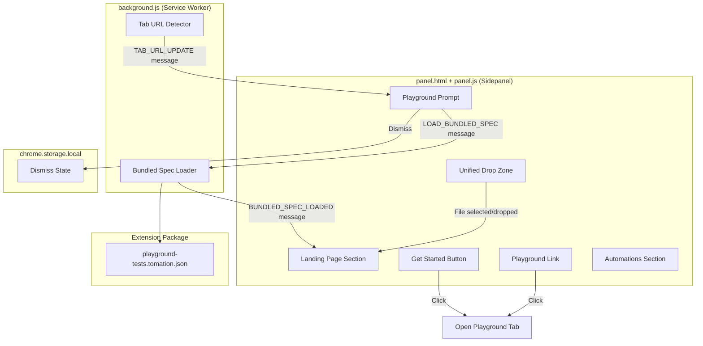

# Design Document: Onboarding Landing Page

## Overview

This feature replaces the existing `#home-landing` section in `panel.html` with a comprehensive onboarding experience optimized for first-time users. The redesign consolidates the separate "Load Spec" button and drop zone into a single unified drop-zone component, adds a welcome heading, a "Get Started" call-to-action, a playground link, an automations guidance section, and introduces auto-detection of the playground URL to offer a bundled spec.

The implementation touches four files:
- `panel.html` — markup restructuring of the `#home-landing` section
- `panel.html <style>` — new CSS rules for onboarding components
- `panel.js` — unified drop zone logic, playground link/button handlers, playground prompt UI, automations section visibility
- `background.js` — playground URL detection, bundled spec loading, message passing for auto-detection

The feature ships a pre-compiled `playground-tests.tomation.json` file inside the extension package so it can be offered to users visiting the playground without file system access.

## Architecture



### Data Flow: Tab URL Detection and Prompting

1. **Tab activation/update** — `background.js` already listens to `tabs.onActivated` and `tabs.onUpdated`. A new check is added: when the active tab URL changes, background sends a `TAB_URL_UPDATE` message to the panel containing the full URL.
2. **Panel receives URL** — `panel.js` handles the `TAB_URL_UPDATE` message. It calls `isPlaygroundUrl(url)` to determine if the URL matches `https://facka.github.io/tomation/` or any subpath.
3. **Prompt decision** — If playground is detected AND no spec is loaded AND the prompt has not been dismissed this session, the panel shows the playground prompt banner.
4. **User accepts** — Panel sends `LOAD_BUNDLED_SPEC` message to background.
5. **Background loads** — `background.js` fetches the bundled JSON from `chrome.runtime.getURL('bundled/playground-tests.tomation.json')`, parses it, and sends `BUNDLED_SPEC_LOADED` with the parsed spec back to the panel.
6. **Panel loads spec** — Panel calls `addSpec(hostname, filename, spec)` to store it and renders the loaded state.

## Components and Interfaces

### 1. Landing Page HTML Structure (panel.html)

The `#home-landing` section is replaced with the following hierarchy:

```html
<div id="home-landing" class="home-landing">
  <!-- Welcome -->
  <h1 class="landing-welcome">Welcome to Tomation</h1>
  <p class="landing-tagline">Run browser UI tests directly from your sidebar — load a spec and watch it execute step by step.</p>

  <!-- Get Started -->
  <button id="get-started-btn" class="btn btn-primary landing-get-started">Get Started</button>

  <!-- Unified Drop Zone -->
  <div id="drop-zone" class="drop-zone-unified" tabindex="0" role="button" aria-label="Load spec file">
    <span class="drop-zone-label">Load Spec File</span>
    <span class="drop-zone-helper">or drag and drop a .tomation.json file here</span>
    <input type="file" id="spec-file-input" accept=".json,.tomation.json" aria-hidden="true" />
  </div>
  <p id="drop-zone-error" class="drop-zone-error" role="alert" aria-live="polite"></p>

  <!-- Playground Prompt (hidden by default, shown on playground detection) -->
  <div id="playground-prompt" class="playground-prompt" style="display:none;">
    <p class="playground-prompt-text">You're on the Tomation Playground! Load example tests?</p>
    <div class="playground-prompt-actions">
      <button id="load-playground-btn" class="btn btn-primary btn-sm">Load Playground Tests</button>
      <button id="dismiss-playground-btn" class="btn btn-ghost btn-sm">Dismiss</button>
    </div>
  </div>

  <!-- Playground Link -->
  <a id="playground-link" class="landing-playground-link" href="https://facka.github.io/tomation/" target="_blank" rel="noopener">Try examples in the Playground</a>

  <!-- Automations Section -->
  <details id="automations-section" class="landing-automations">
    <summary>How to write automations</summary>
    <div class="automations-content">
      <p>Automations are written in TypeScript using the <code>@tomationjs/dsl</code> package. Define page elements, compose reusable tasks, and write tests that read like plain English.</p>
      <p>Compile your TypeScript files to a <code>.tomation.json</code> spec by running:</p>
      <pre><code>npx @tomationjs/compiler</code></pre>
      <p><a href="https://facka.github.io/tomation/" target="_blank" rel="noopener">Read the full documentation →</a></p>
    </div>
  </details>
</div>
```

### 2. CSS Additions (panel.html `<style>`)

New CSS rules added to the existing stylesheet:

| Selector | Purpose |
|----------|---------|
| `.landing-welcome` | h1 styling: 18px, font-weight 700, centered, margin-bottom 4px |
| `.landing-tagline` | Subtitle: 13px, `--text-secondary`, max 120 chars worth of width, centered |
| `.landing-get-started` | Primary CTA with slightly larger padding (8px 20px) |
| `.drop-zone-unified` | Unified clickable+droppable zone: dashed border, centered content, max-width 320px, width 100%, cursor pointer |
| `.drop-zone-unified:hover` | Border color accent hint |
| `.drop-zone-unified.drag-over` | Active drag state: accent border + accent-soft background |
| `.drop-zone-unified:focus-visible` | Keyboard focus ring using accent color |
| `.drop-zone-label` | Bold text inside drop zone acting as button label |
| `.drop-zone-helper` | Muted helper text below the label |
| `.drop-zone-error` | Inline error: `--error` color, 12px, margin-top 6px, hidden when empty |
| `.playground-prompt` | Banner style: accent-soft background, border, rounded, padding 12px |
| `.playground-prompt-text` | 13px, `--text-primary` |
| `.playground-prompt-actions` | Flex row with gap for buttons |
| `.landing-playground-link` | Secondary text link: `--accent-text` color, underline on hover, 13px |
| `.landing-automations` | Details/summary styling: border, radius, margin-top, collapsed by default |
| `.automations-content` | Padding 12px, prose styling for instructions |
| `.automations-content pre` | Code block: bg-elevated, mono font, padding, overflow-x auto |

### 3. Panel.js Changes

#### New Functions

| Function | Signature | Purpose |
|----------|-----------|---------|
| `isPlaygroundUrl` | `(url: string) => boolean` | Returns true if url starts with `https://facka.github.io/tomation/` or equals it exactly (without trailing slash) |
| `showPlaygroundPrompt` | `() => void` | Shows the playground prompt banner in the landing page |
| `hidePlaygroundPrompt` | `() => void` | Hides the playground prompt banner |
| `showDropZoneError` | `(msg: string) => void` | Displays inline error message below the drop zone |
| `clearDropZoneError` | `() => void` | Clears the inline error message |
| `handleUnifiedDropZoneClick` | `() => void` | Triggers the hidden file input click |
| `handleUnifiedDrop` | `(e: DragEvent) => void` | Handles drop event: validates single file, validates extension, loads or shows error |
| `onPlaygroundLoad` | `() => void` | Sends `LOAD_BUNDLED_SPEC` to background, handles response |
| `onPlaygroundDismiss` | `() => void` | Sets session flag, hides prompt |

#### Modified Functions

| Function | Change |
|----------|--------|
| `renderHomeView` | After determining landing vs loaded state, also check playground prompt visibility based on current tab URL and dismiss state |
| `init` | Wire up new event listeners: Get Started button, unified drop zone click/drag/drop, playground prompt buttons, playground link |
| `onBackgroundMessage` | Handle new message types: `TAB_URL_UPDATE`, `BUNDLED_SPEC_LOADED`, `BUNDLED_SPEC_ERROR` |
| `syncToActiveTab` | After hostname sync, also trigger playground detection check |

#### State Additions

```javascript
var playgroundPromptDismissed = false; // session-scoped flag, resets on panel reopen
```

#### Unified Drop Zone Logic

The existing split between `#load-spec-btn` (click) and `#drop-zone` (drag/drop) is merged:

1. **Click** — Clicking anywhere on `#drop-zone` triggers `#spec-file-input.click()`
2. **Drag over** — Adds `.drag-over` class, clears any existing error
3. **Drag leave** — Removes `.drag-over` class (only when leaving the zone boundary)
4. **Drop** — Validates: exactly 1 file, must end in `.json` or `.tomation.json`. If invalid, shows inline error. If valid, calls `handleDroppedFile(file)`.
5. **Error clearing** — Any new click or dragenter clears the previous error message

#### Inline Error Display

Instead of switching to the error view for file validation failures, errors from the drop zone are shown inline below the zone using the `#drop-zone-error` element. The global error view (`showError()`) is still used for unexpected runtime errors.

### 4. Background.js Changes

#### New Message Handling

| Message Type | Direction | Payload | Purpose |
|-------------|-----------|---------|---------|
| `TAB_URL_UPDATE` | background → panel | `{ type, url }` | Sent when active tab URL changes, carries full URL |
| `LOAD_BUNDLED_SPEC` | panel → background | `{ type }` | Request to load the bundled playground spec |
| `BUNDLED_SPEC_LOADED` | background → panel | `{ type, spec, filename }` | Bundled spec successfully parsed |
| `BUNDLED_SPEC_ERROR` | background → panel | `{ type, error }` | Bundled spec failed to load |

#### Tab URL Notification

The existing `tabs.onActivated` and `tabs.onUpdated` listeners in background.js are augmented to send `TAB_URL_UPDATE` to the panel whenever the active tab's URL becomes available. This uses `safeSendMessage` to gracefully handle cases where the panel isn't open.

```javascript
// In tabs.onActivated handler:
api.tabs.get(activeInfo.tabId, function(tab) {
  if (tab && tab.url) {
    safeSendMessage({ type: 'TAB_URL_UPDATE', url: tab.url });
  }
});

// In tabs.onUpdated handler (on status === 'complete'):
api.tabs.query({ active: true, currentWindow: true }, function(tabs) {
  if (tabs[0] && tabs[0].url) {
    safeSendMessage({ type: 'TAB_URL_UPDATE', url: tabs[0].url });
  }
});
```

#### Bundled Spec Loader

```javascript
// Handle LOAD_BUNDLED_SPEC
function loadBundledSpec() {
  var specUrl = api.runtime.getURL('bundled/playground-tests.tomation.json');
  fetch(specUrl)
    .then(function(response) { return response.json(); })
    .then(function(spec) {
      safeSendMessage({
        type: 'BUNDLED_SPEC_LOADED',
        spec: spec,
        filename: 'playground-tests.tomation.json'
      });
    })
    .catch(function(err) {
      safeSendMessage({
        type: 'BUNDLED_SPEC_ERROR',
        error: err.message || 'Failed to load bundled spec'
      });
    });
}
```

### 5. Bundled Playground Spec Inclusion

The compiled `playground-tests.tomation.json` from `examples/playground-tests/` is copied into the extension package at build time:

- **File location in package**: `packages/extension/dist/chrome/bundled/playground-tests.tomation.json`
- **Build step**: The existing build/copy script is updated to include the bundled directory
- **Source**: `examples/playground-tests/playground-tests.tomation.json`
- **Manifest**: No manifest change needed — `chrome.runtime.getURL()` can access any file in the extension package
- **web_accessible_resources**: Not needed since only the background service worker fetches the file via `fetch()`, not a content script or web page

### 6. Get Started Button & Playground Link

Both open `https://facka.github.io/tomation/` in a new tab. Since the panel runs in the extension context:

```javascript
api.tabs.create({ url: 'https://facka.github.io/tomation/' });
```

This works from the panel because it has the `tabs` permission.

## Data Models

### Session State (panel.js, in-memory)

| Variable | Type | Default | Purpose |
|----------|------|---------|---------|
| `playgroundPromptDismissed` | `boolean` | `false` | Tracks whether the user dismissed the playground prompt this session |

### Messages (new)

```typescript
// background → panel
interface TabUrlUpdate {
  type: 'TAB_URL_UPDATE';
  url: string;
}

// panel → background
interface LoadBundledSpec {
  type: 'LOAD_BUNDLED_SPEC';
}

// background → panel
interface BundledSpecLoaded {
  type: 'BUNDLED_SPEC_LOADED';
  spec: object;      // parsed tomation spec
  filename: string;  // 'playground-tests.tomation.json'
}

// background → panel
interface BundledSpecError {
  type: 'BUNDLED_SPEC_ERROR';
  error: string;
}
```

## Correctness Properties

*A property is a characteristic or behavior that should hold true across all valid executions of a system — essentially, a formal statement about what the system should do. Properties serve as the bridge between human-readable specifications and machine-verifiable correctness guarantees.*

### Property 1: Playground URL detection correctness

*For any* URL string, the `isPlaygroundUrl` function SHALL return `true` if and only if the URL starts with `https://facka.github.io/tomation/` or equals `https://facka.github.io/tomation` exactly (case-sensitive on path, case-insensitive on scheme and host). For all other URL strings (including substrings, different domains, or HTTP scheme), it SHALL return `false`.

**Validates: Requirements 7.2**

## Error Handling

| Scenario | Handling |
|----------|----------|
| User drops multiple files | Show inline error "Only a single file can be loaded at a time" below drop zone; do not navigate away |
| User drops non-JSON file | Show inline error "Invalid file type. Please drop a .tomation.json file" below drop zone |
| User drops invalid spec JSON | Show inline error with validation message (from `validateSpec`) below drop zone |
| Bundled spec fetch fails | Show inline error in playground prompt area: "Could not load playground tests"; remain in unloaded state |
| Bundled spec JSON parse error | Same as fetch failure — show error, remain unloaded |
| `chrome.tabs.create` fails | Silently fail (unlikely in practice); log to console |
| Panel receives `TAB_URL_UPDATE` while running | Ignore playground detection while `isRunning === true` |
| User on playground but already has spec loaded | Do not show prompt (requirement 7.6) |

Error messages are cleared automatically when:
- User clicks the drop zone (initiating a new load action)
- User starts dragging a file over the drop zone (dragenter event)

## Testing Strategy

### Unit Tests (example-based)

The majority of this feature is UI rendering and event wiring. Unit tests should cover:

- `isPlaygroundUrl(url)` — specific examples: exact match, subpath, trailing slash, different domain, http scheme, partial match
- `validateSpec(obj)` — already tested; new tests only if modified
- DOM structure assertions: landing page renders correct elements in correct order when no spec loaded
- Visibility toggling: Get Started button hidden when spec loaded, shown when not
- Playground prompt: shown when conditions met, hidden when dismissed or spec loaded
- Drop zone error display and clearing logic
- Multi-file drop rejection

### Property-Based Tests

- **Property 1**: `isPlaygroundUrl` — generate random URL strings (valid URLs, random strings, near-misses like `https://facka.github.io/tomation-other/`, `http://facka.github.io/tomation/`, `https://facka.github.io/`) and verify the function correctly classifies each. Minimum 100 iterations.
  - Tag: **Feature: onboarding-landing-page, Property 1: Playground URL detection correctness**
  - Library: [fast-check](https://github.com/dubzzz/fast-check) (already suitable for this ES5-compatible project when run in Node test environment)

### Integration Tests

- Full flow: panel opens → no spec loaded → landing page shown → click Get Started → new tab opens
- Full flow: navigate to playground URL → prompt appears → click Load → spec loads → transitions to loaded state
- Full flow: drag file over zone → active state shown → drop valid file → spec loads
- Dismiss flow: dismiss playground prompt → navigate away → navigate back to playground → prompt not shown

### Manual Testing Checklist

- Visual verification at 280px minimum width (no overflow)
- Drop zone max-width 320px constraint
- Keyboard accessibility: tab to drop zone, enter to trigger file picker
- Screen reader: drop zone announced as button, error messages via aria-live
