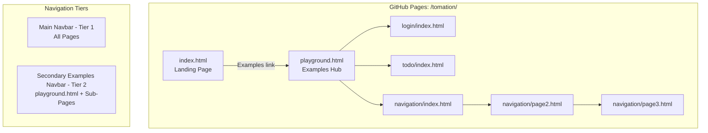

# Design Document: Playground Examples Improvement

## Overview

This design restructures the Tomation playground site with a two-tier navigation system, an examples hub page, and a carousel-based landing page. The implementation is purely static HTML with Tailwind CSS (CDN), Prism.js (CDN), and vanilla JavaScript — no build step required.

The key changes are:
1. **Main Navbar (Tier 1)** — Brand identity bar on ALL pages with Tomation icon, title, Docs/Examples links, and external resource icons
2. **Secondary Examples Navbar (Tier 2)** — Quick-switch bar between examples on playground.html and all sub-pages (not on index.html)
3. **Examples Hub** — New `playground.html` page aggregating all demo apps with code cards and how-to-run instructions
4. **Carousel** — Replaces the 3-column grid on index.html with a single-card-at-a-time viewer with prev/next controls

All changes must preserve existing test selectors, deployment paths, and sub-app functionality.

## Architecture

The architecture remains a flat collection of static HTML files served by GitHub Pages. There is no client-side routing, bundling, or server-side rendering.



### Page-to-Navbar Mapping

| Page | Main Navbar | Secondary Navbar |
|------|:-----------:|:----------------:|
| `index.html` | ✓ | ✗ |
| `playground.html` | ✓ | ✓ (active: Playground) |
| `login/index.html` | ✓ | ✓ (active: Login) |
| `todo/index.html` | ✓ | ✓ (active: Todo) |
| `navigation/index.html` | ✓ | ✓ (active: Navigation) |
| `navigation/page2.html` | ✓ | ✓ (active: Navigation) |
| `navigation/page3.html` | ✓ | ✓ (active: Navigation) |

### Design Decisions

1. **Inline HTML (no JS includes)** — Each page contains its own navbar markup. Since there's no build step and pages are static, using copy-paste HTML across 7 files is simpler and more reliable than runtime JS injection. A shared `<template>` or JS include would add complexity without benefit at this scale.

2. **Relative paths with depth awareness** — Links in navbars use relative paths adjusted per page depth (e.g., `../playground.html` from sub-pages, `playground.html` from index.html).

3. **Carousel state in vanilla JS** — A simple index-based state machine manages which card is visible. No framework needed.

4. **No new IDs or classes conflicting with tests** — Navbar elements use distinct naming (e.g., `nav` elements with aria-labels) and avoid reserved test selectors.

## Components and Interfaces

### 1. Main Navbar Component (HTML + Tailwind)

A `<nav aria-label="Main navigation">` element rendered at the top of every page body, before any existing content.

**Structure:**
```html
<nav aria-label="Main navigation" class="...">
  <!-- Left: Brand -->
  <div class="flex items-center gap-2">
    <svg role="img" aria-label="Tomation logo" ...><!-- Purple rect + white T --></svg>
    <span class="font-bold text-white">Tomation</span>
  </div>
  <!-- Center-left: Links -->
  <div class="flex items-center gap-4">
    <a href="https://github.com/facka/tomation">Docs</a>
    <a href="{relative path to playground.html}">Examples</a>
  </div>
  <!-- Right: External icons -->
  <div class="flex items-center gap-3">
    <a href="{chrome extension URL}" aria-label="Chrome Extension"><!-- Chrome icon SVG --></a>
    <a href="https://github.com/facka/tomation" aria-label="GitHub"><!-- GitHub icon SVG --></a>
  </div>
</nav>
```

**Styling:**
- Dark background (`bg-slate-900/80`) with backdrop blur
- Border bottom with emerald accent (`border-b border-slate-700/70`)
- Horizontal padding responsive (`px-4 sm:px-6 lg:px-8`)
- Fixed height with vertically centered content
- Minimum touch target 44×44px on mobile via padding on links

### 2. Secondary Examples Navbar Component (HTML + Tailwind)

A `<nav aria-label="Examples navigation">` element rendered directly below the Main Navbar on playground.html and all sub-pages.

**Structure:**
```html
<nav aria-label="Examples navigation" class="...">
  <a href="{playground.html}" class="{active|inactive}">Playground</a>
  <a href="{login/index.html}" class="{active|inactive}">Login</a>
  <a href="{todo/index.html}" class="{active|inactive}">Todo</a>
  <a href="{navigation/index.html}" class="{active|inactive}">Navigation</a>
</nav>
```

**Active state:** The link corresponding to the current page gets `text-emerald-300 border-b-2 border-emerald-400` styling. Inactive links get `text-slate-400 hover:text-slate-200`.

**Relative paths by page:**
- From `playground.html`: `playground.html`, `login/index.html`, `todo/index.html`, `navigation/index.html`
- From `login/index.html`: `../playground.html`, `index.html` (self), `../todo/index.html`, `../navigation/index.html`
- From `todo/index.html`: `../playground.html`, `../login/index.html`, `index.html` (self), `../navigation/index.html`
- From `navigation/*.html`: `../playground.html`, `../login/index.html`, `../todo/index.html`, `index.html` or `../navigation/index.html`

### 3. Tomation Icon (Inline SVG)

```html
<svg role="img" aria-label="Tomation logo" width="28" height="28" viewBox="0 0 28 28" xmlns="http://www.w3.org/2000/svg">
  <rect width="28" height="28" rx="6" fill="#6B46C1"/>
  <text x="14" y="20" text-anchor="middle" fill="white" font-family="Sora, sans-serif" font-size="16" font-weight="700">T</text>
</svg>
```

### 4. Carousel Component (Vanilla JS)

Located on `index.html` only. Replaces the 3-column grid in the `#examples` section.

**State:**
- `currentIndex: number` — Index of the currently visible card (0-based)
- `cards: Array` — The array of card data (Login, Navigation, Todo)

**Controls:**
- Previous button (left side): decrements `currentIndex`, wraps to last card if at 0
- Next button (right side): increments `currentIndex`, wraps to first card if at last
- Keyboard: Left/Right arrow keys when carousel or controls have focus

**DOM structure:**
```html
<div aria-roledescription="carousel" aria-label="Code examples">
  <div class="flex items-center justify-between mb-4">
    <button aria-label="Previous example" class="...">←</button>
    <span class="text-sm text-slate-400">1 of 3</span>
    <button aria-label="Next example" class="...">→</button>
  </div>
  <div aria-live="polite" aria-label="Example 1 of 3">
    <!-- Active card content rendered here -->
  </div>
</div>
```

**Behavior:**
- On load: show card at index 0
- On next: `currentIndex = (currentIndex + 1) % cards.length`
- On prev: `currentIndex = (currentIndex - 1 + cards.length) % cards.length`
- Update position indicator text and aria-label on change
- Re-highlight code with Prism.js after card switch

### 5. Examples Hub Page (`playground.html`)

**Sections:**
1. Main Navbar
2. Secondary Examples Navbar (active: Playground)
3. Hero/header area with page title
4. Code Cards grid (responsive: 1/2/3 columns)
5. How-To-Run section
6. Footer

**Code Cards grid:** Each card contains:
- Code snippet preview (≤10 lines, Prism.js highlighted)
- Title (Login, Todo, Navigation Wizard)
- Description
- Link to sub-page

**How-To-Run section:** Ordered list explaining:
1. Install the Tomation Chrome Extension
2. Visit this page — examples auto-load
3. Open the browser side panel
4. Click Run
5. Note: Custom projects require compiling TypeScript before loading

## Data Models

No persistent data models — this is entirely static HTML. The only runtime state is the carousel's `currentIndex` integer managed in memory via vanilla JS.

**Carousel state (in-memory):**
```typescript
interface CarouselState {
  currentIndex: number;  // 0-based index of visible card
  totalCards: number;    // Always 3 for now (Login, Navigation, Todo)
}
```

**Card data (embedded in page):**
```typescript
interface CardData {
  title: string;         // e.g., "Login"
  description: string;   // e.g., "Authentication flow with validation"
  codeSnippet: string;   // TypeScript code string for Prism.js
  codeFilename: string;  // e.g., "login.test.ts"
  appUrl: string;        // e.g., "login/index.html"
}
```

## Correctness Properties

*A property is a characteristic or behavior that should hold true across all valid executions of a system — essentially, a formal statement about what the system should do. Properties serve as the bridge between human-readable specifications and machine-verifiable correctness guarantees.*

### Property 1: Carousel index wrapping

*For any* sequence of next/prev operations on the carousel, the `currentIndex` SHALL always remain within bounds `[0, totalCards - 1]`, wrapping from last to first on next and from first to last on prev.

**Validates: Requirements 4.2, 4.7**

### Property 2: Carousel position indicator accuracy

*For any* carousel state, the displayed position text SHALL equal `"${currentIndex + 1} of ${totalCards}"` and the aria-label on the card container SHALL match the same pattern.

**Validates: Requirements 4.8, 6.8**

### Property 3: Carousel navigation is a cycle

*For any* starting index, performing `totalCards` consecutive next operations SHALL return the carousel to the original index. Similarly for prev operations.

**Validates: Requirements 4.2, 4.7**

## Error Handling

Since this feature is entirely static HTML with minimal JS (carousel logic only), error scenarios are limited:

| Scenario | Handling |
|----------|----------|
| JavaScript disabled | Carousel shows first card statically; navbars render as plain HTML (fully functional without JS) |
| Prism.js CDN fails to load | Code blocks render as plain monospace text without syntax highlighting |
| Tailwind CDN fails to load | Pages degrade to unstyled but structurally sound HTML |
| Invalid carousel index | Modulo arithmetic ensures wrapping; no out-of-bounds possible |

**Graceful degradation approach:** The carousel should render all cards in a stacked layout if JS is disabled, showing all content rather than hiding cards. A `<noscript>` fallback or CSS-only initial state ensures content accessibility.

## Testing Strategy

### Unit Tests (Property-Based)

The carousel navigation logic is the only code with meaningful input variation. Property-based tests validate:

- **Library:** fast-check (JavaScript property-based testing library)
- **Minimum iterations:** 100 per property
- **Test tag format:** `Feature: playground-examples-improvement, Property {N}: {description}`

Properties to test:
1. Index always stays in bounds for any sequence of next/prev operations
2. Position indicator always matches current index
3. N next operations followed by N prev operations returns to start (cycle property)

### Unit Tests (Example-Based)

- Carousel shows first card on initial load
- Next from last card wraps to first
- Prev from first card wraps to last
- Arrow key left/right triggers prev/next
- Position indicator shows "1 of 3" initially

### Integration / Manual Tests

- All 7 pages render without horizontal scroll at 320px, 768px, 1024px, 1920px viewports
- Main Navbar appears on all pages with correct links
- Secondary Navbar appears only on playground.html and sub-pages (NOT index.html)
- Active state correctly highlights current page in secondary navbar
- Reserved test selectors (`username`, `password`, `login-btn`, `message`, `todo-input`, `add-btn`, `todo-list`, `page-title`, `step-indicator`, `success-message`, `.todo-item`, `.todo-text`, `.delete-btn`) remain functional
- Chrome extension auto-loads tests on matching URL
- GitHub Pages deployment still works from `examples/playground/` path
- All Code Card links navigate to correct sub-pages
- Tomation icon renders as purple rounded rect with white T
- Focus indicators visible on keyboard navigation through navbars and carousel

### Accessibility Verification

- Screen reader announces carousel card changes via `aria-live="polite"`
- `aria-roledescription="carousel"` identifies the component
- Navigation controls have descriptive `aria-label` attributes
- Both navbars use semantic `<nav>` with distinct `aria-label` values
- Tomation SVG has `role="img"` and `aria-label="Tomation logo"`
- Touch targets ≥ 44×44px on mobile viewports
