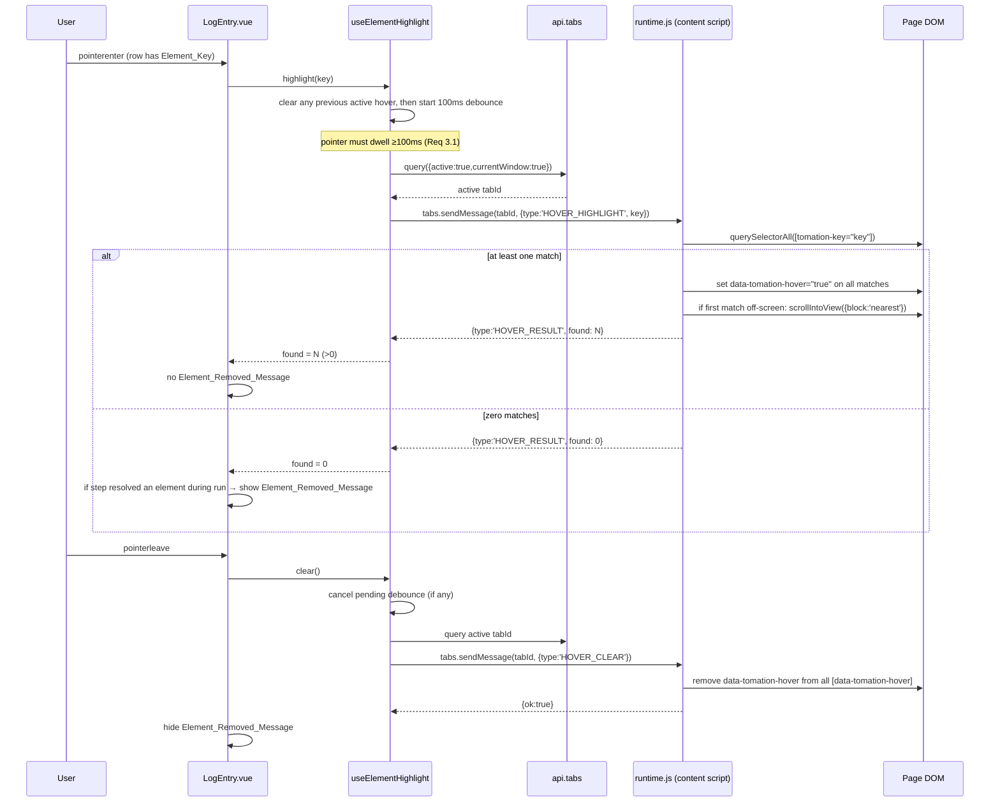
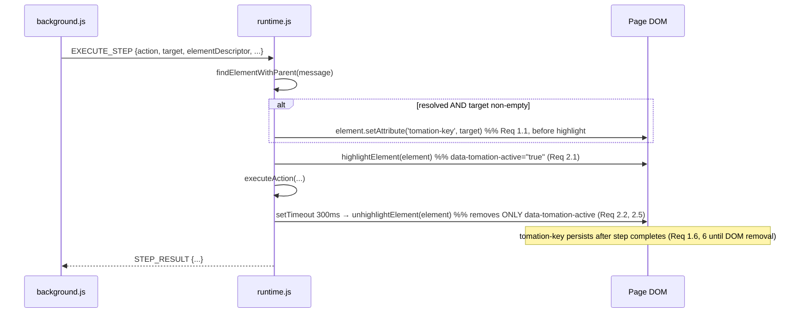

# Design Document

## Overview

This feature lets a user hover a log entry in the Run_View and see the corresponding DOM element highlighted on the page under test, both while a run is executing and after it has finished. It is a diagnostic aid: because the Element_Finder can resolve the *wrong* element when a locator definition is imprecise, showing which element was actually matched lets the author confirm the locator — and this is exactly why passing/completed entries must remain inspectable after the run.

The feature has two halves that meet at a new content-script message contract:

1. **Tagging (Runtime side).** When `findElementWithParent` resolves an element for a step that carries a non-empty `target` (Element_Key), the Runtime stamps that element with a `tomation-key` attribute equal to the raw key, *before* applying the existing Action_Highlight. The tag persists after the step and after the run — it is deliberately independent of the `data-tomation-active` Action_Highlight lifecycle and lives on the element until the element leaves the DOM.

2. **Hover highlighting (Panel side).** When the pointer dwells on a `LogEntry.vue` row that carries an Element_Key for ~100ms, the panel finds the active tab and sends a `HOVER_HIGHLIGHT` message *directly to the content script*, which applies a visually distinct hover highlight (`data-tomation-hover`) to every element carrying the matching `tomation-key`, scrolls the first match into view only if off-screen, and reports how many elements matched. On pointer-leave the panel sends `HOVER_CLEAR`. When a step that *did* resolve an element reports zero matches, the panel shows an inline Element_Removed_Message on that row.

### Key architecture decision: panel talks to the content script directly

Hover highlighting must work **both during a run and after it ends**. Inspecting a green/passing run is the core purpose, but once a run finishes the Background clears `runState.lockedTabId` (in `unlockTab` / `finishRun` / `resetRunState`), so any relay through the Background that depends on `lockedTabId` is unreliable post-run.

**Decision:** the panel queries the active tab and messages the content-script runtime **directly** using `api.tabs.query({ active: true, currentWindow: true })` + `api.tabs.sendMessage(tabId, msg)`. This bypasses run-state entirely and works identically during and after a run. The panel already has `api` (the `browser`/`chrome` object) and the extension already holds the `tabs` permission (`base-manifest.js` → `permissions: ['storage', 'tabs']`), and `useMessaging` already exposes both `api` and an `api.tabs.query` pattern (`getActiveTabUrl`), so no new permission or plumbing is required.

**Reconciling Requirement 5 (background relay).** Requirement 5 is phrased in terms of the Background relaying hover requests to the locked tab. With the direct-messaging decision, the *primary* delivery path is panel → content script; the Background is not on the hover path. Requirement 5's observable guarantees are satisfied at the panel-side delivery layer instead of the Background:

- Req 5.1 (deliver within 200ms when reachable): the direct `api.tabs.sendMessage` reaches the content script on the active tab immediately; there is no relay hop, so the 200ms budget is trivially met when the tab and runtime are reachable.
- Req 5.2 (discard on no locked tab / closed tab / no runtime, leave run unaffected, no user-visible error): the panel swallows all delivery failures — no active tab, `sendMessage` rejects with "Could not establish connection", or the tab has no runtime — as no-ops. Nothing is emitted to the run, no error surfaces.
- Req 5.3 (discard while no run active): with direct messaging there is no run-state gate to fail; a request to a tab with no runtime simply resolves to a no-op, which is the same observable outcome as "discarded and no relay action". The design does **not** add a during-run background-relay fallback, because doing so would fail post-run (no `lockedTabId`) and would give inconsistent behavior between the during-run and post-run cases the feature must both support.

The net effect: **no changes to `background.js` are required.** The tradeoff is that Requirement 5's language about the Background is satisfied structurally by the panel rather than literally by a Background relay; this is intentional and is the only way to satisfy the confirmed "works during and after a run" requirement, because `lockedTabId` is gone after the run.

## Architecture

### Component map

| Layer | File | Change |
|---|---|---|
| Runtime (content script) | `packages/extension/src/runtime.js` | Set `tomation-key` on resolved elements; inject a second hover style; add `HOVER_HIGHLIGHT` / `HOVER_CLEAR` handling to the `onMessage` listener |
| Panel composable | `packages/extension/panel-vue/src/composables/useElementHighlight.ts` (new) | Query active tab, send hover messages directly to content script, 100ms debounce, single-active-hover coordination, error swallowing |
| Panel component | `packages/extension/panel-vue/src/components/LogEntry.vue` | `pointerenter` / `pointerleave` handlers, inline Element_Removed_Message, "did this step resolve an element" predicate |
| Panel types | `packages/extension/panel-vue/src/types/messages.ts` | Document the new content-script message contract types (separate from `PanelMessage` / `BackgroundMessage`) |
| Background | `packages/extension/src/background.js` | **No change** (see decision above) |

### Sequence: hover to highlight, and un-hover to clear



### Sequence: tagging during step execution (unchanged action-highlight flow)



### Navigation handling (Req 6)

The content script is registered in `base-manifest.js` with `matches: ['<all_urls>']` and `run_at: 'document_idle'`, so when the page under test loads a new document the browser injects a fresh `runtime.js` into it (Req 6.2). The self-invoking `injectHighlightStyles()` and the new hover-style injection re-run in the new document. All `tomation-key` tags from the previous document are discarded with the old DOM (Req 6.1). A `HOVER_HIGHLIGHT` for a key that only existed on the old document therefore matches nothing via `document.querySelectorAll('[tomation-key="…"]')` → `found: 0` (Req 6.3), which the panel maps to the Element_Removed_Message for a step that resolved an element (Req 6.5). No Background work is needed; this is the same code path as in-document removal.

## Components and Interfaces

### 1. Runtime: tag resolved elements (`runtime.js`)

Add a small helper next to `highlightElement`:

```js
/**
 * Tag a resolved element with its element key so the panel can find it later
 * for hover highlighting. Idempotent: setAttribute overwrites any prior value,
 * leaving exactly one tomation-key attribute (Req 1.4). Independent of the
 * data-tomation-active Action_Highlight (Req 2.3). Not removed on step
 * completion (Req 1.6).
 *
 * @param {Element} el
 * @param {string} key - the step's raw Element_Key (message.target)
 */
function tagElementKey(el, key) {
  if (typeof key === 'string' && key.length > 0) {
    el.setAttribute('tomation-key', key);
  }
}
```

Call `tagElementKey(element, message.target)` in the `onMessage` listener at **every place a step resolves an element**, immediately before `highlightElement(element)`:

- The generic `ACTIONS_NEEDING_ELEMENT` branch (`click`, `type`, `typePassword`, `select`, `assertExists`, `assertHasText`, `waitFor`, `upload`, `saveText`, `saveAttribute`, `saveValue`).
- The `pressKey`-with-`target` branch (before its `highlightElement(element)`).
- `assertNotExists`: this action resolves an element only when the element is *found* (and a "pass" means it was **not** found). Set the tag only when `findResult.ok` is true (an element was actually resolved). Per Req 8 handling below, an `assertNotExists` that passed is treated as *not resolving* an element for the Element_Removed_Message predicate.

Placement guarantees, mapped to requirements:

- **Req 1.1** — tag is set to the raw `message.target` string, before `highlightElement`.
- **Req 1.2** — `tagElementKey` no-ops when `target` is empty/missing; the attribute is never added, modified, or removed for keyless steps.
- **Req 1.3** — on a failed find, `findResult.ok` is false, we never reach `tagElementKey`, and no existing tags elsewhere on the page are touched.
- **Req 1.4** — `setAttribute` is idempotent; re-resolving leaves exactly one `tomation-key` with the current key.
- **Req 1.5** — tagging happens *after* resolution using the resolved element; it does not participate in matching, so `findElementWithParent` resolves the same element it would have without tagging. `tomation-key` is not a `where` matcher key in `evaluateWhereKey`, so it can never affect a `querySelectorAll(tag)` + `matchesWhere` decision.
- **Req 1.6 / 2.5** — the unhighlight path (`unhighlightElement`, called ~300ms after the action) removes only `data-tomation-active`; it never touches `tomation-key`.

`unhighlightElement` and `highlightElement` are unchanged (Req 2.1, 2.2).

### 2. Runtime: hover style injection + message handlers (`runtime.js`)

**Second injected style.** Alongside the existing `injectHighlightStyles()` (which targets `[data-tomation-active="true"]` with outline `#5e6ad2` and box-shadow `rgba(94,106,210,0.2)`), add a second self-invoking injector for the hover highlight, using a **distinct** color so the two are individually observable when both apply to one element (Req 2.4, 7.1, 7.2):

```js
(function injectHoverStyles() {
  var style = document.createElement('style');
  style.textContent = '[data-tomation-hover="true"] { outline: 2px dashed #f5a623 !important; outline-offset: 2px; box-shadow: 0 0 0 4px rgba(245, 166, 35, 0.25) !important; transition: outline 0.15s ease, box-shadow 0.15s ease; }';
  (document.head || document.documentElement).appendChild(style);
})();
```

The hover style uses a different outline color and box-shadow color (amber `#f5a623` vs the action highlight's indigo `#5e6ad2`) and a dashed outline, satisfying Req 7.2 ("at least one visual outline property different"). Because the two selectors target different attributes, applying/removing hover never modifies the action-highlight style block or the element's author styles (Req 7.3), and removing the attribute restores the prior visual state (Req 7.4). It does not modify the element's own author-defined CSS — only a page-injected attribute selector.

**Message handling.** Extend the existing `api.runtime.onMessage.addListener` to handle two new message types *before* the `EXECUTE_STEP` early-return guard (or by matching on type). Both respond synchronously, so they do not need to return `true`:

```js
// Escape a key for use in an attribute selector.
function hoverSelectorFor(key) {
  var esc = (window.CSS && CSS.escape) ? CSS.escape(key) : key.replace(/["\\]/g, '\\$&');
  return '[tomation-key="' + esc + '"]';
}

function isInViewport(el) {
  var r = el.getBoundingClientRect();
  var vh = window.innerHeight || document.documentElement.clientHeight;
  var vw = window.innerWidth || document.documentElement.clientWidth;
  return r.top >= 0 && r.left >= 0 && r.bottom <= vh && r.right <= vw;
}

function handleHoverHighlight(key) {
  var matches = document.querySelectorAll(hoverSelectorFor(key));
  if (matches.length === 0) {
    return { type: 'HOVER_RESULT', found: 0 };   // Req 3.4, 4/6 no-match → panel decides message
  }
  for (var i = 0; i < matches.length; i++) {
    matches[i].setAttribute('data-tomation-hover', 'true'); // Req 3.2, 3.5, 6.4
  }
  if (!isInViewport(matches[0])) {
    matches[0].scrollIntoView({ block: 'nearest' });  // Req 3.6, 3.8
  }                                                    // else no scroll (Req 3.7)
  return { type: 'HOVER_RESULT', found: matches.length };
}

function handleHoverClear() {
  var hovered = document.querySelectorAll('[data-tomation-hover]');
  for (var i = 0; i < hovered.length; i++) {
    hovered[i].removeAttribute('data-tomation-hover'); // Req 4.2, leaves zero hovered
  }                                                    // never touches data-tomation-active (Req 4.4)
  return { ok: true };
}
```

In the listener:

```js
if (message.type === 'HOVER_HIGHLIGHT') {
  sendResponse(handleHoverHighlight(message.key));
  return;
}
if (message.type === 'HOVER_CLEAR') {
  sendResponse(handleHoverClear());
  return;
}
```

Requirement mapping:

- **Req 3.2 / 3.5 / 6.4** — every element whose `tomation-key` equals the key gets `data-tomation-hover="true"`, whether one or many.
- **Req 3.4 / 6.3 / 6.5** — zero matches → no attribute applied, `{ found: 0 }` returned so the panel can report not-found. No existing hover is disturbed (there is none to disturb once cleared).
- **Req 3.6 / 3.7 / 3.8** — scroll the first match into view only when it is off-screen; otherwise highlight in place with no scroll.
- **Req 3.10** — if the panel sends this to a tab with no runtime (run not active / tab closed), the message is simply never received (delivery rejects at the panel), so no attribute is applied and the DOM is unchanged.
- **Req 4.2 / 4.4** — clear removes `data-tomation-hover` from all carriers, leaving zero; `data-tomation-active` is untouched.

### 3. Panel composable: `useElementHighlight.ts` (new)

Owns all hover coordination so `LogEntry.vue` stays declarative. It is a **module-level singleton** (defined once, imported per component) so that all rows share one "active hovered key" — this is how moving from one row to another clears the previous element before highlighting the next (Req 4.3), and how the 100ms debounce is enforced globally.

```ts
import { api } from '@/logic/browserApi';
import type { HoverHighlightMessage, HoverClearMessage, HoverResult } from '@/types/messages';

const DEBOUNCE_MS = 100;

let pendingTimer: ReturnType<typeof setTimeout> | null = null;
let activeKey: string | null = null;   // key currently highlighted (or pending)

function queryActiveTabId(): Promise<number | null> {
  return new Promise((resolve) => {
    try {
      api.tabs.query({ active: true, currentWindow: true }, (tabs) => {
        resolve(tabs && tabs[0] && tabs[0].id != null ? tabs[0].id : null);
      });
    } catch {
      resolve(null);
    }
  });
}

async function sendToRuntime<T>(msg: HoverHighlightMessage | HoverClearMessage): Promise<T | null> {
  const tabId = await queryActiveTabId();
  if (tabId == null) return null;                 // no active tab → no-op (Req 5.2)
  try {
    return await api.tabs.sendMessage(tabId, msg); // may reject if no runtime / tab closed
  } catch {
    return null;                                   // swallow: run unaffected, no error (Req 5.2, 3.10)
  }
}

async function clearNow(): Promise<void> {
  activeKey = null;
  await sendToRuntime<{ ok: true }>({ type: 'HOVER_CLEAR' });
}

export function useElementHighlight() {
  /**
   * Request a hover highlight for `key` after a 100ms dwell (Req 3.1).
   * Clears any previously active hover first so two rows never highlight at
   * once (Req 4.3). Returns the runtime's found count, or null if undelivered.
   */
  function highlight(key: string): Promise<number | null> {
    // Cancel any pending debounce and clear a prior active hover immediately.
    if (pendingTimer) { clearTimeout(pendingTimer); pendingTimer = null; }
    const hadPrior = activeKey !== null && activeKey !== key;
    return new Promise((resolve) => {
      const start = () => {
        pendingTimer = setTimeout(async () => {
          pendingTimer = null;
          activeKey = key;
          const res = await sendToRuntime<HoverResult>({ type: 'HOVER_HIGHLIGHT', key });
          resolve(res ? res.found : null);
        }, DEBOUNCE_MS);
      };
      if (hadPrior) { void clearNow().then(start); } else { start(); }
    });
  }

  /** Clear the active hover and cancel any pending debounce (Req 4.1, 4.2). */
  function clear(): Promise<void> {
    if (pendingTimer) { clearTimeout(pendingTimer); pendingTimer = null; }
    return clearNow();
  }

  return { highlight, clear };
}
```

Notes:
- `api.tabs.query` is used in its callback form to match the existing `getActiveTabUrl` usage in `useMessaging.ts`; `api.tabs.sendMessage` returns a promise (as used throughout `background.js`).
- The singleton `activeKey` / `pendingTimer` state coordinates a single active hover across all rows (Req 3.1 "exactly one request", Req 4.3 "clear previous before next").
- All delivery failures resolve to `null` and are swallowed (Req 5.2, 5.3, 3.10).

### 4. `LogEntry.vue` changes

Add hover handlers, the Element_Key predicate, the "resolved an element" predicate, and the inline message. Uses `useElementHighlight`, `onBeforeUnmount`, and a local `ref` for the removed-message flag.

```ts
import { onBeforeUnmount, ref } from 'vue';
import { useElementHighlight } from '@/composables/useElementHighlight';

const { highlight, clear } = useElementHighlight();
const showRemovedMessage = ref(false);
let hovering = false;

// Element_Key of this row, or null (Req 3.3).
const elementKey = computed(() => (props.entry.target && props.entry.target.length > 0 ? props.entry.target : null));

// Element-resolving actions (mirror of runtime ACTIONS_NEEDING_ELEMENT + pressKey-with-target).
const ELEMENT_RESOLVING_ACTIONS = new Set([
  'click','type','typepassword','select','assertexists','asserthastext',
  'waitfor','upload','savetext','saveattribute','savevalue','presskey',
]);

// Did this step resolve an element during the run? (Req 8.1, 8.2, 6.5)
// A 'pass' element-dependent step with a target resolved its element. A 'fail'
// step MAY have failed at the find, so it does NOT count as resolved.
// assertNotExists is excluded: a passing assertNotExists means NOT found → no
// tomation-key was ever set → treat as non-resolving.
function stepResolvedElement(entry: LogEntry): boolean {
  if (!entry.target || entry.target.length === 0) return false;
  const action = (entry.action || '').toLowerCase();
  if (action === 'assertnotexists') return false;
  if (!ELEMENT_RESOLVING_ACTIONS.has(action)) return false;
  return entry.status === 'pass';
}

async function onPointerEnter() {
  const key = elementKey.value;
  if (!key) return;              // Req 3.3: no request when no Element_Key
  hovering = true;
  showRemovedMessage.value = false;
  const found = await highlight(key);   // resolves after 100ms dwell (Req 3.1)
  if (!hovering) return;         // pointer already left; ignore late result
  // Req 8.1/8.3: only show when this step resolved an element AND none found now.
  if (found === 0 && stepResolvedElement(props.entry)) {
    showRemovedMessage.value = true;
  }
}

function onPointerLeave() {
  hovering = false;
  showRemovedMessage.value = false;  // Req 8.4: clear message on leave
  void clear();                       // Req 4.1
}

// Req 4.5: if the row unmounts / view changes while hovered, clear.
onBeforeUnmount(() => {
  if (hovering) { hovering = false; void clear(); }
});
```

Template: attach `@pointerenter="onPointerEnter"` and `@pointerleave="onPointerLeave"` to the root `.log-entry` element, and render the inline message beneath the row (Req 8.5 — inline, not global):

```html
<div v-if="showRemovedMessage" class="element-removed-msg">
  <font-awesome-icon :icon="['fas', 'triangle-exclamation']" />
  <span>This element is no longer in the page — it may have been removed by a later navigation or DOM change.</span>
</div>
```

Requirement mapping:
- **Req 3.1 / 3.3** — request only for rows with an Element_Key, and only after the 100ms dwell enforced in the composable; exactly one request per dwell.
- **Req 3.9 / 4.1** — pointer-leave issues exactly one clear.
- **Req 4.3** — the composable clears the previous key before starting the next highlight when moving row→row.
- **Req 4.5** — `onBeforeUnmount` clears an outstanding hover before the row is removed (view change / unmount).
- **Req 8.1 / 8.2 / 8.3 / 8.4 / 8.5** — inline message shown only when `stepResolvedElement` is true and `found === 0`; hidden when `found > 0`, when the step didn't resolve an element, and on pointer-leave.

### 5. Types (`messages.ts`)

The hover messages cross the panel → content-script boundary directly, which is **separate** from the panel↔background `PanelMessage` / `BackgroundMessage` unions. Document them as a distinct content-script message contract in `messages.ts` (they are not added to `PanelMessage`, since they never go to the background):

```ts
// --- Content-script hover contract (panel → content script, via api.tabs.sendMessage) ---
// These are NOT part of PanelMessage/BackgroundMessage (which are panel↔background).
export interface HoverHighlightMessage { type: 'HOVER_HIGHLIGHT'; key: string; }
export interface HoverClearMessage { type: 'HOVER_CLEAR'; }
export type ContentScriptHoverMessage = HoverHighlightMessage | HoverClearMessage;

// Responses returned by the content script.
export interface HoverResult { type: 'HOVER_RESULT'; found: number; }
export interface HoverClearResult { ok: true; }
```

### 6. Store / RunView

No store shape change is required. `LogContainer.vue` already passes `:entry` and `:page-elements` to `LogEntry.vue`, and `App.vue` already routes `LOG` → `store.setStepStatus`, which sets `status`/`action`/`target` — the exact fields `stepResolvedElement` reads. The removed-message flag is local component state, not store state. `RunView.vue` needs no change; when it unmounts, each `LogEntry.vue`'s `onBeforeUnmount` fires the clear (Req 4.5).

## Data Models

### Content-script hover message shapes

| Message | Direction | Shape | Response |
|---|---|---|---|
| Hover_Highlight_Request | panel → content script | `{ type: 'HOVER_HIGHLIGHT', key: string }` | `{ type: 'HOVER_RESULT', found: number }` |
| Hover_Clear_Request | panel → content script | `{ type: 'HOVER_CLEAR' }` | `{ ok: true }` |

`found` is the count of elements carrying the matching `tomation-key` (`0` = not found).

### DOM attributes

| Attribute | Set by | Cleared by | Lifetime |
|---|---|---|---|
| `tomation-key="<key>"` | Runtime, on resolve (before highlight) | never by the feature; only when the element leaves the DOM | persists across the step and the run (Req 1.6) |
| `data-tomation-active="true"` | `highlightElement` at action start | `unhighlightElement` ~300ms after action | per-step (unchanged) |
| `data-tomation-hover="true"` | `handleHoverHighlight` on hover match | `handleHoverClear`; removing it restores prior visual state | while pointer dwells on the row |

The three attributes are mutually independent: setting or clearing any one leaves the others' presence and value unchanged (Req 2.3, 2.5, 4.4, 7.3).

### `LogEntry` "resolved an element during the run" predicate

Given a `LogEntry` (`{ stepIndex, status, action, target?, ... }`):

```
stepResolvedElement(entry) :=
     entry.target is a non-empty string
  AND lower(entry.action) ∈ ELEMENT_RESOLVING_ACTIONS
  AND lower(entry.action) ≠ 'assertnotexists'
  AND entry.status === 'pass'
```

Rationale: a `tomation-key` is only stamped when the Runtime *resolved* an element, which for element-dependent actions corresponds to reaching a `pass`. A `fail` may have failed at the find (no tag was set), so it is treated as non-resolving to avoid a false "element removed" claim. `assertNotExists` is the deliberate exception — a passing `assertNotExists` means the element was *not* found, so no `tomation-key` exists and the row is non-resolving.

## Correctness Properties

*A property is a characteristic or behavior that should hold true across all valid executions of a system — essentially, a formal statement about what the system should do. Properties serve as the bridge between human-readable specifications and machine-verifiable correctness guarantees.*

Several acceptance criteria are not universally quantified and are covered by example/edge/smoke tests instead of properties (see Testing Strategy): the fixed action-highlight set/remove (2.1, 2.2), the injected-style structure and colors (2.4, 7.1, 7.2), the 100ms debounce timing and single-request behavior (3.1, 3.3, 4.1), scroll-into-view branches which require layout jsdom cannot provide (3.6, 3.7, 3.8), the failed-find control flow (1.3), the delivery-reachable SLA (5.1), navigation re-injection which is manifest configuration (6.1, 6.2), lifecycle clear on unmount (4.5), and message-clear-on-leave / inline placement (8.4, 8.5).

### Property 1: Tag equals the raw element key

*For any* resolved element and any non-empty key string, after the Runtime tags the element, `element.getAttribute('tomation-key')` equals the raw key string exactly.

**Validates: Requirements 1.1**

### Property 2: Tagging is idempotent — exactly one key attribute

*For any* element, any non-empty key, and any repetition count N ≥ 1, applying the tag operation N times leaves the element carrying exactly one `tomation-key` attribute whose value equals that key.

**Validates: Requirements 1.4**

### Property 3: No tag for empty or missing keys

*For any* element and any empty, whitespace-only, undefined, or missing key, the tag operation neither adds, modifies, nor removes the element's `tomation-key` attribute.

**Validates: Requirements 1.2**

### Property 4: Tagging does not change which element is resolved

*For any* DOM and any descriptor that resolves to an element, the element resolved by `findElementWithParent` is identical whether or not `tomation-key` attributes are present on candidates, and `tomation-key` is never evaluated as a `where` matcher key.

**Validates: Requirements 1.5**

### Property 5: The three attributes are mutually independent

*For any* element and any sequence of tag / `highlightElement` / `unhighlightElement` / hover-clear operations, each of `tomation-key`, `data-tomation-active`, and `data-tomation-hover` changes only in response to its own operation; in particular removing `data-tomation-active` leaves `tomation-key` present and unchanged, and clearing the hover highlight leaves `data-tomation-active` unchanged.

**Validates: Requirements 1.6, 2.3, 2.5, 4.4, 7.4**

### Property 6: Hover highlight is applied to every matching element

*For any* DOM containing K elements carrying a given key and M elements not carrying it, a `HOVER_HIGHLIGHT` for that key sets `data-tomation-hover="true"` on exactly the K matching elements and on none of the M others (covering K = 1 and K > 1).

**Validates: Requirements 3.2, 3.5, 6.4**

### Property 7: No match applies nothing and reports not-found

*For any* key that no element in the current document carries, a `HOVER_HIGHLIGHT` for that key applies `data-tomation-hover` to zero elements, leaves any existing DOM unchanged, and responds with `found: 0`.

**Validates: Requirements 3.4, 6.3**

### Property 8: Clear removes the hover highlight from every carrier

*For any* DOM in which an arbitrary set of elements carry `data-tomation-hover`, a `HOVER_CLEAR` leaves zero elements carrying `data-tomation-hover`.

**Validates: Requirements 4.2**

### Property 9: At most one element key is hover-active at a time

*For any* sequence of distinct hovered keys driven through the highlight coordinator, a `HOVER_CLEAR` for the previous key is issued before the `HOVER_HIGHLIGHT` for the next key, so at no observable point are two different keys both hover-active.

**Validates: Requirements 4.3**

### Property 10: Undeliverable hover requests are swallowed

*For any* delivery failure mode — no active tab, `sendMessage` rejects, or the call throws — issuing a hover-highlight or hover-clear request resolves without throwing, produces no user-visible error, and leaves the run unaffected.

**Validates: Requirements 3.10, 5.2, 5.3**

### Property 11: Applying the hover highlight does not mutate action or author styles

*For any* element with arbitrary author-defined inline styles and classes, applying the hover highlight adds only the `data-tomation-hover` attribute and leaves the element's inline styles, classes, and the injected action-highlight style block unchanged.

**Validates: Requirements 7.3**

### Property 12: Element_Removed_Message iff step resolved an element and no match remains

*For any* log entry and any runtime-reported match count `found`, the Run_View displays the Element_Removed_Message if and only if `stepResolvedElement(entry)` is true and `found === 0`.

**Validates: Requirements 8.1, 8.2, 8.3, 6.5**

## Error Handling

- **Undeliverable messages (no active tab / tab closed / no runtime).** `useElementHighlight` swallows every failure: `queryActiveTabId` resolves to `null` when there is no active tab (wrapped in try/catch), and `api.tabs.sendMessage` rejections (e.g. "Could not establish connection", the same string `background.js` already special-cases) are caught and mapped to `null`. `highlight`/`clear` therefore never throw and never surface an error; the run continues untouched (Req 5.2, 5.3, 3.10).
- **Run not active / post-run.** Because delivery is direct to the active tab and does not consult `runState.lockedTabId`, there is no run-state gate to fail. A request to a tab whose content script is present simply works (during or after a run); a request to a tab with no runtime is a swallowed no-op — the same observable outcome as "discarded" (Req 5.3).
- **Malformed / duplicate hover requests.** The composable's single `pendingTimer` + `activeKey` state means a rapid re-enter cancels the prior debounce, and a re-enter on the same key clears the prior before re-highlighting, so duplicate requests cannot leave two keys active (Req 4.3). A late `HOVER_RESULT` arriving after the pointer already left is ignored by the `if (!hovering) return;` guard in `onPointerEnter`, preventing a stale Element_Removed_Message.
- **Unsafe key values in selectors.** Keys are arbitrary spec strings and must not break the attribute selector. `hoverSelectorFor` uses `CSS.escape(key)` when available, with a minimal `"`/`\\` fallback, so quotes and backslashes in a key cannot produce an invalid selector or match unintended elements.
- **Missing viewport/layout data.** `isInViewport` reads `getBoundingClientRect` and `window.innerHeight/innerWidth` defensively; if a match has no layout it is treated conservatively and `scrollIntoView({ block: 'nearest' })` is a safe no-op when already visible.
- **Content-script listener isolation.** The new `HOVER_HIGHLIGHT` / `HOVER_CLEAR` branches respond synchronously and return early, so they never interfere with the existing asynchronous `EXECUTE_STEP` path (which returns `true` to keep `sendResponse` alive).

## Testing Strategy

**Workspace rule:** do not run `node --test` or `node -c`; the developer runs tests manually. The sections below describe how tests would be structured, following the repo's existing convention (`packages/extension/src/runtime.property.test.js`): `node:test` + `node:assert/strict` + `fast-check` + `jsdom`, loading `runtime.js` into a jsdom window via `win.eval(runtimeSrc)` with a stubbed `browser`/`chrome`.

### Dual approach

- **Property tests** verify the universal properties above across generated inputs.
- **Unit / example tests** cover the fixed-behavior, timing, layout, and structural criteria that are not universally quantified.

### Property-based tests

- Library: `fast-check` (already a dependency), minimum **100 iterations** per property.
- Each test is tagged with a comment referencing its design property, in the format the repo already uses:
  `// Feature: run-log-element-highlight, Property <n>: <property text>`
- Each correctness property is implemented by a **single** property-based test:
  - **P1–P5** (tagging + attribute independence): jsdom + `runtime.js`, exercising `tagElementKey`, `highlightElement`, `unhighlightElement`, and `findElement`/`matchesWhere`. Generators produce random valid keys, DOM candidate sets, and operation sequences.
  - **P6–P8** (hover highlight/clear): jsdom + the exported `handleHoverHighlight` / `handleHoverClear`, with generators producing random counts of matching / non-matching elements and arbitrary hover-carrier sets.
  - **P9, P10** (coordinator ordering + error swallowing): unit-level tests of `useElementHighlight` with a stubbed `api.tabs` (a fake `query`/`sendMessage` that records a message log and can be made to reject/throw), driving sequences of `highlight`/`clear` and asserting message ordering and no-throw behavior. `P9` uses a generated sequence of distinct keys; `P10` uses generated failure modes.
  - **P11** (style non-mutation): jsdom, apply hover to elements with generated author styles; assert only `data-tomation-hover` was added.
  - **P12** (removed-message predicate): pure test of `stepResolvedElement(entry)` combined with `found`; generate entries varying `action` (element-resolving, non-element, `assertNotExists`), `status`, and `target`, plus a `found` count, and assert message visibility equals `stepResolvedElement(entry) && found === 0`.

### Example / edge / smoke tests

- **2.1, 2.2** — `highlightElement` sets `data-tomation-active="true"`; `unhighlightElement` removes it (both step outcomes call it).
- **2.4, 7.1, 7.2** — assert both injected `<style>` blocks exist, target `[data-tomation-active="true"]` and `[data-tomation-hover="true"]` respectively, and differ in at least one of outline color / box-shadow color; both attributes can coexist on one element.
- **1.3** — a descriptor that cannot resolve leaves no `tomation-key` on any element.
- **3.1, 3.3, 4.1** — with fake timers: dwell < 100ms sends nothing; dwell = 100ms sends exactly one `HOVER_HIGHLIGHT`; a keyless row sends nothing; pointer-leave sends exactly one `HOVER_CLEAR` and cancels any pending debounce.
- **3.6, 3.7, 3.8** — stub `getBoundingClientRect` and spy `scrollIntoView`: off-screen first match scrolls, on-screen match does not, multiple matches scroll only the first.
- **4.5** — mount a `LogEntry`, hover it, unmount; assert a `HOVER_CLEAR` was issued.
- **8.4, 8.5** — pointer-leave hides the message; the message renders inside the log-entry row (inline), not as a global element.
- **5.1** — a reachable active tab receives the message via `api.tabs.sendMessage` (direct, no relay hop).
- **6.1 (integration-style), 6.2 (smoke)** — replacing the jsdom document drops all prior `tomation-key` tags; assert `base-manifest.js` registers `runtime.js` for `<all_urls>` at `document_idle`, which is what re-injects the script (and its style injectors) into each new document.

### Unit-testing balance

Property tests carry the bulk of input coverage (tagging, matching, independence, hover application/clear, the removed-message predicate). Example tests are kept focused on fixed behaviors, timing, layout-dependent scrolling, injected-style structure, and lifecycle — avoiding redundant example coverage of behavior the properties already generalize.
