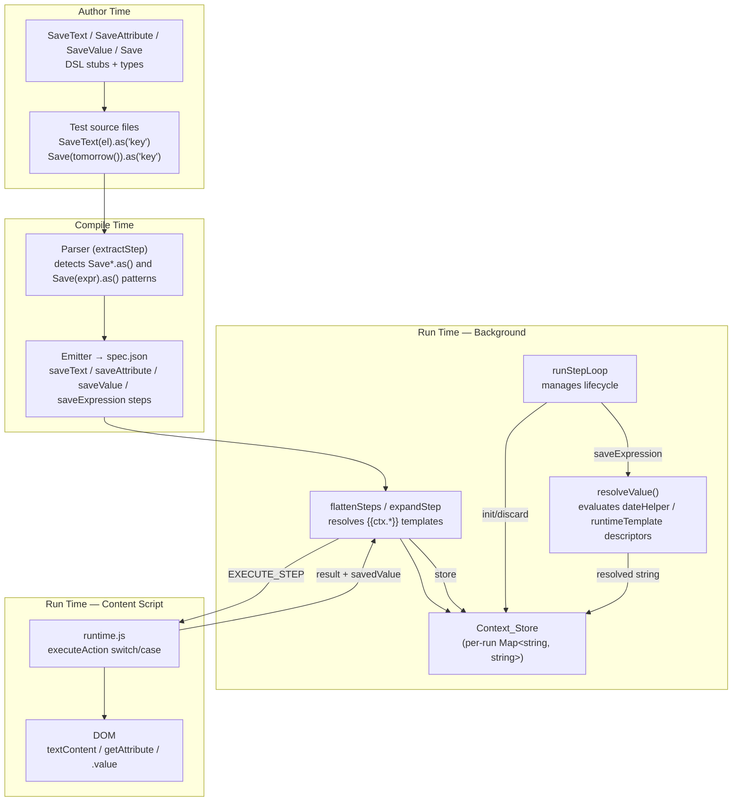
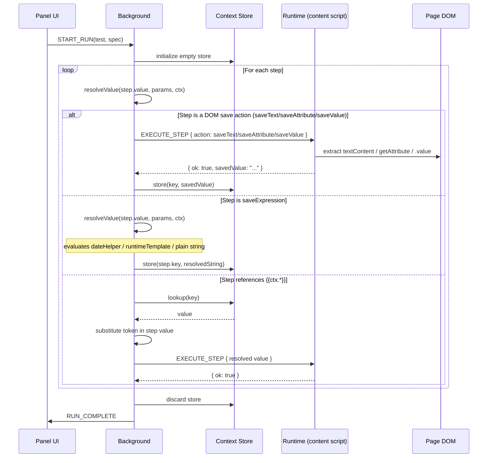

# Design Document: Test Context — Per-Run Key-Value Store

## Overview

The Test Context feature adds a per-test-run key-value store to Tomation's execution pipeline. Four new DSL actions (`SaveText`, `SaveAttribute`, `SaveValue`, `Save`) extract dynamic values from the DOM or compute expressions during execution and write them into a context map. A new template syntax (`{{ctx.keyName}}`) in step parameters resolves against this map, allowing later steps to reference values captured by earlier steps.

The feature touches four layers:
1. **DSL package** — new action stubs and TypeScript types for the four save actions
2. **Compiler** — AST detection of `SaveText(el).as(key)`, `SaveAttribute(el, attr).as(key)`, `SaveValue(el).as(key)`, and `Save(expression).as(key)` patterns
3. **Background (flattener)** — context store lifecycle management, `{{ctx.*}}` template resolution, and `saveExpression` step execution (value descriptor evaluation via `resolveValue()`)
4. **Runtime** — DOM extraction logic for the three DOM-based save action types

The context store is string-keyed and string-valued, initialized when a test run begins and discarded when it ends. Values persist across task boundaries within a single run but never leak between runs.

The `Save(expression)` action bridges with the `dsl-runtime-utilities` feature, reusing its date helper descriptors and runtime template descriptors as the `value` field in the emitted `saveExpression` step. The background's existing `resolveValue()` function (extended by dsl-runtime-utilities) handles evaluating these descriptors at execution time before storing the result.

## Architecture



### Execution Sequence



## Components and Interfaces

### Component 1: DSL Package Extensions (`@tomation/dsl`)

**Purpose**: Provide runtime stubs and TypeScript types for the three save actions.

**Interface**:

```typescript
// New builder interface for save actions
interface SaveBuilder {
  as(keyName: string): any;
}

// New exports
export declare function SaveText(element: ElementDescriptor): SaveBuilder;
export declare function SaveAttribute(element: ElementDescriptor, attributeName: string): SaveBuilder;
export declare function SaveValue(element: ElementDescriptor): SaveBuilder;
export declare function Save(expression: string): SaveBuilder;
```

**Runtime stubs** (index.js):

```javascript
function SaveText(element) {
  return {
    as: function (keyName) {
      return { __step: true, action: 'saveText', target: element, contextKey: keyName };
    }
  };
}

function SaveAttribute(element, attributeName) {
  return {
    as: function (keyName) {
      return { __step: true, action: 'saveAttribute', target: element, attributeName: attributeName, contextKey: keyName };
    }
  };
}

function SaveValue(element) {
  return {
    as: function (keyName) {
      return { __step: true, action: 'saveValue', target: element, contextKey: keyName };
    }
  };
}

function Save(expression) {
  return {
    as: function (keyName) {
      return { __step: true, action: 'saveExpression', value: expression, key: keyName };
    }
  };
}
```

### Component 2: Compiler Parser Extension

**Purpose**: Detect `SaveText(el).as(key)`, `SaveAttribute(el, attr).as(key)`, `SaveValue(el).as(key)`, and `Save(expression).as(key)` patterns in the AST and emit corresponding step objects.

**AST Pattern** (`.as()` chain for DOM save actions):

```
CallExpression                    ← .as(key)
├── callee: MemberExpression
│   ├── object: CallExpression    ← SaveText(el) / SaveAttribute(el, attr) / SaveValue(el)
│   │   ├── callee: Identifier { name: 'SaveText' | 'SaveAttribute' | 'SaveValue' }
│   │   └── arguments: [elementRef, (attributeName)?]
│   └── property: Identifier { name: 'as' }
└── arguments: [Literal { value: keyName }]
```

**AST Pattern** (`.as()` chain for `Save(expression)`):

```
CallExpression                    ← .as(key)
├── callee: MemberExpression
│   ├── object: CallExpression    ← Save(expression)
│   │   ├── callee: Identifier { name: 'Save' }
│   │   └── arguments: [expression]   ← Literal | CallExpression (date helper) | TemplateLiteral
│   └── property: Identifier { name: 'as' }
└── arguments: [Literal { value: keyName }]
```

**Emitted step objects**:

```javascript
// SaveText(el).as('myKey')
{ action: 'saveText', target: 'elementVarName', contextKey: 'myKey' }

// SaveAttribute(el, 'href').as('myKey')
{ action: 'saveAttribute', target: 'elementVarName', attributeName: 'href', contextKey: 'myKey' }

// SaveValue(el).as('myKey')
{ action: 'saveValue', target: 'elementVarName', contextKey: 'myKey' }

// Save(tomorrow()).as('tomorrowDate')
{ action: 'saveExpression', value: { type: 'dateHelper', kind: 'dayOffset', offset: 1 }, key: 'tomorrowDate' }

// Save(today('MM/DD/YYYY')).as('formattedToday')
{ action: 'saveExpression', value: { type: 'dateHelper', kind: 'dayOffset', offset: 0, format: 'MM/DD/YYYY' }, key: 'formattedToday' }

// Save(`Invoice-${today()}`).as('invoiceId')
{ action: 'saveExpression', value: { type: 'runtimeTemplate', parts: ['Invoice-', { type: 'dateHelper', kind: 'dayOffset', offset: 0 }, ''] }, key: 'invoiceId' }

// Save('static-value').as('myConst')
{ action: 'saveExpression', value: 'static-value', key: 'myConst' }
```

**Parsing logic for `Save(expression)`**: The compiler delegates the argument to `extractValueExpression()` (from the dsl-runtime-utilities spec). This function handles:
- **String literals** → plain string value
- **Date helper calls** (e.g., `tomorrow()`, `firstDateOfMonth(1, 'MM/DD')`) → date helper descriptor object
- **Template literals with expressions** (e.g., `` `Ref-${today()}` ``) → runtime template descriptor object

The emitted step uses `value` for the expression descriptor and `key` for the context key name (matching the dsl-runtime-utilities naming convention for value descriptors).

**Error handling**: When a `SaveText`, `SaveAttribute`, `SaveValue`, or `Save` call is detected without a trailing `.as(key)` chain, the parser emits a warning identifying the missing context key requirement.

### Component 3: Background — Context Store & Template Resolution

**Purpose**: Manage the context store lifecycle and resolve `{{ctx.*}}` tokens during step flattening.

**Context Store** is a plain object `{}` attached to `runState`:

```javascript
runState.contextStore = {};  // initialized in startRun, discarded in finishRun
```

**Template Resolution** — the existing `resolveValue` function is extended:

```javascript
function resolveValue(value, params, contextStore) {
  if (value === undefined || value === null) return value;
  if (typeof value !== 'string') return value;

  // Resolve $random
  if (value === '$random') return generateRandom(8);

  // Resolve {{ctx.keyName}} tokens FIRST (fail on missing)
  var ctxError = null;
  var resolved = value.replace(/\{\{ctx\.([^}]+)\}\}/g, function (match, keyName) {
    if (contextStore && contextStore.hasOwnProperty(keyName)) {
      return contextStore[keyName];
    }
    ctxError = 'Context key "' + keyName + '" has not been saved yet';
    return match; // leave token for error reporting
  });

  if (ctxError) {
    return { __ctxError: ctxError }; // signal error to caller
  }

  // Resolve {{paramName}} tokens (existing behavior)
  resolved = resolved.replace(/\{\{([^}]+)\}\}/g, function (match, paramName) {
    if (params && params.hasOwnProperty(paramName)) {
      return params[paramName];
    }
    console.warn('[tomation] Missing param "' + paramName + '" — substituting empty string');
    return '';
  });

  // Resolve $random tokens
  resolved = resolved.replace(/\$random/g, function () {
    return generateRandom(8);
  });

  return resolved;
}
```

**Step execution response handling** — when a save action completes successfully in the runtime, the response includes `savedValue`. The background stores it:

```javascript
// In runStepLoop, after receiving runtime response for DOM save actions:
if (step.action === 'saveText' || step.action === 'saveAttribute' || step.action === 'saveValue') {
  if (response.ok && response.savedValue !== undefined) {
    runState.contextStore[step.contextKey] = response.savedValue;
  }
}
```

**saveExpression step handling** — `saveExpression` steps are handled entirely in the background (no message sent to the runtime). The background evaluates the value descriptor using `resolveValue()` and stores the result:

```javascript
// In runStepLoop, handle saveExpression steps before dispatching to runtime:
if (step.action === 'saveExpression') {
  var resolvedValue = resolveValue(step.value, params, runState.contextStore);
  if (resolvedValue !== null && resolvedValue !== undefined) {
    // resolveValue returns a string for valid descriptors
    if (typeof resolvedValue === 'object' && resolvedValue.__ctxError) {
      // Context key reference error within the expression
      emitLog(currentIndex, step, false, resolvedValue.__ctxError);
      runState.failCount++;
      return; // halt or await-action depending on config
    }
    runState.contextStore[step.key] = String(resolvedValue);
    emitLog(currentIndex, step, true);
    runState.passCount++;
    runState.stepIndex++;
    return runStepLoop(); // advance to next step
  } else {
    runState.contextStore[step.key] = '';
    emitLog(currentIndex, step, true);
    runState.passCount++;
    runState.stepIndex++;
    return runStepLoop();
  }
}
```

The `resolveValue()` function (extended by dsl-runtime-utilities) handles the dispatching:
- **Plain string** → returned as-is (with `{{ctx.*}}` and `{{param}}` resolution applied)
- **Object with `type: "dateHelper"`** → resolved via `resolveDateHelper()` to a formatted date string
- **Object with `type: "runtimeTemplate"`** → resolved via `resolveRuntimeTemplate()` by evaluating each part and concatenating

### Component 4: Runtime — DOM Extraction

**Purpose**: Execute save actions by extracting values from the DOM and returning them to the background.

**New cases in `executeAction`**:

```javascript
case 'saveText':
  return Promise.resolve({
    ok: true,
    savedValue: element.textContent.trim()
  });

case 'saveAttribute':
  var attrVal = element.getAttribute(step.attributeName);
  if (attrVal === null) {
    return Promise.resolve({
      ok: false,
      error: 'Attribute "' + step.attributeName + '" not found on element'
    });
  }
  return Promise.resolve({ ok: true, savedValue: attrVal });

case 'saveValue':
  return Promise.resolve({
    ok: true,
    savedValue: element.value || ''
  });
```

## Data Models

### Extended Step Types

```typescript
// New step types added to the Step union
type Step =
  | /* ...existing steps... */
  | { action: "saveText"; target: string; contextKey: string }
  | { action: "saveAttribute"; target: string; attributeName: string; contextKey: string }
  | { action: "saveValue"; target: string; contextKey: string }
  | { action: "saveExpression"; value: string | DateHelperDescriptor | RuntimeTemplateDescriptor; key: string };
```

### saveExpression Value Field Shapes

The `value` field in a `saveExpression` step is polymorphic — it can be a plain string, a date helper descriptor, or a runtime template descriptor (as defined in the dsl-runtime-utilities spec):

```typescript
// Plain string — stored directly
{ action: "saveExpression", value: "static-value", key: "myKey" }

// Date helper descriptor (day-offset)
{
  action: "saveExpression",
  value: { type: "dateHelper", kind: "dayOffset", offset: 1, format?: "MM/DD/YYYY" },
  key: "tomorrowDate"
}

// Date helper descriptor (month-boundary)
{
  action: "saveExpression",
  value: { type: "dateHelper", kind: "monthBoundary", boundary: "first", monthOffset: 0, format?: "YYYY-MM-DD" },
  key: "firstOfMonth"
}

// Runtime template descriptor
{
  action: "saveExpression",
  value: {
    type: "runtimeTemplate",
    parts: ["Invoice-", { type: "dateHelper", kind: "dayOffset", offset: 0 }, "-final"]
  },
  key: "invoiceRef"
}
```

### DateHelperDescriptor (from dsl-runtime-utilities)

```typescript
interface DateHelperDescriptor {
  type: "dateHelper";
  kind: "dayOffset" | "monthBoundary";
  offset?: number;         // for dayOffset: days from today
  boundary?: "first" | "last";  // for monthBoundary
  monthOffset?: number;    // for monthBoundary: months from current
  format?: string;         // optional format string (default: YYYY-MM-DD)
}
```

### RuntimeTemplateDescriptor (from dsl-runtime-utilities)

```typescript
interface RuntimeTemplateDescriptor {
  type: "runtimeTemplate";
  parts: Array<string | { type: "param"; name: string } | DateHelperDescriptor | { type: "expression"; source: string }>;
}
```

### Context Store Shape

```typescript
// Attached to runState during a test run
interface RunState {
  // ...existing fields...
  contextStore: Record<string, string>;  // key → value, all strings
}
```

### EXECUTE_STEP Message Extensions

```typescript
// Messages sent to the runtime for save actions
interface SaveTextMessage {
  type: 'EXECUTE_STEP';
  action: 'saveText';
  target: string;
  contextKey: string;
  elementDescriptor: PageElement;
  parentDescriptor?: PageElement;
}

interface SaveAttributeMessage {
  type: 'EXECUTE_STEP';
  action: 'saveAttribute';
  target: string;
  contextKey: string;
  attributeName: string;
  elementDescriptor: PageElement;
  parentDescriptor?: PageElement;
}

interface SaveValueMessage {
  type: 'EXECUTE_STEP';
  action: 'saveValue';
  target: string;
  contextKey: string;
  elementDescriptor: PageElement;
  parentDescriptor?: PageElement;
}
```

### Runtime Response Extension

```typescript
// Save actions return the extracted value in the response
interface SaveActionResponse {
  ok: true;
  savedValue: string;
}
```

### spec.json Additions

The compiled spec.json gains new step entries inside task/test step arrays:

```json
{
  "action": "saveText",
  "target": "Namespace__elementVar",
  "contextKey": "myKey"
}
```

```json
{
  "action": "saveAttribute",
  "target": "Namespace__elementVar",
  "attributeName": "data-id",
  "contextKey": "generatedId"
}
```

```json
{
  "action": "saveValue",
  "target": "Namespace__inputVar",
  "contextKey": "enteredEmail"
}
```

```json
{
  "action": "saveExpression",
  "value": { "type": "dateHelper", "kind": "dayOffset", "offset": 1 },
  "key": "tomorrowDate"
}
```

```json
{
  "action": "saveExpression",
  "value": "static-string-value",
  "key": "myConstant"
}
```

```json
{
  "action": "saveExpression",
  "value": {
    "type": "runtimeTemplate",
    "parts": ["Ref-", { "type": "dateHelper", "kind": "dayOffset", "offset": 0 }, "-end"]
  },
  "key": "referenceId"
}
```

## Correctness Properties

*A property is a characteristic or behavior that should hold true across all valid executions of a system — essentially, a formal statement about what the system should do. Properties serve as the bridge between human-readable specifications and machine-verifiable correctness guarantees.*

### Property 1: DSL Builder Produces Correct Step Objects

*For any* valid ElementDescriptor, attribute name string, and context key name, calling `SaveText(el).as(key)`, `SaveAttribute(el, attr).as(key)`, or `SaveValue(el).as(key)` SHALL produce a step object with the correct `action`, `target`, `attributeName` (where applicable), and `contextKey` fields matching the inputs.

**Validates: Requirements 1.3, 2.4, 3.3**

### Property 2: Compiler Emits Correct Save Action Steps

*For any* valid element variable name, attribute name string, and context key string, parsing source code containing `SaveText(el).as(key)`, `SaveAttribute(el, attr).as(key)`, or `SaveValue(el).as(key)` SHALL emit a step with the correct `action`, resolved `target`, `attributeName` (where applicable), and `contextKey`.

**Validates: Requirements 6.1, 6.2, 6.3**

### Property 3: Context Template Resolution Completeness

*For any* context store with N key-value entries and any string containing one or more `{{ctx.keyName}}` tokens where all referenced keys exist in the store, resolving the string SHALL produce output with no remaining `{{ctx.*}}` tokens, and each token SHALL be replaced with its corresponding store value.

**Validates: Requirements 4.1, 4.3**

### Property 4: Missing Context Key Produces Failure

*For any* string containing a `{{ctx.keyName}}` token where the referenced key does NOT exist in the context store, resolution SHALL signal an error rather than substituting an empty string.

**Validates: Requirements 4.2**

### Property 5: Mixed Context and Parameter Token Resolution

*For any* string containing both `{{ctx.X}}` tokens and `{{paramY}}` tokens, given a context store containing key X and a params map containing key Y, resolution SHALL substitute `{{ctx.X}}` from the context store and `{{paramY}}` from the params map independently.

**Validates: Requirements 4.4**

### Property 6: Context Values Persist Across Task Boundaries

*For any* sequence of tasks within a single test run where task N saves a value under key K, subsequent task N+M SHALL be able to resolve `{{ctx.K}}` to that same value (assuming no overwrite).

**Validates: Requirements 5.2**

### Property 7: Context Key Overwrite Stores Last Value

*For any* context key and sequence of 2 or more save operations to that key with distinct values, the final stored value SHALL equal the value from the last save operation, and no error SHALL be produced.

**Validates: Requirements 7.1**

### Property 8: Save Actions Store Correct DOM Values

*For any* DOM element with arbitrary textContent, attribute values, or input value, executing the corresponding save action (SaveText, SaveAttribute, SaveValue) SHALL store a value in the context that equals the trimmed textContent, the getAttribute result, or the .value property respectively.

**Validates: Requirements 1.1, 2.1, 3.1**

### Property 9: DSL Save() Builder Produces Correct Step Objects

*For any* valid expression argument (date helper call descriptor, runtime template descriptor, or plain string) and any non-empty context key name, calling `Save(expression).as(key)` SHALL produce a step object with `action` set to `"saveExpression"`, a `value` field equal to the expression argument, and a `key` field equal to the key name.

**Validates: Requirements 8.1, 8.6**

### Property 10: Compiler Emits Correct saveExpression Steps

*For any* valid expression (date helper call, runtime template literal, or plain string literal) and any non-empty context key string, parsing source code containing `Save(expression).as(key)` SHALL emit a step with `action` set to `"saveExpression"`, a `value` field containing the correct descriptor (date helper descriptor for date helper calls, runtime template descriptor for template literals, or plain string for string literals), and a `key` field matching the context key string.

**Validates: Requirements 8.2, 8.3, 8.6**

### Property 11: Runtime saveExpression Evaluates and Stores Correct Value

*For any* `saveExpression` step with a valid value descriptor (date helper, runtime template, or plain string) and a context key name, executing the step SHALL evaluate the value descriptor using `resolveValue()` and store the resulting string in the Context_Store under the specified key, such that a subsequent `{{ctx.key}}` resolution returns that same string.

**Validates: Requirements 8.4**

## Error Handling

| Scenario | Layer | Behavior |
|----------|-------|----------|
| Save action targets non-existent element | Runtime | Step fails with "Element not found: {target}" error (existing findElement timeout) |
| SaveAttribute targets non-existent attribute | Runtime | Step fails with "Attribute \"{name}\" not found on element" |
| `{{ctx.keyName}}` references undefined key | Background | Step fails with "Context key \"{keyName}\" has not been saved yet" |
| SaveText/SaveValue on element with empty text/value | Runtime | Succeeds — stores empty string `""` |
| Save action `.as()` missing in source | Compiler | Parse warning: "context key name is required" |
| Context key name is empty string in `.as('')` | Compiler | Parse warning: "context key name must be non-empty" |
| `Save()` called with no argument | Compiler | Parse warning: "Save() requires an expression argument" |
| `Save(expression)` with unsupported expression type | Compiler | Parse warning: "Save() argument must be a string, date helper, or template literal at {filePath}:{line}" |
| `saveExpression` value descriptor is unrecognized type | Background | Stores empty string `""`, logs warning via resolveValue() |
| `saveExpression` with runtime template referencing undefined param | Background | Substitutes `""` for missing param (per resolveValue behavior), stores concatenated result |
| `saveExpression` with `{{ctx.key}}` reference in template that hasn't been saved | Background | Step fails with context key error (same as normal ctx resolution) |

**Design decision**: Missing context keys produce a hard error (step failure) rather than empty string substitution. This differs from regular `{{param}}` behavior (which substitutes `""` with a warning) because context values depend on earlier step execution — a missing key likely indicates a test authoring bug or a preceding step failure, and silently substituting empty would produce confusing downstream failures.

## Testing Strategy

**Dual testing approach:**

- **Unit tests (example-based)**: Verify specific scenarios — missing elements, missing attributes, error messages, lifecycle init/discard, parser error reporting for missing `.as()`.
- **Property-based tests**: Verify universal properties across all inputs — template resolution, DSL builder correctness, compiler parsing, overwrite behavior.

**Property-based testing configuration:**
- Library: `fast-check` (already used in the project)
- Minimum 100 iterations per property test
- Tag format: `// Feature: test-context, Property {N}: {title}`

**Test distribution by package:**

| Package | Test Type | Coverage |
|---------|-----------|----------|
| `packages/dsl` | Property test | Property 1 (builder output shape) |
| `packages/dsl` | Property test | Property 9 (Save() builder output shape) |
| `packages/compiler` | Property test | Property 2 (parser step emission) |
| `packages/compiler` | Property test | Property 10 (saveExpression parser emission) |
| `packages/compiler` | Unit test | Missing `.as()` error (Req 6.5) |
| `packages/compiler` | Unit test | Save() with no argument / unsupported expression (Req 8.5) |
| `packages/extension` (background) | Property test | Properties 3, 4, 5, 6, 7 (template resolution, lifecycle, overwrite) |
| `packages/extension` (background) | Property test | Property 11 (saveExpression evaluation and storage) |
| `packages/extension` (runtime) | Property test | Property 8 (DOM extraction correctness) |
| `packages/extension` (runtime) | Unit test | Missing element/attribute error cases (Req 1.2, 2.2, 2.3, 3.2) |
| `packages/extension` (background) | Unit test | Context init/discard lifecycle (Req 5.1, 5.3) |
| `packages/extension` (background) | Unit test | saveExpression with unrecognized descriptor type (Req 8.4 edge case) |

**Integration test (manual):**
- End-to-end scenario: SaveText in one task → reference `{{ctx.key}}` in a later task → verify the resolved value appears in the action.
- End-to-end scenario: `Save(tomorrow()).as('date')` → reference `{{ctx.date}}` in a Type action → verify the date string appears in the input field.
- End-to-end scenario: `Save(\`Ref-${today()}\`).as('ref')` → reference `{{ctx.ref}}` in an assertion → verify the concatenated template result.
