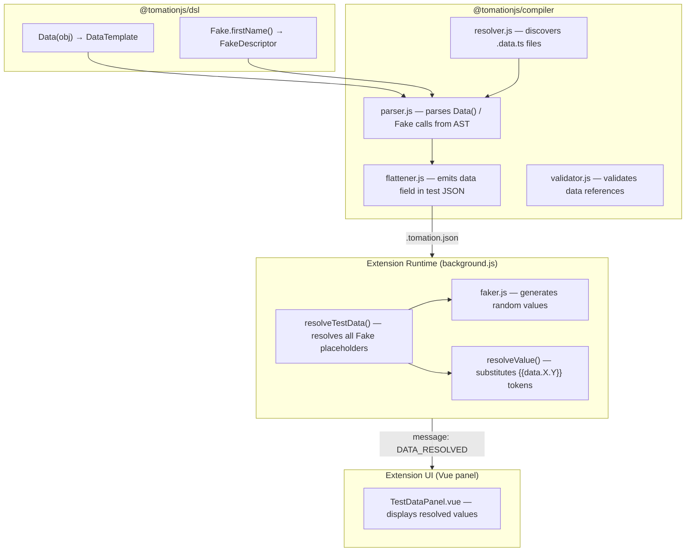

# Design Document: Test Data Generators

## Overview

This feature adds structured test data generation to the Tomation DSL, enabling test authors to define reusable data templates (`Data()`) and generate realistic fake values (`Fake`) without external dependencies. The system spans four packages:

1. **DSL Package** — exports `Data` and `Fake` stubs that produce descriptor objects at compile time
2. **Compiler** — detects Data/Fake declarations in `.data.ts` and `.test.ts` files, emits typed placeholder objects in the `.tomation.json` output
3. **Extension Runtime** — resolves Fake placeholders to concrete random values at test start, provides dot-path substitution (`{{data.patient.name}}`)
4. **Extension UI** — displays resolved data values in a "Test Data" panel above the step list

The design follows the existing pattern established by date helpers: DSL stubs produce marker objects → compiler serializes them → runtime resolves them to concrete values.

## Architecture



### Data Flow

1. **Author time**: Test author writes `Data({ name: Fake.firstName(), age: 30 })` in a `.data.ts` or `.test.ts` file.
2. **Compile time**: The compiler parses the `Data()` call via AST, identifies static values (`age: 30`) and Fake descriptors (`name: { type: "fake", method: "firstName" }`), and emits them in the test's `data` field in `.tomation.json`.
3. **Load time**: Extension loads the spec JSON; data descriptors are available but unresolved.
4. **Run time**: When a test run begins, `resolveTestData()` iterates all Fake descriptors, calls `faker.js` methods to produce concrete values, and stores them in a `dataStore` keyed by template name + property path.
5. **Execution time**: When a step references `{{data.patient.name}}`, `resolveValue()` looks up the resolved value from `dataStore`.
6. **Display time**: The resolved data map is sent to the UI panel via `DATA_RESOLVED` message.

## Components and Interfaces

### 1. DSL Package (`packages/dsl/`)

**New exports:**

```typescript
// Data function — accepts a plain object, returns a typed DataTemplate
export declare function Data<T extends Record<string, any>>(template: T): DataTemplate<T>;

// DataTemplate type — enables typed property access
export interface DataTemplate<T> {
  __data: true;
  template: T;
}

// Fake object — collection of generator methods
export declare const Fake: {
  firstName(gender?: 'male' | 'female'): string;
  lastName(): string;
  fullName(gender?: 'male' | 'female'): string;
  dateOfBirth(options?: { minAge?: number; maxAge?: number; format?: string }): string;
  phone(options?: { country?: 'US' | 'UK' | 'ES' }): string;
  address(part?: 'full' | 'street' | 'city' | 'country' | 'zip'): string;
  email(): string;
  oneOf(options: string[]): string;
  number(options?: { min?: number; max?: number; decimals?: number }): number;
};
```

**Runtime stubs (index.js):**

```javascript
function Data(template) {
  return { __data: true, template: template };
}

var Fake = {
  firstName: function(gender) {
    return { __fake: true, type: 'fake', method: 'firstName', options: { gender: gender } };
  },
  lastName: function() {
    return { __fake: true, type: 'fake', method: 'lastName', options: {} };
  },
  fullName: function(gender) {
    return { __fake: true, type: 'fake', method: 'fullName', options: { gender: gender } };
  },
  dateOfBirth: function(options) {
    return { __fake: true, type: 'fake', method: 'dateOfBirth', options: options || {} };
  },
  phone: function(options) {
    return { __fake: true, type: 'fake', method: 'phone', options: options || {} };
  },
  address: function(part) {
    return { __fake: true, type: 'fake', method: 'address', options: { part: part || 'full' } };
  },
  email: function() {
    return { __fake: true, type: 'fake', method: 'email', options: {} };
  },
  oneOf: function(options) {
    return { __fake: true, type: 'fake', method: 'oneOf', options: { values: options } };
  },
  number: function(options) {
    return { __fake: true, type: 'fake', method: 'number', options: options || {} };
  }
};
```

### 2. Compiler (`packages/compiler/`)

**Modified files:**

| File | Change |
|------|--------|
| `resolver.js` | Add `.data.ts` to discovery extensions; support `data` config property |
| `parser.js` | Detect `Data()` calls and `Fake.*` call expressions in AST; extract template structure |
| `flattener.js` | Emit `data` field on test entries that reference Data templates |
| `validator.js` | Validate data property references; error on missing properties; warn on empty data files; validate `Fake.oneOf` has non-empty array |

**New parser logic — `parseDataDeclaration(node)`:**

The parser walks the AST looking for:
- `const X = Data({...})` — variable declaration with `Data()` callee
- Properties that are `Fake.*()` calls → emit as `{ type: "fake", method, options }`
- Properties that are literals → emit as inline values

**Compiled JSON output shape:**

```json
{
  "tests": [
    {
      "name": "Register patient",
      "sourceFile": "registration",
      "steps": [...],
      "data": {
        "patient": {
          "name": { "type": "fake", "method": "fullName", "options": {} },
          "dob": { "type": "fake", "method": "dateOfBirth", "options": { "minAge": 18, "maxAge": 65, "format": "MM/DD/YYYY" } },
          "phone": { "type": "fake", "method": "phone", "options": { "country": "US" } },
          "city": "Springfield"
        }
      }
    }
  ]
}
```

### 3. Extension Runtime (`packages/extension/src/`)

**New file: `faker.js`**

A lightweight, zero-dependency module bundled with the extension that generates realistic values from internal data arrays.

**Modified file: `background.js`**

- New function `resolveTestData(testData)` called at test run start
- Extended `resolveValue()` to handle `{{data.templateName.property}}` tokens via dot-path lookup in `runState.dataStore`
- New message `DATA_RESOLVED` sent to UI panel after resolution

### 4. Extension UI (`packages/extension/panel-vue/src/`)

**New component: `TestDataPanel.vue`**

Displayed at the top of the step list in `TestPlanView.vue` when the test has data references. Shows a collapsible table of `field → resolved value` pairs.

## Data Models

### FakeDescriptor (Compiler Output)

```typescript
interface FakeDescriptor {
  type: 'fake';
  method: 'firstName' | 'lastName' | 'fullName' | 'dateOfBirth' | 'phone' | 'address' | 'email' | 'oneOf' | 'number';
  options: Record<string, any>;
}
```

### DataTemplate (Compiler Output)

```typescript
// Nested object where leaves are either FakeDescriptors or literal values
type DataFieldValue = string | number | boolean | FakeDescriptor;
type DataTemplateOutput = Record<string, DataFieldValue | Record<string, DataFieldValue>>;
```

### Test JSON `data` field

```typescript
interface TestEntry {
  name: string;
  sourceFile: string;
  steps: Step[];
  data?: Record<string, DataTemplateOutput>;  // templateName → template structure
}
```

### Runtime DataStore

```typescript
// Flat map for fast lookup by dot-path
type DataStore = Record<string, string | number>;
// Example: { "patient.name": "John Smith", "patient.dob": "03/15/1990", "patient.city": "Springfield" }
```

### DATA_RESOLVED Message

```typescript
interface DataResolvedMessage {
  type: 'DATA_RESOLVED';
  data: Record<string, string | number>;  // flat key → value pairs
}
```

## Low-Level Design: Faker Module (`faker.js`)

### Module Structure

```javascript
// faker.js — lightweight fake data generator for Tomation extension runtime
// Zero external dependencies. Uses bundled data arrays.

'use strict';

// ─── Data Arrays ─────────────────────────────────────────────────────────────

var MALE_FIRST_NAMES = ['James', 'John', 'Robert', 'Michael', 'William', 'David', 'Richard', 'Joseph', 'Thomas', 'Charles', 'Christopher', 'Daniel', 'Matthew', 'Anthony', 'Mark', 'Steven', 'Paul', 'Andrew', 'Joshua', 'Kenneth'];

var FEMALE_FIRST_NAMES = ['Mary', 'Patricia', 'Jennifer', 'Linda', 'Barbara', 'Elizabeth', 'Susan', 'Jessica', 'Sarah', 'Karen', 'Lisa', 'Nancy', 'Betty', 'Margaret', 'Sandra', 'Ashley', 'Dorothy', 'Kimberly', 'Emily', 'Donna'];

var LAST_NAMES = ['Smith', 'Johnson', 'Williams', 'Brown', 'Jones', 'Garcia', 'Miller', 'Davis', 'Rodriguez', 'Martinez', 'Hernandez', 'Lopez', 'Gonzalez', 'Wilson', 'Anderson', 'Thomas', 'Taylor', 'Moore', 'Jackson', 'Martin'];

var STREETS = ['Main St', 'Oak Ave', 'Maple Dr', 'Cedar Ln', 'Elm St', 'Pine Rd', 'Birch Blvd', 'Walnut Way', 'Cherry Ct', 'Willow Pl'];

var CITIES = ['Springfield', 'Portland', 'Franklin', 'Greenville', 'Bristol', 'Fairview', 'Salem', 'Madison', 'Georgetown', 'Arlington'];

var COUNTRIES = ['United States', 'United Kingdom', 'Canada', 'Australia', 'Germany', 'France', 'Spain', 'Italy', 'Netherlands', 'Sweden'];

var EMAIL_DOMAINS = ['example.com', 'test.org', 'mail.net', 'demo.io', 'sample.dev'];
```

### Function Signatures

```javascript
/**
 * Pick a random element from an array.
 * @param {Array} arr
 * @returns {*}
 */
function pick(arr) {
  return arr[Math.floor(Math.random() * arr.length)];
}

/**
 * Generate a random integer in [min, max] inclusive.
 * @param {number} min
 * @param {number} max
 * @returns {number}
 */
function randomInt(min, max) {
  return Math.floor(Math.random() * (max - min + 1)) + min;
}

/**
 * Generate a random first name.
 * @param {object} options - { gender?: 'male' | 'female' }
 * @returns {string}
 */
function generateFirstName(options) {
  var gender = options && options.gender;
  if (gender === 'male') return pick(MALE_FIRST_NAMES);
  if (gender === 'female') return pick(FEMALE_FIRST_NAMES);
  // Random gender
  return Math.random() < 0.5 ? pick(MALE_FIRST_NAMES) : pick(FEMALE_FIRST_NAMES);
}

/**
 * Generate a random last name.
 * @returns {string}
 */
function generateLastName() {
  return pick(LAST_NAMES);
}

/**
 * Generate a full name (first + last).
 * @param {object} options - { gender?: 'male' | 'female' }
 * @returns {string}
 */
function generateFullName(options) {
  return generateFirstName(options) + ' ' + generateLastName();
}

/**
 * Generate a random date of birth within age constraints.
 * Algorithm:
 *   1. Determine minAge (default 18) and maxAge (default 65)
 *   2. Calculate the latest possible birth date (today - minAge years)
 *   3. Calculate the earliest possible birth date (today - (maxAge+1) years + 1 day)
 *   4. Pick a random timestamp between earliest and latest
 *   5. Format using the provided format string (default 'YYYY-MM-DD')
 *
 * @param {object} options - { minAge?: number, maxAge?: number, format?: string }
 * @returns {string}
 */
function generateDateOfBirth(options) {
  var minAge = (options && options.minAge !== undefined) ? options.minAge : 18;
  var maxAge = (options && options.maxAge !== undefined) ? options.maxAge : 65;
  var format = (options && options.format) || 'YYYY-MM-DD';

  var now = new Date();
  // Latest birth date: person is exactly minAge today
  var latest = new Date(now.getFullYear() - minAge, now.getMonth(), now.getDate());
  // Earliest birth date: person turns maxAge+1 tomorrow → born on this date maxAge+1 years ago + 1 day
  var earliest = new Date(now.getFullYear() - maxAge - 1, now.getMonth(), now.getDate() + 1);

  var range = latest.getTime() - earliest.getTime();
  var randomTime = earliest.getTime() + Math.floor(Math.random() * range);
  var dob = new Date(randomTime);

  return formatDate(dob, format);
}

/**
 * Generate a phone number for the specified country.
 * Patterns:
 *   US: (XXX) XXX-XXXX
 *   UK: +44 XXXX XXXXXX
 *   ES: +34 XXX XXX XXX
 *
 * @param {object} options - { country?: 'US' | 'UK' | 'ES' }
 * @returns {string}
 */
function generatePhone(options) {
  var country = (options && options.country) || 'US';

  switch (country) {
    case 'US':
      return '(' + randomDigits(3) + ') ' + randomDigits(3) + '-' + randomDigits(4);
    case 'UK':
      return '+44 ' + randomDigits(4) + ' ' + randomDigits(6);
    case 'ES':
      return '+34 ' + randomDigits(3) + ' ' + randomDigits(3) + ' ' + randomDigits(3);
    default:
      throw new Error('Unsupported country for phone generation: ' + country);
  }
}

/**
 * Generate N random digits as a string.
 * @param {number} n
 * @returns {string}
 */
function randomDigits(n) {
  var result = '';
  for (var i = 0; i < n; i++) {
    result += String(Math.floor(Math.random() * 10));
  }
  return result;
}

/**
 * Generate an address or address component.
 * @param {object} options - { part?: 'full' | 'street' | 'city' | 'country' | 'zip' }
 * @returns {string}
 */
function generateAddress(options) {
  var part = (options && options.part) || 'full';

  switch (part) {
    case 'street':
      return randomInt(100, 9999) + ' ' + pick(STREETS);
    case 'city':
      return pick(CITIES);
    case 'country':
      return pick(COUNTRIES);
    case 'zip':
      return randomDigits(5);
    case 'full':
    default:
      return randomInt(100, 9999) + ' ' + pick(STREETS) + ', ' + pick(CITIES) + ' ' + randomDigits(5);
  }
}

/**
 * Generate a syntactically valid random email address.
 * Format: {adjective}{noun}{digits}@{domain}
 * @returns {string}
 */
function generateEmail() {
  var adjectives = ['happy', 'clever', 'swift', 'bright', 'cool', 'fast', 'keen', 'bold'];
  var nouns = ['fox', 'wolf', 'hawk', 'bear', 'deer', 'lynx', 'owl', 'seal'];
  var local = pick(adjectives) + pick(nouns) + randomInt(10, 999);
  return local + '@' + pick(EMAIL_DOMAINS);
}

/**
 * Pick a random value from a provided array.
 * @param {object} options - { values: string[] }
 * @returns {string}
 * @throws {Error} if values array is empty (should be caught at compile time)
 */
function generateOneOf(options) {
  var values = options && options.values;
  if (!values || values.length === 0) {
    throw new Error('Fake.oneOf requires at least one option');
  }
  return pick(values);
}

/**
 * Generate a random number within bounds.
 * @param {object} options - { min?: number, max?: number, decimals?: number }
 * @returns {number}
 */
function generateNumber(options) {
  var min = (options && options.min !== undefined) ? options.min : 0;
  var max = (options && options.max !== undefined) ? options.max : 1000;
  var decimals = (options && options.decimals !== undefined) ? options.decimals : 0;

  if (decimals === 0) {
    return randomInt(min, max);
  }

  var raw = min + Math.random() * (max - min);
  var factor = Math.pow(10, decimals);
  return Math.round(raw * factor) / factor;
}

/**
 * Main dispatch function. Resolves a FakeDescriptor to a concrete value.
 * @param {object} descriptor - { type: 'fake', method: string, options: object }
 * @returns {string|number}
 */
function resolveFake(descriptor) {
  switch (descriptor.method) {
    case 'firstName':   return generateFirstName(descriptor.options);
    case 'lastName':    return generateLastName();
    case 'fullName':    return generateFullName(descriptor.options);
    case 'dateOfBirth': return generateDateOfBirth(descriptor.options);
    case 'phone':       return generatePhone(descriptor.options);
    case 'address':     return generateAddress(descriptor.options);
    case 'email':       return generateEmail();
    case 'oneOf':       return generateOneOf(descriptor.options);
    case 'number':      return generateNumber(descriptor.options);
    default:
      console.warn('[tomation] Unknown fake method: ' + descriptor.method);
      return '';
  }
}
```

### Algorithm: `resolveTestData()`

```javascript
/**
 * Resolve all Fake placeholders in a test's data map to concrete values.
 * Called once at the start of each test run.
 *
 * @param {object} testData - The test's `data` field from compiled JSON
 *   Shape: { templateName: { prop: value|FakeDescriptor, ... }, ... }
 * @returns {object} Flat map of "templateName.propPath" → resolved value
 */
function resolveTestData(testData) {
  var dataStore = {};
  if (!testData || typeof testData !== 'object') return dataStore;

  var templateNames = Object.keys(testData);
  for (var i = 0; i < templateNames.length; i++) {
    var tmplName = templateNames[i];
    var template = testData[tmplName];
    resolveTemplateRecursive(tmplName, template, dataStore);
  }
  return dataStore;
}

/**
 * Recursively resolve a template object, building dot-path keys.
 * @param {string} prefix - Current dot-path prefix (e.g., "patient" or "patient.address")
 * @param {object} obj - Current template node
 * @param {object} dataStore - Target flat map
 */
function resolveTemplateRecursive(prefix, obj, dataStore) {
  var keys = Object.keys(obj);
  for (var i = 0; i < keys.length; i++) {
    var key = keys[i];
    var value = obj[key];
    var path = prefix + '.' + key;

    if (value && typeof value === 'object' && value.type === 'fake') {
      // Fake descriptor → resolve to concrete value
      dataStore[path] = resolveFake(value);
    } else if (value && typeof value === 'object' && !Array.isArray(value)) {
      // Nested object → recurse
      resolveTemplateRecursive(path, value, dataStore);
    } else {
      // Static literal value
      dataStore[path] = value;
    }
  }
}
```

### Algorithm: Extended `resolveValue()` for data tokens

The existing `resolveValue()` function is extended with a new token pattern `{{data.X.Y}}`:

```javascript
// Inside resolveValue(), after {{ctx.*}} resolution and before {{paramName}} resolution:

// Resolve {{data.templateName.property}} tokens
resolved = resolved.replace(/\{\{data\.([^}]+)\}\}/g, function(match, dataPath) {
  if (runState.dataStore && runState.dataStore.hasOwnProperty(dataPath)) {
    return String(runState.dataStore[dataPath]);
  }
  console.warn('[tomation] Unknown data path "' + dataPath + '"');
  return match;
});
```

## Correctness Properties

*A property is a characteristic or behavior that should hold true across all valid executions of a system — essentially, a formal statement about what the system should do. Properties serve as the bridge between human-readable specifications and machine-verifiable correctness guarantees.*

### Property 1: Data template static value round-trip

*For any* plain JavaScript object containing only static values (strings, numbers, booleans), passing it through the compiler's data extraction logic and then reading the compiled JSON output should produce an object with the same keys and identical literal values.

**Validates: Requirements 1.2, 10.2**

### Property 2: Fake descriptor preservation

*For any* Fake method call with valid options, the compiler should emit a placeholder object of the form `{ type: "fake", method: <methodName>, options: <originalOptions> }` that preserves the method name and all provided option values exactly.

**Validates: Requirements 1.3, 10.3**

### Property 3: Run independence

*For any* Fake descriptor, resolving it across two independent test runs should produce at least one differing result across a sufficient number of trials (i.e., the output is non-deterministic across runs).

**Validates: Requirements 1.5, 11.2**

### Property 4: firstName gender correctness

*For any* gender option (including omitted), `generateFirstName` should return a name that belongs to the appropriate name set: male names when gender is `'male'`, female names when gender is `'female'`, and either set when gender is omitted.

**Validates: Requirements 2.2, 2.3**

### Property 5: lastName membership

*For any* invocation of `generateLastName`, the returned value should be a member of the LAST_NAMES data array.

**Validates: Requirements 2.4**

### Property 6: fullName composition

*For any* gender option (including omitted), `generateFullName` should return a string of the form `"<firstName> <lastName>"` where the first-name portion belongs to the appropriate gendered name set and the last-name portion belongs to LAST_NAMES.

**Validates: Requirements 2.5**

### Property 7: dateOfBirth age bounds

*For any* minAge and maxAge where 0 ≤ minAge ≤ maxAge ≤ 120, `generateDateOfBirth({ minAge, maxAge })` should produce a date such that the computed age (years between DOB and today) is in the inclusive range [minAge, maxAge]. When both are omitted, the age should be in [18, 65].

**Validates: Requirements 3.2, 3.3, 3.6**

### Property 8: Date format token fidelity

*For any* valid date and format string composed of supported tokens (YYYY, MM, DD, M, D) and literal separators, formatting the date should produce a string from which the original year, month, and day can be extracted by parsing the token positions.

**Validates: Requirements 3.4**

### Property 9: Phone format by country

*For any* supported country code (`'US'`, `'UK'`, `'ES'`), `generatePhone({ country })` should return a string matching that country's expected format pattern: US → `(XXX) XXX-XXXX`, UK → `+44 XXXX XXXXXX`, ES → `+34 XXX XXX XXX`.

**Validates: Requirements 4.2, 4.3, 4.4**

### Property 10: Address part correctness

*For any* valid part option (`'street'`, `'city'`, `'country'`, `'zip'`, `'full'`), `generateAddress({ part })` should return a string that satisfies the format constraints for that part: street contains a number and a known street name, city is from CITIES, country is from COUNTRIES, zip is 5 digits, and full contains street + city + zip components.

**Validates: Requirements 5.2, 5.3, 5.4, 5.5, 5.6**

### Property 11: Email validity

*For any* invocation of `generateEmail`, the returned string should be a syntactically valid email address containing exactly one `@` character, a non-empty local part, and a domain from the known EMAIL_DOMAINS array.

**Validates: Requirements 6.2**

### Property 12: oneOf membership

*For any* non-empty string array, `generateOneOf({ values: array })` should return a value that is a member of that input array.

**Validates: Requirements 7.2**

### Property 13: Number range bounds

*For any* min and max where min ≤ max, `generateNumber({ min, max })` should return a number in the inclusive range [min, max].

**Validates: Requirements 8.2**

### Property 14: Number decimal precision

*For any* decimals value in [0, 10], `generateNumber({ decimals })` should return a number whose string representation has at most `decimals` digits after the decimal point. When decimals is 0 or omitted, the result should be an integer.

**Validates: Requirements 8.5, 8.6**

### Property 15: resolveTestData completeness

*For any* test data structure containing N Fake descriptor leaves (at arbitrary nesting depth), `resolveTestData` should produce a dataStore with exactly N entries, one for each dot-path corresponding to a Fake descriptor leaf, and each entry should be a non-null concrete value (string or number).

**Validates: Requirements 11.1**

### Property 16: Data token substitution consistency

*For any* data path that exists in the dataStore, calling `resolveValue` with a string containing `{{data.<path>}}` multiple times within the same run state should always return the same concrete value, and that value should equal the one stored in the dataStore.

**Validates: Requirements 11.3, 11.4**


### 5. Compiler — Const Object Resolution

The compiler tracks top-level `const` object declarations and resolves member expressions to their literal values at compile time, enabling enum-style patterns.

**Algorithm: `buildConstBindings()`**

During AST traversal, the parser identifies:
```javascript
const BloodType = { APositive: 'A+', BPositive: 'B+', ... }
```

And stores them in a `constBindings` map:
```javascript
constBindings = {
  'BloodType': { 'APositive': 'A+', 'BPositive': 'B+', ... }
}
```

**Resolution in `Fake.oneOf()` arguments:**

When parsing `Fake.oneOf([BloodType.APositive, BloodType.BPositive])`, the parser:
1. Iterates array elements
2. For each `MemberExpression` (e.g., `BloodType.APositive`):
   - Looks up `BloodType` in `constBindings`
   - Resolves `APositive` to `'A+'`
3. Emits: `{ type: "fake", method: "oneOf", options: { values: ["A+", "B+"] } }`

**Resolution in step values:**

When parsing `Type(BloodType.APositive).in(input)`, the parser resolves the member expression to the literal `'A+'` and emits it as the step's value field.

**Cross-file support:**

Const objects imported via `~/` paths (e.g., `import { BloodType } from '~/data/enums'`) are resolved by following the import, parsing the source file, and extracting the const binding.

**Usage example:**

```typescript
// data/enums.ts
export const BloodType = {
  APositive: 'A+',
  ANegative: 'A-',
  BPositive: 'B+',
  OPositive: 'O+',
} as const

export const Gender = {
  Male: 'Male',
  Female: 'Female',
  NonBinary: 'Non-binary',
} as const

// tests/patient.test.ts
import { BloodType, Gender } from '~/data/enums'

const patient = Data({
  bloodType: Fake.oneOf([BloodType.APositive, BloodType.BPositive, BloodType.OPositive]),
  gender: Fake.oneOf([Gender.Male, Gender.Female, Gender.NonBinary]),
})

// Direct use in steps
Select(BloodType.APositive).in(Form.bloodTypeSelect)
```

## Error Handling

### Compile-Time Errors

| Condition | Error Message | Behavior |
|-----------|--------------|----------|
| `Fake.oneOf([])` — empty array | `Fake.oneOf requires at least one option at {file}:{line}` | Compilation fails with validation error |
| Reference to non-existent Data_Template property | `Unknown data property "{prop}" on template "{name}" at {file}:{line}` | Compilation fails with validation error |
| Data file exports no Data_Template definitions | `Warning: Data file "{file}" exports no Data templates` | Compilation succeeds with warning |
| Circular import involving .data.ts files | `Circular import detected: A → B → ... → A` | Compilation fails (existing behavior) |
| Data file parsing failure or compilation errors | `Failed to compile data file "{file}": {reason}` | Entire compilation fails |

### Runtime Errors

| Condition | Behavior |
|-----------|----------|
| Unknown `{{data.X.Y}}` path (key not in dataStore) | Log warning `[tomation] Unknown data path "X.Y"`, leave token unresolved |
| Unsupported country in `Fake.phone` | Throw explicit `Error('Unsupported country for phone generation: {country}')` |
| Unknown fake method in descriptor | Log warning, return empty string `''` |
| `Fake.oneOf` with empty array at runtime | Throw `Error('Fake.oneOf requires at least one option')` (should never reach runtime due to compile-time validation) |

### Design Decisions

1. **Fail-fast at compile time**: Invalid data references and empty `oneOf` arrays are caught during compilation rather than at runtime, providing faster feedback.
2. **Graceful degradation at runtime**: Unknown data paths log warnings but don't crash test execution, allowing partial results.
3. **Explicit errors over silent failures**: `Fake.phone` with unsupported country throws rather than returning garbage, per Requirement 4.6.

## Testing Strategy

### Property-Based Tests (faker module)

The faker module (`faker.js`) is pure logic with clear input/output behavior, making it ideal for property-based testing. Each correctness property maps to a dedicated property-based test.

**Library**: [fast-check](https://github.com/dubzzz/fast-check) (JavaScript PBT library)

**Configuration**:
- Minimum 100 iterations per property test
- Each test tagged with: `Feature: test-data-generators, Property {N}: {title}`

**Test file**: `packages/compiler/src/faker.test.js` (faker logic is testable independently of the browser extension environment)

Property tests cover:
- Properties 4–14: All faker generation functions (name, date, phone, address, email, oneOf, number)
- Property 15: `resolveTestData` completeness
- Property 16: Data token substitution consistency

### Unit Tests (Example-Based)

| Area | Tests |
|------|-------|
| DSL stubs | `Data()` returns correct descriptor shape; `Fake.*` methods return correct descriptor shapes |
| Compiler parser | Parses inline `Data()` declarations; parses imported data templates; handles nested objects |
| Compiler validator | Reports error on empty `Fake.oneOf`; reports error on invalid property reference; warns on empty data file |
| Compiler flattener | Emits `data` field on test entries; handles multiple templates per test |
| Resolver | Discovers `.data.ts` files; resolves `~/data/` imports; supports `data` config property |
| Runtime | `resolveValue` handles `{{data.X.Y}}` tokens; `resolveTestData` handles nested templates; default format for dateOfBirth |

### Integration Tests

| Scenario | Verification |
|----------|--------------|
| End-to-end compile with `.data.ts` file | Compiled JSON contains correct `data` field structure |
| Test referencing imported Data template | Resolver discovers data file, parser extracts templates, flattener includes in output |
| Extension runtime resolves compiled test data | Load spec JSON, trigger run, verify `DATA_RESOLVED` message contains values |

### Edge Cases (Covered by Property Generators)

- `Fake.dateOfBirth({ minAge: 0 })` — infant edge case
- `Fake.number({ min: 0, max: 0 })` — single-value range
- `Fake.number({ decimals: 0 })` — explicit integer
- `Fake.oneOf(['single'])` — single-element array
- Deeply nested data templates (3+ levels)
- Data template with all static values (no Fake calls)
- Data template with all Fake calls (no static values)
