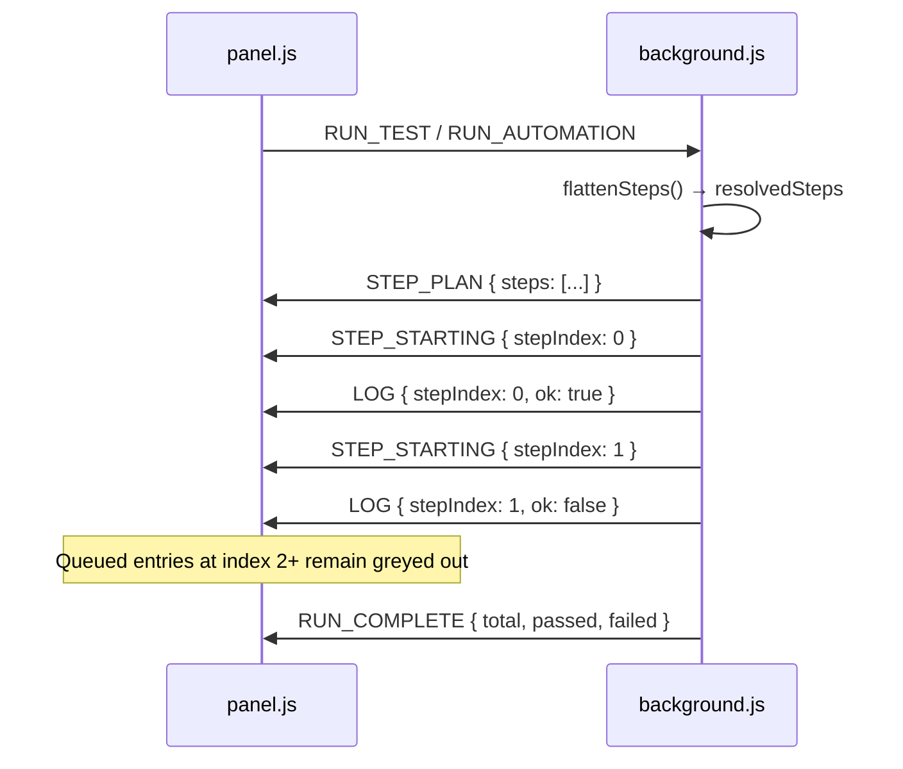
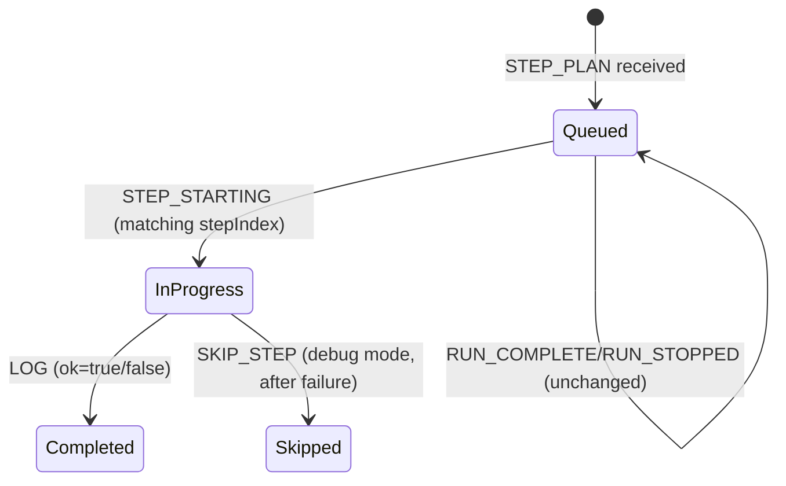

# Design Document: Test Plan Execution Log

## Overview

This feature enhances the Tomation extension's execution log to render the complete test plan upfront when a run starts. Instead of only showing steps as they execute, the panel will display all steps immediately in a "queued" (greyed-out) state. As each step runs, it transitions through visual states: queued → in-progress (spinner, accent styling) → completed (pass/fail). This gives testers full visibility into the test scope and real-time tracking of execution progress.

The implementation requires:
1. A new `STEP_PLAN` message sent from `background.js` to the panel at run start
2. Panel logic to render all plan steps as queued entries
3. State transitions driven by existing `STEP_STARTING` and `LOG` messages
4. Graceful handling of stops (queued entries persist unchanged when run is halted)

## Architecture

The feature follows the existing message-passing architecture between `background.js` (service worker) and `panel.js` (sidebar UI). No new communication channels are needed — only a new message type (`STEP_PLAN`) is added to the existing `safeSendMessage` / `onBackgroundMessage` flow.



### State Lifecycle per Step Entry



## Components and Interfaces

### New Message: STEP_PLAN

Sent by `background.js` immediately after step flattening, before the first `STEP_STARTING`.

```javascript
{
  type: 'STEP_PLAN',
  steps: [
    {
      action: 'click',          // step action type
      target: 'Login__btn',     // element key or null
      value: null,              // resolved value or null
      url: null,                // for navigate steps
      description: null,        // for manual steps
      ms: null,                 // for wait steps
      taskName: 'LoginTask'     // parent task name, or null if standalone
    },
    // ...
  ]
}
```

### background.js Changes

**Location:** After `flattenSteps()` call in `startRun()` and `startAutomationRun()`.

New function:

```javascript
/**
 * Build and send the STEP_PLAN message to the panel.
 * Annotates each resolved step with its parent taskName for hierarchical rendering.
 *
 * @param {Array} resolvedSteps - The flattened step array from flattenSteps()
 * @param {Array} originalSteps - The test's top-level steps array
 * @param {object} tasksMap - The spec's tasks map
 * @param {Array|Set} checkedSteps - Checked top-level step indices
 */
function emitStepPlan(resolvedSteps, originalSteps, tasksMap, checkedSteps) {
  var planSteps = [];
  // ... build annotated plan entries with taskName field
  safeSendMessage({ type: 'STEP_PLAN', steps: planSteps });
}
```

### panel.js Changes

**New handler in `onBackgroundMessage` switch:**

```javascript
case 'STEP_PLAN':
  renderStepPlan(message.steps);
  break;
```

**New rendering function:**

```javascript
/**
 * Render all steps from the STEP_PLAN message as queued entries in the log container.
 * Task boundaries produce task-header rows; child steps are indented.
 *
 * @param {Array} steps - The step plan array from background
 */
function renderStepPlan(steps) { /* ... */ }
```

**Modified `appendInProgressEntry`:** Instead of appending a new entry, it locates the existing queued entry by `data-step-index` and transitions it to in-progress state. Falls back to appending if no queued entry exists.

**Modified `finalizeInProgressEntry` + `appendLogEntry`:** When a LOG arrives, the in-progress entry (or queued entry) at the matching stepIndex is replaced with the completed log entry.

### CSS Classes

| State | CSS Class | Visual Treatment |
|-------|-----------|-----------------|
| Queued | `.log-entry.queued` | `color: var(--text-muted)`, no left border, no indicator |
| In-Progress | `.log-entry.in-progress` | Accent left border, accent-soft background, spinner |
| Completed (pass) | `.log-entry.pass` | Green left border, ✓ indicator |
| Completed (fail) | `.log-entry.fail` | Red left border, ✗ indicator, error text |
| Skipped | `.log-entry.skipped` | Muted text, ⊘ badge |

New CSS rule to add:

```css
.log-entry.queued {
  color: var(--text-muted);
  border-left: 3px solid transparent;
}
```

## Data Models

### STEP_PLAN Message Shape

```typescript
interface StepPlanMessage {
  type: 'STEP_PLAN';
  steps: StepPlanEntry[];
}

interface StepPlanEntry {
  action: string;           // 'click' | 'type' | 'navigate' | 'wait' | 'manual' | 'assertExists' | etc.
  target: string | null;    // pageElement key, or null
  value: string | null;     // resolved value, or null
  url: string | null;       // for navigate steps
  description: string | null; // for manual steps
  ms: number | null;        // for wait steps
  taskName: string | null;  // parent task name if expanded from a task, null otherwise
  gone: boolean | undefined; // for waitFor steps with gone flag
  contextKey: string | undefined; // for save* steps
}
```

### DOM Structure (Queued Entries)

Each queued entry in the log container:

```html
<!-- Task header (rendered at task boundaries) -->
<div class="log-entry task-header queued" data-step-index="0">
  <span class="step-action">Task</span> Login.doLogin
</div>

<!-- Queued child step -->
<div class="log-entry queued indented" data-step-index="1">
  <span class="step-action">Type</span>
  <span class="element-badge">Email Input</span>
  <span class="step-value">"user@example.com"</span>
</div>

<!-- Queued standalone step -->
<div class="log-entry queued" data-step-index="3">
  <span class="step-action">Click</span>
  <span class="element-badge">Submit Button</span>
</div>
```

## Correctness Properties

*A property is a characteristic or behavior that should hold true across all valid executions of a system — essentially, a formal statement about what the system should do. Properties serve as the bridge between human-readable specifications and machine-verifiable correctness guarantees.*

### Property 1: Step plan rendering produces correct entry count with queued class

*For any* valid STEP_PLAN message containing N step entries (where N ≥ 0), after rendering the plan in the log container, the container SHALL contain exactly N entries with the `queued` CSS class (not counting task-header entries that serve as visual grouping).

**Validates: Requirements 1.1, 1.5**

### Property 2: Queued entries contain action labels but no status indicators

*For any* step rendered as a queued entry, the rendered HTML SHALL contain the step's action label (capitalized action name) and applicable fields (target, value, url, ms, description) but SHALL NOT contain the characters ✓, ✗, or a `.spinner` element.

**Validates: Requirements 1.2, 2.2**

### Property 3: Task boundaries produce hierarchical structure

*For any* step plan where consecutive steps share the same non-null taskName that differs from the preceding step's taskName, the rendering SHALL insert a task-header entry before those steps, and all steps within that task group SHALL have the `indented` CSS class.

**Validates: Requirements 1.3**

### Property 4: STEP_STARTING transitions exactly one entry to in-progress

*For any* step plan rendered as queued entries, when a STEP_STARTING message is received with stepIndex=K, exactly one entry (at index K) SHALL have the `in-progress` class and contain a spinner element, and no other entry in the container SHALL have the `in-progress` class.

**Validates: Requirements 2.3, 3.1, 3.2**

### Property 5: LOG message transitions entry from in-progress to completed state

*For any* step that is in the in-progress state, when a LOG message is received with a matching stepIndex and an `ok` field (true or false), the entry SHALL lose the `in-progress` class and gain either the `pass` class (if ok=true, with ✓) or the `fail` class (if ok=false, with ✗ and error text).

**Validates: Requirements 1.4, 4.1**

### Property 6: STEP_PLAN message contains all resolved steps with correct fields

*For any* test definition with N top-level checked steps that expand (via flattenSteps) into M resolved steps, the STEP_PLAN message SHALL contain exactly M entries, and each entry expanded from a task action SHALL have its `taskName` field set to that task's name, while standalone steps SHALL have `taskName` equal to null.

**Validates: Requirements 5.1, 5.2, 5.4**

### Property 7: Run completion preserves all queued entries in the DOM

*For any* step plan rendered with T total entries, after a RUN_COMPLETE or RUN_STOPPED message is received (regardless of how many steps completed), the log container SHALL still contain exactly T entries (none removed or hidden).

**Validates: Requirements 6.2, 6.3**

## Error Handling

| Scenario | Handling |
|----------|----------|
| STEP_PLAN with empty steps array | Render nothing in the log; RUN_COMPLETE will show summary with total=0 |
| STEP_STARTING for stepIndex not in plan | Append a new in-progress entry (fallback, Req 3.5) |
| LOG for stepIndex with no matching entry | Append completed entry directly (fallback, Req 4.5) |
| Panel reconnects mid-run (STATE_SYNC) | Existing STATE_SYNC handler restores running state; queued entries won't be shown (acceptable degradation since the plan was rendered before disconnect) |
| STEP_PLAN arrives after panel already shows entries | Clear log container before rendering plan (same as current switchToRunView behavior) |

## Testing Strategy

### Unit Tests (Example-Based)

- Verify a queued entry for a `navigate` step displays the URL
- Verify a queued entry for a `wait` step displays the ms value
- Verify the spinner element (⟳) appears on in-progress entries
- Verify scroll behavior when transitioning a later step to in-progress
- Verify skip action (on a failed in-progress entry) applies `.skipped` class and ⊘ badge
- Verify RUN_STOPPED leaves remaining queued entries unchanged
- Verify STEP_STARTING with no matching entry appends a new entry
- Verify LOG with no matching in-progress entry still appends completed entry
- Verify pass entry contains ✓ with `.pass` class
- Verify fail entry contains ✗ with `.fail` class and error text

### Property-Based Tests

Property-based tests use `fast-check` to generate random inputs and verify universal properties hold across all valid cases. Each test runs a minimum of 100 iterations.

**Library:** `fast-check` (JavaScript PBT library)

Tests to implement:
1. **Property 1** — Generate random step plan arrays (0–50 steps with varied actions), render, verify entry count matches.
2. **Property 2** — Generate random steps of all action types, render as queued, verify no ✓/✗/spinner present and action label exists.
3. **Property 3** — Generate step plans with random task groupings, verify task-header presence and `.indented` class on children.
4. **Property 4** — Generate plans, render, send STEP_STARTING for random index, verify exactly one `.in-progress` entry.
5. **Property 5** — Generate random ok/fail results, verify correct class transition from in-progress to pass/fail.
6. **Property 6** — Generate test definitions with tasks and standalone steps, call `emitStepPlan` logic, verify field correctness and taskName annotations.
7. **Property 7** — Generate plans, simulate partial completion + RUN_COMPLETE, verify entry count preserved.

Each property test is tagged with: `Feature: test-plan-execution-log, Property {N}: {title}`

### Integration Tests

- Full message flow: RUN_TEST → STEP_PLAN → STEP_STARTING × N → LOG × N → RUN_COMPLETE
- Verify panel renders correctly through the complete lifecycle
- Verify debug mode skip on a failed step leaves remaining queued entries intact
