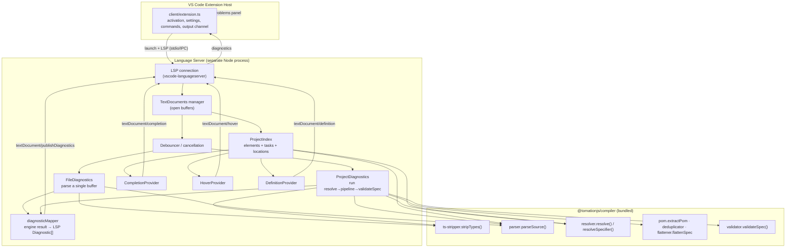

# Design Document: VS Code Tomation DSL Extension

## Overview

This feature delivers a Visual Studio Code extension that provides **live diagnostics** (errors and warnings) and **DSL-aware authoring assistance** (completions, hover documentation, and go-to-definition) for Tomation DSL files — `*.pom.ts`, `*.test.ts`, `*.automation.ts`, and `*.data.ts`. As the developer types, the extension validates the buffer and publishes VS Code Diagnostics that render as inline squiggles and Problems-panel entries, using the **same parsing and validation rules** as `tomation compile`/`tomation check`.

The core design principle is **engine reuse**: the extension does not reimplement DSL rules. It depends on `@tomationjs/compiler` and calls its already-exported functions in-process — `parseSource` (per-file parse + warnings), `stripTypes` (TypeScript → plain JS), `resolve` (project file discovery + config), the POM/flatten pipeline, and `validateSpec` (cross-file validation). This guarantees editor diagnostics stay consistent with the CLI and collapses maintenance to a single rule set.

The extension is built as a **Language Server Protocol (LSP)** client/server pair. The server hosts all validation work in a separate Node process, keeping the extension host responsive (Req 11.1, 11.5). The client is a thin VS Code activation shim that wires the server, settings, and commands.

Authoring features are powered by a **Project Symbol Index** — an in-memory model built by parsing the workspace's DSL files with the same compiler parser — so completions and navigation reflect the developer's own elements and tasks, not just the static DSL type surface. All features run in the LSP server; the client stays a thin activation shim.

### Design Goals

- **Consistency**: editor problems match `tomation check` output (Req 5).
- **Authoring assistance**: context-aware completions, hover docs, and go-to-definition driven by a Project Symbol Index of the user's elements and tasks (Req 7, 8, 9, 10).
- **Responsiveness**: never block the UI; debounce edits; one long-lived server (Req 11).
- **Two diagnostic scopes**: instant file-scoped parse diagnostics + project-scoped cross-file validation when a config exists (Req 6).
- **Robustness**: isolate failures per file; never modify user files; coexist with the TypeScript language service (Req 15).
- **Releasable**: bundled `.vsix`, tested, documented, monorepo-integrated (Req 14).

## Architecture

The extension follows the standard VS Code LSP topology: a **client** (runs in the extension host) launches and manages a **server** (a separate Node process). All DSL parsing/validation happens in the server, which imports `@tomationjs/compiler` directly.



### Why LSP (vs. a diagnostics-only in-process provider)

An in-process `vscode.DiagnosticCollection` provider is simpler, but the compiler's project pipeline (resolve → strip → parse many files → flatten → validate) can be non-trivial on large projects and would run on the extension host thread. LSP moves that off the UI thread by construction (Req 11.1), gives us built-in debounced document sync, request cancellation, and a clean path to future language features. The extra moving part (a server process) is justified by the responsiveness and extensibility requirements. This is the officially recommended pattern for validation-heavy VS Code extensions. It also gives completion, hover, and definition a single well-defined protocol surface, so the authoring features share the same server, document sync, and Project Symbol Index as diagnostics.

### Package layout

```
packages/vscode-extension/
├── package.json              # extension manifest (contributes, activationEvents, engines.vscode)
├── tsconfig.json
├── .vscodeignore             # exclude src maps, tests, node_modules dev files from .vsix
├── README.md                 # file types, settings, commands, min VS Code version
├── esbuild.js                # bundles client + server (+ compiler code) into dist/
├── language-configuration.json (optional; only if needed for the DSL association)
├── src/
│   ├── client/
│   │   └── extension.ts      # activate(): start server, register commands, watch settings
│   └── server/
│       ├── server.ts         # LSP wiring: onInitialize, document events, config
│       ├── diagnostics/
│       │   ├── fileDiagnostics.ts     # single-buffer parse → engine warnings/errors
│       │   ├── projectDiagnostics.ts  # config-scoped full pipeline → validateSpec
│       │   └── diagnosticMapper.ts    # engine result → LSP Diagnostic[]
│       ├── index/
│       │   └── projectIndex.ts        # parse DSL files → element/task symbol model
│       ├── providers/
│       │   ├── completionProvider.ts  # is./chain/matcher/element/task/action completions
│       │   ├── hoverProvider.ts       # DSL symbol + element/task hover docs
│       │   ├── definitionProvider.ts  # element/task go-to-definition
│       │   └── positionContext.ts     # classify cursor position (which completion context)
│       ├── engine/
│       │   └── engine.ts     # thin adapter over @tomationjs/compiler exports + safe loading
│       ├── util/
│       │   ├── debounce.ts
│       │   ├── dslFile.ts    # isDslFile(), fileKind()
│       │   └── settings.ts   # typed settings snapshot
│       └── output.ts         # dedicated output channel logging (relayed to client)
└── test/
    ├── diagnosticMapper.test.ts   # unit: mapping severities/ranges/dedup
    ├── fileDiagnostics.test.ts    # unit: engine result → diagnostics
    ├── projectIndex.test.ts        # unit: parse → symbols, cross-file namespace resolution
    ├── positionContext.test.ts     # unit: cursor position classification
    ├── completionProvider.test.ts  # unit: context → completion items
    ├── hoverProvider.test.ts       # unit: symbol → hover content
    ├── definitionProvider.test.ts  # unit: reference → location
    └── integration/               # @vscode/test-electron end-to-end (optional CI)
```

## Components and Interfaces

### 1. Client (`src/client/extension.ts`)

Thin activation shim. Responsibilities:

- **Activation** (Req 1.3, 1.4): declares narrow `activationEvents` so it loads only for Tomation projects. Because the extension should activate when DSL files merely *exist* in the workspace (not just when opened), activation uses `workspaceContains` globs plus the language/file-open events:

  ```jsonc
  // package.json (excerpt)
  "activationEvents": [
    "workspaceContains:**/*.pom.ts",
    "workspaceContains:**/*.test.ts",
    "workspaceContains:**/*.automation.ts",
    "workspaceContains:**/*.data.ts",
    "workspaceContains:**/tomation.config.ts",
    "workspaceContains:**/tomation.config.js"
  ]
  ```

- **Server lifecycle**: builds `LanguageClient` options and starts the server. On `deactivate()`, calls `client.stop()`, which terminates the server process and disposes the diagnostic collection the client owns (Req 1.5).
- **Commands** (Req 13.1–13.3): registers `tomation.validateActiveFile`, `tomation.validateWorkspace`, `tomation.clearDiagnostics`; each forwards to the server via a custom LSP request/notification.
- **Output channel** (Req 13.5): creates a `Tomation` output channel; the LSP `window/logMessage` and a custom log notification from the server are written here.
- **Settings bridge**: pushes workspace configuration to the server on `initialize` and on `workspace/didChangeConfiguration`.

`LanguageClient` `documentSelector` scopes the server to DSL files only (Req 2.1, 2.2). Because DSL files are also TypeScript, the selector uses **filename patterns**, not the whole `typescript` language, so the extension never displaces the built-in TS service for ordinary `.ts` files (Req 2.4, 15.5):

```ts
documentSelector: [
  { language: 'typescript', pattern: '**/*.pom.ts' },
  { language: 'typescript', pattern: '**/*.test.ts' },
  { language: 'typescript', pattern: '**/*.automation.ts' },
  { language: 'typescript', pattern: '**/*.data.ts' },
]
```

### 2. Server bootstrap (`src/server/server.ts`)

Uses `vscode-languageserver/node` and `vscode-languageserver-textdocument`:

- Creates the connection and a `TextDocuments<TextDocument>` manager (gives open-buffer content including unsaved edits — Req 3.6).
- `onInitialize`: reports capabilities — `textDocumentSync` (incremental), `completionProvider` (with trigger characters `.`, `(`, and `'`), `hoverProvider`, and `definitionProvider`. Captures `initializationOptions` for settings and workspace folders (Req 6.6, 7.6 multi-root).
- Wires document events → the Scheduler (below):
  - `documents.onDidOpen` → validate file (Req 3.1).
  - `documents.onDidChangeContent` → debounced file validation of the live buffer (Req 3.2, 3.3, 3.6).
  - `documents.onDidClose` → the manager stops tracking the buffer; the server clears diagnostics **only when no other open document has the same URI** (Req 3.5). (VS Code delivers one `onDidClose` per document URI when the last editor for it closes, so tracking presence in the `TextDocuments` set is sufficient.)
  - `onDidSave` (via `textDocument/didSave`) → validate saved content and, if enabled, re-run project validation for that folder (Req 3.4, 6.5).
- `onDidChangeWatchedFiles` for `**/tomation.config.{ts,js}` and DSL files → trigger project re-validation (Req 6.5). The client registers the file watcher and relays events.
- `onDidChangeConfiguration` → refresh the settings snapshot; only act if a value actually changed (Req 12.7).
- Registers LSP handlers `onCompletion`, `onHover`, and `onDefinition`, each delegating to the corresponding provider (Req 8, 9, 10). Handlers first check the feature-enable settings (Req 12.5, 12.6) and return empty/null when disabled so built-in TypeScript features are unaffected.
- Feeds the Project Symbol Index: on document open/change/save/delete and on watched-file events, schedules a debounced index update for the affected file/folder (Req 7.3).

### 3. Scheduler / Debouncer (`src/server/util/debounce.ts`)

Coalesces edits and cancels superseded work (Req 3.3, 11.2–11.4):

```ts
interface Scheduler {
  // schedule per-URI file validation; newer calls cancel the pending/in-flight one for that URI
  scheduleFile(uri: string, run: (token: CancellationToken) => Promise<void>): void;
  // schedule per-workspace-folder project validation, coalesced
  scheduleProject(folder: string, run: (token: CancellationToken) => Promise<void>): void;
  dispose(): void;
}
```

- Per-URI timer keyed by document URI; a new change resets the timer (default `debounceInterval` = 300 ms, Req 11.2).
- Each run gets a `CancellationTokenSource`; scheduling a newer run for the same key cancels the previous token (Req 11.4). Long project validations check the token between files to bail early.
- Project validation is additionally coalesced per workspace folder so N file saves collapse to one pass (Req 11.3).

### 4. Engine adapter (`src/server/engine/engine.ts`)

The single boundary to `@tomationjs/compiler`. Loads the compiler lazily and safely (Req 5.1, 5.2, 13.4):

```ts
interface Engine {
  ready: boolean;                 // false if the compiler failed to load
  loadError?: string;
  parseSource(source: string, filePath: string, rawSource: string | null,
              options?: { baseUrl?: string }): ParsedFile;   // parser.parseSource
  stripTypes(source: string, filePath: string): StripResult; // ts-stripper.stripTypes
  resolveProject(cwd: string): ResolveResult;                 // resolver.resolve
  runProjectPipeline(cwd: string): PipelineResult;            // resolve→…→validateSpec
}
```

- Imports are wrapped in `try/catch`; if `require('@tomationjs/compiler/...')` fails, `ready=false` and `loadError` is set. File-scoped and project-scoped diagnostics both short-circuit to a no-op, but **the extension keeps running** and other non-engine functionality (commands, output channel, activation) remains available (Req 13.4). The client shows one clear, actionable error (Req 13.4) and logs to the output channel (Req 13.5).
- The adapter mirrors the CLI pipeline in `packages/compiler/bin/tomation.js`: for `.ts` files it calls `stripTypes` first (passing the raw TS source through as `rawSource` for automation param extraction), then `parseSource` (Req 5.5). This is the exact ordering the compiler uses, guaranteeing identical behavior.
- `runProjectPipeline` reuses `resolve → stripTypes → parseSource → extractPom → deduplicateKeys → flattenSpec → validateSpec`, the same sequence as `runPipeline()` in the CLI, returning either `{ ok: true }` or `{ ok: false, error, warnings }`.

> Note: `@tomationjs/compiler` exposes these as CommonJS module exports (`parser.parseSource`, `ts-stripper.stripTypes`, `resolver.resolve`, `validator.validateSpec`, `pom.extractPom`, `deduplicator.deduplicateKeys`, `flattener.flattenSpec`). The adapter imports the submodules directly, matching how the CLI consumes them today.

### 5. File diagnostics (`src/server/diagnostics/fileDiagnostics.ts`)

Produces **file-scoped** diagnostics from a single buffer, requiring no other files (Req 6.1):

1. Read buffer text from the `TextDocuments` manager (unsaved content, Req 3.6).
2. If the file is `.ts`, `engine.stripTypes(text, filePath)`:
   - If `stripResult.error`, emit **one** Error diagnostic at `stripResult.error.line` and stop (Req 15.3 — a single syntax error, not a cascade).
   - Else use `stripResult.code` as the parse input.
3. `engine.parseSource(code, filePath, rawTsSource, { baseUrl })`.
4. Translate the result via `diagnosticMapper`:
   - `parsed.error` (acorn/parse failure) → one Error diagnostic (Req 4.2, 15.3).
   - each `parsed.warnings[]` entry → one Warning diagnostic (Req 4.1). A warning that is inherently fatal keeps its severity per the mapper's rule table (Req 4.2 confirmed by analysis).
5. Wrap the whole pass in `try/catch`; any thrown error becomes a single Error diagnostic and the pass returns (Req 5.4, 15.2).

The engine's warning objects are already `{ message, filePath, line, source? }`, so mapping is direct.

### 6. Project diagnostics (`src/server/diagnostics/projectDiagnostics.ts`)

Produces **project-scoped** cross-file diagnostics, gated on a config file (Req 6.2):

1. For a workspace folder, locate `tomation.config.ts`/`.js`. If absent → skip project validation; file-scoped diagnostics still apply to open files (Req 6.4).
2. If the config exists but `resolve()` fails to read/parse it (malformed/unreadable) → **skip project validation entirely** for that folder and log to the output channel; do **not** emit misleading errors and do not block file-scoped diagnostics (Req 6.2 malformed-config clarification).
3. Otherwise run `engine.runProjectPipeline(folderCwd)`.
   - On success: clear any prior project-level diagnostics for the folder.
   - On failure: map the pipeline error/warnings to diagnostics. Because the pipeline surfaces:
     - **per-file warnings** (each carries `filePath` + `line`) → attributed to that file/line (Req 6.3),
     - a **single validation error string** without file/line (from `validateSpec`) → attributed to the folder's config file at line 1, as a designated project-level location (Req 6.3, 4.4).
4. Runs on save of any DSL file or the config in that folder (Req 6.5), coalesced per folder by the scheduler (Req 11.3).

Multi-root: the server iterates workspace folders independently, each keyed by its own config (Req 6.6).

### 7. Diagnostic mapper (`src/server/diagnostics/diagnosticMapper.ts`)

Pure, unit-testable translation from engine output to `Diagnostic[]` (Req 4, Req 14.3). No VS Code API dependency beyond the LSP `Diagnostic` shape, so it is trivially testable.

```ts
type EngineWarning = { message: string; filePath: string; line: number; source?: string };
type EngineError   = { message: string; line?: number };

function toDiagnostics(input: {
  parseError?: EngineError | null;
  warnings?: EngineWarning[];
  validationError?: string | null;
  documentText: string;           // to compute full-line ranges
}): Diagnostic[];
```

Rules:

- **Severity** (Req 4.1, 4.2): parse warnings → `Warning`; parse errors, strip errors, validation errors, and fatal warnings → `Error`.
- **Range** (Req 4.3, 4.4):
  - Given a `line` (1-based from the engine), produce a 0-based LSP range covering that whole line (start col 0 → line length). When the engine later provides column/token offsets, the mapper prefers the precise range (forward-compatible; today most engine diagnostics are line-only).
  - `line` of `0` or missing → range on line 0 (first line) so it stays visible (Req 4.4).
- **source** = `"tomation"` on every diagnostic (Req 4.5).
- **code**: when the message matches a known stable pattern (e.g., unresolved-import, unknown-action), attach a short `code` string; otherwise omit (Req 4.6).
- **Dedup** (Req 15.4): collapse diagnostics with identical `(severity, range, message)`.
- **Message hygiene**: engine messages sometimes embed `filePath:line`; the mapper keeps the human message but the range already conveys location, so it does not double-encode.

### 8. Project Symbol Index (`src/server/index/projectIndex.ts`)

The Project Symbol Index is the backbone of the authoring features (Req 7). It is a per-workspace-folder, in-memory model of every declared element and task, keyed by the name and namespace the compiler would produce, so suggestions and navigation match compiled output (Req 7.4).

```ts
interface ElementSymbol {
  variableName: string;      // local declaration name (e.g., submitButton)
  namespacedKey: string;     // resolved key used in steps (e.g., Login__submitButton)
  tag: string;               // resolved tag, or '*' for xpath elements
  label: string | null;      // .as('Label')
  whereSummary: string;      // human-readable matcher summary (e.g., id="login-btn")
  filePath: string;
  line: number;              // 1-based declaration line
}

interface TaskSymbol {
  name: string;              // local task name
  namespacedKey: string;     // resolved task key
  label: string | null;
  paramNames: string[];
  filePath: string;
  line: number;
}

interface ProjectIndex {
  elements: Map<string, ElementSymbol>;  // keyed by namespacedKey
  tasks: Map<string, TaskSymbol>;        // keyed by namespacedKey
  byFile: Map<string, { elements: string[]; tasks: string[] }>; // for incremental removal
}
```

How it is built:

1. For each DSL file in the folder, run `stripTypes` (for `.ts`) then `parser.parseSource`. Reuse the same adapter as diagnostics; the parser already returns `elements[]` (`{ variableName, tag, label, where, childOf, xpath, line }`) and `tasks[]` (`{ name, label, params, line }`) with declaration lines (Req 7.1, 7.2).
2. Derive each file's namespace via `pom.deriveNamespace(filePath, pomDir)` and build `namespacedKey = namespace + '__' + variableName`, mirroring `extractPom`, so keys match what steps reference (Req 7.4).
3. Summarize `where` into `whereSummary` (e.g., `{ id: 'login-btn' }` → `id="login-btn"`) for hover/completion detail (Req 7.2).
4. Resolve cross-file references using `resolver.resolveSpecifier` on the file's `imports[]`, so an element imported via a `~/` alias is indexed under the correct namespace (Req 7.4).

Incremental maintenance (Req 7.3): index updates are keyed by file. On a file change/save the server re-parses only that file, removes its prior symbols via `byFile`, and re-inserts. On delete, its symbols are removed. Updates run through the same debounce scheduler as diagnostics so typing stays responsive.

Fallback (Req 7.5): when no `tomation.config` is present, the index still parses open DSL files and any files reachable via their resolvable imports, so completions/definitions work for ad-hoc files. Multi-root: one index per workspace folder (Req 7.6).

### 9. Position context + providers

All three authoring providers first classify the cursor via a shared `positionContext.ts` helper, which inspects the buffer around the cursor (and, where helpful, a lightweight parse) to decide what kind of position it is. This keeps each provider small and makes classification independently testable.

```ts
type PositionKind =
  | { kind: 'isTag' }                       // after `is.`
  | { kind: 'builderChain' }                // after `is.TAG` or a chain method
  | { kind: 'whereArg' }                    // inside `.where( … )`
  | { kind: 'elementRef' }                  // Click(▮), .in(▮), Assert*(▮), childOf(▮)
  | { kind: 'taskRef' }                     // statement position in a Test/Automation/Task body
  | { kind: 'topLevelAction' }              // start of a statement in a runnable/task body
  | { kind: 'symbolAt', word: string, dotted?: string } // hover/definition target
  | { kind: 'none' };
```

**Completion provider** (`completionProvider.ts`, Req 8):
- `isTag` → HTML tag names + `ELEMENT` (Req 8.1). The tag list comes from the DSL type surface / a curated constant, matching what the builder proxy accepts.
- `builderChain` → `where`, `childOf`, `navigate`, `as` appropriate to position (Req 8.2).
- `whereArg` → matcher factories (`idIs`, `innerTextIs`, `classIncludes`, `placeholderIs`, `nameIs`, `typeIs`, `closestLabelIs`, `nthChild`, `isDisabled`, …) with argument snippets (Req 8.3). The matcher set is derived from the same list the parser recognizes in `extractMatcherCall`.
- `elementRef` → element names from the Project Index, presenting the local name in-file and the namespaced/alias form cross-file (Req 8.4).
- `taskRef` → task names from the Project Index, including namespaced tasks (Req 8.5).
- `topLevelAction` → DSL actions/constructs (`Click`, `Type`, `Select`, `Navigate`, `AssertExists`, `AssertHasText`, `Test`, `Task`, `Automation`, `When`, …) recognized by the parser (Req 8.6).
- Completion items carry documentation where available (Req 8.7). The provider only *adds* items and never resolves TypeScript's own completions, so built-in suggestions remain (Req 8.8). If the index is unavailable or the position is `none`, it returns an empty list, leaving TS intact (Req 8.9).

**Hover provider** (`hoverProvider.ts`, Req 9):
- Over a DSL action/matcher/builder method → concise description from a static docs map (Req 9.1).
- Over an `elementRef` → the element's `ElementSymbol` summary: tag, label, `whereSummary`, and source location (Req 9.2).
- Over a `taskRef` → the task's name and declaration location (Req 9.3).
- Otherwise returns `null`, deferring to TypeScript hover (Req 9.4).

**Definition provider** (`definitionProvider.ts`, Req 10):
- On an `elementRef` → `Location` of the element's `filePath:line` from the index (Req 10.1).
- On a `taskRef` → `Location` of the task's declaration (Req 10.2), opening the other DSL file when cross-file (Req 10.3).
- On anything else → `null`, deferring to TypeScript go-to-definition (Req 10.4). Unresolved symbols return no result rather than a wrong location (Req 10.5).

### 10. Docs map (`src/server/providers/docs.ts`)

A small static table mapping DSL symbol names (actions, matcher factories, builder methods, `is`, `Test`/`Task`/`Automation`/`When`) to short Markdown descriptions and argument hints, sourced from the DSL `index.d.ts` JSDoc and the docs page. Used by both completion (Req 8.7) and hover (Req 9.1). Kept intentionally small and static so it has no runtime cost and is easy to keep in sync.

### 11. Settings (`src/server/util/settings.ts`) and manifest contributions

All settings namespaced under `tomation` (Req 12.8), contributed in `package.json`:

| Setting | Type | Default | Requirement |
| --- | --- | --- | --- |
| `tomation.validation.enabled` | boolean | `true` | 12.1 |
| `tomation.validation.projectScope` | boolean | `true` | 12.2 |
| `tomation.validation.debounceInterval` | number (ms) | `300` | 12.3, 11.2 |
| `tomation.validation.runOn` | `"type"` \| `"save"` | `"type"` | 12.4 |
| `tomation.completion.enabled` | boolean | `true` | 12.5 |
| `tomation.hover.enabled` | boolean | `true` | 12.6 |

Note: the `tomation.hover.enabled` setting also gates go-to-definition (per Req 12.6).

Behavior:
- Disabling `enabled` clears all Tomation diagnostics and stops validation (Req 12.1).
- `projectScope=false` runs only file-scoped diagnostics even when a config exists (Req 12.2).
- `runOn="save"` skips `onDidChangeContent` validation and only validates on save (Req 12.4).
- `completion.enabled=false` disables Tomation completions (TS completions remain); `hover.enabled=false` disables both hover docs and go-to-definition (Req 12.5, 12.6).
- On config change, the server compares the new snapshot to the old; if nothing actually changed, it does nothing (no reload prompt — Req 12.7). Since all these settings apply live (no reload needed), the "prompt to reload" path is reserved for any future setting that can't hot-apply; the server attempts the prompt via the client but may fail silently if unavailable (Req 12.7).

### 12. Commands (`contributes.commands`)

| Command id | Title | Behavior | Req |
| --- | --- | --- | --- |
| `tomation.validateActiveFile` | Tomation: Validate Active File | Re-run file diagnostics for the focused editor | 13.1 |
| `tomation.validateWorkspace` | Tomation: Validate Workspace | Re-run file + project diagnostics for all DSL files/folders | 13.2 |
| `tomation.clearDiagnostics` | Tomation: Clear Diagnostics | Clear the entire Tomation diagnostic set | 13.3 |

Commands are contributed and registered on the client, which forwards to the server via custom LSP requests.

## Data Flow

### Flow A — file-scoped (on type)

1. User edits `login.test.ts`; VS Code sends `didChange` to the server with the new buffer.
2. Scheduler debounces (300 ms) per URI; a newer edit cancels the pending run (Req 11.4).
3. On fire: `fileDiagnostics` reads the buffer → `stripTypes` (it's `.ts`) → `parseSource`.
4. `diagnosticMapper` turns `parsed.error`/`parsed.warnings` into `Diagnostic[]`.
5. Server calls `connection.sendDiagnostics({ uri, diagnostics })` — this **replaces** the file's prior set, so fewer problems means stale ones vanish (Req 4.7).
6. Client renders squiggles + Problems entries with `source: "tomation"`.

### Flow B — project-scoped (on save, config present)

1. User saves any DSL file in a folder with `tomation.config.ts`.
2. Client's watched-files event → server → scheduler coalesces per folder.
3. `projectDiagnostics` runs the full pipeline via the engine adapter.
4. Pipeline warnings map to their `filePath:line`; a single `validateSpec` error maps to the config file line 1.
5. Server publishes per-file diagnostics (merging file-scoped + project-scoped for each affected URI) and a project-level diagnostic on the config if needed.

### Flow C — close / disable / clear

- Close (last editor for URI) → server clears that URI's diagnostics (Req 3.5).
- `enabled=false` or `tomation.clearDiagnostics` → server clears all published diagnostics.

### Flow D — completion (on type)

1. User types `Click(` in `login.test.ts`; VS Code sends `textDocument/completion` to the server.
2. `positionContext` classifies the cursor as `elementRef`.
3. The completion provider reads the folder's Project Symbol Index and returns element names (local + namespaced) as completion items with tag/`whereSummary` detail.
4. VS Code merges these with the built-in TypeScript completions for the same position (Req 8.8).

### Flow E — go-to-definition

1. User invokes Go to Definition on `Login.submitButton` in a test.
2. `positionContext` resolves the dotted reference; the definition provider looks up the namespaced key in the index and returns the `Location` of the declaration in `login.pom.ts`.
3. VS Code opens that file at the element's line (Req 10.1, 10.3).

## Error Handling

| Failure | Handling | Req |
| --- | --- | --- |
| Compiler engine fails to load | `engine.ready=false`; client shows one actionable error; other features keep working; logged to output channel | 13.4, 13.5 |
| TypeScript strip error | One Error diagnostic at the reported line; no further parsing | 15.3 |
| acorn parse error (`parsed.error`) | One Error diagnostic at `parsed.error.line` | 4.2, 15.3 |
| Engine throws mid-parse | `try/catch` → one Error diagnostic; provider continues for later edits | 5.4, 15.2 |
| Malformed/unreadable `tomation.config` | Skip project validation for that folder; keep file-scoped; log | 6.2 |
| One file's validation throws during project pass | Isolate; continue other files/folders | 15.2 |
| Project Index parse error for one file | Skip that file's symbols; keep prior symbols for other files; log | 15.2 |
| Cancelled (superseded) validation | Silently abandon; no diagnostics published for the stale run | 11.4 |

The extension is strictly **read-only** — it never writes, formats, or modifies DSL files (Req 15.1).

## Testing Strategy

Per requirement 14.3, the emphasis is on the **mapper and file-diagnostics translation**, which are pure and fast to unit test, plus a small integration layer.

### Unit tests (primary — Node `node:test`, matching the compiler package)

- **`diagnosticMapper.test.ts`** (Req 4, 14.3, 15.4):
  - Warning objects map to `Warning` severity with `source: "tomation"`.
  - Parse/validation/strip errors map to `Error` severity.
  - `line=5` → range on (0-based) line 4 spanning the line; `line=0`/missing → line 0.
  - Duplicate `(severity, range, message)` collapse to one.
  - Fewer inputs than a prior run → returned array reflects only current problems (the "replace" semantics live at publish time, but the mapper is deterministic per input).
- **`fileDiagnostics.test.ts`** (Req 3.6, 5.5, 15.3): feed representative DSL snippets (unrecognized statement, unresolved import, `else` block, unknown action) through a stubbed engine and assert the emitted diagnostics; assert a strip error yields exactly one Error.
- **Engine adapter**: assert `.ts` files are type-stripped before `parseSource`; assert a simulated load failure sets `ready=false` without throwing.
- **`projectIndex.test.ts`** (Req 7): parsing a POM fixture yields the expected element/task symbols with correct namespaced keys, tags, labels, and lines; a cross-file `~/` import resolves to the right namespace; deleting a file removes its symbols.
- **`positionContext.test.ts`** (Req 8, 9, 10): classify representative cursor positions (`is.`, inside `.where(`, `Click(`, statement start) to the expected `PositionKind`.
- **`completionProvider.test.ts`** (Req 8): each `PositionKind` yields the expected item set from a stubbed index; `none`/unavailable index yields no items.
- **`hoverProvider.test.ts`** / **`definitionProvider.test.ts`** (Req 9, 10): an element reference resolves to its summary/location; a non-Tomation symbol yields null.

### Integration tests (secondary — `@vscode/test-electron`, optional in CI)

- Open a fixture DSL file with a known warning; assert a Tomation diagnostic appears at the expected line with the expected severity/source.
- Edit to remove the problem; assert the diagnostic clears (Req 4.7).
- Open a non-DSL `.ts` file; assert **no** Tomation diagnostics and that TS diagnostics are untouched (Req 2.2, 15.5).
- Trigger completion after `is.` and after `Click(` in a fixture with a POM; assert Tomation tag and element items appear alongside TS items (Req 8.1, 8.4, 8.8).
- Go-to-definition on a cross-file element reference opens the POM file at the declaration (Req 10.3).

### Manual verification checklist

- Multi-root workspace: two folders, one with a config, one without; confirm project validation scopes correctly (Req 6.6).
- Rename `foo.ts` → `foo.test.ts` and back; diagnostics start/stop (Req 2.3).
- Hover an element reference; confirm the tag/label/where summary appears (Req 9.2).

## Packaging & Build

- **Bundler**: `esbuild` produces `dist/client.js` and `dist/server.js`, bundling the used `@tomationjs/compiler` code and `acorn`/`typescript` transitively so the `.vsix` runs standalone (Req 14.2). (The compiler already depends on `acorn` and `typescript`.)
- **Monorepo**: added to root `workspaces`; `@tomationjs/compiler` referenced as a workspace dependency so editor rules match the shipped compiler (Req 5.2, 14.1).
- **Scripts** (package-level): `build` (esbuild), `watch`, `package` (`vsce package` → `.vsix`, Req 14.6), `test`.
- **`.vscodeignore`** excludes `src/`, `test/`, source maps, and dev config from the artifact (Req 14.4).
- **README** documents supported file types, settings, commands, and `engines.vscode` minimum (Req 1.6, 14.5).

## Design Decisions & Trade-offs

1. **LSP over in-process provider** — chosen for UI-thread isolation and future extensibility, at the cost of one extra process. Aligns with Req 11.
2. **Filename-pattern document selector, not the `typescript` language** — ensures the extension only touches DSL files and never competes with the TS language service (Req 2.4, 15.5).
3. **Reuse compiler submodule exports directly** — the CLI already composes `resolve/stripTypes/parseSource/extractPom/deduplicate/flatten/validateSpec`; the server mirrors that exact sequence, so there is one rule set and zero drift (Req 5). Temporary rule mismatches until a dependency bump are acceptable (per requirements clarification).
4. **File-scoped vs project-scoped split** — file-scoped parsing gives instant per-line feedback with no project context; project-scoped validation (only with a config) catches cross-file errors. Matches Req 6 and the analysis decision that file-scoped-only applies when no config is present.
5. **Line-only ranges today, column-ready mapper** — the engine emits line numbers; the mapper highlights the full line now but is structured to consume precise offsets if the parser starts emitting them (Req 4.3).
6. **Project Symbol Index over relying on TS types alone** — VS Code's TypeScript service already completes the typed DSL API surface (`is.`, imported matcher functions). What it *cannot* know is the developer's own element/task names and their resolved namespaces. The Project Index fills exactly that gap by reusing the compiler parser, so authoring help is project-aware, not just type-aware (Req 7, 8).
7. **Providers supplement, never suppress, TypeScript** — completion/hover/definition return empty/null outside recognized Tomation positions, so the built-in TS language features continue to work for ordinary TypeScript in the same file (Req 2.4, 8.8, 9.4, 10.4, 15.5).
