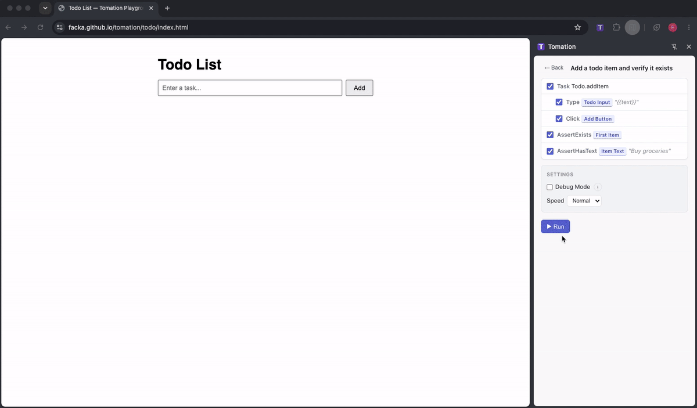

# Tomation

A TypeScript-first browser automation framework that lets you write readable, maintainable UI tests using a declarative DSL — then run them directly in the browser via a lightweight extension.

Tomation separates **what** you're testing from **how** elements are found on the page. You declare elements using a tag-based builder pattern, compose reusable tasks, and write tests that read like plain English. The compiler transforms your TypeScript source into a portable `.tomation.json` file that the browser extension executes step-by-step.

## Demo



## Installation

### Browser Extension

<!-- TODO: Update with store links once published -->
- **Chrome**: Coming soon
- **Firefox**: Coming soon

For development, load the extension from `packages/extension/dist` as an unpacked extension.

### Compiler

```bash
npm install @tomationjs/compiler @tomationjs/dsl
```

## Quick Start

### 1. Create a config file

```typescript
// tomation.config.ts
export default {
  meta: {
    name: 'My App Tests',
    urls: ['http://localhost:3000'],
  },
  pom: './pom',
  tests: './tests',
  baseUrl: './',
}
```

### 2. Define page elements (POM)

```typescript
// pom/login.pom.ts
import { is, idIs, Task, Type, TypePassword, Click } from '@tomationjs/dsl'

const usernameInput = is.INPUT.where(idIs('username')).as('Username')
const passwordInput = is.INPUT.where(idIs('password')).as('Password')
const submitButton = is.BUTTON.where(idIs('login-btn')).as('Submit')
const errorMessage = is.DIV.where(idIs('error-msg')).as('Error Message')

const fillCredentials = Task((params) => {
  const { username, password } = params
  Type(username).in(usernameInput)
  TypePassword(password).in(passwordInput)
}).as('Fill Credentials')

const submit = Task(() => {
  Click(submitButton)
}).as('Submit')

export default { usernameInput, passwordInput, submitButton, errorMessage, fillCredentials, submit }
```

### 3. Write tests

```typescript
// tests/login.test.ts
import { Test, Click, AssertExists, AssertHasText } from '@tomationjs/dsl'
import Login from '~/pom/login.pom'

Test('Login with valid credentials', () => {
  Login.fillCredentials({ username: 'admin', password: 'secret' })
  Login.submit()
  AssertExists(Login.errorMessage)
})

Test('Login shows error on empty submit', () => {
  Click(Login.submitButton)
  AssertHasText(Login.errorMessage, 'required')
})
```

### 4. Compile

```bash
npx tomation compile
```

This produces a `.tomation.json` file (named from your `meta.name`) that the browser extension uses to execute your tests.

### 5. Run

Open the Tomation browser extension panel, load your `.tomation.json`, and run tests interactively with step-by-step execution, pause/resume, and retry controls.

## Key Features

- **TypeScript-first** — Full editor autocomplete, type safety, and go-to-definition
- **Declarative element selectors** — `is.BUTTON.where(idIs('login')).as('Login Button')`
- **XPath support** — `Element('//div[@role="alert"]').as('Alert')`
- **Reusable tasks** — Compose multi-step workflows with parameters and conditionals
- **Folder-based namespacing** — Organize POM files in folders without naming conflicts
- **Browser extension runtime** — Execute tests directly in the browser with visual feedback
- **Watch mode** — `npx tomation watch` for live recompilation during development

## DSL Reference

### Defining Page Elements

Page elements are declared using the `is` builder, which provides a fluent API for describing how to locate elements on the page. Elements are defined in POM (Page Object Model) files.

#### Basic element declaration

The pattern is `is.TAG.where(matcher).as('Label')`:

```typescript
import { is, idIs, innerTextIs, classIncludes, placeholderIs, nameIs, typeIs } from '@tomationjs/dsl'

const submitButton = is.BUTTON.where(idIs('submit-btn')).as('Submit Button')
const emailInput = is.INPUT.where(nameIs('email')).as('Email Input')
const heading = is.H1.where(innerTextIs('Welcome')).as('Page Heading')
```

Any uppercase HTML tag name works: `is.INPUT`, `is.BUTTON`, `is.DIV`, `is.FORM`, `is.SELECT`, `is.SPAN`, `is.H1`, etc.

#### Where matchers

The `.where()` method accepts a matcher factory that describes how to find the element:

| Matcher | Matches on | Example |
|---------|-----------|---------|
| `idIs(value)` | Element `id` attribute | `is.INPUT.where(idIs('username'))` |
| `innerTextIs(value)` | Exact text content | `is.BUTTON.where(innerTextIs('Login'))` |
| `innerTextContains(value)` | Partial text content | `is.DIV.where(innerTextContains('Welcome'))` |
| `classIncludes(value)` | CSS class name | `is.LI.where(classIncludes('active'))` |
| `placeholderIs(value)` | Input placeholder | `is.INPUT.where(placeholderIs('Enter email'))` |
| `nameIs(value)` | Element `name` attribute | `is.INPUT.where(nameIs('password'))` |
| `typeIs(value)` | Input `type` attribute | `is.INPUT.where(typeIs('checkbox'))` |
| `valueIs(value)` | Element `value` property | `is.INPUT.where(valueIs('hello'))` |
| `ariaLabel(value)` | `aria-label` attribute | `is.BUTTON.where(ariaLabel('Close'))` |
| `roleIs(value)` | `role` attribute | `is.DIV.where(roleIs('dialog'))` |
| `titleIs(value)` | `title` attribute | `is.A.where(titleIs('Submit form'))` |
| `hrefContains(value)` | Substring of `href` attribute | `is.A.where(hrefContains('/login'))` |
| `isDisabled()` | Element is disabled | `is.BUTTON.where(isDisabled())` |
| `nthChild(n)` | Nth child position (1-based) | `is.LI.where(nthChild(3))` |
| `dataAttr(name, value)` | `data-*` attribute | `is.DIV.where(dataAttr('testid', 'submit'))` |
| `closestLabelIs(tag, text)` | Nearby label element | `is.INPUT.where(closestLabelIs('LABEL', 'Email'))` |

#### Scoping with childOf

When multiple elements on the page match the same criteria, use `.childOf(parent)` to scope the search within a parent element:

```typescript
const loginForm = is.FORM.where(idIs('login-form')).as('Login Form')
const submitButton = is.BUTTON.where(innerTextIs('Submit')).childOf(loginForm).as('Login Submit')

const signupForm = is.FORM.where(idIs('signup-form')).as('Signup Form')
const signupSubmit = is.BUTTON.where(innerTextIs('Submit')).childOf(signupForm).as('Signup Submit')
```

The `.childOf()` and `.where()` methods can be chained in any order:

```typescript
const child = is.INPUT.childOf(parentForm).where(typeIs('text')).as('Text Input')
```

#### XPath elements

For complex selectors that can't be expressed with tag + where matchers, use XPath:

```typescript
import { Element } from '@tomationjs/dsl'

const alert = Element('//div[@role="alert"]').as('Alert Box')
const thirdRow = Element('//table/tbody/tr[3]').as('Third Row')
```

Or equivalently via the `is` proxy:

```typescript
const alert = is.ELEMENT('//div[@role="alert"]').as('Alert Box')
```

### Save to Context

Save actions extract dynamic values during test execution and store them in a per-run context store. Later steps can reference saved values using `{{ctx.keyName}}` template syntax.

#### SaveText — save an element's text content

```typescript
import { SaveText } from '@tomationjs/dsl'

const confirmationCode = is.SPAN.where(idIs('confirmation-code')).as('Confirmation Code')

SaveText(confirmationCode).as('code')
// Later steps can use {{ctx.code}} to reference the saved text
```

#### SaveAttribute — save an element's attribute value

```typescript
import { SaveAttribute } from '@tomationjs/dsl'

const link = is.A.where(classIncludes('generated-link')).as('Generated Link')

SaveAttribute(link, 'href').as('linkUrl')
// {{ctx.linkUrl}} now contains the href value
```

#### SaveValue — save an input element's current value

```typescript
import { SaveValue } from '@tomationjs/dsl'

const orderIdInput = is.INPUT.where(idIs('order-id')).as('Order ID')

SaveValue(orderIdInput).as('orderId')
// {{ctx.orderId}} now contains the input's value
```

#### Save — save a computed expression

`Save()` lets you compute a value (using date helpers or template strings) and store it for later reference:

```typescript
import { Save, today, tomorrow } from '@tomationjs/dsl'

Save(tomorrow()).as('appointmentDate')
Save(today('MM/DD/YYYY')).as('formattedToday')
Save('static-value').as('myConstant')
```

#### Using saved values in later steps

Reference saved context values with `{{ctx.keyName}}` in any step that accepts a string:

```typescript
Type('{{ctx.code}}').in(verificationInput)
AssertHasText(dateLabel, '{{ctx.appointmentDate}}')
Navigate('{{ctx.linkUrl}}')
```

Context values persist for the entire test run across task boundaries, but reset between runs. Overwriting a key simply stores the new value — no error is produced.

### Date Helpers

Date helpers resolve to formatted date strings at test execution time, so your tests stay valid regardless of when they run.

#### Day-offset helpers

```typescript
Type(today()).in(dateInput)           // today's date: 2025-07-06
Type(tomorrow()).in(dateInput)        // +1 day
Type(yesterday()).in(dateInput)       // -1 day
Type(nextWeek()).in(dateInput)        // +7 days
Type(lastWeek()).in(dateInput)        // -7 days
Type(nextMonth()).in(dateInput)       // +30 days
Type(lastMonth()).in(dateInput)       // -30 days
```

#### Month-boundary helpers

```typescript
Type(firstDateOfMonth(0)).in(dateInput)    // 1st of current month
Type(lastDateOfMonth(0)).in(dateInput)     // last day of current month
Type(firstDateOfMonth(-1)).in(dateInput)   // 1st of previous month
Type(lastDateOfMonth(1)).in(dateInput)     // last day of next month
```

#### Custom format strings

All date helpers accept an optional format string. The default is `YYYY-MM-DD`.

```typescript
Type(today('MM/DD/YYYY')).in(dateInput)              // 07/06/2025
Type(tomorrow('DD-MM-YYYY')).in(dateInput)           // 07-07-2025
Type(firstDateOfMonth(0, 'M/D/YYYY')).in(dateInput)  // 7/1/2025
```

Supported tokens: `YYYY` (4-digit year), `MM` (zero-padded month), `DD` (zero-padded day), `M` (month), `D` (day). Separators (`/`, `-`, `.`) are preserved as-is.

### Runtime Template Strings

Template literals with `${}` expressions are evaluated at runtime, enabling dynamic value construction.

#### Parameter references

```typescript
Type(`Hello ${username}`).in(greetingInput)
```

#### Date helpers inside templates

```typescript
Type(`Appointment on ${tomorrow()} at ${time}`).in(noteInput)
```

#### Arithmetic expressions

```typescript
Type(`Item ${count + 1}`).in(itemInput)
Type(`Total: ${price * quantity}`).in(totalInput)
```

#### Combined example

```typescript
const bookAppointment = Task((params) => {
  const { doctor, slot } = params
  Type(`Dr. ${doctor} - ${tomorrow('MM/DD')} at ${slot}`).in(appointmentField)
}).as('Book Appointment')
```

## Project Structure

```
packages/
  compiler/    # CLI that compiles .ts POM/test files → .tomation.json
  dsl/         # Runtime stubs + TypeScript types for authoring
  extension/   # Browser extension (Chrome/Firefox) for test execution
examples/
  playground/         # Static HTML apps for testing (deployed to GitHub Pages)
  playground-tests/   # Tomation test scripts for the playground apps
  my-app-tests/       # Example project with login flow tests
```
